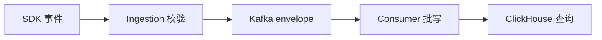
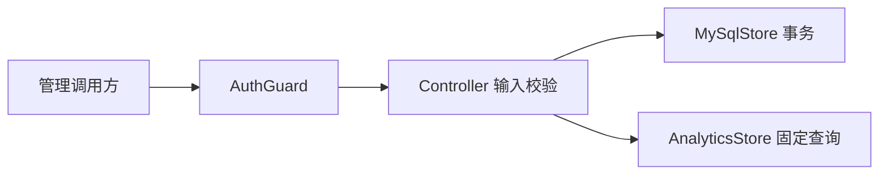
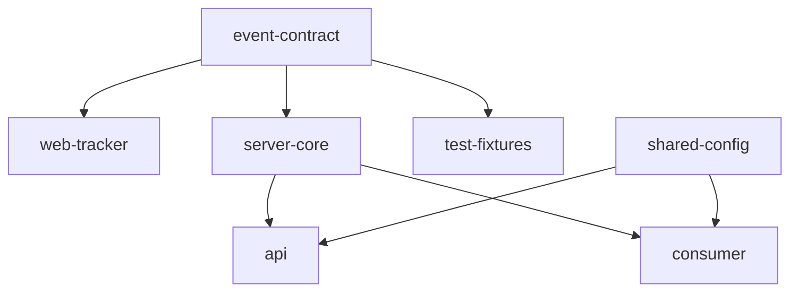

# 01. 架构、边界与技术选型

## 1. 先从约束推导架构

理解这个项目最重要的方法不是记住“用了 NestJS、Kafka 和 ClickHouse”，而是从约束反推组件：

| 已确认约束                             | 推导出的设计                                                    |
| -------------------------------------- | --------------------------------------------------------------- |
| 浏览器离开页面时仍要尽量发送           | SDK 支持 `sendBeacon`，失败后回退 `fetch(..., keepalive: true)` |
| 接收 API 不能等待分析数据库写完        | HTTP 通过 Kafka 持久化后返回 202                                |
| 行为事件写多读少、按时间和项目聚合     | 明细进入 ClickHouse，不进入 MySQL                               |
| 用户、项目、Origin、权限需要事务和约束 | 元数据进入 MySQL                                                |
| SDK、API、consumer 不能各自解释事件    | 独立 `event-contract` 包，以 JSON Schema 为事实来源             |
| Kafka 可能重复交付                     | 原始层允许重复，查询侧按 `eventId` 去重                         |
| 分析结果不能泄漏账号原文               | API 接收时做项目级 HMAC，Kafka 之前删除 `accountRef`            |
| 只有一名开发者且要控制维护成本         | monorepo、固定查询、暂不引入 Redis/Elasticsearch                |

这条推导链比技术名称更值得积累。以后设计相似系统时，应先列出数据量、延迟、可靠性、隐私和团队规模，再决定是否需要消息队列、分析数据库或缓存。

## 2. 两条主链路

系统实际上有两条不同性质的链路。

### 2.1 数据面：高频、公开入口、最终一致

它的特点是：入口无需登录、必须严格限制、接收成功不代表已可查询、允许极少量丢失、允许重复后去重。

### 2.2 管理面：低频、需要认证、强调事务

它的特点是：用户和项目权限必须在服务端校验，管理变更要审计，项目/功能定义由 MySQL 负责，指标由 ClickHouse 负责。

把两条链路分开理解，可以避免一个常见错误：为了复用代码，把公开 ingestion 路由套进管理面认证，或把管理 CRUD 写进高吞吐事件路径。

## 3. 为什么是 Monorepo

根目录的 `pnpm-workspace.yaml` 同时管理 `apps/*`、`packages/*` 和 `spikes/*`。这不是为了“目录整齐”，而是为了让同一次变更能原子地修改 Schema、SDK、consumer 和测试。

### 3.1 三类目录

| 目录        | 含义                         | 示例                                        |
| ----------- | ---------------------------- | ------------------------------------------- |
| `apps/`     | 可启动、可部署的进程入口     | `api`、`consumer`、当前占位的 `web`         |
| `packages/` | 可复用业务或工程能力         | 契约、SDK、数据库迁移、服务端核心、共享配置 |
| `spikes/`   | 风险验证代码，不承诺生产结构 | M0 最小链路                                 |

`tools/check-workspace-boundaries.mjs` 把两个依赖原则变成自动检查：

- `packages/*` 不能依赖 `apps/*`；
- `apps/*` 不能直接依赖另一个 `apps/*`；
- 所有 workspace 本地依赖不能成环。

因此，`api` 和 `consumer` 可以共同依赖 `server-core`，但 consumer 不会为了复用一个函数而导入 API 应用。这个规则能有效防止“应用入口变成公共库”的熵增。

### 3.2 当前依赖方向

学习要点：依赖箭头应指向更稳定、更通用的模块。事件协议比某个 HTTP 框架稳定，所以 NestJS 依赖契约，契约绝不能反向依赖 NestJS。

## 4. 框架层为什么保持薄

`apps/api` 使用 NestJS + Fastify，但主要业务放在 `packages/server-core`：

- Controller 负责路径、HTTP 状态、输入解析和调用编排；
- `AuthGuard` 负责把令牌转换为 `Principal`；
- `ApiExceptionFilter` 把内部错误映射为统一响应；
- `IngestionManager`、`AuthManager`、`AnalyticsStore` 和 `MySqlStore` 负责业务规则。

这种写法有三个收益：

1. 核心逻辑可以用 Vitest 直接测试，不必启动 Nest 应用；
2. 以后替换 HTTP adapter 或拆进程时，业务代码迁移成本较低；
3. Controller 不会逐渐变成数百行、难以复用和难以构造测试的“上帝对象”。

`CoreService` 是当前组合根：在一个位置创建 MySQL、Kafka publisher、ingestion、auth 和 analytics，并在模块销毁时统一关闭连接。组合根集中依赖装配，是值得复用的做法；但随着 M5/M6 增长，可以再按生命周期和测试需求拆成多个 provider。

## 5. 三种基础设施为什么各司其职

### 5.1 MySQL：控制面事实来源

MySQL 保存需要强约束和事务的数据：用户与身份、项目与 Origin、功能定义、成员关系、刷新会话、审计、链路状态。

典型例子是 `MySqlStore.setProjectMember`：它用事务和 `FOR UPDATE` 保证不能删除或降级最后一个 owner。ClickHouse 不适合承担这种行级事务不变量。

### 5.2 Kafka：接收和写库之间的耐压层

API 对 Kafka producer 使用 `acks: -1` 和 idempotent producer。返回 202 的边界是“批次通过校验并被 Kafka 接受”，而不是“ClickHouse 已完成写入”。

Kafka 的价值在于：

- API 延迟不受 ClickHouse 每次写入波动直接影响；
- consumer 可以批写而不是每个 HTTP 请求写一个小 part；
- consumer 暂停时，事件暂存在 topic 中；
- consumer group/offset 提供重放与恢复基础。

代价是最终一致、重复交付、更多运维组件。因此 PRD 明确：如果现有 Kafka 无法稳定复用，应重新评审并简化，而不是为了架构“完整”硬建集群。

### 5.3 ClickHouse：事件明细与列式聚合

`raw_events` 按 `received_at` 月分区，排序键以 `project_id` 开头，适合项目+时间范围的固定聚合。`LowCardinality` 用于事件名、SDK 版本等低基数字段，feature/session 辅助 bloom filter 用于跳过不相关数据块。

当前先查原始表，而不是提前建立大量聚合表。原因是数据量和查询形态还没有真实证据。只有达到 PRD 中的事件量或 p95 阈值，才引入 `AggregatingMergeTree` 状态表。

## 6. M0 到 M4 是怎样逐层降低风险的

| 里程碑 | 先证明的问题                                                              | 主要证据                                                |
| ------ | ------------------------------------------------------------------------- | ------------------------------------------------------- |
| M0     | M1 Mac 上 MySQL/Kafka/ClickHouse/Beacon 能否跑通，凭证能否在 Kafka 前移除 | `spikes/m0`、Compose smoke、`docs/spikes/m0-results.md` |
| M1     | 多模块是否共享稳定契约，数据库能否从空库和旧版安全升级                    | JSON Schema、fixtures、migration checksum               |
| M2     | SPA 生命周期、隐私、三类功能和离开页面发送是否正确                        | SDK 单元测试、Chromium/WebKit 契约、gzip 预算           |
| M3     | 公开接收、Kafka、consumer、去重和链路状态是否闭环                         | pipeline 测试、完整 Compose verifier                    |
| M4     | 登录、权限、项目/功能管理和固定分析口径是否正确                           | API/权限测试、Golden dataset 端到端断言                 |

M0 代码仍保留是为了保存技术风险证据，不是因为生产系统需要维护两套实现。阅读时要把 `spikes/m0` 当作“最小实验”，把 `packages/*` 和 `apps/*` 当作正式实现。

## 7. 值得复用的架构模式

| 模式                  | 本项目实现                 | 适用项目                               |
| --------------------- | -------------------------- | -------------------------------------- |
| 契约包 + 生成类型     | `event-contract`           | 多 producer/consumer 的事件或 API 协议 |
| 薄框架层 + 纯业务核心 | `apps/api` → `server-core` | 需要长期演进或多入口的后端             |
| 控制面/数据面分离     | MySQL 与 ClickHouse        | 监控、分析、IoT、审计检索系统          |
| 接收后异步落库        | HTTP → Kafka → consumer    | 写入突发且允许最终一致的系统           |
| 阶段门驱动技术选型    | M0 spike、性能触发阈值     | 小团队或不确定性高的项目               |
| 依赖规则自动化        | workspace boundary checker | monorepo 和插件化应用                  |

## 8. 不应盲目复制的部分

- 数据量很小、无需削峰的系统不一定需要 Kafka；数据库队列或异步批写可能更简单。
- 需要严格一次记账的系统不能照搬查询侧去重；它需要事务、幂等写和更强的审计。
- 多租户公网产品需要分布式限流、密钥管理、租户隔离、审计导出和更完整的威胁模型。
- 当前 `server-core` 中 `MySqlStore`、`AnalyticsStore` 已经较大。M5/M6 新增职责时，应按领域或查询集拆分，而不是继续把所有方法放入同一文件。

判断是否拆文件/服务的依据应是职责、变化频率和部署需求，不是单纯行数。当前单体进程仍然适合一人团队，但依赖方向和边界必须继续守住。

## 9. 本章代码精读入口

按以下顺序打开文件：

1. `docs/product/requirements-v1.5.md` 的 1、7、9、10 节；
2. `docs/planning/mvp-plan-v1.2.md` 的 4、5、9 节；
3. 根 `package.json` 和 `pnpm-workspace.yaml`；
4. `tools/check-workspace-boundaries.mjs`；
5. `apps/api/src/app.module.ts` 与 `core.service.ts`；
6. `infra/compose/m2-m4.compose.yml`。

自测问题：如果去掉 Kafka，哪些代码和验收语义必须同时改变？如果把项目元数据放进 ClickHouse，最后一个 owner、Origin 更新和审计事务会遇到什么问题？
