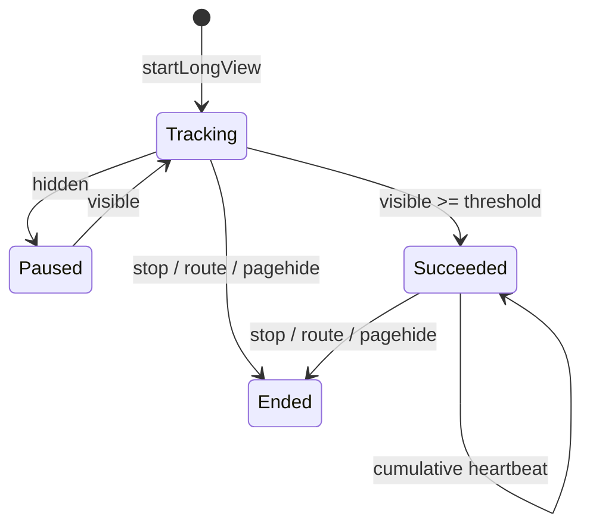

# 03. Web Tracker SDK

## 1. SDK 的真正职责

Web Tracker 不是“给所有事件加一个 HTTP POST”。它在不破坏宿主应用的前提下维护浏览器状态，并把业务成功语义转换为稳定事件：

- 自动记录初始页面和 SPA 路由变化；
- 区分浏览器实例、标签页会话和一次页面视图；
- 只累计前台可见时间；
- 为 data view、action、long view 提供不同 API；
- 在 SDK 和服务端双重约束隐私；
- 控制队列、批次大小、离开页面发送和诊断；
- 任何内部异常都不能中断宿主业务。

核心实现是 `packages/web-tracker/src/tracker.ts` 的 `BrowserTracker`。

## 2. 三种 ID 是三种统计口径

| ID           | 生命周期                                 | 生成/保存位置               | 能代表什么             |
| ------------ | ---------------------------------------- | --------------------------- | ---------------------- |
| `visitorId`  | 尽量跨页面和浏览器重启                   | localStorage 的单个 SDK key | 一个匿名浏览器存储实例 |
| `sessionId`  | 当前 tracker/标签页，30 分钟无活动后轮换 | 内存                        | 一个标签页会话         |
| `pageViewId` | 每次归一化 route 变化                    | 内存                        | 一次页面视图实例       |

`accountRef` 是业务系统显式提供的不透明引用，不是 SDK 读取的 token/email。服务端把它转换为项目级 HMAC `accountId`。

为什么不能只用一个 userId？匿名访问没有业务账号；共享账号不代表真实个人；同一账号可能有多个浏览器与会话。并列三种口径比制造一个虚假的“人数”更诚实。

## 3. 安全初始化：正常 tracker、单例和 no-op

入口 `createTracker(config)` 做三件值得学习的事：

1. 在构造前验证公开 `projectKey` 和 HTTP(S) endpoint；
2. 以 `projectKey + endpoint` 作为 key，重复初始化返回同一个 active tracker，避免 SPA/HMR 重复监听；
3. 任何初始化异常都返回安全 no-op，而不是向宿主抛错。

监控 SDK、日志 SDK、A/B SDK 等“旁路组件”应遵循同一原则：业务功能的可用性优先于监控完整率。

## 4. 页面与 SPA 生命周期

构造函数依次完成：

1. 加载/生成 `visitorId`；
2. 创建 `sessionId` 和 `pageViewId`；
3. 记录当前可见时间起点；
4. 归一化当前 route；
5. 保存原始 `history.pushState/replaceState`；
6. 安装路由、可见性和离开监听；
7. 启动定时 flush；
8. 发出初始 `page_view`。

### 4.1 为什么同时监听四种路由信号

- 包装 `pushState`：Vue/React 常见前进导航；
- 包装 `replaceState`：替换当前地址；
- `popstate`：浏览器前进/后退；
- `hashchange`：hash router。

`handleRouteChange` 先归一化 route。如果结果没有变化就不记新的 PV；变化时先结束旧页面长时任务与可见时间，再生成新 `pageViewId` 和 `page_view`。这个顺序保证旧页面事件不会被错误挂到新 route。

### 4.2 可见时长不是墙上时间

`visibleStartedAt` 只在 `document.visibilityState === 'visible'` 时存在：

- 页面隐藏：`settleVisiblePage` 产生 `page_leave`，然后 lifecycle flush；
- 页面重新可见：重新设置起点；
- route 变化或 `pagehide`：结算旧页面；
- 如果缺少起点，不制造 0 时长事件。

这避免把后台标签页、电脑休眠或不可见时间算进使用时长。

## 5. 路由与属性的隐私边界

`privacy.ts` 是 SDK 最值得复用的模块之一。

### 5.1 Route 默认只取 pathname

默认 `defaultNormalizeRoute` 返回 `url.pathname`，不包含 query/hash。自定义 `normalizeRoute` 仍必须满足：

- 以 `/` 开头；
- 不超过 512 字符；
- 不含 `?` 或 `#`。

业务可以进一步把 `/orders/12345` 归一为 `/orders/:id`，降低高基数并避免 ID 泄漏。SDK 无法猜出每个业务的动态段，所以这个职责必须由接入方配置。

### 5.2 Account reference 必须是不透明值

`isSafeAccountReference` 拒绝：

- 空值或超过 256 字符；
- email-like/phone-like 字符串；
- Bearer/JWT 等凭证形态。

它并不保证值绝对匿名；接入规范仍应要求业务传内部稳定、非敏感、不可逆推出个人信息的引用。

### 5.3 `beforeSend` 为什么不能随意修改事件

钩子只允许修改 `route`、`title` 和已有的 `properties` 值，不能改变 ID、event name、account、feature，也不能增加新字段/新 property key。

如果让接入方任意修改整个事件，Schema 和隐私边界会变成“默认建议”而不是强约束。受限钩子保留了脱敏能力，同时防止绕过核心不变量。

## 6. `emit`：所有事件的统一漏斗

理解 `emit` 就理解了 SDK 的大半数据逻辑：

1. tracker destroyed 时直接返回；
2. 归一化 properties；
3. 根据无活动时间决定是否轮换 session；
4. 组装 ID、时间、route、timezone、account 和额外字段；
5. 运行受限 `beforeSend`；
6. 再扫描凭证；
7. 检查单事件 8 KiB；
8. 队列达到上限时丢弃最旧事件并记录诊断；
9. 入队；达到 50 条时触发 flush。

所有公开事件 API 最终汇入这里，避免每个 API 重复实现隐私、大小、会话和诊断逻辑。

## 7. 三类功能为什么使用不同 API

### 7.1 Data view

业务在数据或图表真正成功渲染后调用 `featureSucceeded`。页面加载或请求发出不能自动算成功。

典型序列：

`feature_exposed → feature_succeeded`，失败时可以是 `feature_failed`。

### 7.2 Action

`featureStarted` 表示用户开始操作，只有业务 Promise/回调成功后才能调用 `featureSucceeded`，失败调用 `featureFailed(reasonCode)`。

典型序列：

`feature_exposed → feature_started → feature_succeeded|feature_failed`。

这套模式可以直接复用于导入、导出、审批、配置保存、下发指令等异步操作。

### 7.3 Long view

`startLongView(featureKey)` 返回幂等 `stop()`：

- 开始时发 `feature_long_view_started`；
- 只在可见状态累计；
- 达到成功阈值后只发一次 `feature_succeeded`；
- 成功后按累计可见时长发送 heartbeat；
- stop/路由变化/pagehide 时发 ended；
- hidden 期间不累计。

heartbeat 上报的是**累计值**，不是本次增量。查询端因此按一次页面实例取最大值，再跨实例求和，重试或多次心跳不会重复相加。

## 8. 队列与发送策略

### 8.1 `nextBatch`

它逐条尝试加入批次，同时满足：

- 最多 50 条；
- 序列化批次最多 64 KiB；
- 单条事件已在 `emit` 限制为 8 KiB。

若队首事件连单独成批都无法满足约束，丢弃并记录 `BATCH_SIZE_UNRESOLVABLE`，防止一个坏事件永久阻塞后续队列。

### 8.2 `send`

| 场景                    | 第一选择     | 失败后的行为                            |
| ----------------------- | ------------ | --------------------------------------- |
| 正常定时/主动 flush     | `fetch`      | 网络或 5xx 最多 3 次，50/100 ms 退避    |
| hidden/pagehide/destroy | `sendBeacon` | 若未排队成功，回退 keepalive fetch      |
| HTTP 4xx                | 不重试       | 说明 payload/权限问题，重试只会放大流量 |

所有 fetch 使用 `credentials: 'omit'`，防止 SDK 把宿主站点 cookie 带到接收端。

### 8.3 诚实理解“发送成功”

`sendBeacon` 返回 true 只表示浏览器接受排队，不表示服务端最终接收。SDK 的 `sentEvents` 也是传输尝试口径，不是 ClickHouse 可查询口径。产品端的数据状态必须由服务端链路提供。

## 9. `destroy` 为什么重要

SDK 修改了全局 History 方法并安装多个 listener/timer。`destroy` 必须：

1. 停止所有 active long view；
2. 清理 flush timer；
3. 结算页面可见时长并尝试 lifecycle flush；
4. 恢复原始 History 方法；
5. 移除事件监听；
6. 标记 destroyed，后续调用不再产生事件。

如果没有完整清理，微前端卸载、HMR、测试重建或重复初始化都会产生重复 PV 和内存泄漏。

## 10. 诊断而不是抛错

`safe` 捕获同步内部错误，`send` 捕获异步网络错误；`drop` 更新 dropped count、last error 和去重 warning。只有 development 模式才 `console.warn`。

这套诊断模式适合嵌入式 SDK：

- 对宿主保持 fail-open；
- 对开发者提供可观察状态；
- 不把事件 body 或敏感值写进日志。

## 11. 关键函数索引

| 函数/类                      | 维护的不变量                           | 最相关测试                                                             |
| ---------------------------- | -------------------------------------- | ---------------------------------------------------------------------- |
| `createTracker`              | 配置合法、同配置单例、异常 no-op       | `packages/web-tracker/test/tracker.test.ts` 的 duplicate/invalid cases |
| `BrowserTracker.constructor` | listener/timer 只安装一次，初始 PV     | lifecycle tests                                                        |
| `handleRouteChange`          | 旧页面先结算，新页面再生成 ID          | SPA route 与 original page tests                                       |
| `emit`                       | 所有事件共享隐私、大小、会话、队列规则 | privacy/queue/feature tests                                            |
| `startLongView`              | 只累计可见时间，成功一次，心跳累计     | hidden/original page tests                                             |
| `nextBatch`                  | 50 条和 64 KiB 双限制                  | contract limit tests                                                   |
| `send`                       | beacon fallback、4xx 不重试、5xx 重试  | beacon fallback test                                                   |
| `destroy`                    | 无遗留 listener/timer                  | Playwright destroy test                                                |

## 12. 当前实现的取舍与未来触发点

- 队列不落 IndexedDB/localStorage，刷新和长离线可能丢事件；若完整率成为 P0，再引入持久队列和容量/过期策略。
- 退避时间当前很短，适合测试和 MVP；真实公网环境应加入更合理的指数退避与 jitter，但要评估页面生命周期。
- active tracker registry 没有在 `destroy` 时删除条目，但新建时会因旧实例不是 active 而替换；如果未来大量动态 projectKey，需要关注 registry 增长。
- `projectTimezone` 出现在配置类型但当前 tracker 未使用；项目时区由查询 API 决定，不应误以为客户端字段已生效。
- `longViewSuccessAfterMs` 和 `longViewHeartbeatMs` 当前是整个 tracker 的配置，不是按 `featureKey` 配置；MySQL feature 表中的逐功能阈值尚未下发到 SDK。M5 必须选择按功能注入阈值，或明确所有大屏使用同一阈值。
- SDK 只提供原子 API，不自动推断“请求成功”“图表渲染完成”；这是正确的责任边界，不应为了少写接入代码而破坏。

本章实验见 [代码精读实验](07-code-reading-labs.md) 的实验 2、3 和 4。
