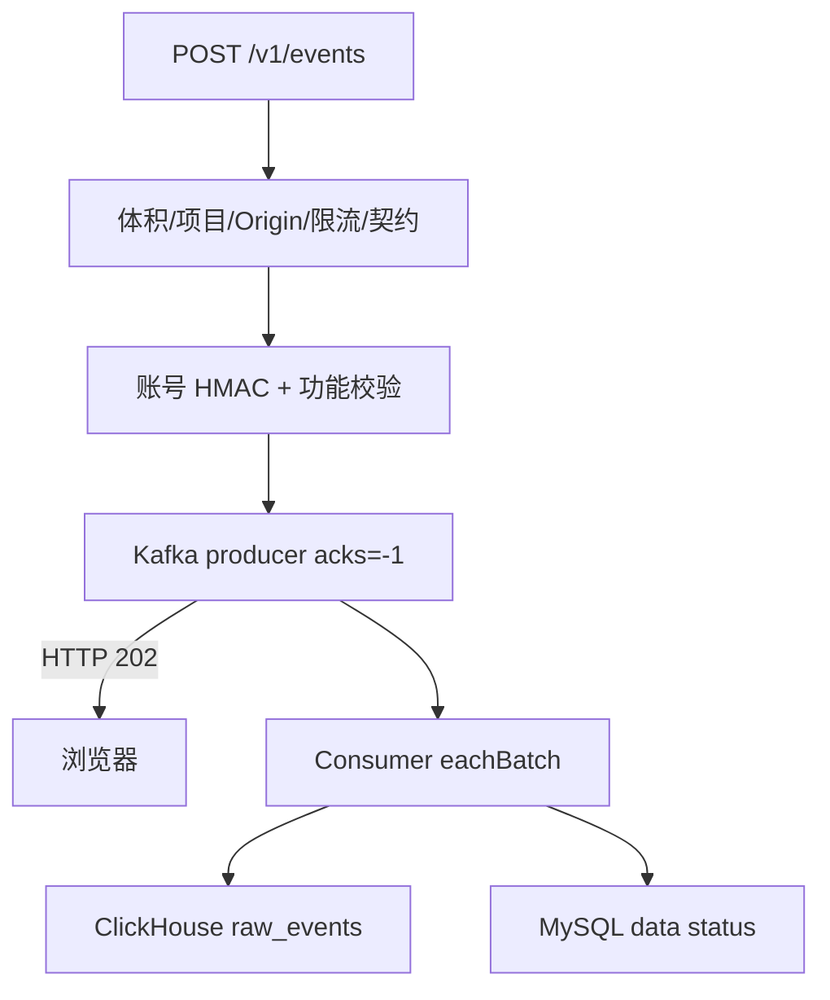

# 04. 接收、Kafka 与 Consumer

## 1. 一条请求的完整旅程



最重要的语义边界：202 表示“批次已通过接收保护并交给 Kafka 持久化”，不表示 ClickHouse 已写入，更不表示 Dashboard 查询已经刷新。

## 2. HTTP 边界做什么

`apps/api/src/main.ts` 在 Fastify adapter 层限制 body 为 64 KiB，并为请求提供 `request.id`/`x-request-id`。`IngestionController` 负责：

- 公开 `OPTIONS`/`POST` 路由；
- CORS 响应头与 `Vary: Origin`；
- 把 body、Origin、IP、Content-Length 交给 `IngestionManager`；
- 成功返回 202。

Controller 不重复契约和项目规则。这样同一 ingestion manager 可以在单元测试中用 fake store/publisher 验证。

当前有两个不同的关联 ID：响应 header 和错误响应使用 Fastify transport request ID；成功响应 body、Kafka envelope 和 `project_data_status.last_request_id` 使用 `IngestionManager` 生成的 pipeline request ID。排查成功链路应使用后者。M6 若要形成统一日志追踪，应明确合并或建立二者映射，不能假定它们现在相同。

预检请求没有 projectKey body，所以 `OPTIONS` 只声明浏览器可尝试 POST；真正的项目 Origin 白名单在 POST 内校验。不能把“预检返回了 allow-origin”误解为服务端已授权事件。

## 3. `IngestionManager.accept` 的拒绝漏斗

`accept` 的顺序兼顾成本、安全和稳定错误码：

1. 记录请求数、开始时间和估算事件数；
2. 重新序列化计算真实 UTF-8 大小，并结合 Content-Length 双重限制 64 KiB；
3. 在访问缓存/数据库前检查 `projectKey` 格式；
4. 用短 TTL cache 查项目、Origin 和功能定义；
5. 拒绝 disabled 项目或不在白名单的 Origin；
6. 以 `projectId + origin + IP` 做分钟固定窗口限流；
7. 调用统一 `validateForIngestion`，并检查 ±24 小时时钟；
8. 校验 feature 是否存在、启用、事件阶段是否适合 feature type；
9. HMAC 账号引用并删除原文；
10. 构造 envelope 并发布 Kafka；
11. 尽力更新 MySQL 接收状态；
12. 返回 requestId、accepted count 和支持的 schema versions。

任何失败都会转换为 `IngestionError(code, statusCode, details)`，更新进程内指标；能确定项目时，还会尽力累计项目拒绝状态。

### 3.1 为什么 project cache 放在校验前但 key 格式校验之后

项目配置是高频读取、低频更新，30 秒短缓存减少每个事件批次访问 MySQL。无效 key 在触碰缓存前拒绝，可以防止攻击者用随机 key 污染缓存。

缓存有两个一致性机制：

- TTL 到期自动刷新；
- 当前 API 进程通过 `ProjectsController` 修改项目/功能后显式 `invalidateProject`。

多副本部署时，显式失效只影响本进程；需要接受 TTL 窗口，或增加跨实例失效机制。这是 M6 前必须重新评审的边界。

### 3.2 限流为什么使用组合 key

只按 IP 会让共享出口的多个项目互相影响；只按 project 会让一个恶意来源拖累所有正常来源。组合 `project + origin + IP` 更贴近污染来源。

当前 limiter 存在单进程 Map 中，重启会清空，多副本也不会共享额度。它是 MVP 防放大护栏，不是生产级全局配额。

## 4. 功能阶段校验

`stageByFeatureType` 防止事件虽然满足通用 Schema，却违背已注册功能的业务类型：

| feature type | 允许的典型阶段                                                |
| ------------ | ------------------------------------------------------------- |
| `data_view`  | exposed、succeeded、failed                                    |
| `action`     | exposed、started、succeeded、failed                           |
| `long_view`  | exposed、succeeded、failed、long_view started/heartbeat/ended |

Schema 只知道“这是合法标准事件”，MySQL 功能定义才知道“这个 featureKey 是 action 还是 long_view”。这是协议验证与领域验证分层的典型例子。

## 5. 账号引用如何在 Kafka 前消失

`sanitize` 对每条事件：

```text
accountId = HMAC-SHA256(ACCOUNT_HMAC_KEY, projectId + ':' + accountRef)
delete event.accountRef
enrichment = { eventId, accountId, featureId }
```

设计效果：

- 同项目同账号得到稳定 ID，可以做去重和重复使用；
- 同一账号在不同项目得到不同 ID，降低跨项目关联；
- Kafka、DLQ 和 ClickHouse 不出现原始账号引用；
- HMAC 比无密钥 hash 更能抵抗字典反推。

运维注意：更换 HMAC key 会让同一账号生成全新 `accountId`，历史趋势出现断点。要轮换必须设计双写/版本字段/回填或明确断点日期，不能直接替换环境变量。

## 6. Kafka envelope 与分区 key

`KafkaEnvelopePublisher` 使用：

- `allowAutoTopicCreation: false`：topic 必须由部署显式创建；
- `idempotent: true` 和 `acks: -1`：降低 producer 重试造成的重复并等待所有 ISR 确认；
- message key 为 `projectId`：同项目事件稳定进入同一分区，便于保持项目内相对顺序；
- header 包含 `requestId` 和 `envelopeVersion`；
- value 是已经去除原始账号引用的 envelope。

Producer 幂等不能把整个系统升级为 exactly-once：HTTP 客户端可能重发同一批次，consumer 也可能在写库后、提交 offset 前崩溃。

## 7. Consumer 如何区分毒消息和基础设施故障

核心：`apps/consumer/src/index.ts` 的 `EventConsumerRuntime.eachBatch`。

### 7.1 毒消息：跳过并进入 DLQ

单条 message 解析失败、envelope 版本错误、契约错误、账号原文残留或 enrichment 缺失，属于“重试也不会好”的数据错误：

1. 发送 DLQ 元数据；
2. resolve 该 offset；
3. 继续处理同批其他消息。

DLQ 只保存 topic/partition/offset、错误码、projectId、失败时间和原 message SHA-256，不保存 poison payload。这样既能定位和关联，又不会把可能含凭证的坏消息复制到另一个长期存储。

### 7.2 基础设施故障：不提交并暂停

ClickHouse 插入、MySQL 状态更新或 Kafka 交互失败属于暂时性基础设施错误：

- 未 resolve/commit 的消息可被再次处理；
- 尝试次数未到上限时抛出，让 KafkaJS 重试；
- 达到上限后把 readiness 设为 false、暂停分区一段时间，再恢复；
- 健康检查和编排能看到 consumer 暂时不可就绪。

错误分类是可复用的消费端模式：确定性坏数据进 DLQ，暂时性依赖故障保留 offset 并退避。两者处理反了会造成无限重试或静默丢数据。

## 8. 手动 offset 与 at-least-once

consumer 配置 `autoCommit: false`、`eachBatchAutoResolve: false`。成功顺序为：

1. 解析消息并生成 rows；
2. 批量插入 ClickHouse；
3. 更新每个项目的 last ingested/queryable；
4. resolve 成功消息 offset；
5. commit offsets；
6. heartbeat。

如果进程在 2 与 5 之间崩溃，Kafka 会重放，ClickHouse 出现同 `eventId` 的重复行。这就是 at-least-once：不轻易丢，但可能重复。

## 9. 为什么在查询侧去重

`AnalyticsStore` 的所有核心查询都包住：

```sql
ORDER BY received_at DESC
LIMIT 1 BY event_id
```

它在项目和事件时间范围内保留每个 `eventId` 最新接收的一条。完整流测试故意把三类 fixture 各发送两次：原始层写入 26 行，查询按 13 个 eventId 得到正确 PV/功能结果。

优点：实现清楚、重放安全、保留接收事实。代价：原始存储有重复，每个查询承担去重成本。只有性能证据达到阈值时，才考虑物化去重/聚合。

## 10. ClickHouse 行转换中的关键逻辑

`rows(envelope)` 将协议模型展平：

- enrichment 必须按 `eventId` 找到；
- 标准时间转成 ClickHouse `DateTime64(3)` 文本；
- `feature_stage` 从 `feature_*` 名称派生；
- `durationMs`/`visibleDurationMs` 从受限 properties 提取为查询列；
- 仍保留完整受限 `properties_json`；
- 记录 `request_id` 与 `origin` 供排障。

把常用指标字段提成 typed columns，避免每次从 JSON 解析；保留 JSON 则给兼容字段留出空间。这是分析事件建模中常见的“热点列 + 原始受限 bag”组合。

## 11. 三个时间点构成数据状态

| 字段                | 谁更新                    | 代表什么               |
| ------------------- | ------------------------- | ---------------------- |
| `last_received_at`  | API 在 Kafka publish 后   | 最近有批次被接收       |
| `last_ingested_at`  | consumer 写 ClickHouse 后 | 最近有 envelope 被消费 |
| `last_queryable_at` | consumer 写库后           | 最近确认可进入查询路径 |

`evaluateDataStatus` 输出：

- `no_data`：从未收到事件；
- `delayed`：已收到但可查询时间落后或不存在；
- `broken`：有 DLQ 且从未有可查询数据；
- `healthy`：链路在阈值内追平。

这套状态让 M5 UI 能区分“正常的 0”和“系统还没把数据处理完”。在任何异步数据产品中，数据值和数据新鲜度都应该是产品模型的一部分。

## 12. 失败矩阵

| 失败点                      | HTTP/consumer 行为       | 数据后果             | 观察入口                    |
| --------------------------- | ------------------------ | -------------------- | --------------------------- |
| body > 64 KiB               | 413 `BATCH_TOO_LARGE`    | 不进 Kafka           | API 拒绝指标/项目状态       |
| project/origin/feature 非法 | 4xx 稳定错误码           | 不进 Kafka           | rejection code              |
| Kafka publish 失败          | 503 `KAFKA_UNAVAILABLE`  | 客户端可按策略重试   | kafkaFailures/readiness     |
| poison Kafka message        | DLQ 后提交该 offset      | 不写原始行，其余继续 | deadLetters/DLQ metadata    |
| ClickHouse 暂时失败         | 不提交 offset，重试/暂停 | 可能延迟，不应丢     | consumer readiness/retries  |
| 写库后提交前崩溃            | 重放并再次写入           | 原始重复，查询去重   | raw count vs dedup count    |
| MySQL 状态更新失败          | 当前批次整体重试         | ClickHouse 可能重复  | data status、consumer error |

## 13. 关键符号索引

| 符号                             | 重点                                        |
| -------------------------------- | ------------------------------------------- |
| `IngestionManager.accept`        | 接收拒绝漏斗和 202 之前的全部保证           |
| `IngestionManager.project`       | 防缓存污染、TTL 和容量清理                  |
| `IngestionManager.sanitize`      | feature 领域校验、项目级 HMAC、删除账号原文 |
| `KafkaEnvelopePublisher.publish` | topic、key、acks、idempotent producer       |
| `EventConsumerRuntime.eachBatch` | 数据错误/基础设施错误分流、手动 offset      |
| `parseEnvelope`                  | consumer 边界二次验证、账号泄露断言         |
| `deadLetter`                     | 不复制 payload，只保留 hash 和定位元数据    |
| `rows`                           | 协议到列式存储模型的映射                    |
| `evaluateDataStatus`             | 把异步链路进度转换为产品状态                |

本章实验见 [代码精读实验](07-code-reading-labs.md) 的实验 4、5 和 10。
