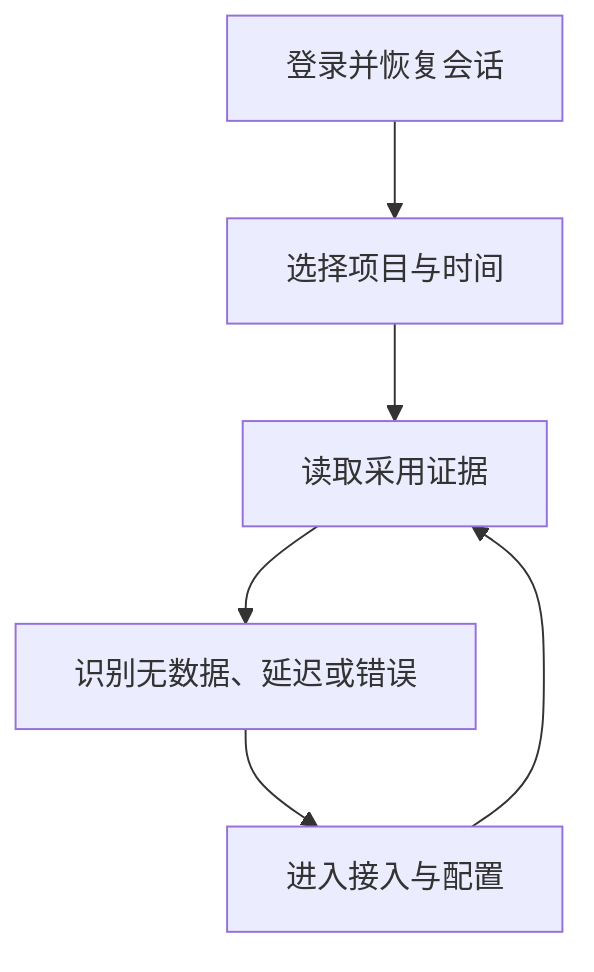
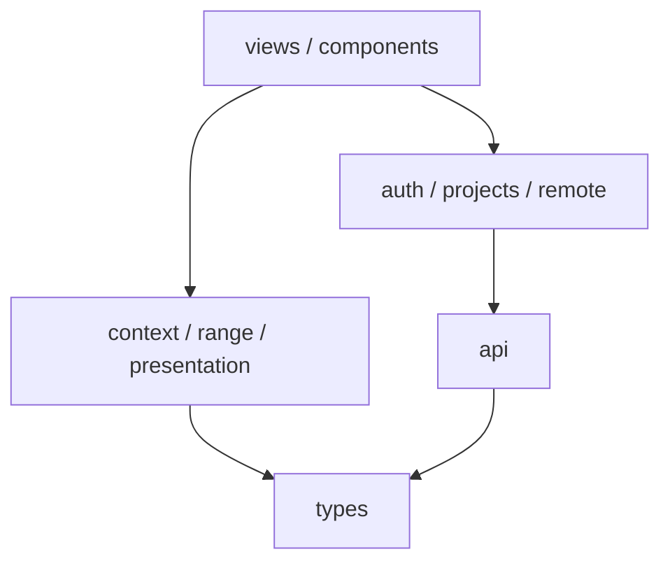
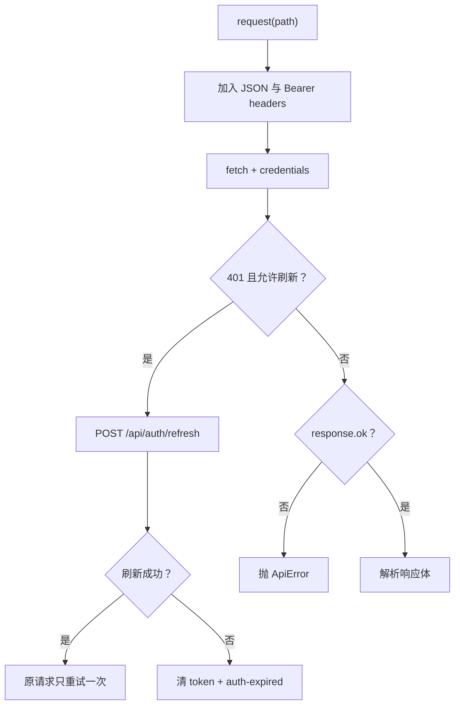

# 08. M5 前端架构与运行时

## 1. 先理解 M5 解决的不是“做几个页面”

M4 已经提供认证、项目管理和固定分析 API，但 API 能调用不等于产品可用。M5 要补齐的是一个稳定的使用闭环：



因此前端架构要守住四个不变量：

1. **权限不由页面决定**：前端隐藏按钮只改善体验，服务端仍是授权事实来源。
2. **筛选上下文可恢复**：项目和时间范围不能只放在组件内存中。
3. **错误不能销毁证据**：刷新失败时，上一份有效数据应保留并标记为 stale。
4. **展示不创造指标**：浏览器负责格式化和状态解释，不重新发明后端口径。

这四点比 Vue、Element Plus 或 ECharts 的 API 更重要。框架可以替换，产品不变量不能丢。

## 2. 从目录看职责分层

`apps/web/src` 没有按“所有代码都放组件”组织，而是分成五层：

| 层             | 文件                                                    | 职责                                   |
| -------------- | ------------------------------------------------------- | -------------------------------------- |
| 组合根         | `main.ts`、`App.vue`                                    | 注册框架、全局组件和根路由出口         |
| 导航与会话     | `router.ts`、`auth.ts`                                  | 页面结构、路由守卫、当前用户           |
| 传输与共享状态 | `api.ts`、`projects.ts`、`remote.ts`                    | HTTP、项目缓存、远程数据生命周期       |
| 领域展示规则   | `types.ts`、`range.ts`、`presentation.ts`、`context.ts` | 读模型、时间查询、页面状态、URL 上下文 |
| 页面与组件     | `views/*`、`components/*`                               | 用户任务、布局和可复用视觉单元         |

依赖方向大致是：



页面可以依赖领域规则和请求层；`api.ts` 不应反向导入某个 Vue 页面。这样新增页面不会把传输层变成 UI 的附属品。

## 3. 为什么选择 Vue 3 Composition API

M5 使用 Vue 3、TypeScript 和 `<script setup>`，主要原因不是“流行”，而是当前页面都有相似的状态组合：

- 从 URL 读取项目与范围；
- 并行请求一个或多个 API；
- 从响应派生表实际用到的 Element Plus 组件样式；

2. 将对应组件注册到 Vue 应用；
3. 安装 router 并挂载 `App`。

它没有直接创建 API client、项目 store 或页面数据。原因是这些对象目前都是模块级单例，启动文件只负责框架装配。

Element Plus 没有 `app.use(ElementPlus)` 全量注册，而是按组件注册。收益是构建内容更可控；代价是新增组件时必须同时添加 JS 注册和 CSS import。若只加 `<el-date-picker>` 模板而忘记注册，类型检查或运行时会暴露问题。

### 3.2 `App.vue`

根组件只保留 `<RouterView />`。真正的布局由嵌套路由中的 `AppShell.vue` 提供：

- `/login` 不显示侧边栏；
- 认证后的功能、页面和接入页共享项目/范围工具栏；
- 功能详情仍保持“功能采用”导航选中。

“根组件薄、布局走路由”让登录页和管理端外壳的职责不会混在一个巨大条件模板中。

## 4. 路由为什么同时承担认证和上下文恢复

源文件：`apps/web/src/router.ts`。

路由表分三层：

- 公共 `/login`；
- `AppShell` 下的 `/features`、`/features/:featureId`、`/pages`、`/onboarding`；
- 未知路径回到首页。

页面组件使用动态 import，首次进入时才加载对应 chunk。对小型 SPA 来说，这比设计复杂的 bundle 分包规则更直接。

### 4.1 `beforeEach` 的顺序

```text
进入任意路由
→ auth.initialize()
→ 未登录且目标不是 login：带 redirect 回登录页
→ 已登录却进入 login：回功能采用页
→ 其他情况继续
```

必须先等待 `auth.initialize()`。如果只看内存中的 `user === null` 就立即跳转，页面刷新时即使 refresh cookie 有效，也会先闪回登录页。

`redirect=to.fullPath` 保存完整路径和查询参数。登录成功后，`LoginView.submit` 用 `router.replace` 回到原位置，避免浏览器后退再次回到登录页。

### 4.2 当前守卫的信任边界

前端守卫只改善体验，不是安全控制：

- 它阻止未登录用户进入页面；
- 它不会决定用户能否读取某项目或修改配置；
- 服务端 `AuthGuard` 和项目角色校验仍是权威边界；
- 即使用户在 DevTools 中伪造前端状态，API 仍应返回 401/403。

任何权限需求都必须先改后端，再用前端隐藏/禁用减少误操作。

## 5. 访问令牌与刷新令牌

源文件：`apps/web/src/api.ts`、`apps/web/src/auth.ts`。

### 5.1 两种令牌的职责

| 凭证          | 保存位置                                         | 发送方式                          | 作用                            |
| ------------- | ------------------------------------------------ | --------------------------------- | ------------------------------- |
| access token  | `sessionStorage["fi.access-token"]` 和模块内变量 | `Authorization: Bearer ...`       | 调用普通管理/分析 API           |
| refresh token | HttpOnly Cookie                                  | `credentials: "include"` 自动发送 | access token 失效后换新         |
| 用户展示信息  | `sessionStorage["fi.user"]`                      | 不作为授权依据                    | 刷新页面时避免丢失姓名/角色显示 |

`sessionStorage` 是标签页会话级存储，不会像 `localStorage` 一样长期跨会话存在，但它仍可被同源脚本读取。真正敏感且长期的 refresh token 放在 HttpOnly Cookie，前端代码不可读取。

### 5.2 `request<T>` 的完整路径



关键不变量：

- 登录、刷新、退出请求不会递归刷新；
- 普通请求最多自动重试一次，避免无穷 401 循环；
- 204 和空 body 显式返回 `undefined`；
- 错误保留 HTTP status、稳定 code、request ID 和安全 message；
- refresh 失败会广播 `fi:auth-expired`，让路由外壳清空项目并回登录页。

### 5.3 为什么用浏览器事件连接 `api.ts` 和 `auth.ts`

`api.ts` 负责凭证和 HTTP；`auth.ts` 负责可响应的用户状态。刷新可能发生在任何页面请求中，不能要求每个调用方再手工更新用户。

当前用两个自定义事件解耦：

- `fi:auth-refreshed`：保存新用户；
- `fi:auth-expired`：清空用户。

它避免 `api.ts` 直接导入 `auth.ts` 形成循环依赖。若未来事件类型增加、SSR 或多窗口同步成为需求，可以把二者收拢为显式 auth service；目前事件数量很少，现有方案成本更低。

### 5.4 当前并发边界

若多个请求同时收到 401，它们都可能调用 refresh。服务端 rotation 只允许一个旧 refresh token 成功，其他请求可能失败并广播过期。M5 的正常页面启动通常不会触发这个窗口，但请求并发增加前应引入“single-flight refresh”：所有 401 共享同一个进行中的 refresh Promise。

这是典型的可持续性判断：不是立刻安装复杂请求库，而是先记录并发不变量和触发重构的条件。

## 6. 为什么项目和范围放在 URL

源文件：`AppShell.vue`、`context.ts`、`range.ts`。

管理端最重要的查询上下文是：

```text
?project=<project UUID>&range=7d
```

把它们放在 URL，而不是只放在组件内存，有四个收益：

- 刷新后仍回到同一项目和范围；
- 用户可以复制 URL 复现问题；
- 从列表进入详情再返回时上下文不丢；
- E2E 可以明确断言状态是否被保留。

`AppShell` 的 computed setter 使用 `router.replace` 更新筛选，避免每次选择都制造一条浏览历史；页面导航使用 `router.push`，因为“从功能到页面”是用户可后退的真实导航。

### 6.1 默认项目

外壳挂载后调用 `projects.load(true)`。当项目列表到达：

- 如果 URL 中项目存在，保持不变；
- 如果不存在，选择第一个可访问项目；
- 同时补上默认 `range=7d`。

`project` 是内部 UUID，而不是 `projectKey`。管理 API 使用内部 ID，公开 ingestion 才使用可公开 project key；两者不能混用。

### 6.2 `useDashboardContext`

这个 composable 不发请求，只把路由和项目列表派生为：

- `projectId`；
- 完整 `project`；
- 合法 preset，非法值回退为 `7d`；
- 带项目 timezone 的 `RangeQuery`；
- 可直接附到 API 的 query string。

这种“只派生、不产生副作用”的 composable 容易测试和复用。页面只 watch `projectId + search`，不用重复解释 URL。

### 6.3 时间范围边界

`buildRangeQuery` 生成滚动 24h/7d/30d：

- `to = now`；
- `from = now - 固定毫秒数`；
- 30d 用 day，其余用 hour；
- timezone 来自项目。

它不是“自然周/月”。跨 DST 时，7 × 24 小时也不一定等于七个完整本地自然日。当前产品写的是最近 7 天/30 天，因此滚动区间可接受；若需求改成“本周/本月”，必须重写边界算法和测试，不能只改显示文字。

## 7. 轻量共享状态为什么没有使用 Pinia

当前跨页面共享状态只有两类：

| 模块          | 状态                      | 主要操作                |
| ------------- | ------------------------- | ----------------------- |
| `auth.ts`     | 当前用户、是否初始化      | initialize/login/logout |
| `projects.ts` | 项目列表、loading、loaded | load/refresh/reset/find |

二者都是模块级单例加 Vue `reactive/computed`。好处：

- 没有额外 store 概念和样板；
- 依赖关系直接；
- 登录过期时可以明确 reset；
- 当前规模下足够可测。

出现以下情况时再评估 Pinia 或查询缓存：

- 多个页面同时修改同一实体并需要精确 cache invalidation；
- 同一请求需要去重、过期时间、后台刷新；
- 离线/乐观更新成为产品需求；
- 调试时已经难以追踪谁修改了共享状态。

框架不是越多越可维护。能清楚写出状态所有者和失效规则，比先安装 store 更重要。

## 8. `useRemoteData`：把旧数据和本次请求分开

源文件：`apps/web/src/remote.ts`。

远程资源有四个正交状态：

- `data`：最近一次成功结果；
- `loading`：当前是否有请求；
- `error`：最近一次请求错误；
- `stale = data && error`：有旧数据，但刷新失败。

`load` 在请求开始时清 error，但不清 data。因此：

- 首次加载失败：没有数据，显示 error/forbidden；
- 已显示数据后刷新失败：保留旧数据，显示 stale 横幅；
- 重试成功：替换数据并清除错误。

这比把 `data = null` 当作 loading/error/empty 的共同值更准确。管理端最危险的体验之一是瞬时故障把可用证据清空，或者把旧数据伪装成最新数据；stale 状态同时避免这两个问题。

### 当前竞争条件

`load` 没有 AbortController 或 request sequence：

```text
切换项目 A → 请求 A 较慢
切换项目 B → 请求 B 较快并先完成
请求 A 最后完成 → 可能覆盖 B
```

下一步安全改法是在 composable 中维护递增序号，只允许最新请求写入；需要节省服务端资源时再加入 AbortController。修改时要补“快速切换项目/范围”的单元或组件测试。

## 9. 类型层的作用与风险

`apps/web/src/types.ts` 不是领域数据库模型，而是前端读模型：

- `Project/Feature/User` 对应管理 API；
- `OverviewResponse/FeaturesResponse/FeatureDetailResponse` 对应固定分析 API；
- `DataStatus` 对应链路状态；
- `RangeQuery/TrendPoint` 连接范围和图表。

把读模型集中后，页面不用到处写匿名对象。但当前类型是手工维护的，TypeScript 只保证“前端内部相信的结构”，不能证明服务端真实响应一致。

可持续升级路径：

1. 先保持 API 响应有服务端测试；
2. 关键响应增加运行时 schema 或契约 fixture；
3. 当接口数量/团队规模增加时，从 OpenAPI 生成类型；
4. 不要让 Vue 组件直接依赖数据库字段命名。

## 10. 一次页面请求怎样穿过这些层

以“页面访问”为例：

```text
URL query
→ AppShell 校验 project/range
→ useDashboardContext 生成 RangeQuery
→ PagesView watch 上下文
→ useRemoteData.load
→ api.request 加 Bearer / 自动 refresh
→ M4 固定分析 API
→ types.ts 读模型
→ computed 生成卡片、趋势和页面状态
→ StatePanel / TrendChart / Table 呈现
```

每层只做一种变化：路由管理可分享状态、context 派生查询、API 处理 HTTP、remote 管理请求生命周期、view 组合业务语义、组件负责表现。

## 11. 不要这样扩展

- 不要在组件里直接读写 access token；统一走 `api.ts`。
- 不要根据前端隐藏按钮判断授权完成；后端必须拒绝越权。
- 不要在每个页面重新解析 `route.query`；统一用 `useDashboardContext`。
- 不要让图表组件自己请求数据或计算产品指标。
- 不要为了一个局部搜索框把所有状态都放入全局 store。
- 不要收到新需求就把所有页面请求塞进一个通用“万能 composable”；先确认错误、缓存和部分成功语义是否真的相同。

## 12. 本章代码精读入口

按以下顺序打开 M5 代码：

1. `apps/web/src/main.ts` 与 `App.vue`；
2. `apps/web/src/router.ts`；
3. `apps/web/src/api.ts`；
4. `apps/web/src/auth.ts`；
5. `apps/web/src/projects.ts`；
6. `apps/web/src/components/AppShell.vue`；
7. `apps/web/src/context.ts` 与 `range.ts`；
8. `apps/web/src/remote.ts`；
9. `apps/web/src/types.ts`。

自测问题：

1. 页面刷新时为什么不会立刻被误判为未登录？
2. 为什么 401 只重试一次？并发 401 还有什么窗口？
3. `projectId` 和 `projectKey` 分别在哪条链路使用？
4. 为什么项目/范围进 URL，而搜索框和弹窗状态没有进 URL？
5. `data + error` 为什么不是矛盾状态？
6. 什么时候引入 Pinia 会降低复杂度，什么时候只会增加概念？
7. 如果需求从“最近 7 天”改成“本自然周”，哪些函数和测试必须一起变？
