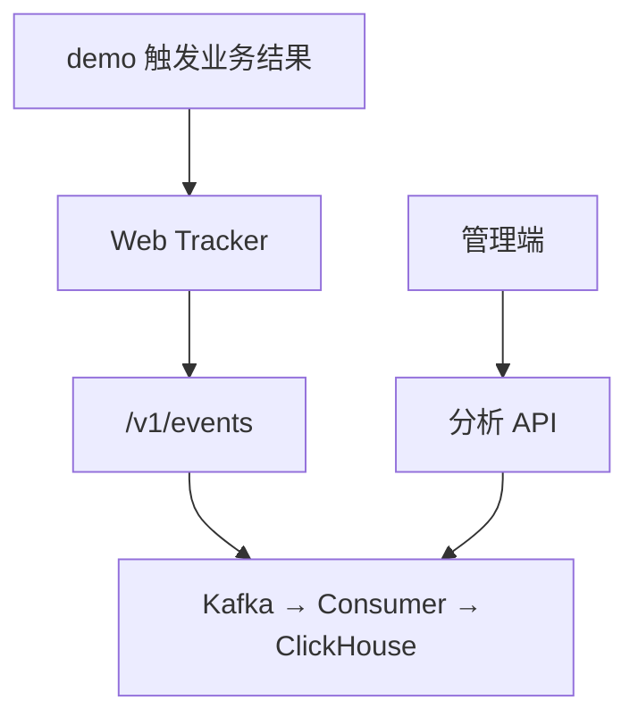

# 10. M5 接入、demo 与本地闭环

## 1. 为什么 M5 需要两个前端应用

M5 同时有：

| 应用            | 角色                    | 主要问题                           |
| --------------- | ----------------------- | ---------------------------------- |
| `apps/web`      | Frontend Insight 管理端 | 怎样查看证据、配置项目、验证接入？ |
| `apps/demo-app` | 被观测的受控业务应用    | 三种真实使用怎样产生正确事件？     |

如果只有管理端，用户能看到页面，却无法亲手验证 SDK 的成功语义和隐私边界；如果只有 demo，事件能发送，却没有产品层解释和排障入口。

两个应用通过同一个 API/数据链路闭环：



demo 不是生产模板，而是可重复的实验夹具。它故意把事件名称、成功条件和隐私结果显示出来，方便学习和验收。

## 2. onboarding 页为什么把配置和验证放在一起

源文件：`apps/web/src/views/OnboardingView.vue`。

“没有数据”的用户通常需要连续完成：

1. 创建/选择项目；
2. 复制 project key、endpoint 和 npm 初始化代码；
3. 配置 Origin/CSP；
4. 创建功能定义；
5. 发送测试事件；
6. 查看 request ID 和链路状态；
7. 回到分析页面确认可查询。

把这些能力分散到多个后台菜单会增加定位成本。M5 把它们放进一个任务页，但内部仍分清三种事实：

- 项目/功能定义来自管理 API；
- 测试事件走公开 ingestion；
- 链路状态来自 data-status。

页面上的相邻不代表服务端职责混在一起。

## 3. 权限：前端可见性与服务端授权

Onboarding 中有两个 computed：

```text
canCreate = globalRole === "admin"

canWrite =
  globalRole === "admin"
  AND project role in ["owner", "admin"]
```

它们控制：

- 创建项目按钮；
- 项目配置是否可编辑；
- 保存按钮；
- 新增/停用功能入口。

viewer 仍可查看接入信息和已授权项目证据，但不能修改。

这里重复了部分后端权限逻辑，目的只是让 UI 在点击前给出正确预期。真正不变量仍在服务端：

- 直接调用 API 也必须被拒绝；
- 前端角色字段被篡改不能获得权限；
- 最后一个 owner 等事务约束不能在浏览器实现；
- API 返回 403 时页面进入 forbidden，而不是假装空数据。

权限变更的正确顺序是：后端策略与测试 → API 响应 → 前端可见性 → E2E viewer/admin 回归。

## 4. 接入代码为什么只接收 `analyticsRef`

管理端生成的最小代码：

```ts
import { createTracker } from "@frontend-insight/web-tracker";

const tracker = createTracker({
  projectKey: "...",
  endpoint: "https://example.internal/v1/events",
  projectTimezone: "Asia/Shanghai",
});

tracker.setAccount(currentUser.analyticsRef);
```

关键不是复制代码本身，而是最后一行：

- `analyticsRef` 是业务系统专门生成的不透明引用；
- 它不是用户名、邮箱、手机号；
- 它不是 access token、refresh token、Cookie；
- 同一业务账号应稳定，同一项目内可用于去重；
- ingestion 在 Kafka 前做项目级 HMAC 并删除原值。

用户此前说明内部系统以 Bearer token 标识登录，并可能多人共享账号。M5 明确把“认证凭证”和“分析引用”拆开：

```text
token：证明本次请求可访问业务系统
analyticsRef：用于采用分析的稳定不透明账号口径
```

不能把 token 当 accountRef。token 会轮换、包含权限、属于敏感凭证；共享账号也意味着 account 口径不等于真实人数。

## 5. Origin 与 CSP 解决不同问题

### 5.1 Origin allowlist

项目 Origin 必须是完整的：

```text
scheme://host[:port]
```

不包含路径。ingestion 用浏览器 Origin 与项目白名单比对，防止另一个站点拿到公开 project key 后任意发送。

本地端口也是 Origin 的一部分：

- `http://localhost:4174`
- `http://127.0.0.1:4174`

不是同一个 Origin。seed 同时加入 localhost/127.0.0.1 和 web/demo 端口，避免本地验收因访问方式不同失败。

### 5.2 CSP `connect-src`

CSP 是业务应用告诉浏览器“脚本可以连接哪些目标”。即使服务端 Origin 允许，业务页面的 CSP 没有放行 ingestion endpoint，浏览器仍会阻止请求。

因此排障要区分：

| 症状                                      | 第一证据                                 |
| ----------------------------------------- | ---------------------------------------- |
| 浏览器控制台 CSP 拒绝                     | 业务应用响应头/HTML CSP                  |
| ingestion 返回 `PROJECT_ORIGIN_FORBIDDEN` | 项目 Origin 配置                         |
| 网络错误无 HTTP status                    | DNS、代理、端口、TLS、CSP                |
| 202 但暂不可查询                          | Kafka/consumer/ClickHouse 与 data-status |

## 6. “发送测试事件”证明了什么

`sendTestEvent` 直接构造最小 `page_view` 批次并 POST `/v1/events`。它使用：

- 随机 event/visitor/session/pageView ID；
- 固定归一化 route；
- `sdk.name = onboarding-test`；
- 不含当前 access token、密码或 Cookie；
- 响应 request ID；
- 1.5 秒后刷新 data-status。

它证明：

- project key 可识别；
- 当前 Origin 被允许；
- 浏览器能访问 ingestion；
- 契约被接收；
- request ID 可用于排障。

它不证明：

- 业务应用已安装正确版本 SDK；
- SPA 生命周期和 feature 事件正确；
- analyticsRef 合规；
- 事件已经完成 Kafka → ClickHouse 并出现在所有查询；
- 生产 CSP、域名和 TLS 已配置。

因此测试成功后仍要在真实业务应用完成 SDK 场景验收。这个区别能避免 onboarding 按钮变成“绿色即上线”的误导。

### 6.1 拒绝码到行动建议

页面把稳定 code 映射为下一步：

- `PROJECT_ORIGIN_FORBIDDEN` → 检查完整 Origin；
- `PROJECT_DISABLED` → 重新启用项目；
- `PROJECT_NOT_FOUND` → 重新复制 project key；
- `SCHEMA_INVALID` → 检查 SDK/字段；
- `KAFKA_UNAVAILABLE` → 接收服务暂不可持久化；
- `NETWORK_ERROR` → 检查网络和 CSP。

未知 code 不猜原因，只要求保留 request ID 查日志。错误文案应基于稳定 code，而不是匹配易变化的 message。

## 7. demo 如何证明三种真实使用成功

源文件：`apps/demo-app/src/App.vue`。

### 7.1 场景一：数据与图表

功能：`sales_dashboard`。

```text
进入/呈现 → feature_exposed
关键请求成功 + 内容渲染完成 → feature_succeeded
API 失败 → feature_failed / api_failure
数据成功但渲染失败 → feature_failed / render_failure
```

这避免“进入路由就算成功”。用户可能打开页面但看到接口错误或图表崩溃，不能计入成功使用。

demo 用 450ms 延迟模拟异步结果，重点是成功调用点位于业务结果之后，而不是延迟长度。

### 7.2 场景二：业务操作

功能：

- `report_export`；
- `data_import`；
- `settings_save`；
- `command_dispatch`。

`runAction` 的标准模式：

```ts
tracker.featureStarted(featureKey);
try {
  await businessOperation();
  tracker.featureSucceeded(featureKey);
} catch (error) {
  tracker.featureFailed(featureKey, safeReasonCode);
}
```

demo 进一步区分：

- 成功 → `feature_succeeded`；
- 用户取消 → `feature_failed / user_cancelled`；
- 业务失败 → `feature_failed / operation_failed`。

started 只说明用户开始，不增加成功使用。reason code 是低基数安全枚举，不应包含服务端异常堆栈、文件名、查询内容或个人信息。

### 7.3 场景三：持续展示

功能：`operations_wallboard`。

`startWallboard` 同时启动：

- SDK 的 `startLongView`；
- 页面上仅用于演示的可见秒数计时器。

演示计时器只在 `document.visibilityState === "visible"` 时加一；真正权威事件由 SDK 产生。停止时必须：

- 调用 `stopLongView` 结算 ended；
- 清 interval；
- flush；
- 页面卸载或切换场景时也执行清理。

正式默认：

- 30 秒前台可见 → succeeded；
- 60 秒累计间隔 → heartbeat。

`?acceptance=fast` 只把自动化阈值缩短为 1 秒。这个开关位于 demo，不改变服务端指标定义，也不能在真实项目中使用来制造成功。

## 8. demo 中 token 隔离是怎样被验证的

demo 登录生成：

```text
sessionStorage["fi-demo.simulated-token"]
```

SDK 只获得：

```text
analyticsRef = "demo-operator-001"
```

`initializeTracker` 从不读取 token key。`beforeSend` 只记录即将发送的事件，页面显示：

- eventName；
- featureKey；
- reasonCode；
- 人类可读的成功/失败解释。

Playwright 同时监听 `/v1/events` 请求体，断言其中没有：

- 模拟 token；
- 输入的模拟密码；
- `Authorization`；
- 并包含三类预期事件。

这比只检查源码里“没有 token 字符串”更强，因为它验证实际浏览器发送 payload。

### 8.1 `beforeSend` 的边界

demo 用 `beforeSend` 做可视化，不代表生产代码应在这里塞入任意调试数据。所有返回事件仍经过 SDK/契约隐私校验；回调不应读取 DOM、Cookie 或业务表单。

## 9. 为什么本地使用同源 Nginx

管理端和 demo 各自构建为静态文件，由相同 `m5.conf` 的 Nginx 镜像提供。Nginx 路由：

| 路径         | 行为                                                    |
| ------------ | ------------------------------------------------------- |
| `/health`    | 容器健康检查                                            |
| `/api/*`     | 代理管理/分析 API                                       |
| `/v1/events` | 代理 ingestion，并传递浏览器 Origin                     |
| 其他         | 静态文件；不存在时回退 `index.html` 支持 history router |

前端使用相对路径 `/api` 和 `/v1/events`，带来：

- access/refresh Cookie 保持同源；
- 本地不需要为管理 API 维护额外 CORS；
- 前端构建不写死 API 容器地址；
- `/features/...` 刷新不会因静态服务器找不到文件而 404。

Nginx 同时加基础安全头和 CSP。但 M5 的 `style-src 'unsafe-inline'` 是为了当前组件样式运行，不代表生产策略已经完成安全评审。

## 10. Docker 构建为什么使用两阶段

`infra/docker/m5-web.Dockerfile`：

```text
node:24-alpine
→ 安装固定 pnpm
→ 安装 workspace 依赖
→ 构建 web 或 demo-app
→ 复制 dist

nginx:1.29-alpine
→ 只保留静态文件和 Nginx 配置
```

`APP_DIR` 只允许 `web` 或 `demo-app`，避免任意路径进入构建。运行镜像不携带 Node、源码和完整依赖，体积与攻击面更小。

当前每个前端镜像都会重新安装整个 workspace 依赖。小项目可接受；构建时间成为瓶颈后，再评估 BuildKit cache、pnpm fetch 或更精细的 workspace prune，不要先引入复杂发布流水线。

## 11. Compose 为什么叠加 M2–M4

`scripts/dev` 同时加载：

```text
infra/compose/m2-m4.compose.yml
infra/compose/m5.compose.yml
```

底层文件继续拥有 MySQL、Kafka、ClickHouse、migration、API、consumer 和 verifier；M5 文件只增加：

- seed 工具；
- web；
- demo。

这是可持续的增量设计：

- 数据链路仍可独立验收；
- M5 不复制基础设施定义；
- 共享网络和 service health；
- M6 如果替换前端部署，不必重写底层本地链路。

## 12. `scripts/dev` 是本地产品接口

脚本提供稳定命令：

| 命令                              | 含义                                               |
| --------------------------------- | -------------------------------------------------- |
| `doctor`                          | 检查 Docker/Compose、arm64、内存、磁盘、端口和配置 |
| `bootstrap`                       | 创建 `.env.m5` 并验证 Compose                      |
| `up`                              | 构建、等待底层健康、启动应用并 seed                |
| `seed`                            | 幂等创建本地用户、项目和六个功能                   |
| `smoke`                           | 验证数据流和三个 HTTP 服务                         |
| `status`                          | 查看容器健康和资源                                 |
| `logs [service]`                  | 读取限定服务日志                                   |
| `down`                            | 停止但保留卷                                       |
| `reset --confirm-local-data-loss` | 只删除 M5 Compose 项目卷                           |

### 12.1 `doctor`

目标 Mac 是 M1/32GB。脚本默认要求：

- host arm64；
- Docker engine arm64；
- 至少 16 GiB 主机内存；
- 至少 10 GiB 可用磁盘；
- Compose config 有效。

CI 用 `M5_ALLOW_NON_ARM64=1` 显式绕过目标架构检查，而不是偷偷放宽本地标准。

### 12.2 reset 的破坏性边界

`reset` 必须带完整确认参数，并先按精确 Compose project label 列卷。它不会调用全局 prune，也不会用未解析 glob 删除 Docker 数据。

普通启动失败应先看日志和 `down/up`，不能把删库当默认排障步骤。

## 13. seed 为什么必须幂等

`m5-fixture.ts` 固定创建：

- admin 和 viewer；
- 一个 demo project；
- 两种 project role；
- localhost/127.0.0.1 的 web/demo Origins；
- 六个功能定义；
- data-status 行。

所有写入使用 `INSERT ... ON DUPLICATE KEY UPDATE`。因此：

- `up` 可以重复运行；
- 密码哈希可以更新；
- 被停用的 demo 项目/功能恢复为 active；
- Origin 去重；
- 固定 UUID 让 E2E 和 verifier 可预测。

固定凭证只属于本地 Compose。把 seed 复制到试点或生产，会绕过真实身份、Secret 和审批流程。

## 14. M5 为什么增加 `sdk_name` migration

M1 原始表已有 SDK version，但 M5 需要在指标定义抽屉展示 name + version 分布，因此新增：

```sql
ALTER TABLE raw_events
  ADD COLUMN IF NOT EXISTS sdk_name LowCardinality(String) DEFAULT 'unknown';
```

同时 consumer 写入 `sdk_name`，分析查询按 name/version 分组。

这是一次完整的纵向变更：

```text
传输契约已有 sdk.name
→ consumer 存储映射
→ ClickHouse forward migration
→ 验证脚本写入
→ AnalyticsStore 固定查询
→ API 类型
→ 管理端 DefinitionsDrawer
```

学习重点：UI 需要一个字段时，不一定只是前端任务。要从事实来源检查它是否已被可靠存储、迁移和测试。

## 15. 本地手工闭环

目标步骤见 [M5 Mac 本地全流程指南](../guides/local-full-flow-macos.md)。最小流程：

```bash
./scripts/dev doctor
./scripts/dev bootstrap
./scripts/dev up
./scripts/dev smoke
```

随后：

1. 在 demo 登录；
2. 分别完成数据成功/失败、操作成功/取消/失败、大屏前台/后台；
3. 在管理端用 admin 查看功能采用、页面访问和接入状态；
4. 用 viewer 确认配置只读；
5. 刷新页面确认 project/range URL 不丢；
6. 执行 `status` 记录资源；
7. `down` 后重新 `up` 确认数据保留。

手工验收的价值在于检查浏览器交互、文案、Docker Desktop 资源和真实等待感受；CI 不能完全替代。

## 16. 本章代码精读入口

1. `apps/web/src/views/OnboardingView.vue`；
2. `apps/demo-app/src/App.vue`；
3. `packages/web-tracker/src/tracker.ts`；
4. `packages/server-core/scripts/m5-fixture.ts` 与 `seed-m5.ts`；
5. `infra/clickhouse/migrations/003_sdk_name.sql`；
6. `infra/compose/m5.compose.yml`；
7. `infra/docker/m5-web.Dockerfile`；
8. `infra/nginx/m5.conf`；
9. `scripts/dev`；
10. `docs/guides/local-full-flow-macos.md`。

自测问题：

1. 为什么测试事件成功不能证明业务 SDK 已接好？
2. Origin allowlist 和 CSP 各自在哪一端生效？
3. 为什么 token 不能代替 analyticsRef？共享账号对口径有什么影响？
4. 数据查看、操作、大屏的成功调用点分别在哪里？
5. `acceptance=fast` 为什么只能存在于 demo 自动验收？
6. 为什么前端用相对 `/api` 和 `/v1/events`？
7. `down` 与 `reset` 的数据语义有什么不同？
8. `sdk_name` 从需求到页面经过了哪些层？
