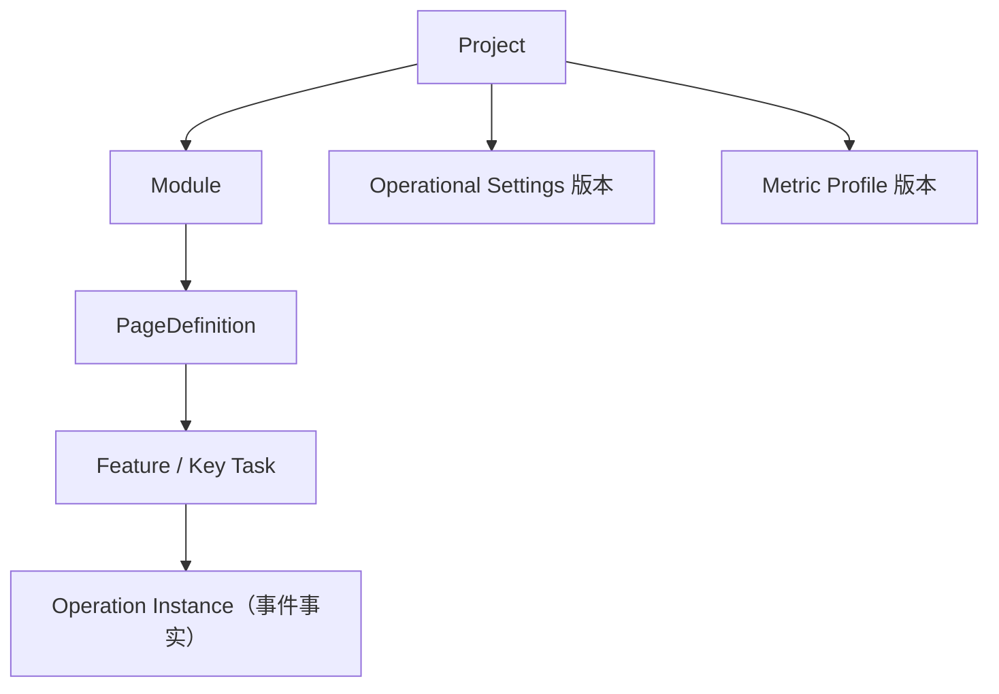

# 12. M6 运营领域与数据模型

## 1. M6 解决的核心问题

M5 能回答“某个 route/feature 有没有事件”，但内部产品还需要稳定的业务结构和目标：

- route 属于哪个模块、页面是什么类型；
- 哪些页面是核心页面，哪些功能是关键任务；
- 一次任务的开始、成功、失败、取消和超时如何配对；
- 指标应该从哪一天开始生效，配置变化后如何避免改写历史。

M6 因此没有新增一个万能“健康度字段”，而是增加受治理的实体、operation lifecycle、MetricCatalog、版本化设置/profile 和固定读模型。

## 2. 实体关系



| 实体 | 当前标识 | 事实来源 | 关键字段 |
| --- | --- | --- | --- |
| 项目 | `projectId/projectKey` | MySQL `projects` | timezone、Origin、retention |
| 模块 | `id/moduleKey` | `project_modules` | criticalityWeight、displayOrder、effectiveFrom |
| 页面 | `id/normalizedRoute` | `page_definitions` | templateKey、isCore、criticalityWeight、expectedFrequency |
| 功能/任务 | `id/featureKey` | `features` | pageDefinitionId、isKeyTask、taskWeight、timeout、operationLifecycleEnabled |
| 操作实例 | `operationInstanceId` | ClickHouse `raw_events` | started、唯一 terminal、interactionType |
| 运营设置 | project + version | `project_operational_settings` | targetAccounts、expectedActiveWeekdays、effectiveFrom/effectiveTo |
| 指标 profile | project + profileKey + version | `metric_profiles/items/assignments` | 维度权重、指标权重、目标、样本门槛、状态 |

模块、页面、功能和 profile 是控制面配置；operation 是事件面事实。不要把页面配置复制进每条事件，也不要从事件里的 route 自动创建正式页面定义。

## 3. Migration 004 表达的领域不变量

`infra/mysql/migrations/004_operational_metrics.sql` 是最直接的数据模型说明。

### 3.1 模块与页面

- 同一项目的 `module_key` 唯一；
- 同一项目的 `normalized_route` 唯一；
- 页面必须属于模块，外键使用 `ON DELETE RESTRICT`；
- 模块/页面使用 `active/disabled`，不是物理删除；
- 权重必须大于 0 且不超过 100；
- 页面模板固定为 `monitoring_dashboard`、`analysis_view`、`task_operation`；
- 页面预期频率固定为 daily/weekly/monthly/ad_hoc。

这些约束让错误配置在写入时失败，而不是等指数计算后才暴露。

### 3.2 功能扩展为任务

`features` 新增：

- `page_definition_id`：任务落在哪个页面；
- `is_key_task`：是否进入关键任务读模型；
- `task_weight`：多个任务聚合时的权重；
- `task_timeout_seconds`：started 多久后才可近似视为未结束；
- `operation_lifecycle_enabled`：是否要求 operation 配对；
- `configuration_effective_from`：新语义从何时开始。

`isKeyTask=true` 不等于一定可计算任务指标。还需要 operation lifecycle 开启、v2 operation 事实存在、样本足够且所选范围与配置生效时间相交。

## 4. Operation lifecycle

SDK 的推荐入口是：

```ts
const operation = tracker.startOperation("alarm_acknowledge", {}, "click");

try {
  await acknowledge();
  operation.succeed();
} catch {
  operation.fail("request_failed");
}
```

`BrowserTracker.startOperation`：

1. 生成不可由业务方指定的 `op_*`；
2. 立即发送 `feature_started`；
3. 返回只允许一个 terminal 的 handle；
4. `succeed/fail/cancel` 复用同一 operation ID；
5. 重复 terminal 不发事件，只增加诊断计数；
6. SDK 自身异常被 `safe` 隔离，不影响宿主。

ClickHouse migration 004 增加 `operation_instance_id` 和 `interaction_type`。`AnalyticsStore.operationInstances` 按 operation ID 聚合：

- `minIf` 找 started 时间；
- `minIf/argMinIf` 取第一个 terminal；
- 没有 started 的孤立 terminal 不进入实例；
- 成功耗时只计算 succeeded；
- failed、canceled 与超时未结束分别保留。

### 当前需要特别注意的兼容边界

当前 SDK 0.3 仍暴露旧 `featureStarted/featureSucceeded/featureFailed` API，同时默认发送 schema v2。契约 validator 对 v2 `feature_started` 要求 operation ID，因此新任务应始终使用 `startOperation`。评审 v1.7 删除旧 wrapper 时，应把这处公共 API/契约不一致列为明确清理项，而不是仅做名称替换。

## 5. 生效时间不是展示字段

当前查询会把配置生效时间纳入计算：

- 模块/页面/功能只在 `effectiveFrom < range.to` 时参与；
- operation 早于 `configurationEffectiveFrom` 时不属于新任务配置；
- 运营指数把查询起点裁剪到 profile、settings、页面和功能中最晚的配置边界；
- 页面返回 `availableFrom`，任务返回 v2 operation `availableFrom`；
- UI 用 `partial/full/none` 提示所选范围是否跨越可用起点。

这样可以避免“今天把普通功能改成关键任务，却用上个月的旧事件计算新任务达成率”。

## 6. 未归类 route

事件可以先于正式页面配置出现。当前处理是：

- 基础 PV/账号/浏览器/会话仍可见；
- `AnalyticsStore.modules/operationalOverview` 把它们放入 `unclassified`；
- 未归类 route 不进入模块覆盖率、核心页面覆盖或运营指数；
- UI 提供跳转到运营配置的入口。

这是“保留证据，但不让未知实体污染评分”的可复用模式。v1.7 若调整产品流程，应保留这一语义。

## 7. 配置写入与版本写入

`OperationalController` 对模块/页面提供 create/update/disable；对设置/profile 使用版本化动作：

- 保存运营设置会创建新版本并 supersede 旧版本；
- profile 先建立 draft；
- clone 产生新版本，而不是原地编辑 active profile；
- activate 建立项目级 assignment 和生效时间；
- retire 不删除历史版本。

真正写权限要求全局 admin 且项目角色为 owner/admin；viewer 即使绕过 UI 也会得到 403。

## 8. 代码精读入口

按顺序阅读：

1. `packages/server-core/src/model.ts`；
2. `infra/mysql/migrations/004_operational_metrics.sql`；
3. `packages/event-contract/schema/event-batch-v2.schema.json`；
4. `packages/web-tracker/src/tracker.ts` 的 `startOperation`；
5. `packages/server-core/src/pipeline.ts` 的 `assertFeature`；
6. `packages/server-core/src/mysql-store.ts` 的 module/page/settings/profile 方法；
7. `packages/server-core/src/analytics.ts` 的 `operationInstances`、`taskSummary`；
8. `apps/api/src/operational.controller.ts`。

