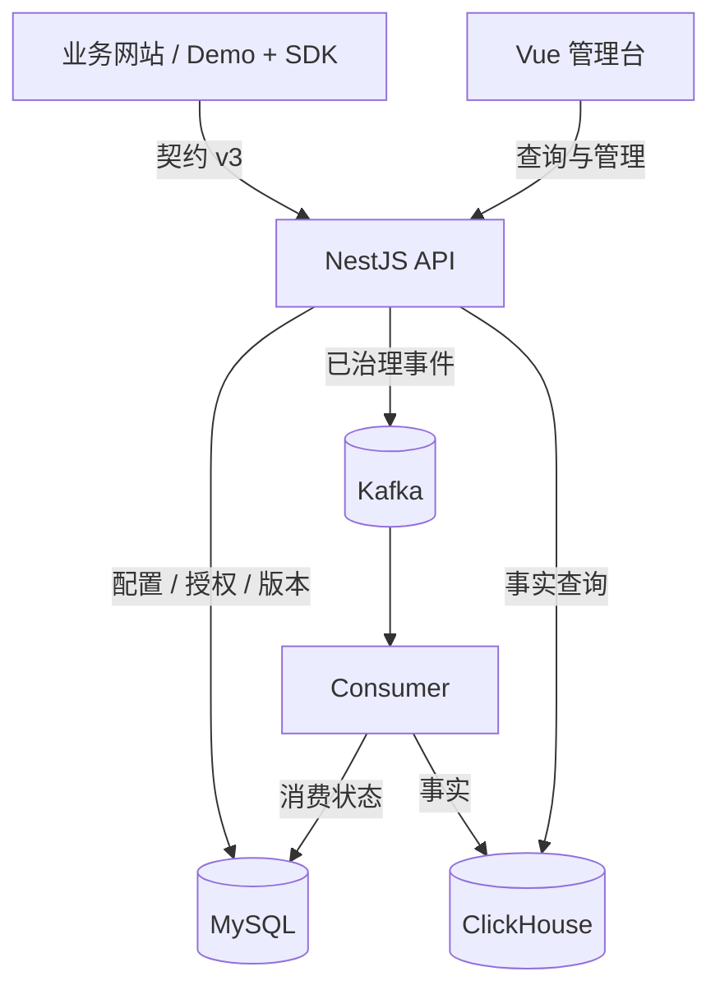

# 12. v1.8 架构与源码阅读地图

本文对应 `agent/v1-8-r8-cleanup-acceptance` 的 `641e106` 内容，包含 R8 质量页面刷新修复。第 01–11 章保留为 M0–M5 历史资料；当前维护请从本章开始。本文解释实现，不代替验收结果或批准记录。

目标读者是熟悉 Python、第一次接手这个 TypeScript 项目的开发者。完成本章后，应能从一个页面找到接口、业务计算、存储和测试，并判断一次修改会穿过哪些边界。

## 1. 先理解系统在做什么

系统把业务网站产生的事实转换为三类可解释证据：

- 运营：页面是否被有效使用、功能是否采用、工作流是否完成、操作是否高效。
- 质量：错误发生在哪里、性能与稳定性事实是否满足定义、是否具备评分条件。
- 治理：指标版本、评分配置、组织目录、可信数据源和 SDK 策略怎样影响上述结果。

“点击过”只是交互事实，“成功”需要业务结果；“没有错误明细”不自动意味着质量合格；“能观察到数据”不代表已有足够证据输出正式得分。维护者最容易引入的错误，是为了让页面有数字，把这些状态合并。

## 2. 运行时与代码组织

Nginx/Compose 负责入口与进程部署，图中省略了这层，避免把网络代理误认为业务计算层。部署拓扑见 [生产 Compose](../../infra/compose/production.compose.yml)。

| 位置                                                         | 真实职责                                             | 为什么这样分                             |
| ------------------------------------------------------------ | ---------------------------------------------------- | ---------------------------------------- |
| [apps/web](../../apps/web/src/main.ts)                       | Vue 页面、路由、筛选、API 调用、状态呈现             | 浏览器呈现服务端语义，不拥有权威评分算法 |
| [apps/demo-app](../../apps/demo-app/src/App.vue)             | 产生可控制的业务、工作流与错误场景                   | 提供真实 SDK 接入示例和端到端验证入口    |
| [web-tracker](../../packages/web-tracker/src/index.ts)       | 路由/可见时间/操作/质量采集、内存队列、发送          | 嵌入业务站点，故障不应扩散为宿主业务异常 |
| [event-contract](../../packages/event-contract/src/index.ts) | Schema、规范名称、生成类型、运行时校验、共享范围算法 | SDK、接收端、消费端共享同一传输语言      |
| [apps/api](../../apps/api/src/app.module.ts)                 | HTTP 路由、输入校验、认证、组件装配                  | 类似 Python 项目中路由与依赖注入层       |
| [server-core](../../packages/server-core/src/index.ts)       | 业务规则、事实读取、归约、指标绑定、评分、存储服务   | 可脱离 HTTP 与 Vue 测试业务不变量        |
| [apps/consumer](../../apps/consumer/src/index.ts)            | Kafka 校验、上下文复核、批量写事实、offset 与 DLQ    | 隔离接收延迟与存储延迟，承担重试语义     |
| [database](../../packages/database/src/migrations.ts)        | 两种数据库的版本迁移与校验                           | 让新建与保留数据升级有可核对的结果       |
| [shared-config](../../packages/shared-config/package.json)   | 环境配置边界                                         | 配置错误在服务启动时尽早暴露             |
| [test-fixtures](../../packages/test-fixtures/package.json)   | 共享合法/非法事件等测试输入                          | 避免测试各自发明不同契约                 |

这里没有 MongoDB 运行时。当前管理数据在 MySQL，分析事实在 ClickHouse，Kafka 是消息日志。不要根据旧技术讨论为本系统新增 MongoDB 依赖。

## 3. Python 开发者需要补齐的最少知识

| 本项目写法                                     | 可借用的 Python 理解  | 维护时真正要注意的事                                                             |
| ---------------------------------------------- | --------------------- | -------------------------------------------------------------------------------- |
| `interface`、`type`、`import type`             | 类型提示、结构描述    | TypeScript 类型编译后消失；外部 JSON 必须继续经 Zod/Ajv 校验                     |
| `{ ok: true, value } \| { ok: false, errors }` | 有标签的成功/失败结果 | 先检查 `ok` 再使用 `value`，不能用类型断言跳过失败路径                           |
| `Promise<T>`、`async/await`                    | 协程返回结果          | 创建 Promise 即可能开始工作；是否等待写入影响 202、事务和 offset 语义            |
| `Map` / `Set`                                  | `dict` / `set`        | 常用于按事件 ID 去重、实例状态；内存集合不会跨进程共享                           |
| `undefined` 与 `null`                          | 缺字段与明确空值      | 查询省略条件和“这个值不可得”不是同一语义                                         |
| `@Controller`、`@Get`、`@Inject`               | 路由装饰器、依赖注入  | Nest 装配关系由 `AppModule` 和 `CoreService` 明确建立                            |
| `.vue` 的 `<script setup lang="ts">`           | 页面逻辑与模板同文件  | `ref` 在脚本用 `.value`，模板自动解包；`computed` 是派生状态，`watch` 触发副作用 |
| `workspace:*`                                  | 同仓库本地包依赖      | 一个工作区包含多个包；共享包可供多个应用使用，应用不能互相依赖                   |

根 [package.json](../../package.json) 固定 pnpm 版本并要求 Node `>=24`。这里的 `type: module` 表示 ESM；源码中服务端使用的 `.js` 导入后缀对应编译输出，不应看到 `.ts` 文件就机械替换为 `.ts` 后缀。部分包运行时导出 `dist`，改源码后运行集成链路需要构建；只通过类型检查不能证明运行时加载了新代码。

[工作区边界检查](../../tools/check-workspace-boundaries.mjs) 校验依赖环、应用到应用、共享包到应用的非法依赖。需要共享逻辑时，将它放入合理的 `packages/*`，不要让 API 直接导入 Vue 页面的实现。

## 4. 用一条 JS 错误走完系统

建议先跟读错误明细，因为它足够短，又穿过完整链路。

1. [Demo App](../../apps/demo-app/src/App.vue) 的场景触发错误；SDK 的 [observability.ts](../../packages/web-tracker/src/observability.ts) 捕获并规范化。
2. [BrowserTracker](../../packages/web-tracker/src/tracker.ts) 为事件关联 `appId/env/release`、页面、身份和 `eventId`，进入队列；`flush` 发送 v3 批次。
3. [IngestionController.ingest](../../apps/api/src/ingestion.controller.ts) 接收 `POST /v1/events`，调用 [IngestionManager.accept](../../packages/server-core/src/pipeline.ts)。
4. `accept` 校验契约、项目、Origin 和 SDK 策略，HMAC 处理用户引用、补充可信组织信息，等待 Kafka 发布成功后返回 202。
5. [EventConsumerRuntime.eachBatch](../../apps/consumer/src/index.ts) 再校验 envelope 与业务上下文，`rows` 转换为 ClickHouse 行，`observabilityGroupId` 计算错误组；写 `raw_events` 后推进消费。
6. [PageQualityView.vue](../../apps/web/src/views/PageQualityView.vue) 以 URL 的项目、环境、日期、页面、类别等条件请求 `/api/projects/:projectId/observability/occurrences`。
7. [ObservabilityController.occurrences](../../apps/api/src/observability.controller.ts) 授权并按项目时区解析范围；[PageQualityStore.read](../../packages/server-core/src/page-quality.ts) 读取、去重、分页；Vue 显示返回的 occurrence。

用户看到一条错误是第 7 步的结果。第 4 步返回成功只能证明消息已交给 Kafka。服务端的接收诊断状态写入还是尽力而为，不能把它当作同步入库证明。

### 这条链为何与最新验收缺陷相关

R8 修复前，质量页打开时的 `from/to` 固定在 URL；点击刷新只获得新查询快照，未推进事件时间 `to`。后来产生的错误虽然正常入库，仍被 `timestamp < to` 排除。

现在 `PageQualityView.refresh` 对预设范围重新调用 `resolveProjectCalendar`，更新 URL 并清理旧游标；自定义范围保留日期。切换环境不会把 `dev` 的事实复制到 `staging/prod`。Demo 实际发送 `dev`，这也是排查时必须核对的条件。详细证据见 [R8 修复记录](../progress/v1.8-r8-quality-refresh-fix.md)。

这说明调试应同时核对“事实在哪”与“查询要什么”，不能看到空表就先改 SDK。

## 5. 按任务定位，而不是从第一行读到最后一行

| 想理解或修改         | 先读                                                                                                                                                       | 下一层与测试入口                                          |
| -------------------- | ---------------------------------------------------------------------------------------------------------------------------------------------------------- | --------------------------------------------------------- |
| 上报字段或拒绝码     | [Schema](../../packages/event-contract/schema/event-batch-v3.schema.json)、[validator](../../packages/event-contract/src/validator.ts)                     | tracker → pipeline → consumer；`pnpm test:r0`             |
| 功能类型、成功语义   | [analysis-objects](../../packages/server-core/src/analysis-objects.ts)、[tracker](../../packages/web-tracker/src/tracker.ts)                               | business-facts / business-analysis；`pnpm test:r4a`       |
| 工作流版本和实例     | [workflow](../../packages/web-tracker/src/workflow.ts)、[workflow-definitions](../../packages/server-core/src/workflow-definitions.ts)                     | workflow-reducer / workflow-facts；`pnpm test:r4b`        |
| 组织、效率、重复操作 | [organization-directory](../../packages/server-core/src/organization-directory.ts)、[efficiency-facts](../../packages/server-core/src/efficiency-facts.ts) | repeated-projection / organization-facts；`pnpm test:r4c` |
| 性能与稳定性口径     | [quality-facts](../../packages/server-core/src/quality-facts.ts)、[quality-binding](../../packages/server-core/src/quality-binding.ts)                     | quality.ts / quality-definition；`pnpm test:r5a`          |
| 错误明细和分页       | [page-quality](../../packages/server-core/src/page-quality.ts)、[PageQualityView](../../apps/web/src/views/PageQualityView.vue)                            | observability controller；`pnpm test:r5b`                 |
| 页面运营             | [page-usage](../../packages/server-core/src/page-usage.ts)、[page-usage-binding](../../packages/server-core/src/page-usage-binding.ts)                     | PageOperationsView / controller；`pnpm test:r6`           |
| 指标/分数改动        | [metric-library](../../packages/server-core/src/metric-library.ts)、[score-evaluation](../../packages/server-core/src/score-evaluation.ts)                 | score-management / score-storage；`pnpm test:r1c`         |
| 探针、导出接口、设置 | [settings](../../packages/server-core/src/settings.ts)、[settings.controller](../../apps/api/src/settings.controller.ts)                                   | SettingsView；`pnpm test:r7`                              |

测试命令的当前定义以根 `package.json` 为准；本章没有声称上述命令已在本次文档编写时运行。单元测试、真实服务、双浏览器测试证明的范围不同。

## 6. 跟读练习与检验

**练习 A：解释两次校验。** 找出 `validateForIngestion` 与 `validateForConsumer` 的共同实现，再找出各自额外校验。不要运行服务，先写出你认为的失败路径。

预期答案：共同入口是 `validateTransportBatch`；接收端知道当前时间、项目、Origin、目录与 SDK 策略；消费端检查 envelope、HMAC 后身份形状、工作流定义、组织归属、效率注册，以及短期对象引用不能进入长通道。传输合法不等于业务上下文合法。

**练习 B：修改一个前端筛选会触及哪些文件？** 以错误类别为例，从 Vue 查到 controller 的 Zod 枚举，再查 `PageQualityStore` 的过滤及 cursor scope。

预期答案：不是只增加下拉选项；要保持客户端、接口校验、查询、分页上下文及测试一致。若只是文案变化，不需要改契约；若新增事件含义，需要重新评估生产和消费端。

**练习 C：为什么不能把旧 README 的“全部查询都没并发保护”照搬到今天？** 比较 [remote.ts](../../apps/web/src/remote.ts) 和 `PageQualityView.load`。

预期答案：通用 `useRemoteData` 仍只是保存加载、数据、错误状态；质量页面自身已有 `AbortController` 和 `generation` 防止旧响应覆盖新条件。并发行为需要逐个入口验证，不能凭一个公共 helper 推断全部页面。

继续阅读 [第 13 章：契约、SDK 与数据管道](13-v1.8-contract-sdk-and-pipeline.md) 和 [第 14 章：存储与读模型](14-v1.8-storage-and-read-models.md)。
