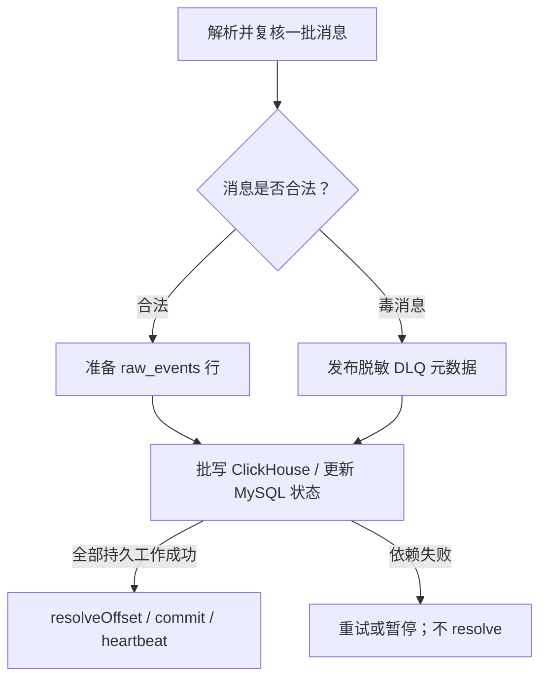

# 13. v1.8 契约、SDK 与事件管道

基线与阅读方式见 [第 12 章](12-v1.8-architecture-and-reading-map.md)。本章要解决的问题是：一条事件什么时候算合法、什么时候只是发送出去、什么时候可以查询，以及重复和失败由谁负责。

## 1. 三种结构，不要混为一个 JSON

| 结构           | 源码                                                                                          | 字段与用途                                                                             |
| -------------- | --------------------------------------------------------------------------------------------- | -------------------------------------------------------------------------------------- |
| 浏览器批次     | [event-batch-v3.schema.json](../../packages/event-contract/schema/event-batch-v3.schema.json) | `schemaVersion/sentAt/sdk/events`；事件有身份、页面、环境、时间和 payload              |
| Kafka envelope | [model.ts](../../packages/server-core/src/model.ts) 的 `KafkaEventEnvelope`                   | 增加 `envelopeVersion/projectId/receivedAt/requestId/origin/enrichments`，由服务端生成 |
| ClickHouse 行  | [consumer](../../apps/consumer/src/index.ts) 的 `rows`                                        | 将常用过滤/归约字段展开为列，保留 `payload_json`；不是原样保存浏览器请求               |

`schemaVersion` 是传输结构版本；SDK 版本是软件发布版本；`workflowDefinitionVersion`、质量事实 `qualityVersion` 又有各自用途。它们不能互相替代。

当前只支持契约 **v3**。字段与规范名称的修改入口是 [canonical-names.json](../../packages/event-contract/canonical-names.json) 和 [generate-types.mjs](../../packages/event-contract/scripts/generate-types.mjs)；JSON Schema 和 `src/generated` 类型均为生成结果，不要只修改生成文件。根命令 `pnpm contract:generate` 生成，`pnpm contract:check` 检查生成结果是否与源文件一致。

## 2. 校验为什么分三层

[boundaries.ts](../../packages/event-contract/src/boundaries.ts) 的 `validateForProducer/validateForIngestion/validateForConsumer` 都调用 [validateTransportBatch](../../packages/event-contract/src/validator.ts)。SDK 的浏览器运行时还有自己的规范化与边界处理，不能理解成所有环境都直接加载服务端 Ajv 校验器。

共同校验包含：

- v3 JSON Schema 与字段关系；批次不超过 50 条、64 KiB，单条不超过 8 KiB。
- 一个批次只能有一个 `appId + env`，批次内 `eventId` 唯一。
- 凭据和直接识别信息检测；JSON 可以序列化。
- 开启质量/使用采集时，相应计数、采样、序号和终态字段必须自洽。例如完成 API 数不能大于开始数。
- 仅在传入 `nowMs` 时检查事件时钟窗口，默认允许与当前时间偏差不超过 24 小时。接收端传入当前时间；consumer 不用消费时的“现在”重新拒绝合法积压。

接收端另外检查项目有效性、Origin、SDK 策略、工作流定义、功能注册、组织目录、对象引用。消费端复核治理结果，防止被污染或绕过 API 的消息成为可信事实。

要记住：TypeScript 的 `as FrontendInsightEventBatch` 不会运行任何校验。服务端处理外部 JSON 的边界不能用类型断言代替。

## 3. SDK 是有状态的小型运行时

从 [createTracker](../../packages/web-tracker/src/index.ts) 读起，再读 [BrowserTracker](../../packages/web-tracker/src/tracker.ts)。

`createTracker` 检查 appId、环境、release 和 endpoint。无效配置返回 noop tracker；同一 `appId/env/release/endpoint` 的存活实例会复用。这样重复初始化不至于重复安装同一套采集器。调试时查看 `getDiagnostics()`，不要仅以“初始化没抛异常”判断成功。

| 生命周期      | 关键动作                                                                | 维护关注点                                       |
| ------------- | ----------------------------------------------------------------------- | ------------------------------------------------ |
| 创建          | 建立 device/session/page view，装配工作流、表单和可选质量采集，安装监听 | `initialUserId` 尽早建立身份；SDK 自身失败应隔离 |
| 页面/路由变化 | 结算旧页面，建立新 `pageViewId`                                         | SPA 不是整页刷新，不能把不同路由的可见时间混算   |
| 可见性变化    | 累积前台可见时间、发送阶段结算                                          | 标签页在后台的墙钟时间不能当作有效停留           |
| `setUser`     | 用户变化前结算表单，再更新身份                                          | 操作句柄和工作流不能无条件跨账号延续             |
| 操作/工作流   | 保存实例状态，生成明确开始和终态                                        | 多次点击与一个业务操作、多步流程并非同一概念     |
| `flush`       | 从内存队列分批发送                                                      | 传输失败记诊断，不抛到宿主业务                   |
| `destroy`     | 结束采集/监听、结算并发起生命周期 flush                                 | 是尽力发送，不是等待服务端持久化的同步承诺       |

### 三种业务接口需要分别理解

- `featureStarted/featureSucceeded/...` 表达显式功能阶段。上报成功的时机由业务代码判断，不能用点击事件自动代替。
- `startOperation` 返回操作句柄，以 `operationInstanceId` 关联开始和终态。注册要求启用操作生命周期的功能，接收端会拒绝缺实例的生命周期事件。
- `startWorkflow` 由 [WorkflowRuntime](../../packages/web-tracker/src/workflow.ts) 持有工作流实例、定义版本、步骤和终态。它支持显式开始或首步开始、步骤触发和超时；服务端 [workflow-definitions](../../packages/server-core/src/workflow-definitions.ts) 会按已发布定义再校验。只按 session 或时间邻近推测步骤归属会破坏关联。

长时功能通过 `startLongView` 结算前台可见时长；表单和业务结果分别见 [forms.ts](../../packages/web-tracker/src/forms.ts) 与 `tracker.ts`。扩展接口前，先用已有测试确认它属于哪个状态机。

## 4. 队列与发送的真实保证

`createTracker` 默认每 10 秒 flush；队列默认且最高为 100 条，满队列时丢弃最老条目并记录诊断。`nextBatch` 按 50 条/64 KiB 限制分包。队列在内存中，没有断电恢复或持久离线补传保证。

`send` 的行为是：

1. 生命周期发送优先 `sendBeacon`；若浏览器接受入队就视为本次发送成功。
2. Beacon 未入队时回退 fetch，并使用 `keepalive`。
3. fetch 最多尝试 3 次，间隔为 50ms、100ms；网络异常和非 4xx 失败可重试，**所有 4xx，包括 429，都直接停止该批发送**。
4. 批次失败后记录 `failedBatches`；当前实现不会把已取出的批次放回队列长期等待。

因此 `sentEvents` 不是 ClickHouse 确认计数，Beacon 成功更不是 API 202 证明。若业务需要财务审计级“不丢事件”，不能仅修改这两个计数器就宣称支持。

身份有不同层级：`eventId` 标识事实，`pageViewId` 标识页面访问，`sessionId` 标识会话，`deviceId` 是未登录使用分析的设备兜底，`userId` 是经过约束的业务用户引用。UV 的去重键应按具体读模型查看，不能把设备 UV 写成真实账号人数。

## 5. 接收端：将不可信事件变成可消费消息

跟读 [IngestionManager.accept/sanitize](../../packages/server-core/src/pipeline.ts)：

1. 检查大小、契约和时钟；按 `appId` 读取项目配置。
2. 确保项目 active，`Origin` 存在并精确匹配项目白名单；校验探针版本策略。
3. 以项目、Origin、IP 为键限流。限流器、项目缓存和诊断计数都在 API 进程内，多副本不会自动共享。
4. 校验工作流及功能；读取目录，生成可信 enrichments。
5. 用 `HMAC-SHA256(ACCOUNT_HMAC_KEY, projectId + ':' + userReference)` 转换用户引用；同一引用在不同项目下结果不同。
6. 用事件发生时刻、环境和当时可见的已发布组织目录覆盖 `deptId/roleId`；浏览器声称的部门不拥有权威性。
7. 发布 Kafka，成功后尽力更新接收状态，再返回 202 和 `requestId`。

CORS 预检响应和业务 Origin 白名单是两件事。`OPTIONS` 返回允许头不意味着 `POST` 已授权；真实检查在 `assertProject`。采集公开路由也不需要把管理端 bearer token 嵌入业务网页。

### 重复操作为什么有另一条短期通道

重复操作需要判断是不是对同一业务对象的操作，但对象关联材料不应长时间混在全部事件里。[object-reference.ts](../../packages/server-core/src/object-reference.ts)、[repeated-projection.ts](../../packages/server-core/src/repeated-projection.ts) 与 `sanitize` 共同完成：

- 受约束的业务开始事件携带已签发引用；验证用户、会话、实例、操作、环境等上下文。
- 从长通道 payload 删除 `objectReference`，留下 `repeatedEligible` 等事实标记。
- `publishWithObjects` 在一个 Kafka 事务中同时发布短期对象材料与普通 envelope，失败则中止事务。
- consumer 订阅短期主题并产生重复证明。长通道若仍有 `objectReference`，会拒绝为 `OBJECT_REFERENCE_IN_LONG_CHANNEL`。

这不是 MySQL、Kafka、ClickHouse 的分布式事务；Kafka 事务只覆盖其两条消息发布。短期表及查询保护见下一章。

## 6. Consumer：offset 是数据不丢的关键

[EventConsumerRuntime.start/eachBatch](../../apps/consumer/src/index.ts) 当前配置是 `autoCommit: true`、`autoCommitThreshold: 1`、`eachBatchAutoResolve: false`。不要把历史文档中的“手动提交”简化理解成当前 `autoCommit: false`。

对普通主题，处理顺序如下：



重要区别：

- 毒消息指结构或业务证据确实非法；DLQ 写入成功后才能跳过它。DLQ 只保存来源 offset、错误码、hash、可验证的 projectId 等元数据，没有原始 payload，不能指望用 DLQ 本身重建事件。
- MySQL 元数据读取失败、ClickHouse 写失败属于依赖故障，不能据此将正常业务消息丢进 DLQ。达到重试阈值后暂停分区，稍后恢复。
- 先完成批次写入及状态更新，再 resolve 全批 offset，避免后面的毒消息先提交导致前面的未写事实被跳过。
- Kafka 事务有不可见控制记录；当前提交逻辑也考虑控制记录推进和未处理后缀。不要用“最后看到的事件 offset + 1”自行重写提交。

短期主题每次最多处理一条 Kafka 消息，其中对象最多 50 个；完成投影或确定毒消息并写 DLQ 后才 resolve。消费者设置 `readUncommitted: false`，不读取未提交事务内容。

### 幂等不是“数据库里永远只有一条”

发布器启用 Kafka producer 幂等，不等于 SDK 重发同一 eventId 永远不会形成新消息。若 ClickHouse 写成功后进程退出、offset 未提交，重启会重写。`raw_events` 本身是普通 `MergeTree`，允许重复。

因此系统采用至少一次消费与读侧去重：查询或 reducer 按 eventId 处理重复，部分事实 reducer 还会把相同 ID 的内容冲突判为不可用。这不是端到端 exactly-once；给新读模型直接写 `count(*)` 会把基础设施重试计成业务增长。

## 7. 跟读练习与预期

**练习 A：模拟失败，不改生产服务。** 阅读 [pipeline.test.ts](../../packages/server-core/test/pipeline.test.ts)、[consumer 测试目录](../../apps/consumer/test)，找到 Kafka 发布失败、写库失败和毒消息场景。若依赖已安装，可在仓库根运行：

```bash
pnpm exec vitest run packages/server-core/test/pipeline.test.ts apps/consumer
```

预期：Kafka 失败不返回“已接收”；写库失败不提前 resolve；毒消息进入脱敏 DLQ。单元测试证明控制顺序，真实 Kafka/ClickHouse 故障恢复仍需集成验证。

**练习 B：为什么在 consumer 重查目录？** 跟读 `sanitize` 与 [governConsumerOrganization](../../packages/server-core/src/organization-directory.ts)。

预期：consumer 不把 envelope 的组织声明直接当权威。缺 `directoryVersionId` 的旧消息保留业务事实，但清空组织归属；有版本时必须与可信目录、用户和部门一致，否则拒绝。

**练习 C：一个请求获得 202，但质量页没有错误，下一步看什么？**

预期按证据逐步缩小：响应 requestId → consumer 健康/积压与拒绝 → raw event/occurrence → 项目、`dev/staging/prod`、事件时间边界、查询快照与筛选。不要先把错误明细查询加上 `qualityVersion` 必填；旧错误也可以进入错误明细，正式质量指标才有不同证据要求。

**练习 D：修改 SDK 重试次数会发生什么？**

预期：会影响页面退出时发送成本、接口压力、重复写入和诊断统计，不能自动解决持久离线补传或业务 exactly-once。至少复核 SDK 发送测试和读模型重复事件测试，而不是仅改一个常量。

继续阅读 [第 14 章](14-v1.8-storage-and-read-models.md)。
