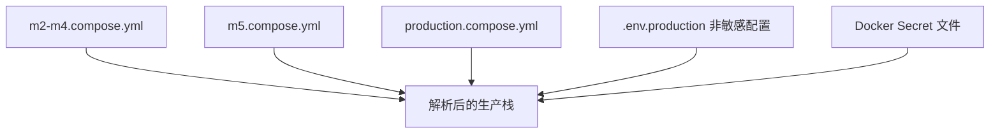

# 15. M7 生产硬化与故障恢复

## 1. M7 的结论

M7 没有把单机 Compose 宣称为“生产高可用”。它把以下能力变成可执行、可验证的 pilot 基线：

- Secret 不进入版本库或普通环境明文；
- 进程和依赖有真实 readiness；
- 容器有资源、日志、只读文件系统和优雅停止边界；
- 固定负载、故障注入、备份、恢复和应用回滚可重复；
- CI/synthetic 与目标环境/真实项目发布门分开。

## 2. 本地栈与 production overlay

本地 `scripts/dev` 使用 M2–M4 基础 Compose + M5 Web overlay。`scripts/production` 再叠加 `production.compose.yml`：

production overlay 为 MySQL、ClickHouse、Kafka、API、consumer、web 设置：

- `restart: unless-stopped`；
- stop grace period；
- 有界 json-file 日志；
- CPU/内存 reservations/limits；
- app/web 的 read-only root + 必要 tmpfs；
- API/consumer 的 `*_FILE` Secret；
- secure refresh cookie；
- synthetic seed/demo 只在 profile 中启用。

## 3. Secret 生命周期

`scripts/production init-secrets --confirm-create`：

1. 要求显式确认；
2. 拒绝覆盖已存在或“半套” Secret；
3. 用 OpenSSL 生成六个值；
4. 目录 700、文件 600；
5. 不打印值；
6. `.env.production` 只保存非 Secret 配置。

`doctor` 会检查 Docker/Compose、权限、长度、Compose 解析、local-only 凭据、主机内存和磁盘。`FI_ALLOW_CONSTRAINED_HOST=1` 只为 CI 策略检查跳过容量 gate，不能作为真实 pilot 通过证据。

## 4. 部署不是 `docker compose up`

`deploy [release-id]` 的顺序：

1. doctor；
2. 校验安全的 release tag；
3. 构建带 release tag 的 app/web 镜像；
4. 启动并等待 MySQL/ClickHouse/Kafka；
5. 独立运行 additive migration；
6. 启动 API/consumer/web，禁止重新 build；
7. 记录 current/previous release；
8. 验证 API、consumer、web readiness。

migration 与应用镜像分离，意味着应用可以回滚到旧镜像，但数据库不 down-migrate。

## 5. Live 与 ready

| 探针 | 回答的问题 |
| --- | --- |
| live | 进程是否存活 |
| API ready | MySQL、ClickHouse、Kafka 是否真实可用 |
| consumer ready | consumer 进程、ClickHouse/Kafka 状态和 lag 是否满足 |
| web health | Nginx 是否能服务 |

Kafka 或 ClickHouse 故障时 ready 必须失败，即使 Node 进程还活着。编排系统才能停止把新流量送给“不具备服务能力”的实例。

## 6. 三种故障的语义

`scripts/m7 fault ... --confirm-disruption` 会主动停止服务：

| 故障 | 故障期间 | 恢复后 |
| --- | --- | --- |
| consumer 停止 | API 仍将事件写入 Kafka 并返回 202 | backlog 消费，marker 可查询 |
| ClickHouse 停止 | API ready 失败；Kafka 已接收数据保留 | consumer 重试，marker 最终可查询 |
| Kafka 停止 | ingestion 明确 503，不伪造 202 | Kafka 恢复后新 marker 202 并可查询 |

这里的 202 只表示 Kafka 已确认接收，不表示 ClickHouse 已可查；Kafka publish 超时是“结果未确认”，SDK 可使用相同 eventId 重试，读模型再去重。

## 7. 固定负载门槛

`tools/m7-load.mjs` 的 full profile：

- 20 events/s 持续 60 秒；
- 200 events/s 峰值 10 秒；
- 每批不超过 50；
- HTTP 接收失败为 0；
- request p95 ≤1000ms；
- 120 秒内 expected 全部可查询。

事件使用未归类 `/m7/load`，避免负载数据污染运营指数。报告同时读取 API 进程的 ingestion/analytics/observability 指标；这些进程指标目前不跨副本汇总。

## 8. 一致备份

`production backup` 的顺序很重要：

1. 停 API/Web，阻止新 ingestion；
2. 等 consumer group lag 归零；
3. 停 consumer；
4. MySQL single-transaction dump；
5. ClickHouse `raw_events FORMAT Native`；
6. 写 release/format metadata；
7. 生成 SHA-256；
8. 无论成功/失败都尝试恢复服务。

只备份 MySQL 或只备份 ClickHouse 会产生不一致切点：控制面配置和事件事实可能不属于同一时刻。

## 9. 恢复与应用回滚不同

### 9.1 Restore

`restore <name> --confirm-replace-data` 会替换数据：

- 先校验 SHA-256；
- 自动生成 pre-restore 安全备份；
- 停应用；
- 恢复 MySQL；
- truncate + restore ClickHouse raw_events；
- 重跑 migration；
- 启动并 verify。

这是破坏性运维动作，必须在维护窗口并确认异地副本可读取。

### 9.2 Rollback

`rollback <release-id> --confirm-rollback`：

- 要求旧 app/web 镜像仍存在；
- 先备份；
- 用旧镜像重建 API/consumer/web；
- 保留当前 schema/data；
- verify。

旧应用必须兼容已执行的 additive schema。回滚不是 down migration，也不会恢复历史数据快照。

## 10. CI 与真实发布门

`.github/workflows/m7-m8.yml` 自动执行：

- `pnpm check`；
- shell 语法和 production policy；
- Chromium/WebKit；
- Compose smoke；
- full load；
- Kafka/ClickHouse/consumer fault；
- release/restore drill；
- M5/M6/M8 E2E。

仍需人工/外部证据：

- Apple Silicon/目标部署环境的资源峰值；
- 目标环境备份/恢复和故障演练；
- TLS/ACL、集中日志 30 天、通知、异地备份；
- 至少一个真实项目试点；
- M8 三项目和处理人。

“CI 绿”与“阶段 Go”是两种不同结论。

## 11. v1.7 评审影响

v1.7 的 Pre-1.0 reset 会改变 M7 的运维语义：

- 当前 production 流程只允许 additive migration；
- 当前 rollback 保留 schema/data；
- v1.7 提议在可丢弃本地/验收环境一次性清空 v1/v2 数据；
- reset 必须是独立、精确目标的命令，不能复用 restore/rollback 的名称；
- 一旦发现真实 SDK 或真实数据，必须退出 reset 路径并回到迁移方案。

因此“测试环境重建”与“投产后的向前 migration”必须在文档、命令和验收中分开。

## 12. 代码精读入口

1. `scripts/production`；
2. `infra/compose/production.compose.yml`；
3. `scripts/m7`；
4. `tools/m7-load.mjs`、`tools/m7-resilience-probe.mjs`；
5. `packages/server-core/src/clickhouse-health.ts`；
6. `apps/api/src/system.controller.ts`、consumer health server；
7. `.github/workflows/m7-m8.yml`；
8. `docs/guides/m7-m8-local-acceptance-macos.md`。

