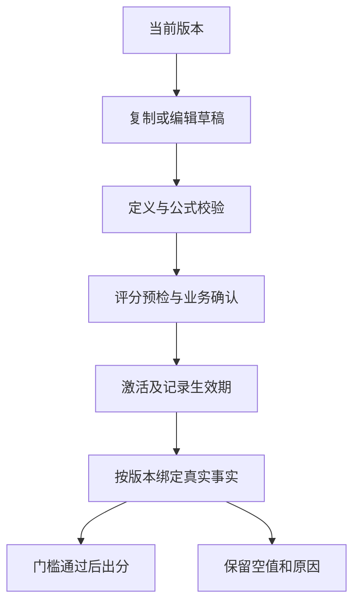

# 15 · v1.8 业务分析、事实与版本化评分

> 阅读基线：`agent/v1-8-r8-cleanup-acceptance` 的 `641e106`，包含质量刷新修复 `4948ece`。本文讲当前实现，不代表 R6 手工验收、R7 业务审批或 R8 修复后复验已通过。适合熟悉 Python、准备接手服务端维护的人。

读完应能回答三个问题：页面上的数从哪些事实算来；为什么已有数据仍不能出分；改业务配置后哪些历史结果会受影响。

## 1. 先区分定义、事实、展示和分数

Python 开发者可将 `server-core` 中的纯函数看作不访问数据库的领域函数，把 `*FactStore` 看作读取事实的 repository，把 `*Service` 看作组合事务与领域函数的 service。Nest controller 负责 HTTP 输入和权限，Vue 负责展示；不能把业务口径迁移到组件内再算一份。

| 层次     | 存什么/做什么                                      | 读代码入口                                                                                                                                             |
| -------- | -------------------------------------------------- | ------------------------------------------------------------------------------------------------------------------------------------------------------ |
| 分析对象 | 模块、页面、操作、工作流，以及有效期和修订         | [analysis-objects.ts](../../packages/server-core/src/analysis-objects.ts)、[mysql-store.ts](../../packages/server-core/src/mysql-store.ts)             |
| 事实     | 收到并持久化的访问、操作、工作流、性能和错误事件   | [business-facts.ts](../../packages/server-core/src/business-facts.ts)、[workflow-facts.ts](../../packages/server-core/src/workflow-facts.ts)           |
| 指标定义 | 单位、适用对象、粒度、样本门槛、公式、实现状态     | [metric-library.ts](../../packages/server-core/src/metric-library.ts)                                                                                  |
| 读模型   | 在指定项目、环境、时间窗、版本下组合事实与定义     | [business-analysis.ts](../../packages/server-core/src/business-analysis.ts)、[project-overview.ts](../../packages/server-core/src/project-overview.ts) |
| 评分     | 对可用事实归一化、按权重汇总、判断门槛并给出解释   | [score-evaluation.ts](../../packages/server-core/src/score-evaluation.ts)                                                                              |
| 展示绑定 | 决定哪个版本中的哪些指标出现在概览/业务/页面卡片上 | `MetricLibraryService.saveDisplayBindings`                                                                                                             |

“注册了指标”不等于“实现了事实查询”；“卡片出现”不等于“可以参与评分”；“错误详情存在”不等于“质量分数可用”。这些是不同层次的状态。

## 2. 纵向读一条业务分析请求

从 [BusinessAnalysisView.vue](../../apps/web/src/views/BusinessAnalysisView.vue) 到 [projects.controller.ts](../../apps/api/src/projects.controller.ts)，再进入 `BusinessAnalysisService.analysis`：

1. 确认项目访问权，解析环境和时间。`resolveProjectCalendar` 使用项目时区生成 `[from,to)` 及日历桶，不能用浏览器本地时区替代。
2. 服务在 MySQL 的 `REPEATABLE READ` 事务中读取项目、模块修订、页面修订、当前运营版本、展示绑定、工作流定义、组织目录和使用来源。一次请求中的元数据需要自洽。
3. 页面归属使用页面修订与模块修订有效期的交集；修改今天的归属不能把历史访问一律搬到新模块。显式指定模块还会校验它确实属于该项目。
4. 用快照读取 ClickHouse 事实，再调用 reducer。`asOf` 限制本次可见的事件/接收证据；观察时点不等于查询结束时间 `to`。
5. 将事实按版本定义绑定，组合指标、工作流、效率与解释。若客户端带来的 `versionId` 已不是当前运营版本，返回 `BUSINESS_ACTIVE_VERSION_CHANGED`，而不是悄悄混算。

排查一张“空卡片”时，按这个顺序检查：请求范围 → 定义有效期 → 活跃版本 → 展示绑定 → 事实查询 → 指标状态。不要先给空值补 `0`。

## 3. 分析对象与工作流为什么需要版本

页面路径通过 `normalizePageRouteDefinition` 归一化：拒绝 query/hash、非法路径片段，数字、UUID 等动态片段归为 `:id`。这是控制同一页面被订单号等动态值拆成大量对象的基础。它不是任意 URL 的字符串模糊匹配器。

工作流定义包含有序步骤和终态策略。校验要求 2–20 个步骤，`stepKey`、顺序不重复且顺序连续，终态步骤必须存在且互不冲突。触发方式的 `triggerConfig` 使用白名单字段：

| 触发方式             | 证据含义                                                           |
| -------------------- | ------------------------------------------------------------------ |
| `explicit_sdk`       | 业务代码明确调用 SDK 告知到达步骤                                  |
| `selector`           | 约定 DOM 元素的 click/change；易变 class 选择器会被识别为脆弱配置  |
| `network_request`    | 约定方法和路径的请求；不能自动证明业务成功                         |
| `page_lifecycle`     | 页面 loaded/refreshed                                              |
| `operation_terminal` | 指定 operation 的 succeeded/failed/canceled 终态，需要真实操作证据 |

关键链路：SDK 产生显式 `workflowInstanceId` 和关联操作实例 → consumer 保存事实 → [workflow-reducer.ts](../../packages/server-core/src/workflow-reducer.ts) 根据定义重放 → [workflow-score-facts.ts](../../packages/server-core/src/workflow-score-facts.ts) 转为评分事实。不要按“同一个 session 中最近的操作”猜所属工作流。

Reducer 先按 `eventId` 去重；同 ID 不同内容视为冲突。它检查实例的会话、身份、工作流 key/版本是否一致，并在整个项目/环境的关联范围内检查一个 operation 是否被绑定到多个父实例。对于 `operation_terminal`，必须找到匹配的操作开始、最早终态和约定状态；只有一个“步骤达到”事件不能伪造成功。

输出状态为 `started/completed/failed/canceled/approximate_abandoned/unresolved`。没有终态且超时才推断 `approximate_abandoned`，不创建一条伪造超时事件。一般矛盾证据变成 `unresolved`；不同时间的终态冲突保留最早终态并记录原因，同一时刻矛盾终态则无法判定先后。耗时仅对完成实例计算。

汇总按 **开始时间** 落在 `[from,to)` 的 cohort 统计。终态可在观察截止前稍后到达；成功率遇到 unresolved 不会给出一个假精确值。修改 reducer 时至少保护：乱序/重复到达、迟到终态、跨版本、跨身份、一个操作多个父实例、缺少成功步骤。

测试入口：[workflow-reducer.test.ts](../../packages/server-core/test/workflow-reducer.test.ts)、[workflow-facts.test.ts](../../packages/server-core/test/workflow-facts.test.ts)、[workflow.spec.ts](../../tests/v1.8/r4b/workflow.spec.ts)。

## 4. 操作效率与组织维度：分母先于比率

[efficiency-policy.ts](../../packages/server-core/src/efficiency-policy.ts) 将已批准口径落实为可读的函数：

- 表单效率以生命周期结算为 cohort，使用已提交生命周期的 changes/resets/validationFailures 除以 submits；未提交生命周期单独排除。少于 5 次提交、计数溢出、冲突或覆盖未证明，会返回原因及空正式值。`resets/submits` 是比率，可以大于 1，不能为了“像百分比”截断。
- `operation_fail_rate` 的正式分子是业务 `rejected`，分母是 `started`；技术失败、取消、未知是不同结果。HTTP 200 不能替代业务适配器的成功/拒绝结果。样本不足、unknown、unresolved 或来源覆盖未知都会阻止正式可用。
- `form_efficiency` 是结构化结果，不是一个可直接塞入标量评分的数字。

[repeated-operation.ts](../../packages/server-core/src/repeated-operation.ts) 使用滚动、含边界的 24 小时关系，不是“同一自然日”。同用户、对象类型、操作及服务端验证的对象引用用于关联；[object-reference.ts](../../packages/server-core/src/object-reference.ts) 和 [repeated-projection.ts](../../packages/server-core/src/repeated-projection.ts) 提供引用与投影链路。不能让浏览器任意声明一个对象 ID 就信任它，也不能把跨轮换的内部别名返回给页面。同一关联组滚动 24 小时内至少 3 次操作才标记重复，最终分子/分母是命中与合格的 user-session 集合，不是简单的重复事件数/全部事件数。正式值还要求前后各一天扫描、`asOf ≥ to + 2 天`、已证明覆盖及至少 5 个分母样本。扫描范围不完整、引用过期与未知覆盖必须保留为不可用原因。

组织采用有版本的可信目录，不能把当前访问过的人数当“应使用人数”。[organization-facts.ts](../../packages/server-core/src/organization-facts.ts) 要求：完整且关闭的日历桶、桶后至少一天的迟到观察窗口、历史范围被目录覆盖、桶内不跨目录版本、目录 coverage 完整、合格分母非零。代码另有小组抑制，`ORGANIZATION_SMALL_GROUP` 返回 `privacy_suppressed`，不是零。此处描述现有实现，不能因为“内部系统”就在维护时绕过。

测试入口：[efficiency-facts.test.ts](../../packages/server-core/test/efficiency-facts.test.ts)、[organization-facts.test.ts](../../packages/server-core/test/organization-facts.test.ts)、[repeated-operation.test.ts](../../packages/server-core/test/repeated-operation.test.ts)。

## 5. 页面运营与页面质量不是同一条读模型

页面运营由 [page-operations.controller.ts](../../apps/api/src/page-operations.controller.ts) 组合页面修订、运营指标版本、工作流事实及 [page-usage.ts](../../packages/server-core/src/page-usage.ts)。核心口径：

- PV 是窗口内 `page_view`；UV 优先 user，缺 user 才用 device；VV 按原始 session 去重。跨午夜不人为拆 session。
- 先取窗口内全路由数据，再计算所选页面关联 session 的深度；先筛掉其他页面会制造“跳出”。
- 当前平均使用时长要求 `r6-1` 连续 sequence 的使用片段和关闭标记、同一 pageView/session/route/identity；完整总时长除以 UV，不是简单对所有 leave 取平均。缺片段返回 `PAGE_LEAVE_INCOMPLETE_OR_IDENTITY_MISSING`。
- [page-usage-binding.ts](../../packages/server-core/src/page-usage-binding.ts) 继续检查 page scope、definitionVersion、样本及版本时间边界。原始访问已存在也可能没有正式指标值。

质量分数事实由 [quality-facts.ts](../../packages/server-core/src/quality-facts.ts) 读取并经 [quality-binding.ts](../../packages/server-core/src/quality-binding.ts) 绑定到选中的不可变质量版本。新 collector 上线不会自动把旧定义改成新口径；`QUALITY_DEFINITION_UPGRADE_REQUIRED` 需要定义升级和正常版本流程。

错误列表/详情则走 [page-quality.ts](../../packages/server-core/src/page-quality.ts)，输出安全投影后的 occurrence/group、分类、页面、有限上下文及 breadcrumb，支持 latest/all 与游标。它并不要求先产生质量分数。不要给详情 API 添加“必须有 qualityVersion 才能查询”的条件来修复空列表。

测试入口：[page-usage.test.ts](../../packages/server-core/test/page-usage.test.ts)、[page-usage-binding.test.ts](../../packages/server-core/test/page-usage-binding.test.ts)、[page-quality.test.ts](../../packages/server-core/test/page-quality.test.ts)、[quality-binding.test.ts](../../packages/server-core/test/quality-binding.test.ts)。

## 6. 从一项指标修改到正式分数

运营与质量分别有版本链。`metricSetVersion` 标识指标集合快照，`definitionVersion` 标识具体定义口径，不能混用；工作流版本、目录版本、SDK 版本又是不同概念。

[metric-library.ts](../../packages/server-core/src/metric-library.ts) 的 `createDraft`、`activateVersion` 管理生命周期。编辑生效版本的评分或展示绑定会创建草稿。激活在项目行锁和事务中再次验证定义、评分和引用，并更新版本生效期；不是简单修改前端“当前版本”选择框。重新启用旧版本也须走激活记录。

业务公式使用 [formula.ts](../../packages/server-core/src/formula.ts) 的受限 AST：校验引用、单位/作用域/粒度与依赖图，拓扑排序后求值，不运行用户提供的 JavaScript。维护一个指标要连同 `minimumSample`、`implementationStatus`、单位与作用域一起考虑。

评分有四种容易混淆的操作：

| 操作              | 实现与结果                                                                                                                                                                         |
| ----------------- | ---------------------------------------------------------------------------------------------------------------------------------------------------------------------------------- |
| 预检              | [score-preflight.ts](../../packages/server-core/src/score-preflight.ts) 校验未保存配置与真实版本；明确返回 `saved:false/value:null/SCORE_PREFLIGHT_CONFIGURATION_ONLY`，不查询事实 |
| 预览              | `ScoreManagementService.preview` 给配置差异、依赖血缘、影响和 fixtures；示例计算不是线上真实得分                                                                                   |
| 保存/激活         | `save` 核对业务选项摘要 `optionsDigest`，保存配置及依赖快照；定义激活仍是独立流程                                                                                                  |
| 当前计算/历史试算 | `query` 按正式生效期读事实；`trial` 以 `historical_trial` 模式计算并保存结果快照和审计，不重写历史正式分数                                                                         |

业务确认不是一句 UI 勾选说明：运营分数确认前需要目标人数、预期工作日、有效核心页面、作用域内工作流及其权重。业务选项在编辑期间改变时返回 `SCORE_BUSINESS_REVISION_CHANGED`；重新加载并审查，不能删掉这个检查。

`evaluateScore` 的输入事实必须带完全相符的项目、环境、指标集/定义版本、scope、时间窗、时区和粒度。它依次判断配置确认与 owner、管道健康、当前版本生效范围、事实匹配、采集实现与启用状态、样本、target，再对叶子归一化。维度只汇总合格叶子，整体判断 **合格维度数** 和 **叶子权重覆盖率** 两个 gate，不能把它概括成“有三条数据就能出分”。缺失值不按 0 分算，移除缺失叶子后也不能跳过 gate。

默认运营维度权重为覆盖 30%、持续/深度 25%、任务达成 30%、效率 15%，见 [score-templates.ts](../../packages/server-core/src/score-templates.ts)。这是带版本的模板，不是每次查询强行覆盖用户配置的常量。

显示绑定和血缘解决另外两个问题：`saveDisplayBindings` 选择 overview/business/page 的指标，检查对象 scope、启用状态、重复数量及未采集指标；`lineage/impact/diff` 展示依赖、引用位置和版本差异。改了定义而没绑到页面，页面不出现；绑到了页面也不能保证 score 配置引用它。优先用 [MetricLineageDrawer.vue](../../apps/web/src/components/MetricLineageDrawer.vue) 与 [ScoreExplanation.vue](../../apps/web/src/components/ScoreExplanation.vue) 验证维护效果。

## 7. 修改前如何选验证范围

| 修改                  | 最小有意义的验证                                                    |
| --------------------- | ------------------------------------------------------------------- |
| 工作流终态或实例归属  | reducer 单测 + fact/score 接合测试 + R4-B 浏览器链路                |
| 组织分母/重复操作窗口 | 目录版本、边界、覆盖未知和轮换别名的反例测试                        |
| 评分公式/门槛         | `pnpm test:r1c`，并验证不满足样本、跨版本、跨环境不出分             |
| 页面使用口径          | `pnpm test:r6`；完整/缺失片段、跨午夜、页面筛选不能制造跳出         |
| 指标展示绑定          | metric-library 与对应 controller 测试；草稿可见但未激活不冒充正式值 |
| 质量事实或定义升级    | `pnpm test:r5a`，确保旧定义不被重标，新定义有真实来源               |

命令以仓库根 [package.json](../../package.json) 为准。单测、controller 模拟、真实存储集成、浏览器端到端证明的范围不同；不能用一次纯函数通过替代全链路。本文是阅读指南，不声称本次文档编写重新运行了这些测试。

## 8. 自测练习与预期答案

**练习 A：同一个工作流实例先收到 completed，再收到 timestamp 更早的 started，应该按接收顺序判断失败吗？**

预期：不应。查看 `reduceWorkflowInstances`，它按明确观察截止过滤、去重并依据事件事实重放；但两条证据都必须在接收截止内，且定义、身份、步骤等约束满足。

**练习 B：某表单 5 次提交、10 次 reset，UI 是否应限制成 100%？**

预期：不应。正式口径为已提交生命周期的 resets/submits，可能为 2；仍须来源覆盖与无冲突。未提交生命周期的 reset 不能混进分子。

**练习 C：管理员改权重并预检成功，为什么概览还是旧分数？**

预期：预检没有保存或激活；即便已保存，也可能仍是草稿。沿 version ID、激活期、展示绑定与实际查询上下文检查，不应将预检 fixtures 接入概览。

**练习 D：页面错误列表有数据而质量分数显示 unavailable，是否矛盾？**

预期：不矛盾。详情是 occurrence 读模型；评分还有版本、采样/覆盖、分母、样本、target、配置与 gate。逐层检查 `reason`，不要伪造零分或满分。

**练习 E：昨天部门 A 有 8 人访问，能否把 8 当部门渗透率分母？**

预期：不能。访问人数是分子候选，分母来自有效可信目录及 eligibility；还须闭合桶、迟到窗口、单目录版本、完整 coverage 和小组规则。
