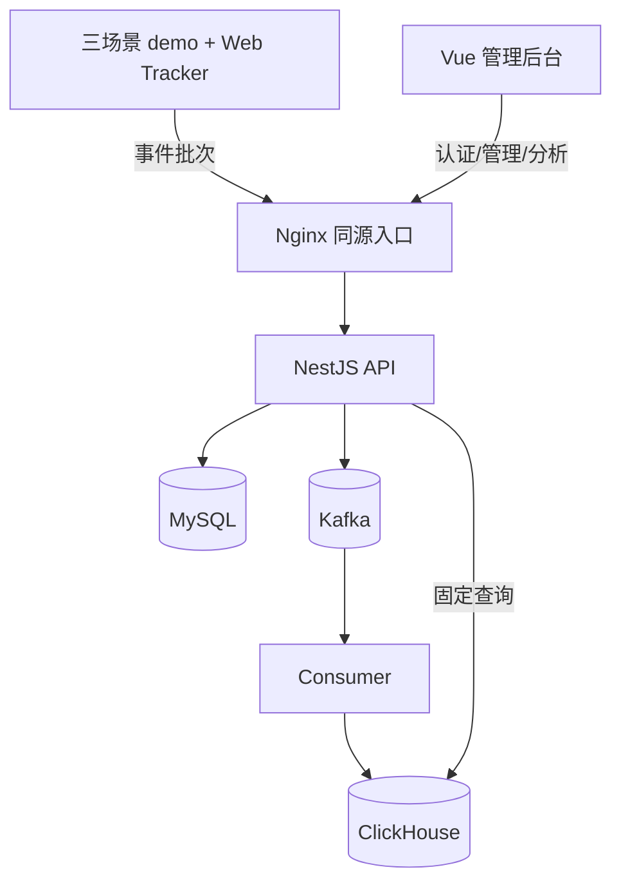

# Frontend Insight 项目学习指南（M0–M5）

> M0–M4 代码基线：`agent/m1-engineering-contract-migrations`，提交 `fd2f468`  
> M5 代码基线：`agent/m5-management-ui-demo`，提交 `c1bbbf3`  
> 学习资料分支：`agent/project-learning-guide-m0-m4`  
> 已覆盖：M0 技术验证、M1 工程/契约/迁移、M2 Web SDK、M3 数据链路、M4 管理与分析 API、M5 Vue 管理后台与三场景 demo  
> 尚未覆盖：M6 生产硬化、备份恢复、容量验证与真实项目试点

学习资料分支用于集中维护文档，没有合入 M5 业务代码。阅读第 8–11 章时，请同时打开 `agent/m5-management-ui-demo` 或上述固定提交，避免用后续变更后的代码反推旧设计。

这组文档的目标不是复述源码，而是让维护者形成一张可以解释、验证和修改项目的心智地图。读完后，你应该能回答五类问题：

1. 一条事件为什么要经过这些模块，而不是直接写数据库？
2. 每个存储、框架和抽象分别解决什么问题？
3. 关键函数维护了哪些业务不变量，改错后会破坏什么？
4. API 的数据语义如何变成不会误导使用者的页面状态？
5. 新需求应该落在哪一层、需要补哪些测试、哪些边界暂时不能突破？

## 1. 先建立正确的项目定义

Frontend Insight 是“内部 Web 功能采用分析系统”，不是通用埋点平台、人员考核系统、财务级审计系统，也不是 Sentry/BI 的替代品。当前核心问题只有两个：

- 页面和数据是否真正被查看；
- 功能是否从曝光、开始走到了业务成功，以及是否被重复使用。

这个定义直接决定了代码和页面中的几个重要选择：

- “按钮被点击”不能算成功，操作功能必须由业务代码显式调用 `featureSucceeded`；
- 大屏必须累计前台可见时间，后台标签页不能制造成功；
- `visitorId`、`sessionId`、`accountId` 是三种不同口径，任何一个都不能被直接称为“真实人数”；
- 允许 Kafka at-least-once 和查询时近似/去重语义，不承诺账务系统的 exactly-once；
- 缺少数据时必须区分“尚未接入”“所选范围无活动”“链路延迟”“请求失败”，不能统一显示 0；
- 管理端提供证据、定义和排障入口，不输出健康度、设计得分或人员结论。

## 2. M5 完成后的系统地图

| 组件                      | 当前职责                                                        | 不负责什么                               |
| ------------------------- | --------------------------------------------------------------- | ---------------------------------------- |
| `apps/web`                | 登录、项目/范围上下文、功能与页面证据、接入配置、统一页面状态   | 不在浏览器计算权威指标，不绕过服务端授权 |
| `apps/demo-app`           | 用受控交互证明三类成功语义和隐私边界                            | 不是生产业务系统，不模拟所有异常         |
| `infra/nginx/m5.conf`     | 提供静态文件、SPA fallback、同源 API/ingestion 代理和基础安全头 | 不替代生产网关、WAF、SSO 或 TLS 终止设计 |
| `packages/web-tracker`    | 浏览器生命周期、三类功能事件、隐私约束、批量发送                | 不判断业务操作是否成功，不持久化离线队列 |
| `packages/event-contract` | JSON Schema、生成类型、统一校验、拒绝码                         | 不包含数据库模型或业务授权               |
| `apps/api`                | HTTP、NestJS 装配、输入/输出边界、认证入口                      | 不直接堆放主要业务逻辑                   |
| `packages/server-core`    | ingestion、认证、权限、MySQL store、分析查询、状态判断          | 不依赖具体 Web UI                        |
| Kafka                     | 削峰、解耦接收与写库、有限重放                                  | 不提供最终查询结果                       |
| `apps/consumer`           | 手动提交 offset、批写 ClickHouse、毒消息隔离                    | 不计算 Dashboard 指标                    |
| MySQL                     | 用户、项目、功能、Origin、成员、会话、审计和链路状态            | 不存高吞吐行为明细                       |
| ClickHouse                | 原始事件与固定聚合查询                                          | 不作为管理元数据事实来源                 |

M5 增加的是“可操作的产品表面”，没有改变 M2–M4 的数据所有权：项目和功能定义仍来自 MySQL，使用事实仍来自 ClickHouse，前端只是把固定 API 的语义清楚地呈现出来。

## 3. 建议阅读顺序

| 顺序 | 文档                                                                  | 读完后的能力                                                       |
| ---: | --------------------------------------------------------------------- | ------------------------------------------------------------------ |
|    1 | [架构、边界与技术选型](01-architecture-and-boundaries.md)             | 能画出组件图，解释为什么分层和为什么使用三种基础设施               |
|    2 | [事件契约、数据模型与迁移](02-contract-data-and-migrations.md)        | 能从 Schema 追到 Kafka envelope 和 ClickHouse 行，理解兼容与升级   |
|    3 | [Web Tracker SDK](03-web-tracker-sdk.md)                              | 能解释 SPA、会话、可见时间、长时大屏和发送策略                     |
|    4 | [接收、Kafka 与 Consumer](04-ingestion-and-consumer.md)               | 能解释 202、HMAC、at-least-once、去重、DLQ 和数据状态              |
|    5 | [认证、管理与分析 API](05-auth-management-and-analytics.md)           | 能解释双层授权、刷新令牌轮换和每个指标的查询口径                   |
|    6 | [测试、运维与维护手册](06-testing-operations-and-change-playbooks.md) | 能按证据定位故障，并安全修改契约、查询或数据库                     |
|    7 | [M0–M4 代码精读实验](07-code-reading-labs.md)                         | 能通过可重复实验把“看懂”变成“亲手验证过”                           |
|    8 | [M5 前端架构与运行时](08-m5-frontend-architecture-and-runtime.md)     | 能解释 Vue 装配、路由认证、URL 状态、请求刷新与共享状态            |
|    9 | [M5 分析页面与数据状态](09-m5-analytics-views-and-data-states.md)     | 能把 API 读模型映射到正确的 loading/empty/stale/delayed/ready 页面 |
|   10 | [M5 接入、demo 与本地闭环](10-m5-onboarding-demo-and-local-loop.md)   | 能解释配置、测试事件、三类业务成功、token 隔离与 Compose 运行结构  |
|   11 | [M5 测试与代码精读实验](11-m5-testing-and-code-reading-labs.md)       | 能运行并扩展单元、双浏览器、数据流和产品闭环验收                   |

推荐每章采用同一个循环：

1. 先只读本章的“为什么”；
2. 打开文中列出的源文件，按函数顺序走一遍；
3. 执行对应测试或实验；
4. 不看文档，用自己的话复述输入、状态变化、输出和失败路径；
5. 把仍解释不清的地方记录为问题，不要靠背诵跳过。

## 4. 从需求到代码的定位表

| 需求概念             | 第一入口                                         | 继续追踪                                                               |
| -------------------- | ------------------------------------------------ | ---------------------------------------------------------------------- |
| 页面访问/SPA 路由    | `packages/web-tracker/src/tracker.ts`            | `handleRouteChange`、`settleVisiblePage`                               |
| 操作成功不能等于点击 | `BrowserTracker.featureStarted/featureSucceeded` | JSON Schema 条件约束、分析查询 `countIf`                               |
| 大屏前台 30 秒成功   | `BrowserTracker.startLongView`                   | `AnalyticsStore.featureDetail` 的 `max` 再 `sum`                       |
| 禁止 token/PII       | `packages/web-tracker/src/privacy.ts`            | `packages/event-contract/src/security.ts`、`IngestionManager.sanitize` |
| Origin 和项目保护    | `IngestionManager.accept/assertProject`          | `ProjectsController` 更新后的缓存失效                                  |
| 202 接收语义         | `IngestionController.ingest`                     | `KafkaEnvelopePublisher.publish`                                       |
| at-least-once 与幂等 | `EventConsumerRuntime.eachBatch`                 | `AnalyticsStore.deduplicatedEventsWhere`                               |
| admin/viewer         | `AuthGuard`、`ProjectsController.requireProject` | `MySqlStore.getProjectRole`                                            |
| “昨日同时段”         | `previousLocalCalendarDay`                       | `packages/server-core/test/status-and-range.test.ts` 的 DST 用例       |
| 无数据/延迟/故障     | `evaluateDataStatus`                             | `project_data_status` 与 consumer 更新点                               |
| 数据库升级           | `packages/database/src/migrations.ts`            | `infra/*/migrations/*.sql`                                             |
| 登录恢复与 401 刷新  | `apps/web/src/api.ts`                            | `refreshAccessToken`、`request`、`apps/web/src/auth.ts`                |
| 项目/范围可分享      | `apps/web/src/components/AppShell.vue`           | `apps/web/src/context.ts`、`apps/web/src/range.ts`                     |
| 旧数据保留与错误状态 | `apps/web/src/remote.ts`                         | `apps/web/src/presentation.ts`、`StatePanel.vue`                       |
| 趋势缺口不补 0       | `fillTrendGaps`                                  | `TrendChart.vue` 的 `connectNulls: false`                              |
| 功能采用首页         | `apps/web/src/views/FeaturesView.vue`            | features API、`DefinitionsDrawer.vue`                                  |
| 页面访问与排行       | `apps/web/src/views/PagesView.vue`               | overview/trend/pages/data-status 四个 API                              |
| 项目接入与测试事件   | `apps/web/src/views/OnboardingView.vue`          | Origin/CSP、权限、`/v1/events`、请求 ID                                |
| 三类真实使用场景     | `apps/demo-app/src/App.vue`                      | `runData`、`runAction`、`startWallboard`                               |
| 本地完整闭环         | `scripts/dev`                                    | 两层 Compose、seed、smoke、Nginx、Playwright                           |

## 5. M5 后必须知道的当前边界

这些不是全部都要立刻修复的问题，而是下一次扩展时必须重新评审的约束：

- SDK 队列仍在内存中，刷新或断网可能丢少量事件；这是分析系统允许的取舍。
- API 的限流、项目缓存和指标仍在单进程内；多副本部署前要重新设计一致性和汇总方式。
- 原始重复事件会进入 ClickHouse，查询侧用 `eventId` 去重；可靠性换来了额外存储成本。
- `retention_days` 可在管理端修改，但 ClickHouse TTL 仍固定为 90 天；UI 能保存配置不等于保留策略已经执行。
- 功能的 long-view 阈值可在 MySQL/管理端配置，但运行中的 SDK 没有配置下发链路；demo 与 seed 只是用相同默认值对齐。
- 管理端从项目对象取得 timezone 并传给分析 API；服务端仍接受调用方提供的合法 timezone，生产前可考虑进一步收紧。
- `apps/web/src/types.ts` 手工维护 API 读模型，没有 OpenAPI/代码生成；后端字段变化时存在静默漂移风险。
- `useRemoteData` 没有请求取消或序号保护；用户快速切换项目/范围时，较慢的旧请求理论上可能覆盖新请求。
- 页面访问把四个 API 放进同一个 `Promise.all`，保证同一屏数据一致，但任一请求失败会让整屏进入 stale/error；未来拆分必须先定义“部分成功”语义。
- 管理端没有引入 Pinia 或查询缓存。当前共享状态很少，这是降低复杂度；当跨页面可变状态、缓存失效和并发请求明显增多时再引入。
- onboarding 的“发送测试事件”直接构造最小契约，用来定位 ingestion/Origin，不等于证明业务项目已经正确使用 SDK。
- 本地固定账号、密码、`unsafe-inline` 样式 CSP 和单 Nginx 入口只用于开发闭环；生产 SSO、TLS、Secret、备份、恢复、容量和故障演练属于 M6。
- M5 CI 在 Linux amd64 运行，不能替代目标 M1 Mac 的 Docker Desktop、资源占用和人工页面验收。

## 6. 文档维护规则

代码变化时，不要求把所有实现复制进文档，但以下变化必须同步：

- 组件职责或依赖方向改变；
- 事件字段、事件语义、拒绝码或兼容窗口改变；
- 身份、授权、刷新令牌、URL 状态或项目上下文改变；
- 去重、时间范围、指标口径、缺口或页面状态语义改变；
- migration、数据保留、重试、DLQ、恢复或本地运行语义改变；
- 本文列出的“当前阶段边界”被解除或替换。

文档中的源文件路径和函数名属于可执行索引。重构改名时，CI 不会自动替你更新这些说明，代码评审必须把文档链接和路径检查列入验收。
