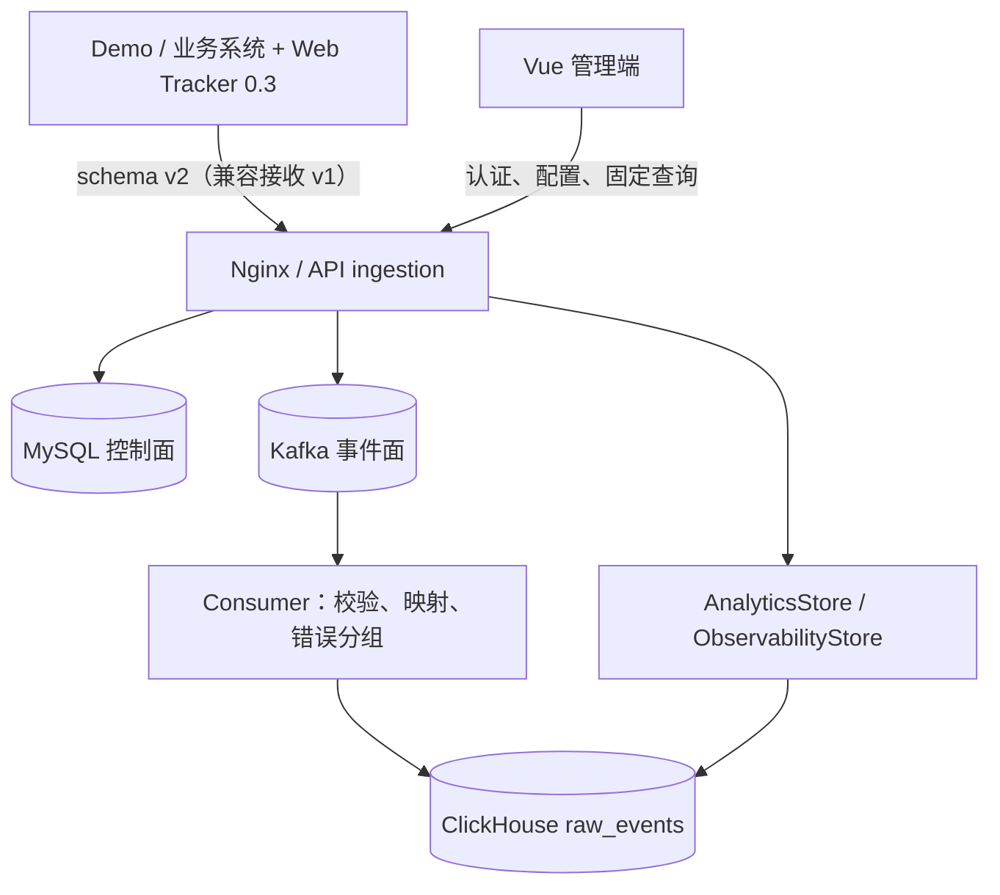

# Frontend Insight 项目学习指南（M0–M8）

> 当前代码基线：`main`，提交 `4262ef6359b492cf9264b4d8fb97bb8b399306e8`（2026-08-02）
> 当前产品/计划基线：`docs/product/requirements-v1.6.md`、`docs/planning/mvp-plan-v1.3.md`
> 当前实现范围：M0–M8；M7 目标环境演练、真实项目试点和 M8 三项目/处理人仍是外部发布门
> 待评审提案：`agent/metric-dictionary-alignment-v1.7` 中的 requirements v1.7、MVP plan v1.4；其中 schema v3、SDK 0.4.0、规范重命名和新增指标均尚未进入 `main`

这组文档以当前 `main` 的源码、测试、migration、Compose 和验收记录为事实来源。它既解释系统为什么这样实现，也帮助评审 v1.7：凡是“当前实现”和“提案目标”不同的地方，必须明确标注，不能把计划写成已经存在的能力。

读完后，你应该能回答：

1. 一条页面、任务或可观测性事件怎样从浏览器进入可查询读模型；
2. 项目、模块、页面、功能/任务、操作实例和指标 profile 分别由谁管理；
3. 当前指标的公式、样本、版本、血缘和运营指数门槛实际在哪里实现；
4. 页面为什么需要区分请求状态、链路状态、业务空数据、配置缺口与版本缺口；
5. M7 的部署、故障、备份、恢复和应用回滚分别保证什么；
6. v1.7 哪些内容是命名调整，哪些会重建契约、查询、存储或产品流程。

## 1. 当前产品定义

Frontend Insight 是面向内部 Web 产品的“功能采用 + 产品运营 + 前端可观测性”平台，不是员工绩效系统、任意 BI、Sentry 的完整替代品或财务级审计系统。

当前 `main` 回答四类问题：

| 产品域 | 当前回答的问题 | 主要证据 |
| --- | --- | --- |
| 功能采用 | 页面/功能是否被看到、开始、成功并重复使用 | page/feature/long-view 事件、功能定义 |
| 产品运营 | 模块和核心页面是否持续使用，关键任务是否达成，时长/深度是否符合目标 | M6 实体、operation v2、固定查询、版本化配置 |
| 项目运营指数 | 四个运营维度在样本、目标和数据状态满足时如何汇总 | MetricCatalog、profile、70% coverage 和 3 维 gate |
| 前端可观测性 | 哪些错误、页面、发布和 Web Vitals 正在退化 | M8 错误组、p75、固定只读告警 |

必须始终守住的语义：

- 点击或 `feature_started` 不等于业务成功；
- 并发任务只能按 `operationInstanceId` 配对，不能按“相邻事件”猜测；
- `accountId`、`visitorId`、`sessionId` 是不同统计口径；
- 缺失页面时长不补 0，缺失分母不制造比例；
- 错误/性能与使用变化可以并列，但相关不代表因果；
- M8 错误和性能没有进入项目运营指数 v1。

## 2. 当前系统地图

| 组件 | 当前职责 | 关键边界 |
| --- | --- | --- |
| `apps/web` | 功能采用、运营概览、页面/任务详情、运营指数、可观测性和配置 UI | 不在浏览器计算权威指标 |
| `apps/demo-app` | 三类功能语义、operation 和四类 M8 事件的受控验收 | 不是生产业务模板 |
| `packages/web-tracker` | SPA/可见时长、operation handle、批量发送、M8 opt-in 采集和浏览器端裁剪 | SDK 0.3 默认发 schema v2；不判断业务成功 |
| `packages/event-contract` | v1/v2 JSON Schema、生成类型、大小/凭据/operation 校验 | 当前仍接受 v1/v2，不是 v1.7 的 v3-only |
| `apps/api` | NestJS HTTP 边界、认证、授权和 controller 装配 | 业务查询主要在 server-core |
| `packages/server-core` | ingestion、认证、MySQL store、运营分析、MetricCatalog、指数和可观测性查询 | 当前 `analytics.ts` / `mysql-store.ts` 仍是较大的集中模块 |
| `apps/consumer` | at-least-once 消费、ClickHouse 批写、M8 字段映射/错误组、无 payload DLQ | 不计算页面上的最终综合结论 |
| MySQL | 用户/项目/成员/模块/页面/功能、版本化设置/profile、审计和链路状态 | 不保存高吞吐事件明细 |
| Kafka | 接收与写库之间的缓冲、故障恢复和有限重放 | Kafka 不可用时 API 明确 503 |
| ClickHouse | 去重查询基础、运营事实、operation、错误/性能/发布证据 | 原始行可重复，读模型按 `eventId` 去重 |
| `scripts/production` | Secret、部署、验证、备份、恢复、应用回滚和状态 | 单机 Compose 不等于基础设施 HA |

## 3. 阅读顺序

| 顺序 | 文档 | 读完后的能力 |
| ---: | --- | --- |
| 1 | [架构、边界与技术选型](01-architecture-and-boundaries.md) | 理解控制面/事件面/查询面和 M0–M8 的演进 |
| 2 | [事件契约、数据模型与迁移](02-contract-data-and-migrations.md) | 区分 v1/v2、operation、M8 列和版本化配置 |
| 3 | [Web Tracker SDK](03-web-tracker-sdk.md) | 理解 SPA、operation、observability、发送与隔离 |
| 4 | [接收、Kafka 与 Consumer](04-ingestion-and-consumer.md) | 理解 202/503、at-least-once、DLQ、错误分组和新鲜度 |
| 5 | [认证、管理与分析 API](05-auth-management-and-analytics.md) | 理解 RBAC、运营配置、固定读模型、指标和可观测性 API |
| 6 | [测试、运维与变更手册](06-testing-operations-and-change-playbooks.md) | 能选择正确的回归层并安全修改契约/指标/部署 |
| 7 | [M0–M4 代码精读实验](07-code-reading-labs.md) | 掌握系统基础不变量 |
| 8–11 | M5 前端、页面状态、demo、本地闭环与测试 | 理解当前 UI 的基础运行时 |
| 12 | [M6 运营领域与数据模型](12-m6-operational-domain-and-data-model.md) | 理解模块/页面/任务、operation 和生效时间 |
| 13 | [M6 指标目录、读模型与运营指数](13-m6-metrics-read-models-and-index.md) | 能手算指标、血缘、profile 与指数 gate |
| 14 | [M6 管理端页面与配置闭环](14-m6-management-ui-and-configuration.md) | 理解页面下钻、版本化配置和权限 |
| 15 | [M7 生产硬化与故障恢复](15-m7-production-hardening-and-recovery.md) | 理解部署、负载、故障、备份、恢复和应用回滚 |
| 16 | [M8 前端可观测性](16-m8-frontend-observability.md) | 追踪错误/Web Vitals 从 SDK 到页面 |
| 17 | [当前实现与 v1.7 评审地图](17-current-main-vs-v1.7-review-map.md) | 区分已存在、需改名、需新增和需决策内容 |
| 18 | [M6–M8 代码精读实验](18-m6-m8-code-reading-labs.md) | 用 fixture、SQL、API、UI 和故障演练验证理解 |

第 8–11 章保留“M5 引入时为什么这样设计”的教学顺序，但已经补充 M6–M8 对相应模块的当前影响。阅读具体 `main` 行为时，应继续阅读第 12–18 章。

## 4. 从需求到当前代码

| 问题 | 第一入口 | 继续追踪 |
| --- | --- | --- |
| schema v1/v2 选择 | `packages/event-contract/src/validator.ts` | 两份 Schema、fixtures、consumer |
| SDK 当前发什么 | `packages/web-tracker/src/tracker.ts` 的 `makeBatch` | `CURRENT_SCHEMA_VERSION=2` |
| 并发任务配对 | `BrowserTracker.startOperation` | ClickHouse `operation_instance_id`、`operationInstances` |
| M8 自动/显式采集 | `packages/web-tracker/src/observability.ts` | v2 Schema、consumer 映射 |
| 项目/模块/页面/任务配置 | `apps/api/src/operational.controller.ts` | `MySqlStore`、migration 004 |
| 运营概览与下钻 | `AnalyticsStore.operationalOverview` | modules/pageDetail/taskDetail |
| 指标真相源 | `packages/server-core/src/metrics.ts` | `METRIC_CATALOG`、lineage、profile |
| 项目运营指数 | `AnalyticsStore.operationalIndex` | `calculateOperationalIndex`、M6 fixture |
| 数据状态 | `evaluateDataStatus` | `resolveProductPresentation` |
| 错误组与 Web Vitals | `packages/server-core/src/observability.ts` | consumer SHA-256 group、M8 API/UI |
| 固定告警 | `buildFixedAlerts` | M8 overview/alerts、无确认关闭状态 |
| 生产部署 | `scripts/production` | production Compose、`*_FILE` Secret |
| 容量和故障 | `scripts/m7` | load/resilience 工具、M7/M8 workflow |
| 当前与 v1.7 差异 | [评审地图](17-current-main-vs-v1.7-review-map.md) | requirements v1.7、MVP plan v1.4 |

## 5. Review v1.7 时的事实层级

评审时按以下顺序确认，不要混用：

1. `main` 源码、Schema、migration 和自动化测试：当前真实行为；
2. requirements v1.6、MVP plan v1.3、ADR-009～013：当前实现的设计依据；
3. requirements v1.7、MVP plan v1.4：尚未实现的目标方案；
4. 反馈附件/指标字典：输入材料，不自动覆盖源码或已评审 ADR。

例如：

- `projectId/projectKey`、`route`、`accountRef`、`releaseVersion`、`deploymentEnvironment` 已存在；
- `eventTime`、snake_case metric key、`active_browsers` 仍与 v1.7 目标不同；
- schema v3、SDK 0.4.0、v1/v2 拒绝、安全 reset 和 P90 新读模型是提案，不是当前能力；
- `userId` 仍是管理端登录用户/成员 ID；它不是浏览器遥测的原始员工标识。若实施规范重命名，不能把所有 `userId` 机械删除。

## 6. 当前必须知道的边界

- SDK 队列在内存中；失败批次完成重试后不会持久化到离线队列。
- API 的限流、项目缓存、analytics/observability 进程指标仍是单实例内存状态。
- ClickHouse 保留重复接收事实，查询通过 `LIMIT 1 BY event_id` 去重。
- 当前数据状态只有 `healthy/delayed/no_data/broken`；v1.7 的 `not_collected/insufficient_sample/partial` 等更细状态尚未形成统一枚举。
- 页面/任务时长当前主读模型为 P50/P75；Web Vitals 为 P75。v1.7 计划的 P90/P99 尚未实现。
- MetricCatalog 已有版本、公式、分母说明、去重键、最小样本和血缘，但尚未包含 v1.7 要求的全部 numerator、primary percentile、coverage/status 元数据。
- `apps/web/src/types.ts` 仍手工维护 API 读模型，没有 OpenAPI 生成。
- `useRemoteData` 没有 request sequence 或 AbortController，快速切换范围仍可能被旧请求覆盖。
- 时间范围只有最近 24 小时/7 天/30 天，URL 目前只统一项目与时间；部署环境、release、module、page 等 v1.7 全局筛选尚未实现。
- M7 的 Linux CI/synthetic 不能替代目标部署环境、Apple Silicon 人工演练和真实项目发布门。
- production Compose 提供单机 pilot 策略，不提供 TLS 终止、集中日志/通知、异地备份或基础设施高可用。
- M8 SourceMap、告警确认/关闭/通知、任意告警 DSL、自动修复和 AI 分析均未实现。

## 7. 文档维护规则

下列变化必须同步学习资料：

- 事件字段、schema 支持窗口、SDK 公共 API、事件大小/隐私边界；
- 实体、配置、生效时间、profile、指标公式/分母/分位数/样本或 lineage；
- API route、读模型字段、数据状态和页面下钻；
- consumer 映射、错误组特征、告警阈值或 ClickHouse 列；
- health/readiness、负载门槛、Secret、备份恢复或回滚语义；
- 当前实现与待评审/待实现内容的边界。

文档中的路径、类名、函数名和命令是可执行索引。更新后应运行路径检查、相对链接检查、`git diff --check`，并抽样从文档反向定位到源码。
