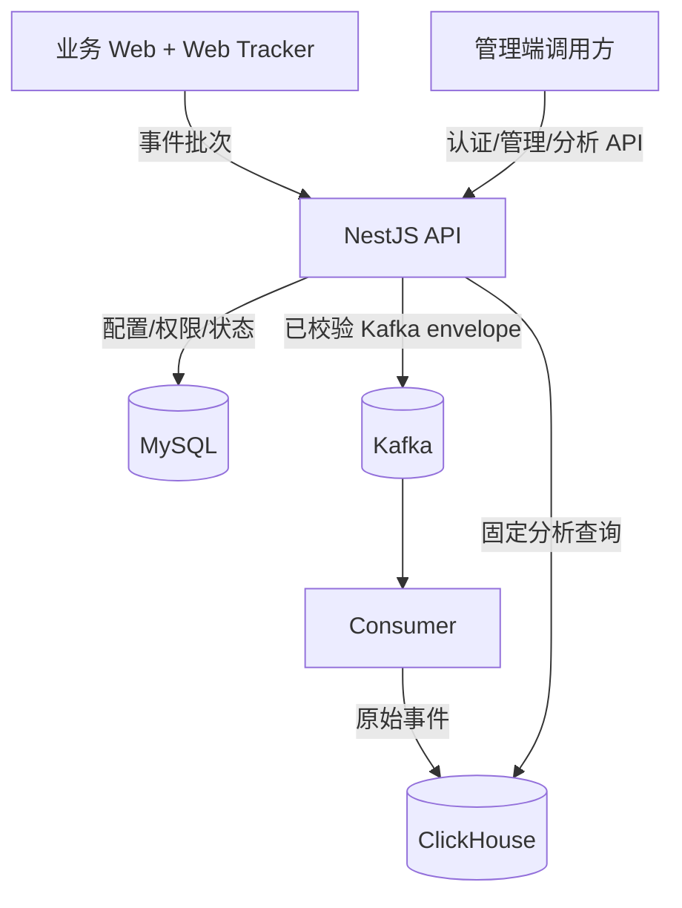

# Frontend Insight 项目学习指南（M0–M4）

> 适用基线：`agent/m1-engineering-contract-migrations`，截至提交 `fd2f468`  
> 已覆盖：M0 技术验证、M1 工程/契约/迁移、M2 Web SDK、M3 数据链路、M4 管理与分析 API  
> 尚未覆盖：M5 Vue 管理后台与三场景 demo-app、M6 生产硬化与真实项目试点

这组文档的目标不是复述源码，而是让维护者形成一张可以解释、验证和修改项目的心智地图。读完后，你应该能回答四类问题：

1. 一条事件为什么要经过这些模块，而不是直接写数据库？
2. 每个存储、框架和抽象分别解决什么问题？
3. 关键函数维护了哪些业务不变量，改错后会破坏什么？
4. 新需求应该落在哪一层、需要补哪些测试、哪些边界暂时不能突破？

## 1. 先建立正确的项目定义

Frontend Insight 是“内部 Web 功能采用分析系统”，不是通用埋点平台、人员考核系统、财务级审计系统，也不是 Sentry/BI 的替代品。当前核心问题只有两个：

- 页面和数据是否真正被查看；
- 功能是否从曝光、开始走到了业务成功，以及是否被重复使用。

这个定义直接决定了代码中的几个重要选择：

- “按钮被点击”不能算成功，操作功能必须由业务代码显式调用 `featureSucceeded`；
- 大屏必须累计前台可见时间，后台标签页不能制造成功；
- `visitorId`、`sessionId`、`accountId` 是三种不同口径，任何一个都不能被直接称为“真实人数”；
- 允许 Kafka at-least-once 和查询时近似/去重语义，不承诺账务系统的 exactly-once；
- 缺少数据时必须区分“尚未接入”“链路延迟”“链路故障”，不能统一显示 0。

## 2. 当前系统地图

| 组件                      | 当前职责                                               | 不负责什么                               |
| ------------------------- | ------------------------------------------------------ | ---------------------------------------- |
| `packages/web-tracker`    | 浏览器生命周期、三类功能事件、隐私约束、批量发送       | 不判断业务操作是否成功，不持久化离线队列 |
| `packages/event-contract` | JSON Schema、生成类型、统一校验、拒绝码                | 不包含数据库模型或业务授权               |
| `apps/api`                | HTTP、NestJS 装配、输入/输出边界、认证入口             | 不直接堆放主要业务逻辑                   |
| `packages/server-core`    | ingestion、认证、权限、MySQL store、分析查询、状态判断 | 不依赖具体 Web UI                        |
| Kafka                     | 削峰、解耦接收与写库、有限重放                         | 不提供最终查询结果                       |
| `apps/consumer`           | 手动提交 offset、批写 ClickHouse、毒消息隔离           | 不计算 Dashboard 指标                    |
| MySQL                     | 用户、项目、功能、Origin、成员、会话、审计和链路状态   | 不存高吞吐行为明细                       |
| ClickHouse                | 原始事件与固定聚合查询                                 | 不作为管理元数据事实来源                 |

## 3. 建议阅读顺序

| 顺序 | 文档                                                                  | 读完后的能力                                                     |
| ---: | --------------------------------------------------------------------- | ---------------------------------------------------------------- |
|    1 | [架构、边界与技术选型](01-architecture-and-boundaries.md)             | 能画出组件图，解释为什么分层和为什么使用三种基础设施             |
|    2 | [事件契约、数据模型与迁移](02-contract-data-and-migrations.md)        | 能从 Schema 追到 Kafka envelope 和 ClickHouse 行，理解兼容与升级 |
|    3 | [Web Tracker SDK](03-web-tracker-sdk.md)                              | 能解释 SPA、会话、可见时间、长时大屏和发送策略                   |
|    4 | [接收、Kafka 与 Consumer](04-ingestion-and-consumer.md)               | 能解释 202、HMAC、at-least-once、去重、DLQ 和数据状态            |
|    5 | [认证、管理与分析 API](05-auth-management-and-analytics.md)           | 能解释双层授权、刷新令牌轮换和每个指标的查询口径                 |
|    6 | [测试、运维与维护手册](06-testing-operations-and-change-playbooks.md) | 能按证据定位故障，并安全地修改契约、查询或数据库                 |
|    7 | [代码精读实验](07-code-reading-labs.md)                               | 能通过可重复实验把“看懂”变成“亲手验证过”                         |

推荐每章采用同一个循环：

1. 先只读本章的“为什么”；
2. 打开文中列出的源文件，按函数顺序走一遍；
3. 执行对应测试或实验；
4. 不看文档，用自己的话复述输入、状态变化、输出和失败路径；
5. 把仍解释不清的地方记录为问题，不要靠背诵跳过。

## 4. 从需求到代码的定位表

| 需求概念             | 第一入口                                         | 继续追踪                                                               |
| -------------------- | ------------------------------------------------ | ---------------------------------------------------------------------- |
| 页面访问/SPA 路由    | `packages/web-tracker/src/tracker.ts`            | `handleRouteChange`、`settleVisiblePage`                               |
| 操作成功不能等于点击 | `BrowserTracker.featureStarted/featureSucceeded` | JSON Schema 条件约束、分析查询 `countIf`                               |
| 大屏前台 30 秒成功   | `BrowserTracker.startLongView`                   | `AnalyticsStore.featureDetail` 的 `max` 再 `sum`                       |
| 禁止 token/PII       | `packages/web-tracker/src/privacy.ts`            | `packages/event-contract/src/security.ts`、`IngestionManager.sanitize` |
| Origin 和项目保护    | `IngestionManager.accept/assertProject`          | `ProjectsController` 更新后的缓存失效                                  |
| 202 接收语义         | `IngestionController.ingest`                     | `KafkaEnvelopePublisher.publish`                                       |
| at-least-once 与幂等 | `EventConsumerRuntime.eachBatch`                 | `AnalyticsStore.deduplicatedEventsWhere`                               |
| admin/viewer         | `AuthGuard`、`ProjectsController.requireProject` | `MySqlStore.getProjectRole`                                            |
| “昨日同时段”         | `previousLocalCalendarDay`                       | `packages/server-core/test/status-and-range.test.ts` 的 DST 用例       |
| 无数据/延迟/故障     | `evaluateDataStatus`                             | `project_data_status` 与 consumer 更新点                               |
| 数据库升级           | `packages/database/src/migrations.ts`            | `infra/*/migrations/*.sql`                                             |

## 5. 当前阶段必须知道的边界

这些不是“代码错误”，而是 M4 为了控制范围做出的实现边界。后续扩展前必须重新评审：

- `apps/web` 目前只是占位，不是可用的管理后台；产品闭环要到 M5 才形成。
- SDK 队列在内存中，刷新或断网可能丢少量事件；这是分析系统允许的取舍。
- API 的限流、项目缓存和指标在单进程内；多副本部署前要重新设计一致性和汇总方式。
- 原始重复事件会进入 ClickHouse，查询侧用 `eventId` 去重；可靠性换来了额外存储成本。
- `retention_days` 已存在于项目元数据，但 ClickHouse 当前 TTL 固定为 90 天；项目级保留策略尚未真正执行。
- ClickHouse migration 有版本和 checksum ledger，但当前没有像 MySQL `GET_LOCK` 那样的跨进程迁移锁；部署编排必须保证单实例执行。
- HMAC 包含 `projectId`，可隔离跨项目账号；更换 `ACCOUNT_HMAC_KEY` 会切断历史账号连续性，不能把普通 Secret 轮换方式直接套用。
- SDK 的 long-view 阈值目前是 tracker 级配置；MySQL 虽保存每个 feature 的阈值，但尚未有配置下发链路。M5 接入设计必须把两者对齐。
- 分析 API 接受调用方传入的合法 timezone，但尚未强制它等于项目 timezone；M5 必须统一使用项目设置，或在服务端收紧。
- 本地认证是 MVP 临时方案，生产是否接 SSO 仍属于后续决策。

## 6. 文档维护规则

代码变化时，不要求把所有实现复制进文档，但以下变化必须同步：

- 组件职责或依赖方向改变；
- 事件字段、事件语义、拒绝码或兼容窗口改变；
- 身份、授权、去重、时间范围或指标口径改变；
- migration、数据保留、重试、DLQ 或恢复语义改变；
- 本文列出的“当前阶段边界”被解除或替换。

文档中的源文件路径和函数名属于可执行索引。重构改名时，CI 不会自动替你更新这些说明，代码评审必须把文档链接检查列入验收。
