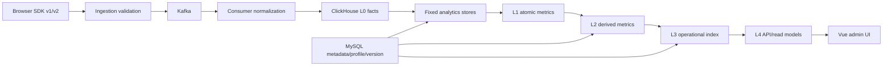

# Frontend Insight——MVP 开发计划 v1.3（M6 产品运营基线）

> 状态：待技术评审  
> 更新日期：2026-07-29  
> 对应需求：[需求文档 v1.6](../product/requirements-v1.6.md)  
> 基于版本：[MVP 开发计划 v1.2](mvp-plan-v1.2.md)  
> 决策来源：[智慧园区内部产品运营指标与项目运营指数方案 v0.2](operational-metrics-health-plan-v0.2.md)  
> 适用假设：1 名有经验的全栈开发者，AI 辅助，复用现有 Kafka、ClickHouse、MySQL 和内网部署环境

## 0. 版本说明

v1.2 对应的 M0–M5 已完成并通过手工验收。本计划不重新实现既有链路，而是在当前实现上增加 M6 产品运营指标、任务实例、指标语义层和项目运营指数。

本版对里程碑作如下调整：

- 新 M6：产品运营指标与项目运营指数，预计 26–37 个开发日；
- M7：承接 v1.2 原 M6 的硬化、部署和试点，预计 6–8 个开发日；
- M8：前端错误、性能、版本和告警，单独评审和估算。

已确认的技术方向：

1. 项目、模块、页面、功能/任务、任务实例构成分析层级；
2. 页面使用持续监测、信息分析、任务操作三类模板；
3. event contract v2 使用随机 `operationInstanceId`，服务端同时接受 v1/v2；
4. 指标层采用代码注册、版本化、固定查询和依赖 DAG，不开放任意 SQL/公式；
5. 项目运营指数 v1 默认权重为 30/25/30/15；
6. 至少 3 个 eligible 一级维度且叶子权重覆盖 ≥70% 才显示总分；
7. admin 配置、viewer 只读，“功能采用”继续作为默认入口；
8. 指标血缘元数据进入 M6，图形化 DAG 为 P1；
9. M8 加入错误/性能时发布指数 v2，不改写 v1 历史。

## 1. 交付目标

在不破坏 M5 功能采用闭环的前提下，完成以下链路：


M6 完成不以“页面出现 radar chart”为准，而以以下结果为准：

- 每个指标能追溯到事实、公式、目标、样本和版本；
- 页面停留与访问深度按业务模板解释；
- 一次任务的开始和终态能够可靠关联；
- 总分在数据不足时拒绝计算，在数据充分时能与手算一致；
- 产品、运营、Supervisor 和开发能从总分下钻到可行动证据；
- 无新配置或仍使用 v1 事件的项目可以继续使用 M5。

### 1.1 M6 交付物

- 4 份 M6 核心 ADR；
- event contract v2 schema、类型、拒绝码和兼容 fixtures；
- Web SDK operation lifecycle API；
- MySQL/ClickHouse 向前 migrations；
- 模块、页面、任务和指标 profile 管理能力；
- 页面、深度、任务和持续使用固定分析查询；
- `MetricCatalog`、指标求值、血缘和项目运营指数服务；
- 运营概览、页面详情和项目运营指数页面；
- 指标定义/血缘 JSON；图形化只读 DAG 为可选 P1；
- golden fixtures、手算结果、回归测试和真实用户走查记录；
- 事件 v2 接入、指标口径、配置、升级和回滚文档。

### 1.2 非交付物

M6 不包含：

- 任意事件、属性、维度、窗口和公式的通用指标引擎；
- 任意 SQL、任意 group by、自助 BI 和动态回算平台；
- JS/资源/API 错误、Web Vitals、SourceMap 和告警；
- Redis、Elasticsearch 或新的离线调度集群；
- 行为回放、DOM 文本、表单采集和个人级评分；
- 小程序 SDK 和外部多租户 SaaS。

## 2. M0–M5 已完成基线与不可破坏边界

### 2.1 已完成能力

| 领域     | 当前基线                                                           |
| -------- | ------------------------------------------------------------------ |
| 工程     | pnpm/TypeScript monorepo、统一 lint/typecheck/test/build           |
| SDK      | 页面/SPA 生命周期、账号/浏览器/会话、功能事件、long-view、发送降级 |
| 契约     | schema v1、共享类型、校验、拒绝码和 golden fixtures                |
| 数据链路 | ingestion → Kafka → consumer → ClickHouse                          |
| 元数据   | MySQL 项目、功能、Origin、成员、审计和 migration                   |
| 查询     | overview、trend、pages、features、feature detail 和 data status    |
| 权限     | admin/viewer、项目级授权和审计                                     |
| 前端     | 功能采用默认首页、功能详情、页面访问、项目接入                     |
| 本地闭环 | Vue 管理端、三场景 demo、full Compose、Chromium/WebKit E2E         |

### 2.2 必须保持的边界

- 现有 v1 事件在整个迁移期继续接收；
- M5 API 兼容字段不破坏性删除；
- `accountRef` 继续在 ingestion 做项目级 HMAC，原值不写 Kafka；
- SDK 不读取 Authorization、cookie 或 Local/Session Storage token；
- `projectKey` 不是秘密凭证，Origin、限流和 schema 校验继续生效；
- 无 module/page/profile 配置的项目继续访问 M5 页面；
- 功能采用继续作为默认首页；
- Kafka、ClickHouse 和 MySQL 基础设施继续复用；
- 不修改既有 `001–003` migration；
- 不使用缓存掩盖慢查询或错误公式；
- 新代码继续满足 Apple Silicon、本地 Compose 和两种浏览器验收。

### 2.3 对既有里程碑的修订影响

| 既有里程碑          | 影响  | M6 修订点                                                                       |
| ------------------- | ----- | ------------------------------------------------------------------------------- |
| M0 决策与基线       | 低–中 | 新增实体、模板、目标、业务日历、指标和指数 ADR                                  |
| M1 契约与 migration | 高    | event contract v2、module/page/profile migration、operation fixtures 和定义版本 |
| M2 Web SDK          | 中    | operation handle、canceled 终态、data-view started 和框架无关回归               |
| M3 接收/消费        | 中    | v1/v2 双版本、operation 字段、stage 校验和 ClickHouse additive migration        |
| M4 管理与查询       | 高    | module/page/task 查询、指标语义层、profile、指数、权限和审计                    |
| M5 产品闭环         | 高    | 运营概览、页面详情、项目指数、解释/血缘入口和新增数据状态                       |

影响为“在现有实现上扩展”，不代表重做对应里程碑。Kafka/ClickHouse/MySQL 基础架构、既有 page/feature/long-view 事实、账号 HMAC、Origin、认证授权和 M5 功能采用闭环继续复用。

## 3. 工期与里程碑

| 里程碑                       |        建议时间 | 结果                                    | 阶段门                   |
| ---------------------------- | --------------: | --------------------------------------- | ------------------------ |
| M6.0 产品、实体和评分 ADR    |          2–3 日 | 决策、手算场景和接口边界固定            | 每个分数都能解释         |
| M6.1 模块/页面注册与页面指标 |          4–5 日 | 页面元数据、停留、深度和模块查询        | 页面 fixtures 与手算一致 |
| M6.2 任务实例与操作耗时      |          5–7 日 | event v2、SDK lifecycle、双版本链路     | 并发任务不串联           |
| M6.3 指标语义、派生与血缘    |          4–5 日 | metric catalog、DAG、definition/lineage | 所有指标版本化且无循环   |
| M6.4 项目运营指数与配置      |          4–6 日 | profile、目标、权重、四维指数           | gate 和手算一致          |
| M6.5 前端产品闭环            |          4–6 日 | 运营概览、页面详情、指数与配置 UI       | 目标用户完成 P0 任务     |
| M6.6 回归与真实用户走查      | 3–5 日 + 观察期 | M0–M5 回归、试点反馈和 Go/No-Go         | 无阻断缺陷               |

M6 合计：**26–37 个开发日**，不含至少 2 个工作日的业务观察等待，也不含完整动态血缘能力。

开发日不等于日历日。试点发布、内网 ACL、业务目标确认和用户走查需要单独安排。

## 4. M6.0：产品、实体和评分 ADR

### 4.1 ADR 清单

| ADR     | 决策范围           | 必须记录                                                          |
| ------- | ------------------ | ----------------------------------------------------------------- |
| ADR-009 | 分析实体和页面模板 | project/module/page/task/operation 层级、三模板、关键度和生效时间 |
| ADR-010 | 事件契约 v2        | operation API、随机 ID、终态、超时、v1/v2 兼容和历史边界          |
| ADR-011 | 指标语义与血缘     | L0–L4、目录元数据、版本、DAG、固定查询和物化门槛                  |
| ADR-012 | 项目运营指数 v1    | 30/25/30/15、子权重、归一化、样本、70% gate 和版本                |

这些 ADR 用于记录已批准方向的实现约束和后果，不重新打开已通过的产品决策。

### 4.2 任务

- [ ] 固化项目、模块、页面、功能/任务和 operation 的 ID/唯一性边界；
- [ ] 固化页面定义的生效时间和历史归类规则；
- [ ] 固化三类模板及各指标 score direction；
- [ ] 固化目标账号、业务日历、页面/任务关键度的数据来源；
- [ ] 固化 v1/v2 接收期、弃用信号和 v2 可用起始时间；
- [ ] 固化 metric definition 与 profile version 的不可变规则；
- [ ] 手算至少 3 个代表性场景和 2 个指数不可用场景；
- [ ] 明确 M6 P1 血缘图是否随 P0 同期实现，不影响底层设计。

### 4.3 必须手算的场景

1. **持续监测型**：单页面驾驶舱持续可见，低页面深度不扣分；
2. **信息分析型**：部分 `page_leave` 缺失，时长 coverage 下降且缺失样本不按 0；
3. **任务操作型**：同一任务两个并发 operation，分别成功和失败，不发生配对串联；
4. **目标缺失**：没有目标账号，相关分项 unavailable，浏览器数不代替；
5. **门槛不足**：eligible 维度或权重覆盖不足，总分 null 但分项继续展示。

每个 fixture 必须记录输入事件、元数据、目标、逐步计算、最终响应和 UI 预期。

### 4.4 Stop 条件

出现以下任一情况时暂停对应实现并向产品负责人确认：

- 业务系统无法为关键任务提供可靠成功/失败终态；
- 需要把设备 ID、报警 ID、人员 ID 或其他敏感业务标识用于配对；
- 页面模板无法覆盖代表性业务，必须新增第四种评分语义；
- 目标账号或业务日历的含义在不同项目间不可比较；
- 某一分数无法说明事实、公式、目标和行动含义；
- v2 使 SDK 包体或同步耗时明显超过预算；
- 默认查询在当前数据量下已触发物理聚合门槛；
- 需求转向任意 SQL/公式或个人级使用评分。

### 4.5 验收

- ADR 状态为 accepted，决策、替代方案和后果完整；
- 产品基线、开发计划、事件契约和 fixtures 使用同一术语；
- 默认指数手算得到产品负责人确认；
- 未决项有 owner 和截止时间，不在代码中使用隐式默认。

## 5. 目标架构

### 5.1 数据流



### 5.2 指标分层

| 层级      | 实现                                                |
| --------- | --------------------------------------------------- |
| L0 事实   | ClickHouse 不可变 raw events，查询侧按 eventId 去重 |
| L1 原子   | 固定 SQL/查询构建器；PV、去重账号、operation 数等   |
| L2 派生   | 纯函数组合；达成率、coverage、深度和持续使用        |
| L3 复合   | profile、归一化、权重、eligibility 和项目指数       |
| L4 读模型 | 运营概览、页面详情、指数、定义和血缘响应            |

首期 DWS 是逻辑语义层，不新建调度平台或通用表达式执行器。

### 5.3 服务边界

现有 analytics 代码逐步拆为以下职责；允许先在同一模块内落地，不要求新进程：

- `PageAnalyticsStore`：页面、模块、时长和深度固定查询；
- `TaskAnalyticsStore`：operation、达成、失败、取消、放弃和耗时；
- `ProjectOperationalStore`：覆盖、持续使用和项目级原始输入；
- `MetricCatalog`：定义注册、版本、依赖和静态校验；
- `MetricEvaluationService`：原子/派生结果和状态；
- `OperationalIndexService`：归一化、权重、gate 和版本化输出；
- `MetricLineageService`：定义与 lineage JSON；
- 既有 controller：保持薄层，只处理鉴权、参数和响应。

业务服务不得直接拼接前端提交的 SQL、列名、group by 或公式。

## 6. M6.1：模块/页面注册与页面指标

### 6.1 MySQL 向前 migration

#### `project_modules`

至少包含：

- `id`、`project_id`、`module_key`、`name`；
- `criticality_weight`、`display_order`；
- `status`、`effective_from`、时间戳。

约束：

- `project_id + module_key` 唯一；
- 已被历史定义引用的 module 不物理删除；
- 关键度必须在受限范围内。

#### `page_definitions`

至少包含：

- `id`、`project_id`、`module_id`；
- `normalized_route`、`name`；
- `template_key`；
- `is_core`、`criticality_weight`；
- `expected_frequency`；
- `status`、`effective_from`、时间戳。

约束：

- 同项目、同生效区间内 route 只能对应一个有效定义；
- route 必须经过与 SDK/查询一致的归一化校验；
- 默认从启用时开始参与评分，不自动重写此前历史归类；
- 如需回溯生效，必须显式配置并写审计。

#### 扩展 `features`

增加：

- nullable `page_definition_id`；
- `is_key_task`；
- `task_weight`；
- `task_timeout_seconds`；
- `operation_lifecycle_enabled`；
- 配置生效时间。

所有变更采用新的 migration 文件，不修改现有 migration。

### 6.2 管理能力

- [ ] module CRUD、排序、停用和项目隔离；
- [ ] page definition CRUD、模板和关键度；
- [ ] 从已观测 route 创建 page definition；
- [ ] feature 绑定页面并配置关键任务；
- [ ] 未归类 route 数量和最近访问时间；
- [ ] admin 写、viewer 读；
- [ ] 所有修改写审计，不记录敏感 payload。

### 6.3 固定页面查询

- [ ] 模块访问和核心页面覆盖输入；
- [ ] 同一 `pageViewId` 多个可见片段求和；
- [ ] 平均、p50、p75 和 coverage；
- [ ] 会话 `count(page_view)`；
- [ ] 会话 `uniq(normalized_route)`；
- [ ] 会话 `uniq(moduleKey)`；
- [ ] 项目时区和统一粒度；
- [ ] 未归类 route 继续返回基础指标；
- [ ] 查询扫描行数、耗时和错误率指标。

页面时长聚合先形成每个 page view 的完整时长，再计算 quantile。不能直接对 `page_leave` 片段计算 p50/p75。

### 6.4 风险

- route 定义变化导致历史口径漂移；
- 动态 route 未正确归一化造成高基数；
- 缺失 leave 被误按 0；
- 多段可见时间被当成多个 page view；
- 大屏单页深度被错误作为负向指标。

### 6.5 测试与验收

- [ ] 空库、升级和重复 migration；
- [ ] module/page 唯一性、项目隔离和停用；
- [ ] route 高基数和归一化 fixtures；
- [ ] 多次隐藏/恢复的可见片段求和；
- [ ] leave 缺失时 coverage 下降；
- [ ] DST、跨日、迟到和重复事件；
- [ ] 大屏单页面 session 不因低深度扣分；
- [ ] 默认 30 天查询 p95 ≤2 秒。

阶段门：页面、模块、时长和深度 golden fixtures 与手算完全一致。

## 7. M6.2：任务实例与操作耗时

### 7.1 event contract v2

v2 在现有事实基础上增加：

- `schemaVersion: 2`；
- `operationInstanceId`；
- `feature_canceled`；
- started/terminal 配对规则；
- 可选、固定枚举的 `interactionType`；
- operation 字段长度和格式校验；SDK 公共 API 不接受调用方传入 instance ID。

v2 继续沿用：

- `eventId`、`projectKey`、`visitorId`、`sessionId`、`pageViewId`；
- 归一化 route；
- `accountRef` 传输后 HMAC；
- 事件时间、receivedAt 和 requestId；
- 属性数量和请求体边界。

### 7.2 SDK API

推荐新增 handle-first API，具体命名在 ADR-010 固定：

```ts
const operation = tracker.startOperation("alarm_acknowledge");

try {
  await acknowledgeAlarm();
  operation.succeed();
} catch (error) {
  operation.fail("request_rejected");
}

// 用户主动关闭或取消
operation.cancel();
```

要求：

- start 时生成随机、不透明 operation ID；
- 公共 API 不允许业务侧指定 operation ID；直接 `track` 也不能覆盖保留字段；
- succeed/fail/cancel 自动携带同一 ID；
- terminal 只能生效一次，重复调用只记录诊断；
- 同一 feature 多个并发 handle 相互独立；
- operation 属性继续受 schema 和隐私限制；
- 既有 `featureStarted/Succeeded/Failed` 保留兼容；
- data view 可使用 operation 记录数据就绪时长；
- long-view 生命周期保持独立，不强行改造成短任务。

### 7.3 Ingestion 与 consumer

- [ ] 同时加载 v1/v2 schema；
- [ ] 按 schemaVersion 使用对应校验器；
- [ ] 校验 operation ID 格式、feature 状态和 event stage；服务端只承诺格式校验，不声称能识别所有伪装成随机值的业务 ID；
- [ ] v2 terminal 缺少 operation ID 时拒绝并返回稳定错误码；v1 继续使用兼容语义；
- [ ] v1 继续按现有语义入库；
- [ ] consumer 规范化 operation 字段；
- [ ] ClickHouse 增加 nullable `operation_instance_id`；
- [ ] 不回写历史数据；
- [ ] 重复/冲突终态进入数据质量计数；
- [ ] 日志和死信不记录 payload。

`operation_instance_id` 为高基数随机值，不使用 `LowCardinality`，也不进入默认排序键，除非真实查询证明需要。

### 7.4 任务查询

- [ ] started、succeeded、failed、canceled 实例数；
- [ ] 无终态实例在 task timeout 后计为近似放弃；
- [ ] 成功实例耗时 p50/p75；
- [ ] 并发实例按 operation ID 配对；
- [ ] 任务前页面深度使用明确时间/会话窗口；
- [ ] v2 可用起始时间；
- [ ] v1/v2 时间范围跨界时明确返回 partial availability。

### 7.5 风险

- 业务在点击时错误调用 succeed；
- 同一 handle 重复终态；
- 浏览器关闭导致终态缺失；
- operation ID 携带业务敏感标识；
- terminal 比 started 先到或迟到；
- SDK 增量使包体或同步耗时超预算。

### 7.6 测试与验收

- [ ] 两个同 feature 并发 operation 分别成功/失败，不串联；
- [ ] succeed/failed/canceled 互斥；
- [ ] 重复终态、终态先到、迟到终态和重复 eventId；
- [ ] timeout 前不算放弃，timeout 后标记近似；
- [ ] v1 valid/invalid fixtures 全部回归；
- [ ] v2 valid/invalid/golden fixtures；
- [ ] Chromium、WebKit、history/hash 和非 Vue demo；
- [ ] payload、日志和死信无 token/业务 ID；
- [ ] SDK bundle diff、p95 同步耗时和 listener/timer 检查；
- [ ] 应用回滚后 v1 链路继续工作。

阶段门：任务实例生命周期和耗时手算一致，且双版本兼容测试通过。

## 8. M6.3：指标语义、派生与血缘元数据

### 8.1 `MetricCatalog`

每个定义至少包含：

```ts
interface MetricDefinition {
  metricKey: string;
  displayName: string;
  businessQuestion: string;
  entityType: "project" | "module" | "page" | "task";
  valueType: "count" | "ratio" | "duration" | "score";
  unit: string;
  inputKeys: string[];
  formulaDescription: string;
  missingValuePolicy: string;
  scoreDirection: "higher_better" | "lower_better" | "target_range" | "none";
  minimumSample: number;
  definitionVersion: string;
  effectiveFrom: string;
  owner: string;
}
```

实际类型可以按仓库规范调整，但不得省略业务问题、缺失语义、minimum sample、版本和依赖。

### 8.2 目录规则

- [ ] metric key 全局唯一；
- [ ] definition version 不可原地修改；
- [ ] 启动或测试阶段完成依赖拓扑排序；
- [ ] 发现循环依赖时 fail fast；
- [ ] 不存在输入定义时构建/启动失败；
- [ ] 同一公式文案从 catalog 返回，前端不复制；
- [ ] 每个定义关联 golden fixture；
- [ ] owner 和生效时间可查询。

### 8.3 求值结果

统一结果至少包含：

```ts
interface MetricResult {
  metricKey: string;
  value: number | null;
  status:
    | "available"
    | "insufficient_sample"
    | "missing_target"
    | "metric_not_available"
    | "data_delayed";
  sampleSize: number | null;
  definitionVersion: string;
  availableFrom: string | null;
  inputs: Array<{ metricKey: string; value: number | null }>;
}
```

API 不得只返回一个无法解释的数值。

### 8.4 计算边界

- L1 使用固定 ClickHouse 查询；
- L2/L3 优先使用可单测的纯函数；
- 所有除法显式处理分母 0；
- unavailable、insufficient 和 0 是三个不同状态；
- delayed/broken 时不继续生成业务 0；
- 比率显示精度与内部计算精度分开；
- 时间范围、时区和 entity scope 随求值上下文传入；
- 不接受前端表达式、SQL、字段名或函数名。

### 8.5 血缘

- [ ] 从 `inputKeys` 生成 DAG；
- [ ] `GET .../definition` 返回公式、版本、样本和缺失规则；
- [ ] `GET .../lineage` 返回 nodes/edges；
- [ ] nodes 区分 fact、atomic、derived、composite；
- [ ] 可返回直接上游和下游使用者；
- [ ] 图形化布局不进入后端；
- [ ] P1 UI 只读，不提供公式编辑。

### 8.6 测试与验收

- [ ] catalog key、版本和依赖静态测试；
- [ ] 循环、缺失依赖和重复 key 测试；
- [ ] 分母 0、null、0、样本不足和延迟状态；
- [ ] definition/lineage snapshot；
- [ ] 所有 PRD 指标都有定义和 fixture；
- [ ] API、UI 与计算使用同一元数据来源。

阶段门：任一项目指数分项都能从 L3 沿 DAG 追溯到 L0 事实。

## 9. M6.4：项目运营指数与配置

### 9.1 MySQL 配置模型

#### `metric_profiles`

- project 或模板作用域；
- profile key、名称和 version；
- 状态、生效时间、创建者；
- 激活后不可原地修改，编辑采用 clone-on-write。

#### `metric_profile_items`

- profile/version；
- metric key；
- dimension key；
- dimension weight、metric weight；
- target/floor/ceiling/target range；
- minimum sample 覆盖值；
- enabled/required 标记。

#### `metric_profile_assignments`

- project/module/page/task entity；
- profile/version；
- effective_from/effective_to；
- 同一实体和时间区间不可有冲突 assignment。

目标账号和业务日历可按 ADR-009 进入项目配置或独立表，但必须版本化、审计并能按生效时间读取。

### 9.2 指数计算

默认一级权重：

- 使用覆盖：30%；
- 持续使用与访问深度：25%；
- 任务达成：30%；
- 使用效率：15%。

默认子权重：

| 一级维度           | 子项                                               |
| ------------------ | -------------------------------------------------- |
| 使用覆盖           | 活跃账号目标 40%、核心页面覆盖 35%、活跃日覆盖 25% |
| 持续使用与访问深度 | 跨日持续使用 40%、不同页面数 30%、模块广度 30%     |
| 任务达成           | 关键任务达成 70%、失败/取消/放弃反向分 30%         |
| 使用效率           | 关键任务耗时 60%、页面可见时长 40%                 |

计算规则：

- 先按 metric definition 做归一化；
- 先算维度内 eligible 子项，再算项目维度；
- 页面/任务按显式关键度加权；
- 叶子配置权重（一级维度权重 × 维度内子项权重）用于计算 overall weight coverage；
- 同一事实不能在多个维度重复加分；
- 数据质量只控制 eligibility，不增加业务分；
- 至少 3 个 eligible 一级维度且 coverage ≥70%；
- delayed、broken、no_data 或 minimum sample 不足时按规则返回 null。

### 9.3 API 与权限

- [ ] profile 列表、创建、复制新版本、激活和停用；
- [ ] assignment、目标、权重和业务日历；
- [ ] 运营指数 read model；
- [ ] 原始指标、目标、得分、贡献、eligible 和原因；
- [ ] profile/definition version 和 availableFrom；
- [ ] admin 写、viewer 读；
- [ ] 服务端项目级授权；
- [ ] 创建、激活和 assignment 全部审计；
- [ ] 前端不计算独立版本的总分。

### 9.4 测试与验收

- [ ] 30/25/30/15 和全部子权重手算；
- [ ] `higher_better`、`lower_better`、`target_range` 边界；
- [ ] clamp、分母 0 和浮点舍入；
- [ ] 关键页面/任务权重；
- [ ] missing target 不使用浏览器替代；
- [ ] eligible 维度少于 3；
- [ ] coverage 为 69.99%、70% 和 100%；
- [ ] delayed/broken/no_data；
- [ ] profile 激活后不可原地修改；
- [ ] 同版本趋势可比较，不同版本有明确断点；
- [ ] viewer 写请求返回 403；
- [ ] 重复 assignment 和生效区间冲突。

阶段门：固定数据的 API、UI 表格、radar 和人工手算结果一致。

## 10. M6.5：前端产品闭环

### 10.1 信息结构

保持以下顺序：

1. 功能采用；
2. 运营概览；
3. 页面访问；
4. 项目运营指数；
5. 项目与接入。

未来错误与性能入口在 M8 实现前不展示空壳导航。

### 10.2 运营概览

- [ ] 项目访问和持续使用趋势；
- [ ] 模块覆盖和核心页面覆盖；
- [ ] 活跃日；
- [ ] 页面深度摘要；
- [ ] 关键任务达成摘要；
- [ ] 未归类 route 和配置缺口；
- [ ] 数据状态、更新时间和统一筛选。

### 10.3 页面详情

- [ ] 页面模板、模块和关键度；
- [ ] PV、账号、浏览器和会话；
- [ ] 平均、p50、p75 时长和 coverage；
- [ ] 页面/模块深度；
- [ ] 页面内关键任务；
- [ ] 原始趋势和目标范围；
- [ ] 指标定义、版本和可用起始时间；
- [ ] 未归类页面的 admin 配置入口。

### 10.4 项目运营指数

- [ ] 总分、profile/definition version 和时间范围；
- [ ] 四维 radar；
- [ ] 与 radar 等价的表格；
- [ ] 加权贡献；
- [ ] 原始值、目标、样本、分数和原因；
- [ ] eligible 维度和 weight coverage；
- [ ] 模块、页面和任务下钻；
- [ ] 指标定义/血缘入口；
- [ ] 指数不可用时保留原始数据和分项。

颜色不能作为唯一表达。radar 必须有键盘可访问的等价表格。

### 10.5 配置 UI

- [ ] module/page/task 管理；
- [ ] 三类模板说明和示例；
- [ ] 目标、权重和历史基线参考；
- [ ] 修改前显示影响范围；
- [ ] 保存为新 profile version，不静默覆盖；
- [ ] viewer 所有配置入口只读或隐藏，同时服务端拒绝写入；
- [ ] 对高风险配置给出业务解释，不暴露 SQL/ClickHouse 概念。

### 10.6 状态和兼容

覆盖：

- loading；
- first-time empty；
- healthy no activity；
- partial；
- stale/delayed；
- request error；
- forbidden；
- unclassified；
- missing target；
- insufficient sample；
- metric not available；
- index unavailable；
- v2 available-from boundary。

兼容字段可以继续存在，但 UI 将“转化率”改为“曝光后使用率”，“漏斗”改为“使用阶段/任务阶段”。

### 10.7 测试与验收

- [ ] 单元测试：格式化、状态映射、权限和下钻参数；
- [ ] 组件测试：表格、radar 等价内容、配置版本；
- [ ] E2E：admin 配置 → v2 事件 → 指标 → 指数 → 下钻；
- [ ] E2E：viewer 只读；
- [ ] E2E：无配置项目继续使用 M5；
- [ ] E2E：所有 unavailable/partial 状态；
- [ ] URL 刷新和分享保持项目/时间筛选；
- [ ] API 失败不把旧数据清空为 0；
- [ ] Chromium 和 WebKit；
- [ ] 常用办公屏幕和键盘访问。

阶段门：产品、运营、Supervisor 和开发均能完成 PRD 第 2.2 节对应任务。

## 11. M6.6：回归与真实用户走查

### 11.1 自动化回归

- [ ] `pnpm check`；
- [ ] v1/v2 contract tests；
- [ ] SDK Chromium/WebKit；
- [ ] ingestion/consumer/ClickHouse/MySQL 集成；
- [ ] M5 完整产品 E2E；
- [ ] M6 配置、页面、任务、指数 E2E；
- [ ] migration 空库、M5 升级、重复执行和应用回滚；
- [ ] privacy payload/log/dead-letter snapshots；
- [ ] 默认 30 天查询性能。

### 11.2 人工走查

参与角色：

- 至少 1 名产品或运营；
- 至少 1 名 Supervisor；
- 至少 1 名业务开发；
- 平台维护者。

步骤：

- [ ] 使用代表性项目配置模块、页面、任务和目标；
- [ ] 接入至少一个持续监测、信息分析和任务操作场景；
- [ ] 观察至少 2 个工作日；
- [ ] 逐项解释原始指标和项目运营指数；
- [ ] 记录误解、不可行动分项、异常默认值和采集困难；
- [ ] 对比业务端已知访问样本；
- [ ] 目标/权重调整通过新 profile version 生效；
- [ ] 不在观察过程中改写既有历史结果。

### 11.3 M6 Go 条件

- M0–M5 全回归通过；
- PRD P0 任务走查通过；
- v1/v2 兼容和应用回滚通过；
- golden fixtures 与手算一致；
- 总分门槛无误显示；
- 所有分项可解释和下钻；
- SDK 性能、数据隐私和查询预算通过；
- 无 P0/P1 缺陷；
- 试点反馈没有发现会误导业务决策的默认值。

## 12. API 与响应边界

### 12.1 只读 API

- `GET /api/projects/:id/analytics/operational-overview`
- `GET /api/projects/:id/analytics/modules`
- `GET /api/projects/:id/analytics/page-detail?route=...`
- `GET /api/projects/:id/analytics/tasks/:featureId`
- `GET /api/projects/:id/operational-index`
- `GET /api/projects/:id/metrics/:metricKey/definition`
- `GET /api/projects/:id/metrics/:metricKey/lineage`

### 12.2 管理 API

- module/page definition CRUD；
- feature/task metadata 扩展；
- metric profile/version CRUD；
- profile assignment；
- target/weight 配置；
- business calendar/expected active days；
- configured target accounts。

### 12.3 统一响应要求

分析响应至少携带：

- `from`、`to`、`timezone`、`granularity`；
- `dataStatus`、`updatedAt`；
- `definitionVersion`；
- `profileVersion`（适用时）；
- `availableFrom`（适用时）；
- `value`、`sampleSize`、`status`；
- missing/unavailable reason；
- request ID 在错误响应中可见。

服务端继续限制最大查询范围 13 个月，并按范围校验粒度。不得接受前端任意字段、公式或 SQL。

## 13. 数据迁移与发布顺序

### 13.1 向前发布

1. 合入 ADR、schema 和 fixtures；
2. 部署 MySQL/ClickHouse additive migrations；
3. 部署能同时读取/接受 v1/v2 的 consumer 和 ingestion；
4. 部署模块/页面/指标配置 API；
5. 发布 SDK v2，但按项目显式启用 operation lifecycle；
6. 配置代表性项目的页面、任务、目标和 profile；
7. 启用任务指标和项目运营指数 API；
8. 发布 M6 前端页面；
9. 完成观察和 Go/No-Go。

数据库向前兼容必须先于 v2 SDK 发出新事件。

### 13.2 历史数据

- page/feature v1 历史继续可查；
- 页面定义默认从生效时间参与评分；
- 不自动把当前模块归属覆盖到全部历史；
- operation 耗时、取消和放弃不回填；
- UI 显示 v2 指标可用起始时间；
- profile 只影响其生效区间；
- definition/profile 跨版本趋势不直接连接。

### 13.3 回滚

- 停止项目的 SDK v2 feature flag；
- 服务端继续接受 v1；
- 前端隐藏 M6 导航或指数模块，M5 保持可用；
- 保留新增表和 nullable 字段；
- 不执行破坏性 down migration；
- 不删除已接收 v2 原始事件；
- 不改写已生成的历史 profile/definition version；
- 修复后以前向 migration 和新应用版本恢复。

## 14. 查询性能与物理聚合门槛

M6 默认继续从 raw events 执行固定查询，并记录：

- 查询 p50/p95；
- 扫描行数和字节；
- 内存和超时；
- 按 endpoint、项目和时间范围分布。

满足任一条件时，才设计小时/天级 `AggregatingMergeTree`：

- 默认 30 天 Dashboard 查询 p95 连续 3 天超过 2 秒；
- 单项目日事件量连续 7 天超过既定阈值；
- 扫描负载影响 ClickHouse 其他业务。

物化前必须：

- 为去重使用聚合状态，而不是直接相加 UV；
- 为平均/quantile 使用可合并状态；
- 定义迟到、重复、回填和版本语义；
- 用真实查询对比原始表与聚合表结果；
- 记录退出和重建方式。

不得为了“像 DWS”而提前增加 Redis、调度器或离线重算集群。

## 15. 测试矩阵

| 层级       | 关键覆盖                                                   |
| ---------- | ---------------------------------------------------------- |
| 静态       | 类型、lint、依赖循环、metric catalog 静态校验              |
| 单元       | 时长片段、深度、task pairing、归一化、gate、版本           |
| 契约       | v1/v2 valid/invalid、字段边界、拒绝码和兼容                |
| 浏览器     | history/hash、可见性、并发 operation、destroy、非 Vue      |
| 集成       | MySQL migration、Kafka、consumer、ClickHouse nullable 字段 |
| 数据正确性 | 页面、任务、持续使用、指数 golden fixtures                 |
| API        | 授权、范围、状态、版本、availableFrom 和错误响应           |
| 前端       | radar/表格一致、下钻、配置、URL 和所有数据状态             |
| E2E        | admin 配置 → SDK → 入库 → 指标 → 指数；viewer 只读         |
| 性能       | SDK bundle/同步耗时、ingestion p95、30 天查询 p95          |
| 隐私       | operation ID、payload、日志、死信和审计快照                |
| 迁移       | 空库、M5 升级、重复执行、应用回滚和重新升级                |
| 人工       | 产品、运营、Supervisor、开发和维护者走查                   |

任何 golden fixture 修改必须同时说明业务口径变化；不能只更新 snapshot 使测试变绿。

## 16. 风险登记

| 风险                       | 概率/影响 | 早期信号           | 应对                                    |
| -------------------------- | --------- | ------------------ | --------------------------------------- |
| 指数掩盖原始事实           | 高/高     | 评审只讨论总分     | 原始指标优先、贡献表和强制下钻          |
| 停留越长被误解为越好       | 高/高     | 三模板使用同方向   | 模板目标区间和业务说明                  |
| 深度越高被误解为越好       | 高/中     | 大屏低深度扣分     | template-specific target                |
| 任务 started/terminal 串联 | 中/高     | 并发耗时异常       | 随机 operation ID 和并发 fixtures       |
| 业务无法提供真实成功终态   | 高/高     | 点击即 succeed     | M6.0 Stop，先修业务埋点语义             |
| v1/v2 历史混算             | 中/高     | 升级日耗时突变     | availableFrom、版本边界和 partial 状态  |
| 目标被历史流量自动绑架     | 中/高     | 目标随流量漂移     | admin 业务目标，历史仅作参考            |
| profile 原地编辑           | 中/高     | 历史分数变化       | clone-on-write 和生效区间               |
| 指标口径跨服务漂移         | 高/高     | API/UI 公式不同    | 单一 MetricCatalog + golden fixtures    |
| 通用引擎范围膨胀           | 高/高     | 出现任意公式编辑器 | M6 非目标和独立立项门槛                 |
| ClickHouse 扫描膨胀        | 中/高     | p95/扫描量持续上升 | 固定查询指标和物化触发门槛              |
| SDK 包体或宿主影响增长     | 中/高     | bundle/p95 超预算  | handle API 精简、bundle diff、Stop 条件 |
| 配置复杂导致 admin 误用    | 高/中     | 目标/权重无法解释  | 模板默认、历史参考、影响预览和审计      |
| 未归类 route 污染总分      | 高/中     | 路由自动加入评分   | 未归类只展示、不评分                    |
| operation ID 泄露业务信息  | 中/高     | 使用设备/报警 ID   | SDK 随机生成、schema 和隐私测试         |
| AI 生成重复指标逻辑        | 高/中     | 多处独立公式       | 服务边界、catalog 和纯函数              |

## 17. 变更控制与防熵规则

1. 指标变更先改定义、fixture 和版本，再改查询与 UI；
2. event contract 变更先改 schema/fixture，再改 SDK、ingestion 和 consumer；
3. 激活的 metric definition/profile 不原地修改；
4. 新分数必须说明业务问题、输入、公式、目标、样本和缺失语义；
5. 新页面模板必须证明三类现有模板无法表达；
6. 新存储组件必须有真实性能证据、owner 和退出方案；
7. 不允许前端和后端分别实现项目指数；
8. 不允许把 unavailable、insufficient 和 0 合并；
9. 不允许未归类 route 静默进入评分；
10. 不允许使用当前元数据静默改写历史归类；
11. P1 图形化能力不能阻塞 P0 数据正确性；
12. 每个 M6 子里程碑结束清理重复代码、过期 flag 和漂移文档；
13. PR 必须关联任务、风险和验收项；
14. M6 完成并观察后，才进入 M7 或扩大指标范围。

## 18. Go / No-Go 评审模板

| 问题                 | Go 条件                               |
| -------------------- | ------------------------------------- |
| M5 是否保持可用？    | 原用户闭环和全部 M5 E2E 通过          |
| 实体和模板是否稳定？ | 三类代表场景均能表达，未决项为 0      |
| v2 是否安全兼容？    | v1/v2、并发、回滚和隐私测试通过       |
| 指标是否正确？       | golden fixtures、手算和 API 结果一致  |
| 指数是否可信？       | gate、版本、目标、贡献和下钻完整      |
| 用户是否理解？       | 产品、运营、Supervisor 和开发走查通过 |
| 查询是否可控？       | 默认 30 天 p95 和扫描预算通过         |
| 宿主影响是否可接受？ | SDK bundle、同步耗时和异常隔离通过    |
| 迁移是否可恢复？     | M5 升级、应用回滚和重新升级通过       |
| 是否有阻断缺陷？     | P0/P1 为 0                            |

任一项不满足时为 No-Go，记录修复任务、owner 和复评日期。

## 19. M7 与 M8

### M7：硬化、部署与试点

承接 v1.2 原 M6：

- 完整自动化和数据正确性；
- 20 events/s 持续与 200 events/s 峰值测试；
- Kafka/ClickHouse/consumer 故障注入；
- 生产 Compose、Secret、资源和日志策略；
- 升级、回滚、备份和恢复演练；
- 真实项目扩大试点。

预计 6–8 个开发日，具体以 M6 新查询和数据量重新估算。

### M8：前端可观测性

- JS、资源和 API 错误；
- 错误分组和影响账号/浏览器/页面/版本；
- Web Vitals；
- 发布版本关联；
- 固定告警；
- SourceMap 按真实定位需求触发。

M8 与项目运营指数 v2 必须单独完成产品、隐私、数据模型、容量和运维评审，不能直接把错误/性能字段加入 v1 公式。
