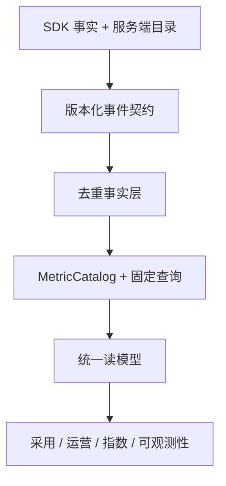
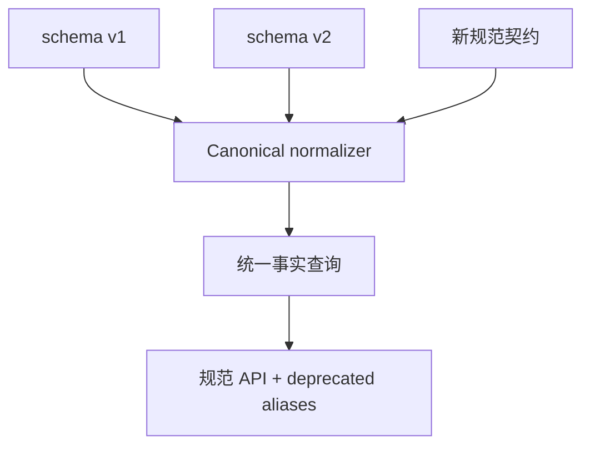

# Frontend Insight 修改计划 v1.4

- 状态：待技术与产品评审
- 更新日期：2026-08-06
- 产品基线：`docs/product/requirements-v1.7.md`
- 前序计划：`docs/planning/mvp-plan-v1.3.md`
- 规划起点：M0–M8 已实现并合并 `main`（基线提交 `4262ef6359b492cf9264b4d8fb97bb8b399306e8`）
- 计划定位：M8.1 指标字典、采集规范与产品流程对齐；M9 AI 分析助手编号保持不变

## 0. 结论

本次不是一次文案替换。它会同时影响事件契约、Web SDK、接收校验、ClickHouse 事实、MetricCatalog、固定查询、项目运营页面、可观测性页面和测试夹具，整体影响为“中高”。

可以安全分批实施，且不需要推倒 M0–M8：

1. M0–M8 的核心架构、项目隔离、匿名标识、事件去重、operation lifecycle、项目运营指数 v1 和 M8 可观测性读模型继续复用；
2. 名称统一采用新契约 + 兼容别名 + 统一读模型，不回写历史原始事件；
3. 先完成不新增采集的 P0，对现有指标、页面关系和解释纠偏；
4. 再以逐项目 opt-in 方式补齐 API/资源分母、首屏、长任务、白屏候选和 breadcrumb 等 P1 事实；
5. 组织、表单、路径和安全能力因依赖外部系统或更高隐私风险，独立进入 P2/P3。

不建议把 P0–P3 一次性合并为一个大版本。P0 可以形成独立、可回滚的 M8.1-A 发布；P1 形成 M8.1-B；P2/P3 只在真实项目与 ADR 就绪后启动。

## 1. 目标与非目标

### 1.1 目标

- 建立产品、SDK、事件、存储、API、UI 共用的规范词典和兼容映射；
- 把指标公式、分母、分位数、样本、缺失语义、版本与血缘固化到 MetricCatalog；
- 对齐项目 → 模块 → 页面 → 功能/任务 → 操作实例的产品流程；
- 在不降低隐私边界的前提下补齐附件中有业务价值的采集能力；
- 保持旧 SDK、v1/v2 事件、历史数据和项目运营指数 v1 可用；
- 为每一批提供自动化回归、灰度、观测、回滚和本地验收指引。

### 1.2 非目标

- 不在本计划实现通用自定义指标 DSL、任意 SQL、自助 BI 或动态回算平台；
- 不采集原始账号、设备指纹、原始 UA、完整 URL、DOM/输入、请求/响应正文；
- 不在没有稳定分母时展示 API/资源“失败率”；
- 不自动把错误/性能加入项目运营指数 v1；
- 不把安全异常监控与员工绩效关联；
- 不提前实施 M9 AI 助手，且 M9 不得绕过本计划的指标与权限读模型。

## 2. 对 M0–M8 的影响评估

| 里程碑 | 已有资产 | 影响 | 处理方式 |
| --- | --- | --- | --- |
| M0 技术验证 | ARM64、Kafka、ClickHouse、Beacon 可行性 | 低 | 不改历史 spike；新事件沿用已验证链路 |
| M1 工程/迁移 | monorepo、JSON Schema、迁移、golden fixture | 高 | 新增契约版本、兼容 manifest、additive migration 和更多 fixture；不修改旧 schema 真相 |
| M2 SDK | SPA/page lifecycle、session、批量、隐私 | 高 | 统一字段，补 10s flush、可选性能汇总/任务旅程适配器；保留旧 API wrapper |
| M3 接收/消费 | Origin、schema、大小、HMAC、Kafka、ClickHouse | 高 | 双/三版本校验、规范化字段、分母事件、别名遥测；原始事件不回写 |
| M4 管理/分析 API | 固定 overview/trend/pages/features 查询 | 高 | 建 canonical read model、指标定义返回、兼容字段、统一 data status |
| M5 产品前端 | 功能采用、页面访问、接入、筛选和状态 | 中高 | 统一 UI 术语、全局筛选、页面职责和下钻；默认入口不变 |
| M6 运营闭环 | 实体、operation v2、MetricCatalog、指数 v1 | 高但可复用 | 扩充目录与分位数；冻结指数 v1 公式/历史；避免 page-entry 与 operation 时长混义 |
| M7 生产硬化 | 负载/故障/恢复、Secret、日志、回滚 | 中 | 为新增事件重跑容量、备份恢复与降级；不改变运维安全基线 |
| M8 可观测性 | 错误组、Web Vitals、发布、影响范围、固定告警 | 中高 | 统一环境/发布字段，补可选请求/资源分母和详情联动；保留 SourceMap 阶段门 |

### 2.1 可直接复用

- `eventId` 去重、项目级账号 HMAC、匿名 visitor/session/pageView/operation ID；
- schema 生成类型、stable reject code 和 valid/invalid/golden fixture 流程；
- Kafka at-least-once、ClickHouse 查询侧去重和 90 天 TTL；
- 模块/页面/任务实体、三类页面模板和 clone-on-write 配置；
- operation handle、并发配对、取消终态与 SDK 异常隔离；
- MetricCatalog、definition version 与 lineage JSON 的骨架；
- URL 可分享筛选、admin/viewer 权限、数据状态与页面 E2E；
- M7 负载、故障、备份恢复和 production Compose；
- M8 脱敏错误组、粗粒度影响范围、Web Vitals P75 和发布维度。

### 2.2 不能只改名的部分

| 表面改动 | 实际风险 | 正确改法 |
| --- | --- | --- |
| `userId → accountId` | 原始工号可能被持久化；旧数据与新数据不可连接 | 接入瞬时 `accountRef`，服务端项目级 HMAC；旧 alias 只进转换器 |
| `deviceId → visitorId` | 设备指纹违反现有隐私边界 | 保留浏览器随机实例，文案明确不等于设备/人员 |
| `pageUrl/pageRoute` | query/hash、业务 ID 和凭据泄露 | 只发送 route，经服务端再归一化 |
| `operation_fail_rate` | 混淆前端校验、业务拒绝和 HTTP 失败 | 拆成三个独立指标与事件来源 |
| 资源/API 失败率 | M8 目前主要有异常分子，没有总请求分母 | 先新增受控 summary 事实，再发布 rate |
| 所有时长默认 P90 | 会破坏 Web Vitals P75 和指数历史 | 按指标族配置主分位数；新增 P90，不覆盖旧 definition |
| 模块渗透率 | 90 日活跃人数不是系统适用人数 | 官方目录分母；无目录时另名为 active share |
| task duration | page entry 与 operation started 是两个不同起点 | 保留 operation duration；新增显式 task journey |

## 3. 目标架构

### 3.1 真相源边界

| 内容 | 真相源 |
| --- | --- |
| 传输字段、事件结构、大小 | `packages/event-contract` JSON Schema |
| 规范名、别名、弃用期 | 版本化 compatibility manifest |
| 指标公式、分母、方向、分位数、依赖 | server-core `MetricCatalog` |
| 页面/模块/任务/目标/profile | MySQL 版本化配置 |
| 不可变事实与聚合输入 | ClickHouse raw events/read queries |
| 页面解释、公式和血缘 | API 返回的 MetricCatalog 元数据 |

前端不得复制公式；SDK 不计算服务端业务比率；数据库物理列名不得反向决定产品术语。

### 3.2 兼容数据流

是否将新规范契约正式编号为 v3 在 ADR 中确认。无论编号如何，不能在 schema v2 上把相同字段静默换义。

## 4. 先行 ADR 与决策门

| ADR | 必须回答 | 阻断范围 |
| --- | --- | --- |
| ADR-014 规范命名与事件版本 | 字段/事件/指标规范名、alias、枚举、弃用期、SDK 版本 | M8.1-A 契约实现 |
| ADR-015 指标口径与分位数 | 分子分母、样本门槛、P75/P90/P99、缺失状态、definition migration | M8.1-A 查询与 UI |
| ADR-016 新采集隐私边界 | API/资源 summary、breadcrumb、白屏、表单、业务对象引用、采样 | M8.1-B SDK |
| ADR-017 组织目录与群体隐私 | eligible 分母、目录版本、角色多值、最小群体、审计与保留 | P2 组织指标 |
| ADR-018 安全/SourceMap 阶段门 | 证据、权限、处理人、误报、源码与认证数据治理 | P3 |

ADR-014/015 可在同一评审完成。ADR-016 允许按事件族拆分，未批准的采集开关保持关闭。

## 5. 实施分批

### 5.1 M8.1-A：规范名、现有口径和产品流程（P0）

目标：不要求业务项目新增埋点，先让现有数据在所有页面上“同名、同算、同解释、可下钻”。

#### A0 资产盘点与冻结

- 生成字段、事件、指标、接口字段、数据库列、UI 文案的现状 inventory；
- 逐项标注 canonical、alias、conflict、unused、privacy-prohibited；
- 为当前项目运营指数 v1 保存一套不可变 golden baseline；
- 记录 v1/v2 SDK 分布、事件量、alias 使用和 M8 数据覆盖；
- 禁止在盘点期新增第三套名称。

退出条件：每一个需求 v1.7 P0 词条都能映射到现有实现位置或明确标记“尚未实现”。

#### A1 契约与兼容层

- 在 `packages/event-contract` 增加新版本 schema 或 canonical manifest；
- 生成 TypeScript 类型和稳定拒绝码；
- 接收端实现 v1/v2/新版本到 canonical fact 的纯转换；
- 统一 `deploymentEnvironment/releaseVersion/occurredAt/route`；
- `appId/env/release/userId/pageRoute` 只在批准的 compatibility adapter 中接受；
- 增加 alias 使用计数，不记录值和 payload；
- 保持单事件 8 KiB、批 50 条/64 KiB 与既有隐私拒绝。

退出条件：旧 fixture、旧 SDK 和新 fixture 同时通过；规范输入不能持久化原始账号/URL/UA。

#### A2 MetricCatalog 与固定查询

- 为现有指标补齐 business question、formula、numerator/denominator、dedupe、unit、primary percentile、minimum sample、missing semantics 和 version；
- 增加 active account/visitor/session 的明确读模型；
- 为页面/operation 时长新增 P90，不改变旧 P50/P75 历史定义；
- 派生周/月活跃、小时分布、单页会话率和 90 日模块活跃份额；
- 对 operation duration 与 task journey duration 使用不同 key；
- 缺少目录/API/resource 分母时返回 `not_collected` 或 `missing_denominator`，不返回 0；
- lineage DAG 自动从依赖元数据构建并做循环校验。

退出条件：MetricCatalog、API 说明、golden fixture 与 SQL 对同一范围给出一致结果。

#### A3 统一读模型与 API

- 为功能采用、运营概览、页面/任务详情、指数和可观测性提供相同筛选对象；
- 所有比率返回 numerator/denominator/sample/coverage/status/version；
- 返回 `availableFrom`、definition/profile version 和 partial window；
- 兼容字段明确 `deprecatedSince` 和 replacement；
- 高基数 route/API/error 使用固定 Top N 或 cursor；
- 指标定义/血缘 endpoint 成为页面解释来源。

退出条件：同一指标从两个页面访问时值、范围、版本与解释完全一致。

#### A4 管理端信息架构

- 保持“功能采用”为默认入口；
- 全局项目/环境/时间/发布筛选组件复用并写入 URL；
- 运营概览按项目 → 模块 → 页面 → 功能/任务下钻；
- 页面/任务详情并列显示使用、效率、相关性能/错误摘要；
- 页面详情与可观测性互相带筛选跳转，但不显示因果措辞；
- “指标定义与血缘”抽屉展示公式、分母、样本、版本和 DAG；
- UI 替换 UV/VV/转化/健康度等歧义词；
- radar 保留等价表格，趋势不跨数据/版本缺口。

退出条件：需求 v1.7 第 9 节页面职责与下钻全部通过 Chromium/WebKit E2E 和键盘走查。

#### A5 回归、灰度与文档

- 更新单元、contract、browser、consumer、API、M5/M6/M8 E2E；
- 建新旧字段/查询的差异测试，允许差异只能来自明确的新 definition version；
- 运行 M7 负载、Kafka/ClickHouse 故障、备份恢复和回滚；
- 为至少一个 M8 数据项目做 shadow read，对比旧/新 read model；
- 新增 `docs/guides/m8.1-a-local-acceptance-macos.md` 和迁移/弃用清单。

退出条件：M0–M8 回归通过、指数 v1 golden 不漂移、灰度期间旧 SDK 无新增拒绝。

### 5.2 M8.1-B：一期采集缺口（P1）

只在 ADR-016 通过后实施，每个事件族单独 opt-in、单独容量与隐私 gate。

| 工作包 | SDK/业务接入 | 服务端/产品产物 | 特别边界 |
| --- | --- | --- | --- |
| API summary | 显式请求层适配器；全局 fetch 默认关 | P50/P90、成功/错误/慢请求率、慢接口 Top | 无 header/query/body；path 归一化；必须有总请求分母 |
| Resource summary | 每 pageView 汇总可观测资源请求与失败 | 资源失败次数和率、release 对比 | 抽样率/覆盖率随结果返回 |
| First screen | 页面模板显式 readiness API | 首屏 P90 与 coverage | 不用 DOM 文本推断 |
| List render | 组件层 begin/end + row bucket | page × row bucket P90 | 只发 `<100/100-1000/>1000` 桶 |
| Long task | PerformanceObserver 页面离开汇总 | count/duration/affected PV rate | attribution 默认不发脚本 URL 明细 |
| Blank candidate | root/readiness 模板适配器 | 候选率、相关错误/资源摘要 | Cesium/Canvas/骨架按模板禁用或适配 |
| Breadcrumb | 错误时附 allowlist 环形摘要 | 错误详情诊断证据 | 无 DOM 文本、selector、console、业务 ID |

每个工作包都要提供：配置开关、采样/限流、数据 coverage、`not_collected` 空态、可用起始时间、容量报告、停用与回滚路径。

### 5.3 P2：操作效率与组织指标

P2 不作为 M8.1-A/B 发布门：

- task journey 显式开始/结束和跨页关联；
- form summary（字段 key allowlist，不采集值）；
- 业务拒绝适配器，与 HTTP/API/校验失败分离；
- 关键路径步数；
- 可选短期 HMAC `businessObjectRef` 的重复操作诊断；
- 账号/权限目录、eligible 分母、部门/角色聚合与最小群体展示。

先选一个任务操作型页面做试点。没有稳定 success 语义、目录 owner 或隐私审批的项目不启用对应能力。

### 5.4 P3：独立立项

- `abnormalAccessSignal` 安全产品线；
- 受控 SourceMap；
- 项目运营指数 v2；
- 通用自定义/派生指标工作台；
- M9 多模型 AI 分析助手。

以上能力互不自动解锁。每项都必须有真实用户任务、owner、权限、保留、容量和误用风险评审。

## 6. 分层改动清单

### 6.1 事件契约

- canonical fields、enum 和 alias manifest；
- event/family registry 与受限 properties schema；
- v1/v2/新版本 valid、invalid、golden fixtures；
- 大小、PII、URL、UA、业务 ID 和 nested object 拒绝用例；
- 生成代码与文档，禁止手工维护平行类型。

### 6.2 Web SDK

- config 名称迁移与 deprecated wrapper；
- SPA leave-before-view、hash 策略、30 分钟 session 和 visible duration 截断回归；
- queue 最多 50、最长 10 秒、64 KiB、sendBeacon/keepalive、retry 与同 eventId；
- 新 collector 逐项 opt-in、按 pageView 汇总、限流/coverage/diagnostic；
- 所有用户输入在浏览器发送前裁剪；SDK 异常不影响宿主。

### 6.3 Ingest / Consumer / Storage

- 多 schema validator 和 canonical normalizer；
- `occurredAt/receivedAt` 校时与拒绝规则；
- additive nullable 列，禁止 destructive migration 和历史原始表回写；
- alias、schema/SDK 分布和拒绝量只记录计数；
- 新事件的高基数、批写、TTL、毒消息和 replay 验证；
- 根据新事件体重跑 M7 持续/峰值负载。

### 6.4 Server core / Analytics

- MetricCatalog 元数据 schema 与版本发布流程；
- canonical query context 与 time bucket；
- quantile、ratio、coverage、data status 通用结构；
- 固定查询和 materialization 门槛；P0 先查询时计算；
- lineage DAG/循环检测；
- index v1 继续绑定旧 definition/profile，不自动指向新 key。

### 6.5 Web 管理端

- 单一术语资源表和 API 驱动的 metric copy；
- shared global filters 与 URL 状态；
- 页面职责/下钻/返回路径；
- loading、no_data、not_collected、insufficient_sample、partial、delayed、broken、forbidden；
- 指标定义、血缘和版本断点；
- admin 配置与 viewer 只读；
- ECharts resize/dispose、键盘、颜色以外状态和 radar 等价表格回归。

### 6.6 Demo / Docs / Operations

- demo 增加旧 SDK、新 SDK、三类页面模板和每个 opt-in collector 的可见开关；
- seed 同时生成可用、分母缺失、样本不足、partial、alias 和隐私拒绝场景；
- 更新 README、契约、ADR、迁移、SDK 接入、数据字典和本地验收；
- production 配置默认关闭所有新敏感 collector；
- dashboard 增加 schema/SDK/alias/拒绝/事件族/队列抑制的非 payload 指标。

## 7. 迁移策略

### 7.1 数据迁移

1. 先发布能理解新旧字段的 consumer/API，再发布新 SDK。
2. schema 与 ClickHouse migration 只增加列/枚举支持；应用回滚仍能读取旧列。
3. raw events 不回填；canonical read model 在查询时映射旧事实。
4. 新指标 `availableFrom` 从可靠事实首次出现时计算，趋势不跨边界伪造。
5. 只有查询性能达到既定门槛才增加小时/天物化；物化可重建，不成为唯一事实。

### 7.2 名称迁移

- SDK 新配置只输出规范字段；旧配置打印一次无敏感值的开发期 deprecation warning；
- 生产 alias 使用仅计数，不写 payload；
- API 兼容期同时返回规范字段与 deprecated alias；UI 只读规范字段；
- alias 至少跨两个正式 SDK 版本，并在近 30 天生产使用为零后才提下线 PR；
- UI 名称替换与 API alias 解耦，用户先看到清晰术语，接入方有迁移窗口。

### 7.3 指标版本迁移

- 新增 P90 或改变分母发布新 `definitionVersion`，不原地修改旧版本；
- 指数 v1 profile 固定引用原 definition；
- 页面默认展示新 definition，但历史对比只在同版本内连线；
- 如需跨版本对照，只并列展示并解释差异，不计算伪同比。

## 8. 测试与验收矩阵

| 层 | 必测内容 |
| --- | --- |
| Contract | 新旧合法批次、alias、枚举、大小、PII/URL/UA/业务 ID、稳定拒绝码、生成类型 |
| SDK unit | route order、hash、visibility、idle/session、queue/flush/retry、sampling、collector isolation |
| Browser | Chromium/WebKit SPA、后台/恢复、关闭 Beacon、并发 operation、Vue/非 Vue 接入 |
| Consumer | at-least-once、eventId 去重、canonical mapping、poison/no-payload DLQ、schema 混跑 |
| Metric golden | DST/时区、重复、零分母、缺失 leave、P50/P75/P90/P99、coverage、partial、版本切换 |
| API | RBAC、统一筛选、compat fields、status/sample/version/availableFrom、Top N/cursor |
| UI | 术语、URL 状态、下钻、所有空态、定义/血缘、版本断点、a11y、错误跳页 |
| Regression | M5/M6/M8 E2E、指数 v1 golden、auth/audit、Compose smoke |
| Production | 20 events/s 持续、200 events/s 峰值、Kafka/CH/consumer 故障、backup/restore/rollback |
| Privacy | 浏览器抓包与存储/日志扫描均无原始账号、URL 参数、UA、DOM/输入、header/body |

### 8.1 关键 golden fixture

- 同一 `eventId` 重复两次，只计一次；
- route 切换旧 leave 先于新 view，时长归属正确；
- 缺失 leave 时 PV 增加但时长样本不补 0，coverage 降低；
- 两个同 feature 并发 operation 不串联；取消、失败和超时分开；
- `accountRef` 一项目内稳定、跨项目不可关联，且不落原始值；
- 分母为 0/未采集/目录缺失分别返回不同状态；
- Web Vitals P75 与页面/API/任务 P90 使用各自规则；
- 版本切换日趋势断开，指数 v1 同配置结果不变；
- Canvas/Cesium 页面未启用 readiness adapter 时不生成白屏率；
- breadcrumb 的 DOM 文本、输入、console、query、业务 ID 被拒绝或删除。

## 9. 性能与容量门槛

新增事实会扩大事件量，M8.1-B 每个 collector 在启用前必须提供：平均/峰值每 PV 事件数、P50/P95 事件大小、压缩前批大小、Kafka lag、consumer throughput、ClickHouse 写入和查询扫描量。

最低门槛沿用 M7：20 events/s 持续 60 秒、200 events/s 峰值 10 秒，接收无失败、p95 ≤1 秒且 120 秒内全部可查询。若验收环境因资源不足无法完成容量门槛，可以记录为环境限制并继续逻辑验收，但不能据此宣布生产容量通过；目标生产环境仍需演练。

客户端预算建议在 ADR-016 固化：基础 SDK 不明显增加主线程长任务；observer/serialization 单次工作有上限；队列和 breadcrumb ring buffer 有硬上限；禁用 collector 时不注册对应 observer/wrapper。

## 10. 发布、灰度与回滚

### 10.1 发布顺序

1. ADR、schema、migration、consumer/API 兼容层；
2. Web UI 读取规范 read model，旧 SDK 保持运行；
3. 一个内部 demo 使用新 SDK；
4. 一个真实项目 shadow read，默认不开新 P1 collector；
5. 按项目逐个开启 collector，观察拒绝、队列、event volume、lag、coverage；
6. 两个正式 SDK 版本后评估 alias 下线，不自动执行。

### 10.2 回滚

- UI/API 可回滚到保留镜像；additive schema/列保留；
- 新 SDK collector 可远程/项目配置关闭，基础 page/feature 事件继续；
- 新 definition 不删除，默认指针可切回旧版本；
- 不执行 down migration、不删除新列、不回写 raw events；
- 失败发布仍按 M7 流程验证 Kafka lag、数据查询、备份和恢复。

### 10.3 Go/No-Go

任一条件触发 No-Go：

- 旧 SDK 拒绝率相对基线明显上升且无法解释；
- 原始账号、query/hash、UA、DOM/输入或 header/body 出现在网络、Kafka/ClickHouse、日志或 DLQ；
- 同一指标跨页面值/公式/版本不一致；
- 指数 v1 golden 漂移；
- 新 collector 无法单独关闭、没有 coverage 或没有容量证据；
- 数据缺失被显示为 0，或没有分母却显示 rate；
- 页面下钻丢失项目/环境/时间/发布上下文；
- M5/M6/M8 任一关键回归失败。

## 11. 工作量估算

估算单位为开发人日，包含实现、自动化测试和文档，不包含排队评审、真实项目接入等待或生产观察期。

| 批次 | 范围 | 估算 | 主要不确定性 |
| --- | --- | ---: | --- |
| M8.1-A / P0 | 盘点、ADR-014/015、兼容契约、MetricCatalog/查询、读模型、UI 流程、回归 | 24–36 | 现有字段散布、旧 API 消费方、指数 golden 差异 |
| M8.1-B / P1 | API/resource/first-screen/list/long-task/blank/breadcrumb 逐项 opt-in | 28–44 | 宿主请求层差异、事件量、白屏误报、隐私审批 |
| P2 | task journey、表单、业务拒绝、路径、组织目录 | 24–40 | 外部账号目录、业务成功语义、角色多值、接入配合 |
| P3 | 每项独立估算 | 未纳入 | SourceMap/安全/指数 v2/通用引擎/AI 均是独立项目 |

若只做用户当前最紧迫的“命名 + 口径 + 页面关系”对齐，交付 M8.1-A 即可，预计 24–36 人日。一次性实施 A+B 会放大回归与隐私风险，建议分两个 PR 系列和两个发布门。

## 12. 风险与缓解

| 风险 | 后果 | 缓解 |
| --- | --- | --- |
| 全量改名破坏历史/旧 SDK | 接入中断、趋势断裂 | 新版本、alias、canonical normalizer、30 天零使用门 |
| 公式统一导致指数漂移 | 历史评分失真 | index v1 固定 definition；新定义版本化 |
| 新分母事件增量过大 | SDK/链路/存储压力 | pageView 汇总、采样、硬队列、逐项开关和容量 gate |
| 自动 API 包装破坏宿主 | 业务故障 | 显式 adapter 优先；global fetch 默认关闭 |
| 白屏/时长被误解 | 产品错误结论 | 页面模板、coverage、候选命名、原始证据优先 |
| 组织/轨迹侵犯隐私 | 员工监控与合规风险 | 目录映射、聚合门槛、allowlist、审计、独立 ADR |
| 多页面重复公式 | 数值和文案漂移 | MetricCatalog/API 单一真相源 |
| 低分辨率流程图被过度解读 | 实现不存在的页面/关系 | 只固化可辨认结构，名称以 v1.7 字典为准 |

## 13. 交付物

M8.1-A 完成时至少应有：

- ADR-014/015 与 canonical/alias manifest；
- 新事件契约或兼容规范、schema fixtures 与生成类型；
- 版本化 MetricCatalog、统一 read model 和 lineage；
- 对齐后的管理端页面流程和 UI 术语；
- M0–M8 自动化回归、指数 v1 golden 和 shadow read 报告；
- migration/deprecation 说明；
- `docs/guides/m8.1-a-local-acceptance-macos.md`；
- 实现与验收结果记录。

M8.1-B 每个 collector 另交付 schema、SDK API、开关、隐私 fixture、coverage、容量报告、空态、回滚与验收章节。

## 14. 评审建议

本轮先评审并锁定以下四项，随后即可进入 M8.1-A：

1. 接受 v1.7 规范名，并允许旧名跨两个 SDK 版本兼容；
2. 接受按指标族选择 P75/P90，而不是全局强制 P90；
3. 接受“没有官方分母就不展示渗透率/失败率”，改用明确的描述性指标；
4. 接受 P0 与新增采集 P1 分批发布，项目运营指数 v1 暂不变。

若其中任何一项不接受，应先修订需求与 ADR，不在代码里通过临时映射或默认值绕过产品决策。

## 15. 与 M9 AI 分析助手的衔接

M9 的功能范围、模型兼容、上下文选择和历史留存仍按 requirements-v1.7 第 18 节实施；本计划不把 M9 混入 M8.1 的代码工作包。新增约束如下：

- M8.1-A 是 M9 P0 前置门。`AIContextBlock` 只使用规范 metric/entity/filter key，并绑定 definition/profile/directory version；
- context snapshot 只能从统一 read model 生成，不能直接序列化旧页面 store、deprecated alias 或原始事件；
- M8.1-B collector 未启用或 coverage 不足时，block 返回相同 data status，AI 不得补算；
- 指标定义与血缘 endpoint 作为提示词中的业务解释来源，避免模板复制公式；
- 页面职责矩阵同时定义可注册 block 的范围，跨页面/跨项目拼接仍需用户显式选择和服务端授权；
- M9 开发估算、AI Gateway、provider conformance、安全与数据出境评审单独维护，不消耗 M8.1-A/B 的完成门。

因此推荐顺序为：M8.1-A 评审与实施 → 规范 read model 稳定观察 → M9 P0 与 M8.1-B 可独立排期；二者都不得修改项目运营指数 v1。
