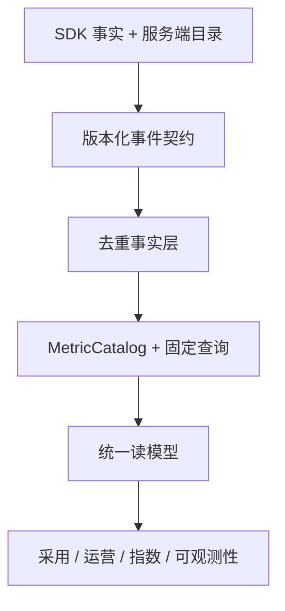
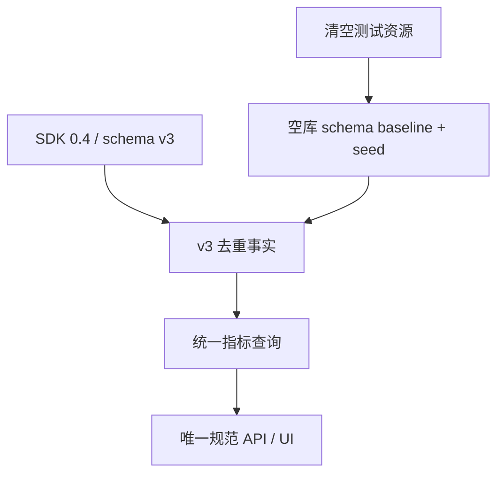

# Frontend Insight 修改计划 v1.4

- 状态：待技术与产品评审
- 更新日期：2026-08-10
- 产品基线：`docs/product/requirements-v1.7.md`
- 前序计划：`docs/planning/mvp-plan-v1.3.md`
- 规划起点：M0–M8 已实现并合并 `main`（基线提交 `4262ef6359b492cf9264b4d8fb97bb8b399306e8`）
- 计划定位：M8.1 指标字典、采集规范与产品流程对齐；M9 AI 分析助手编号保持不变

## 0. 结论

本次不是一次文案替换。它会同时影响事件契约、Web SDK、接收校验、ClickHouse 事实、MetricCatalog、固定查询、项目运营页面、可观测性页面和测试夹具，整体影响为“中高”。

项目尚未投产，MySQL、ClickHouse、Kafka、账号、项目、Origin、实体配置、profile、目标和 demo 数据均为可丢弃测试数据，因此采用一次 Pre-1.0 破坏性重置：

1. 复用 M0–M8 的架构与业务能力，但不复用测试数据、旧 schema 或旧 API/SDK 兼容逻辑；
2. schema v3、SDK `0.4.0`、ingest、consumer、API、Web 与 demo 在同一实施批次直接切换到唯一规范名；
3. 清空明确命名的本地/验收资源，从空库执行干净 schema baseline 和 seed；
4. 先完成不新增采集的 P0，把管理端默认入口从“功能采用”改为“项目入口页”，增加“项目入口 → 项目概览 → 专项分析/实体下钻”的导航闭环，并对现有指标、页面关系和解释纠偏；
5. 再以逐项目 opt-in 方式补齐 API/资源分母、首屏、长任务、白屏候选和 breadcrumb 等 P1 事实；
6. 组织、表单、路径和安全能力因依赖外部系统或更高隐私风险，独立进入 P2/P3。

不建议把 P0–P3 一次性合并为一个大版本。P0 可以形成独立、可回滚的 M8.1-A 发布；P1 形成 M8.1-B；P2/P3 只在真实项目与 ADR 就绪后启动。

## 1. 目标与非目标

### 1.1 目标

- 建立产品、SDK、事件、存储、API、UI 共用的唯一规范词典；
- 把指标公式、分母、分位数、样本、缺失语义、版本与血缘固化到 MetricCatalog；
- 对齐平台入口 → 项目入口页 → 项目概览 → 专项分析，以及项目 → 模块 → 页面 → 功能/任务 → 操作实例的两级产品流程；
- 在不降低隐私边界的前提下补齐附件中有业务价值的采集能力；
- 将 v1/v2、旧 SDK、旧 API 字段和旧测试数据从运行时移除；
- 保留项目运营指数 30/25/30/15 产品构成，并用新定义、新配置和新 seed 重新计算；
- 为每一批提供自动化回归、可观测、重置/回退和本地验收指引。

### 1.2 非目标

- 不在本计划实现通用自定义指标 DSL、任意 SQL、自助 BI 或动态回算平台；
- 不采集原始账号、设备指纹、原始 UA、完整 URL、DOM/输入、请求/响应正文；
- 不在没有稳定分母时展示 API/资源“失败率”；
- 不自动把错误/性能加入项目运营指数 v1；
- 不把安全异常监控与员工绩效关联；
- 不开发旧数据库升级、事件回填、双读、兼容别名、deprecated wrapper 或历史指数对照；
- 不提前实施 M9 AI 助手，且 M9 不得绕过本计划的指标与权限读模型。

## 2. 对 M0–M8 的影响评估

| 里程碑 | 已有资产 | 影响 | 处理方式 |
| --- | --- | --- | --- |
| M0 技术验证 | ARM64、Kafka、ClickHouse、Beacon 可行性 | 低 | 不改历史 spike；新事件沿用已验证链路 |
| M1 工程/迁移 | monorepo、JSON Schema、迁移、golden fixture | 高 | 建立只含 v3 的干净 schema baseline、生成类型和 fixture；空库/幂等验证替代旧库升级验证 |
| M2 SDK | SPA/page lifecycle、session、批量、隐私 | 高 | 发布 SDK `0.4.0`，统一字段，补 10s flush、性能汇总/任务旅程适配器；删除旧 API wrapper |
| M3 接收/消费 | Origin、schema、大小、HMAC、Kafka、ClickHouse | 高 | 只接收 v3；重建 Kafka/ClickHouse 测试数据和列，不实现多版本 normalizer |
| M4 管理/分析 API | 项目管理、固定 overview/trend/pages/features 查询 | 高 | 增加授权项目集合与单项目概览 read model；直接切换 canonical 指标定义和统一 data status；删除旧响应字段 |
| M5 产品前端 | 功能采用、页面访问、接入、筛选和状态 | 高 | 破除“功能采用默认首页”的既有假设；将项目入口页设为平台默认入口，项目概览设为项目默认页，并重构导航、返回路径、URL 状态和 E2E |
| M6 运营闭环 | 实体、operation v2、MetricCatalog、指数 v1 | 高但可复用 | 扩充目录与分位数；按新 key 重建 profile/golden/index 计算；避免 page-entry 与 operation 时长混义 |
| M7 生产硬化 | 负载/故障/恢复、Secret、日志、回滚 | 中 | 为新增事件重跑容量、备份恢复与降级；不改变运维安全基线 |
| M8 可观测性 | 错误组、Web Vitals、发布、影响范围、固定告警 | 中高 | 统一环境/发布字段，补可选请求/资源分母和详情联动；保留 SourceMap 阶段门 |

### 2.1 可直接复用

- `eventId` 去重、项目级账号 HMAC、匿名 visitor/session/pageView/operation ID；
- schema 生成类型、stable reject code 和 valid/invalid/golden fixture 流程；
- Kafka at-least-once、ClickHouse 查询侧去重和 90 天 TTL；
- 模块/页面/任务实体、三类页面模板和 clone-on-write 配置；
- operation handle、并发配对、取消终态与 SDK 异常隔离；
- MetricCatalog、definition version 与 lineage JSON 的骨架；
- URL 可分享筛选、admin/viewer 权限、数据状态与页面 E2E；现有实现可复用，但默认路由和页面顺序必须按 v1.7 重构；
- M7 负载、故障、备份恢复和 production Compose；
- M8 脱敏错误组、粗粒度影响范围、Web Vitals P75 和发布维度。

### 2.2 不能只改名的部分

| 表面改动 | 实际风险 | 正确改法 |
| --- | --- | --- |
| `userId → accountId` | 原始工号可能被持久化 | 只接受瞬时 `accountRef`，服务端项目级 HMAC；删除 `userId` 字段 |
| `deviceId → visitorId` | 设备指纹违反现有隐私边界 | 保留浏览器随机实例，文案明确不等于设备/人员 |
| `pageUrl/pageRoute` | query/hash、业务 ID 和凭据泄露 | 只发送 route，经服务端再归一化 |
| `operation_fail_rate` | 混淆前端校验、业务拒绝和 HTTP 失败 | 拆成三个独立指标与事件来源 |
| 资源/API 失败率 | M8 目前主要有异常分子，没有总请求分母 | 先新增受控 summary 事实，再发布 rate |
| 所有时长默认 P90 | 会违背 Web Vitals P75 和不同指标族的业务语义 | 按指标族配置主分位数；新 baseline 同时生成所需 P75/P90 |
| 模块渗透率 | 90 日活跃人数不是系统适用人数 | 官方目录分母；无目录时另名为 active share |
| task duration | page entry 与 operation started 是两个不同起点 | 保留 operation duration；新增显式 task journey |

## 3. 目标架构

### 3.1 真相源边界

| 内容 | 真相源 |
| --- | --- |
| 传输字段、事件结构、大小 | `packages/event-contract` JSON Schema |
| 规范名及禁止名 | 版本化 canonical manifest |
| 指标公式、分母、方向、分位数、依赖 | server-core `MetricCatalog` |
| 页面/模块/任务/目标/profile | MySQL 版本化配置 |
| 不可变事实与聚合输入 | ClickHouse raw events/read queries |
| 页面解释、公式和血缘 | API 返回的 MetricCatalog 元数据 |

前端不得复制公式；SDK 不计算服务端业务比率；数据库物理列名不得反向决定产品术语。

### 3.2 重置后的唯一数据流

v1/v2 请求以稳定 `SCHEMA_VERSION_UNSUPPORTED`（名称由 ADR-014 固化）拒绝。旧契约和数据只保留在 Git 历史，不进入 runtime。

## 4. 先行 ADR 与决策门

| ADR | 必须回答 | 阻断范围 |
| --- | --- | --- |
| ADR-014 Pre-1.0 重置与事件 v3 | 规范字段/事件/指标、SDK `0.4.0`、干净 schema baseline、安全 reset、v1/v2 拒绝码 | M8.1-A 契约实现 |
| ADR-015 指标口径与分位数 | 分子分母、样本门槛、P75/P90/P99、缺失状态、新 definition baseline | M8.1-A 查询与 UI |
| ADR-016 新采集隐私边界 | API/资源 summary、breadcrumb、白屏、表单、业务对象引用、采样 | M8.1-B SDK |
| ADR-017 组织目录与群体隐私 | eligible 分母、目录版本、角色多值、最小群体、审计与保留 | P2 组织指标 |
| ADR-018 安全/SourceMap 阶段门 | 证据、权限、处理人、误报、源码与认证数据治理 | P3 |

ADR-014/015 可在同一评审完成。ADR-016 允许按事件族拆分，未批准的采集开关保持关闭。

## 5. 实施分批

### 5.1 M8.1-A：规范名、现有口径和产品流程（P0）

目标：不要求业务项目新增埋点，直接用重建后的测试数据让所有页面“同名、同算、同解释、可下钻”。

#### A0 资产盘点与重置清单

- 生成字段、事件、指标、接口字段、数据库列、UI 文案、前端路由、导航菜单、面包屑、登录后跳转和 E2E 的现状 inventory；
- 逐项标注 canonical、rename、delete、unused、privacy-prohibited；
- 列出需要清空的 MySQL schema、ClickHouse 表、Kafka topic/consumer offset、命名 volume、项目配置和 demo seed；
- 为新项目运营指数公式准备可手算 golden cases，不复制旧测试结果；
- 确认仓库外没有生产 SDK、真实数据或必须保留的人工配置；
- 禁止在盘点期新增第三套名称。

退出条件：每一个需求 v1.7 P0 词条都能映射到现有实现位置或明确标记“尚未实现”。

#### A1 契约 v3 与干净数据基线

- 在 `packages/event-contract` 建立唯一 schema v3 与 canonical manifest；
- 生成 TypeScript 类型和稳定拒绝码；
- 删除 ingest/consumer/SDK 对 v1/v2、旧字段和旧枚举的运行时支持；
- 统一 `deploymentEnvironment/releaseVersion/occurredAt/route`；
- 将活动 migration 重整为可从空库确定性执行的 v3 baseline；不实现旧库升级路径；
- 提供带精确确认参数、只作用于明确项目资源的 test reset 命令；
- 重建默认账号、项目、Origin、模块/页面/任务、profile、目标和三场景 demo seed；
- 保持单事件 8 KiB、批 50 条/64 KiB 与既有隐私拒绝。

退出条件：全新环境可一次建库并 seed；第二次执行满足约定的幂等性；v3 fixture 通过；v1/v2 与禁止字段明确拒绝；规范输入不持久化原始账号/URL/UA。

#### A2 MetricCatalog 与固定查询

- 为现有指标补齐 business question、formula、numerator/denominator、dedupe、unit、primary percentile、minimum sample、missing semantics 和 version；
- 增加 active account/visitor/session 的明确读模型；
- 为页面/operation 时长生成 P50/P75/P90 所需新定义；
- 派生周/月活跃、小时分布、单页会话率和 90 日模块活跃份额；
- 对 operation duration 与 task journey duration 使用不同 key；
- 缺少目录/API/resource 分母时返回 `not_collected` 或 `missing_denominator`，不返回 0；
- lineage DAG 自动从依赖元数据构建并做循环校验。

退出条件：MetricCatalog、API 说明、golden fixture 与 SQL 对同一范围给出一致结果。

#### A3 统一读模型与 API

- 增加“当前用户可访问项目集合”read model/API，返回总项目数、筛选结果数、项目状态、权限、负责人/所属信息、资产数量、最近有效事件时间、数据状态和运营指数摘要/不可用原因；
- 增加“单项目概览”read model/API，返回项目属性、资产与配置覆盖、数据新鲜度、运营指数、功能采用、使用/任务和错误/性能摘要；
- 项目入口列表采用批量查询或预聚合，禁止 Web 对每个项目逐个请求专项接口形成 N+1；
- 为功能采用、使用/页面/任务、指数和可观测性提供相同的项目内筛选对象；
- 所有比率返回 numerator/denominator/sample/coverage/status/version；
- 返回 `availableFrom`、definition/profile version 和 partial window；
- API 响应只返回规范字段，旧字段有契约测试证明不存在；
- 高基数 route/API/error 使用固定 Top N 或 cursor；
- 指标定义/血缘 endpoint 成为页面解释来源。

退出条件：项目集合和项目概览通过 RBAC、分页/筛选、空态与 data status 契约测试；同一摘要从项目概览和专项页访问时值、范围、版本与解释完全一致。

#### A4 管理端信息架构

- 将 `/projects` 设为登录后的平台默认入口，展示当前用户有权访问的全部已接入项目；`/` 不得跳到功能采用、最近项目或第一个项目；
- 项目入口页展示总项目数、筛选结果数及每个项目的状态、资产数量、最近数据时间、数据状态和运营指数摘要/不可用原因；
- 点击项目进入 `/projects/:projectId/overview`；项目概览是项目内默认页，功能采用改为项目内二级专项页；
- 项目概览提供功能采用、使用/页面/任务、项目运营指数、可观测性和配置摘要及明确下钻入口；
- 项目入口页使用自己的搜索、状态、排序和分页 URL 状态；项目内复用环境/时间/发布筛选，并在切换项目时清理失效实体筛选；
- 实现项目入口 → 项目概览 → 模块 → 页面 → 功能/任务的面包屑和返回路径；从项目内返回时保留入口页列表状态；
- 直接项目深链执行 RBAC；覆盖 `forbidden`、`not_found`、零授权项目、单授权项目和多个项目场景；
- 页面/任务详情并列显示使用、效率、相关性能/错误摘要；
- 页面详情与可观测性互相带筛选跳转，但不显示因果措辞；
- “指标定义与血缘”抽屉展示公式、分母、样本、版本和 DAG；
- UI 替换 UV/VV/转化/健康度等歧义词；
- radar 保留等价表格，趋势不跨数据/版本缺口。

退出条件：需求 v1.7 第 9 节默认路由、项目列表、项目概览、专项下钻、返回路径和权限场景全部通过 Chromium/WebKit E2E 和键盘走查；功能采用不再承担平台默认入口。

#### A5 重置回归与文档

- 更新单元、contract、browser、consumer、API、M5/M6/M8 E2E；
- 删除或改写断言“功能采用是默认首页”的旧测试，新增 `/ → /projects → /projects/:projectId/overview` 主路径测试；
- 增加零/单/多项目、项目无数据、指数不可用、无权限深链、返回保留列表状态，以及项目概览到各专项页的测试；
- 增加 v1/v2 拒绝、旧字段不存在、全量 reset、空库 baseline、seed 幂等和冷启动闭环测试；
- 用新 golden fixtures 手算验证原子、派生、复合指标和 30/25/30/15 项目运营指数；
- 运行 M7 负载、Kafka/ClickHouse 故障、备份恢复和回滚；
- 在三场景 demo 验证项目入口、项目概览、功能采用、页面/任务、指数、错误和 Web Vitals；
- 新增 `docs/guides/m8.1-a-local-acceptance-macos.md`，在开头明确会删除全部本地/验收测试数据及所需确认参数，并把项目入口 → 项目概览作为 UI 验收第一条主流程。

退出条件：M0–M8 业务能力在 v3 基线上通过；默认入口与项目概览的新 E2E 通过；新指数 golden 与手算一致；连续两次 reset → bootstrap → smoke 可重复；运行时不存在 v1/v2 normalizer 或 deprecated API。

### 5.2 M8.1-B：一期采集缺口（P1）

只在 ADR-016 通过后实施，每个事件族单独 opt-in、单独容量与隐私 gate。

| 工作包 | SDK/业务接入 | 服务端/产品产物 | 特别边界 |
| --- | --- | --- | --- |
| API summary | 显式请求层适配器；全局 fetch 默认关 | P50/P90、成功/错误/慢请求率、慢接口 Top | 无 header/query/body；path 归一化；必须有总请求分母 |
| Resource summary | 每 pageView 汇总可观测资源请求与失败 | 资源失败次数和率、release 对比 | 抽样率/覆盖率随结果返回 |
| First screen | 页面模板显式 readiness API | 首屏 P90 与 coverage | 不用 DOM 文本推断 |
| List render | 组件层 begin/end + row bucket | page × row bucket P90 | 只发 `<100/100-1000/>1000` 桶 |
| Long task | PerformanceObserver 页面离开汇总 | count/duration/affected PV rate | attribution 默认不发脚本 URL 明细 |
| Blank candidate | root/readiness 模板适配器 | 候选率、相关错误/资源摘要 | Cesium/Canvas/骨架按模板禁用或适配 |
| Breadcrumb | 错误时附 allowlist 环形摘要 | 错误详情诊断证据 | 无 DOM 文本、selector、console、业务 ID |

每个工作包都要提供：配置开关、采样/限流、数据 coverage、`not_collected` 空态、可用起始时间、容量报告、停用与回滚路径。

### 5.3 P2：操作效率与组织指标

P2 不作为 M8.1-A/B 发布门：

- task journey 显式开始/结束和跨页关联；
- form summary（字段 key allowlist，不采集值）；
- 业务拒绝适配器，与 HTTP/API/校验失败分离；
- 关键路径步数；
- 可选短期 HMAC `businessObjectRef` 的重复操作诊断；
- 账号/权限目录、eligible 分母、部门/角色聚合与最小群体展示。

先选一个任务操作型页面做试点。没有稳定 success 语义、目录 owner 或隐私审批的项目不启用对应能力。

### 5.4 P3：独立立项

- `abnormalAccessSignal` 安全产品线；
- 受控 SourceMap；
- 项目运营指数 v2；
- 通用自定义/派生指标工作台；
- M9 多模型 AI 分析助手。

以上能力互不自动解锁。每项都必须有真实用户任务、owner、权限、保留、容量和误用风险评审。

## 6. 分层改动清单

### 6.1 事件契约

- canonical fields、enum 和禁止名 manifest；
- event/family registry 与受限 properties schema；
- v3 valid、invalid、golden fixtures，以及 v1/v2/旧字段拒绝 fixtures；
- 大小、PII、URL、UA、业务 ID 和 nested object 拒绝用例；
- 生成代码与文档，禁止手工维护平行类型。

### 6.2 Web SDK

- SDK `0.4.0` 只提供规范 config 和 API，删除 deprecated wrapper；
- SPA leave-before-view、hash 策略、30 分钟 session 和 visible duration 截断回归；
- queue 最多 50、最长 10 秒、64 KiB、sendBeacon/keepalive、retry 与同 eventId；
- 新 collector 逐项 opt-in、按 pageView 汇总、限流/coverage/diagnostic；
- 所有用户输入在浏览器发送前裁剪；SDK 异常不影响宿主。

### 6.3 Ingest / Consumer / Storage

- 单一 v3 validator；删除多 schema normalizer；
- `occurredAt/receivedAt` 校时与拒绝规则；
- 从空库建立干净 MySQL/ClickHouse schema；不开发旧结构升级和原始事件回写；
- schema/SDK 版本和拒绝量只记录计数；
- 新事件的高基数、批写、TTL、毒消息和 replay 验证；
- 根据新事件体重跑 M7 持续/峰值负载。

### 6.4 Server core / Analytics

- MetricCatalog 元数据 schema 与版本发布流程；
- canonical query context 与 time bucket；
- quantile、ratio、coverage、data status 通用结构；
- 固定查询和 materialization 门槛；P0 先查询时计算；
- lineage DAG/循环检测；
- index v1 使用新 baseline 的规范 key、definition/profile 与 seed；错误/性能仍不自动加入。

### 6.5 Web 管理端

- `/projects` 平台默认入口与授权项目列表；
- `/projects/:projectId/overview` 项目默认概览，以及项目内稳定子路由；
- 项目卡片/表格摘要、项目总数与筛选结果数、零/单/多项目状态；
- 项目入口独立列表状态与项目内 shared filters/URL 状态；
- 项目入口 → 项目概览 → 专项分析/实体下钻的页面职责、面包屑和返回路径；
- 单一术语资源表和 API 驱动的 metric copy；
- loading、no_data、not_collected、insufficient_sample、partial、delayed、broken、forbidden、not_found；
- 指标定义、血缘和版本断点；
- admin 配置与 viewer 只读；
- ECharts resize/dispose、键盘、颜色以外状态和 radar 等价表格回归。

### 6.6 Demo / Docs / Operations

- demo 全部切换 SDK `0.4.0`，覆盖三类页面模板和每个 opt-in collector 的可见开关；
- seed 生成可用、分母缺失、样本不足、partial 和隐私拒绝场景，不生成旧 alias；
- 更新 README、契约、ADR、schema baseline、SDK 接入、数据字典和本地验收；
- production 配置默认关闭所有新敏感 collector；
- dashboard 增加 schema/SDK/拒绝/事件族/队列抑制的非 payload 指标。

## 7. 重建与未来版本策略

### 7.1 重置范围与安全边界

重置仅用于尚未投产的 frontend-insight 本地与验收资源，并要求：

- 命令必须使用 `--confirm-local-data-loss` 或等价精确确认参数；
- target 必须解析为明确的 Compose project、数据库、topic 和 volume 名，不接受空变量、通配符、`$HOME`、`~` 或 workspace 根目录；
- reset 前显示将删除的 MySQL、ClickHouse、Kafka、volume、项目配置与 seed 范围；
- reset 不尝试保存旧事件、指标、项目、账号、Origin、profile 或目标；
- Git 仓库、源码、文档、Secret 模板和用户工作区文件不属于删除范围；
- 任何环境若出现真实数据或外部 SDK 使用，立即停止本方案并重新评估迁移。

### 7.2 一次性执行顺序

1. 合并 ADR-014/015、schema v3、SDK `0.4.0`、干净 migrations 和新 seed；
2. 停止 Web/API/consumer 与 demo，验证目标资源清单；
3. 执行显式 reset，确认 MySQL/ClickHouse/Kafka/volume 均为空或已重建；
4. 从空环境运行 migration/bootstrap/seed；
5. 同时启动只支持 v3 的 SDK、ingest、consumer、API 和 Web；
6. 运行 smoke、contract、M5/M6/M8 E2E、指标 golden、负载与故障恢复；
7. 生成新验收数据并开始 `availableFrom`，不显示重置前趋势。

不得让旧 SDK 与新服务或新 SDK 与旧服务混跑。所有组件通过 schema/SDK version health 信息确认同一基线。

### 7.3 投产后的版本治理

- 本次新定义可直接成为初始 `definitionVersion`；投产后公式、分母或主分位数变化必须发布新版本；
- profile/directory/definition 继续 clone-on-write，并记录生效时间；
- 趋势只连接同一版本，跨版本明确断点；
- 未来数据库只允许向前 migration，不再用清库替代正式升级；
- 新指标 `availableFrom` 从可靠事实首次出现时计算；
- 只有查询性能达到门槛才增加小时/天物化，物化可重建且不成为唯一事实。

## 8. 测试与验收矩阵

| 层 | 必测内容 |
| --- | --- |
| Contract | v3 合法/非法批次、v1/v2/旧字段拒绝、枚举、大小、PII/URL/UA/业务 ID、稳定拒绝码、生成类型 |
| SDK unit | route order、hash、visibility、idle/session、queue/flush/retry、sampling、collector isolation |
| Browser | Chromium/WebKit SPA、后台/恢复、关闭 Beacon、并发 operation、Vue/非 Vue 接入 |
| Consumer | v3 at-least-once、eventId 去重、poison/no-payload DLQ、v1/v2 拒绝、无多版本分支 |
| Metric golden | DST/时区、重复、零分母、缺失 leave、P50/P75/P90/P99、coverage、partial、版本切换 |
| API | 授权项目集合、项目概览、RBAC、分页/筛选、批量摘要、统一项目内筛选、旧字段不存在、status/sample/version/availableFrom、Top N/cursor |
| UI | `/ → /projects → /projects/:projectId/overview`、零/单/多项目、入口列表状态、项目概览到专项页、术语、URL 状态、下钻、所有空态、定义/血缘、版本断点、a11y、错误跳页 |
| Reset | 精确目标、显式确认、空变量/通配符拒绝、全量清理、空库 bootstrap、seed 幂等、重复执行 |
| Regression | v3 下的 M5/M6/M8 E2E、新指数 golden、auth/audit、Compose smoke |
| Production | 20 events/s 持续、200 events/s 峰值、Kafka/CH/consumer 故障、backup/restore/rollback |
| Privacy | 浏览器抓包与存储/日志扫描均无原始账号、URL 参数、UA、DOM/输入、header/body |

### 8.1 关键 golden fixture

- 同一 `eventId` 重复两次，只计一次；
- route 切换旧 leave 先于新 view，时长归属正确；
- 缺失 leave 时 PV 增加但时长样本不补 0，coverage 降低；
- 两个同 feature 并发 operation 不串联；取消、失败和超时分开；
- `accountRef` 一项目内稳定、跨项目不可关联，且不落原始值；
- 分母为 0/未采集/目录缺失分别返回不同状态；
- Web Vitals P75 与页面/API/任务 P90 使用各自规则；
- 新 seed 下零/单/多项目均可从项目入口进入正确项目概览，项目摘要与详情 read model 一致；
- 新 seed 下指数 v1 四个维度、叶子贡献、70% gate 和总分与手算一致；
- Canvas/Cesium 页面未启用 readiness adapter 时不生成白屏率；
- breadcrumb 的 DOM 文本、输入、console、query、业务 ID 被拒绝或删除。

## 9. 性能与容量门槛

新增事实会扩大事件量，M8.1-B 每个 collector 在启用前必须提供：平均/峰值每 PV 事件数、P50/P95 事件大小、压缩前批大小、Kafka lag、consumer throughput、ClickHouse 写入和查询扫描量。

最低门槛沿用 M7：20 events/s 持续 60 秒、200 events/s 峰值 10 秒，接收无失败、p95 ≤1 秒且 120 秒内全部可查询。若验收环境因资源不足无法完成容量门槛，可以记录为环境限制并继续逻辑验收，但不能据此宣布生产容量通过；目标生产环境仍需演练。

客户端预算建议在 ADR-016 固化：基础 SDK 不明显增加主线程长任务；observer/serialization 单次工作有上限；队列和 breadcrumb ring buffer 有硬上限；禁用 collector 时不注册对应 observer/wrapper。

## 10. 执行、验证与回退

### 10.1 重置执行顺序

1. 完成 ADR、schema v3、SDK `0.4.0`、干净 migrations、seed 与全仓调用方修改；
2. 先在可丢弃 CI/本地环境执行 reset → bootstrap → smoke；
3. 再在验收环境停服并展示精确删除清单，经显式确认后重置；
4. 同时部署 ingest、consumer、API、Web、demo 和 SDK v3 基线；
5. 运行逻辑、隐私、E2E、M7 负载/故障/备份恢复验收；
6. M8.1-B collector 仍按项目逐个开启，观察拒绝、队列、event volume、lag 和 coverage。

### 10.2 回滚

- 若 M8.1-A 失败，代码可回退到上一提交，但测试数据不恢复；回退后再次清空并用对应旧 baseline/seed 重建；
- 新 SDK collector 可远程/项目配置关闭，基础 page/feature 事件继续；
- 不在同一数据环境混用 v1/v2 与 v3，不执行跨 baseline down migration；
- 不把测试数据恢复能力描述为生产回滚能力；
- 失败发布仍按 M7 流程验证 Kafka lag、数据查询、备份和恢复。

### 10.3 Go/No-Go

任一条件触发 No-Go：

- reset 目标不精确、无法证明全部数据可丢弃，或发现仓库外真实 SDK/数据；
- 任一运行组件仍产生/接受 v1/v2、旧字段或旧枚举；
- 原始账号、query/hash、UA、DOM/输入或 header/body 出现在网络、Kafka/ClickHouse、日志或 DLQ；
- 同一指标跨页面值/公式/版本不一致；
- 新项目运营指数 golden 与手算不一致；
- 新 collector 无法单独关闭、没有 coverage 或没有容量证据；
- 数据缺失被显示为 0，或没有分母却显示 rate；
- `/` 或 `/projects` 仍默认进入功能采用、最近项目或第一个项目，或者点击项目未先进入项目概览；
- 项目入口未展示全部授权项目、项目摘要与详情口径不一致，或项目列表产生 N+1 专项查询；
- 页面下钻丢失项目/环境/时间/发布上下文；
- M5/M6/M8 任一关键回归失败。

## 11. 工作量估算

估算单位为开发人日，包含实现、自动化测试和文档，不包含排队评审、真实项目接入等待或生产观察期。

| 批次 | 范围 | 估算 | 主要不确定性 |
| --- | --- | ---: | --- |
| M8.1-A / P0 | 盘点、ADR-014/015、schema v3、全量重置、MetricCatalog/查询、项目入口/项目概览、UI 流程、回归 | 20–31 | 现有字段散布、路由与导航重构、项目摘要查询、迁移脚本重整、全仓调用方、指数新 golden |
| M8.1-B / P1 | API/resource/first-screen/list/long-task/blank/breadcrumb 逐项 opt-in | 26–40 | 宿主请求层差异、事件量、白屏误报、隐私审批 |
| P2 | task journey、表单、业务拒绝、路径、组织目录 | 24–40 | 外部账号目录、业务成功语义、角色多值、接入配合 |
| P3 | 每项独立估算 | 未纳入 | SourceMap/安全/指数 v2/通用引擎/AI 均是独立项目 |

若只做当前最紧迫的“命名 + 口径 + 项目入口/项目概览 + 页面关系”对齐，交付 M8.1-A 即可，预计 20–31 人日。相比兼容迁移方案减少约 20%–30% 的工作，但全仓重命名、指标正确性和安全 reset 仍不能省略。一次性实施 A+B 会放大回归与隐私风险，建议分两个 PR 系列和两个发布门。

## 12. 风险与缓解

| 风险 | 后果 | 缓解 |
| --- | --- | --- |
| reset 指向错误资源 | 误删其他项目或非测试数据 | 固定 Compose project/库/topic/volume 白名单、dry-run 清单、精确确认参数 |
| 组件未同步切换 v3 | 事件被拒绝或读模型字段缺失 | 单一变更、version health、启动前契约检查、禁止新旧混跑 |
| 全量重命名遗漏调用方 | 运行时错误或页面空数据 | `rg` inventory、类型生成、删除旧字段的负向契约测试、全仓 E2E |
| 公式统一后新指数计算错误 | 产品结论失真 | 新 seed、手算 golden、叶子贡献和 gate 测试 |
| 新分母事件增量过大 | SDK/链路/存储压力 | pageView 汇总、采样、硬队列、逐项开关和容量 gate |
| 自动 API 包装破坏宿主 | 业务故障 | 显式 adapter 优先；global fetch 默认关闭 |
| 白屏/时长被误解 | 产品错误结论 | 页面模板、coverage、候选命名、原始证据优先 |
| 组织/轨迹侵犯隐私 | 员工监控与合规风险 | 目录映射、聚合门槛、allowlist、审计、独立 ADR |
| 多页面重复公式 | 数值和文案漂移 | MetricCatalog/API 单一真相源 |
| 把核心分析能力误当默认入口 | 用户未选择项目就进入功能采用，无法建立项目级心智 | 固定 `/projects` 与 `/projects/:projectId/overview` 契约，删除旧默认首页断言并增加 E2E |
| 跨项目摘要逐项目请求 | 项目入口出现 N+1、口径漂移和加载缓慢 | 服务端授权项目集合 read model 批量返回有界摘要 |
| 低分辨率流程图被过度解读 | 实现不存在的页面/关系 | 只固化已由产品确认的“项目入口 → 项目概览”关系，其余名称以 v1.7 字典为准 |

## 13. 交付物

M8.1-A 完成时至少应有：

- ADR-014/015、canonical/禁止名 manifest 与安全 reset 规范；
- 唯一事件契约 v3、SDK `0.4.0`、schema fixtures 与生成类型；
- 版本化 MetricCatalog、统一 read model 和 lineage；
- 对齐后的项目入口页、项目概览、项目内专项路由、返回路径和 UI 术语；
- v3 下 M0–M8 自动化回归、新指数 golden 和 reset 重复性报告；
- 干净 schema baseline、seed 和 Pre-1.0 重置说明；
- `docs/guides/m8.1-a-local-acceptance-macos.md`；
- 实现与验收结果记录。

M8.1-B 每个 collector 另交付 schema、SDK API、开关、隐私 fixture、coverage、容量报告、空态、回滚与验收章节。

## 14. 评审建议

本轮先评审并锁定以下四项，随后即可进入 M8.1-A：

1. 接受 Pre-1.0 全量测试数据重置、schema v3/SDK `0.4.0` 唯一基线，且不保留旧名或 v1/v2 runtime；
2. 接受按指标族选择 P75/P90，而不是全局强制 P90；
3. 接受“没有官方分母就不展示渗透率/失败率”，改用明确的描述性指标；
4. 接受 P0 与新增采集 P1 分批发布，项目运营指数 v1 暂不变。

若其中任何一项不接受，应先修订需求与 ADR，不在代码里通过临时映射或默认值绕过产品决策。

## 15. 与 M9 AI 分析助手的衔接

M9 的功能范围、模型兼容、上下文选择和历史留存仍按 requirements-v1.7 第 18 节实施；本计划不把 M9 混入 M8.1 的代码工作包。新增约束如下：

- M8.1-A 是 M9 P0 前置门。`AIContextBlock` 只使用规范 metric/entity/filter key，并绑定 definition/profile/directory version；
- context snapshot 只能从统一 read model 生成，不能直接序列化页面 store 或原始事件；
- M8.1-B collector 未启用或 coverage 不足时，block 返回相同 data status，AI 不得补算；
- 指标定义与血缘 endpoint 作为提示词中的业务解释来源，避免模板复制公式；
- 页面职责矩阵同时定义可注册 block 的范围，跨页面/跨项目拼接仍需用户显式选择和服务端授权；
- M9 开发估算、AI Gateway、provider conformance、安全与数据出境评审单独维护，不消耗 M8.1-A/B 的完成门。

因此推荐顺序为：M8.1-A 评审与实施 → 规范 read model 稳定观察 → M9 P0 与 M8.1-B 可独立排期；二者都不得修改项目运营指数 v1。
