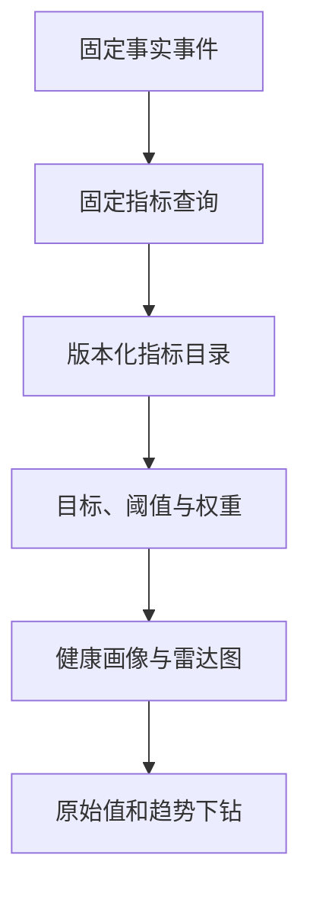

# Frontend Insight 运营指标与可解释健康度重评估及实施计划 v0.1

> 状态：评审草案，不代表已修改当前产品基线  
> 评估日期：2026-07-28  
> 评估基线：`main`（M0–M5 已完成）  
> 当前产品基线：[需求文档 v1.5](../product/requirements-v1.5.md)  
> 当前开发基线：[MVP 开发计划 v1.2](mvp-plan-v1.2.md)  
> 决策来源：[v1.3 评审报告 §2.3](../reviews/v1.3-review.md#23-应移出-mvp-的能力)

## 0. 结论摘要

重新评估后的结论不是简单推翻 v1.3 评审，而是需要修正当时对需求的命名和拆分：

1. **运营、产品和主管确实需要比当前 M5 更完整的运营洞察。** 页面访问量、账号/浏览器/会话、前台可见停留时长、功能曝光、成功、转化和重复使用，直接服务于“功能是否有人使用、是否值得继续投入”的决策，应进入下一阶段。
2. **上述需求不等于“通用自定义指标引擎”。** 当前固定事件和原始事件表已经能计算大部分指标。首期应建设“受限运营指标目录 + 类型化指标模板 + 可配置目标”，而不是任意事件、任意属性、任意公式、任意分组和任意 SQL。
3. **健康度总分不能因为画出了 radar chart 就直接计算。** 雷达图只是展示；总分必须先解决实体范围、指标方向、归一化、目标值、权重、缺失数据、最小样本和数据链路可信度。访问量和停留时长本身也不天然是“越高越好”。
4. **建议实现可解释的“健康画像”，并将总分作为 Beta 结果。** 页面仍应优先展示原始指标、趋势和分项解释；只有满足样本和权重覆盖门槛时才展示总分，链路异常或证据不足时明确显示“暂不评分”。
5. **对现有代码的影响总体为中等，不需要推倒 M0–M5。** 运营指标阶段主要影响 M4 查询/API 和 M5 前端；M1 增加向前迁移，M2/M3 可基本复用。真正的通用指标 DSL 或前端错误/性能监控则会产生高影响，应分别立项。

推荐产品命名：

- 下一阶段能力：**运营指标目录（Operational Metric Catalog）**
- 页面/功能诊断：**健康画像（Health Profile）**
- 满足评分条件后的摘要：**运营指数 Beta**
- 暂不使用：**通用自定义指标引擎**、**万能健康分**

## 1. 本次评估依据

### 1.1 已阅读的产品与计划文档

- 根目录 `README.md`
- `docs/planning/mvp-plan-v1.2.md`
- `docs/product/requirements-v1.5.md`
- `docs/reviews/v1.3-review.md`

### 1.2 已核对的主要实现

| 领域         | 当前实现证据                                                         | 与本需求的关系                                           |
| ------------ | -------------------------------------------------------------------- | -------------------------------------------------------- |
| 事件契约     | `packages/event-contract/schema/event-batch.schema.json`             | 已允许受限 custom event，并已有页面/功能/长时事件        |
| 页面可见时长 | `packages/web-tracker/src/tracker.ts`                                | `page_leave` 已携带 `visibleDurationMs`                  |
| 原始事件     | `infra/clickhouse/migrations/001_raw_events.sql`                     | 已保存 route、pageViewId、账号、会话和可见时长           |
| 接收与消费   | `packages/server-core/src/pipeline.ts`、`apps/consumer/src/index.ts` | 现有字段可直接进入 ClickHouse，不需要先改 Kafka envelope |
| 固定查询     | `packages/server-core/src/analytics.ts`                              | 已实现 overview、trend、pages、features、feature detail  |
| 元数据与权限 | `packages/server-core/src/mysql-store.ts`                            | 可沿用项目级授权、事务、审计和向前 migration             |
| 管理 API     | `apps/api/src/analytics.controller.ts`、`projects.controller.ts`     | 适合增加固定页面详情和指标配置 API                       |
| M5 前端      | `apps/web/src/views/*`                                               | 已有功能采用、页面访问、详情和数据状态组件               |

## 2. 当前能力与真实缺口

### 2.1 当前已经具备

- 项目级 PV、活跃浏览器、已识别账号、会话；
- 项目访问趋势和页面排行；
- 功能曝光、开始、成功、失败；
- 功能曝光到成功转化、跨会话重复使用；
- 长时展示累计前台可见时长；
- 页面前台可见时长原始数据；
- 受限 `track(eventName, properties)` 自定义事件；
- 数据新鲜度、延迟、故障和无数据状态；
- admin/viewer 权限与管理审计。

### 2.2 当前真正缺失

- 按归一化 route 查看页面详情；
- 页面平均值、中位数、分位数和停留时长样本覆盖率；
- 页面级已识别账号、功能采用和失败证据的组合视图；
- 统一、版本化的指标定义目录；
- 按页面/功能类型选择的指标模板；
- 业务目标、阈值和权重配置；
- 将不同单位的原始指标归一到同一方向的分项分数；
- 总分的缺失值、最小样本、可信度和版本解释；
- 错误、性能、Web Vitals 等前端可观测性数据。

### 2.3 一个重要的实现细节

页面停留与 long-view 时长不能使用同一聚合方式：

- `page_leave.visibleDurationMs` 是一次前台可见片段。一个 `pageViewId` 可能因隐藏、恢复而产生多个片段；应先按 `pageViewId` **求和**，再对页面访问实例计算平均值或分位数。
- long-view heartbeat 保存的是累计值；同一实例应先取 **最大值**，再跨实例求和。当前 `featureDetail` 已使用该口径。

页面没有收到 `page_leave` 时，不应把停留时长当作 0。页面详情必须同时返回：

- 完整 page view 数；
- 有有效时长的 page view 数；
- `durationCoverageRate`；
- 平均前台可见时长；
- 中位前台可见时长。

平均值容易被少量长时间打开的页面拉高，因此建议中位数作为主要解释，平均值作为补充。

## 3. 为什么不恢复真正的“通用自定义指标引擎”

当前 SDK 的 custom event 只解决“受限上报”，并没有解决自助分析需要的下列问题：

| 通用引擎必须补齐的能力  | 当前状态     | 风险                        |
| ----------------------- | ------------ | --------------------------- |
| 事件/属性注册与类型版本 | 无注册中心   | 同名字段含义漂移            |
| 任意过滤、分组和聚合    | 固定查询     | 扫描量、高基数和注入风险    |
| 指标公式与依赖图        | 无 DSL       | 循环依赖、除零和口径冲突    |
| 历史回溯与重算          | 无作业模型   | 修改公式后新旧结果不一致    |
| 权限与敏感属性控制      | 项目级权限   | 指标级越权和敏感字段泄露    |
| 成本预算                | 固定范围限制 | 单个配置可能拖慢 ClickHouse |
| 指标版本与弃用          | 无           | Dashboard 无法解释历史变化  |

因此下一阶段采用三层边界：

1. **固定事实层**：当前页面、功能和后续错误/性能事件；
2. **受限指标目录**：代码中注册并测试的聚合器，数据库只保存展示、目标和权重配置；
3. **健康画像层**：读取固定指标并进行版本化归一和解释。

数据库不保存任意 SQL，前端不提交公式 AST，API 不接受任意列名或 group by。

只有同时满足以下条件，才重新评估受限 DSL：

- 至少 3 个现有指标模板无法满足的真实需求；
- 需求在至少 2 个项目中复用；
- 已定义属性注册、基数上限、查询成本预算、回溯和版本策略；
- 固定指标阶段的真实使用证明自助配置是高频任务。

## 4. 目标产品模型

### 4.1 目标用户与页面

| 角色       | 首要页面                      | 需要回答的问题                              |
| ---------- | ----------------------------- | ------------------------------------------- |
| 运营/产品  | 运营概览、页面详情、功能采用  | 有多少访问、哪些页面/功能在用、是否持续使用 |
| Supervisor | 项目/页面健康画像与分项趋势   | 哪些区域偏离目标、需要找谁进一步分析        |
| 业务开发   | 接入、数据状态、功能/页面证据 | 埋点是否正确、失败发生在哪个阶段            |
| 前端开发   | 后续错误与性能页              | 生产出现哪些错误、影响范围和版本            |

Supervisor 的摘要不能替代产品和开发的明细页。总分必须可以下钻到原始值、趋势、阈值和样本。

### 4.2 类型化指标模板

首批建议模板：

| 模板                   | 适用实体     | 首批指标                                             |
| ---------------------- | ------------ | ---------------------------------------------------- |
| `project_traffic`      | 项目         | PV、浏览器、账号、会话、活跃趋势                     |
| `page_engagement`      | 页面         | PV、账号/浏览器、会话、平均/中位可见时长、时长覆盖率 |
| `feature_adoption`     | 功能         | 曝光、成功、转化、重复使用、失败                     |
| `long_view_usage`      | 持续展示功能 | 成功实例、累计/中位可见时长、活跃会话                |
| `frontend_reliability` | 后续阶段     | 无错误会话率、错误影响账号/浏览器、错误趋势          |
| `frontend_performance` | 后续阶段     | LCP/INP/CLS 达标率、API 慢请求率                     |

页面/功能可选择模板和业务目标，但不能编辑模板内部 SQL。

### 4.3 信息结构



建议保留“功能采用”为当前默认页，先新增“运营概览”和“页面详情”。是否把运营概览改成默认入口，应在真实用户走查后决定，不在本次设计中静默改变。

## 5. 健康度与 radar chart 的正确关系

### 5.1 直接回答

**可以根据雷达图的分项结果计算总分，但不能直接根据雷达图中的原始指标计算。**

正确顺序是：

1. 取得原始指标；
2. 判断数据是否新鲜、样本是否足够；
3. 根据页面/功能意图和业务目标做归一化；
4. 得到所有“越高越好”的 0–100 分项；
5. 雷达图展示这些分项；
6. 对符合资格的分项做加权汇总；
7. 同时返回分数覆盖率、置信状态、版本和解释。

雷达图是结果的可视化，不是评分规则本身。

### 5.2 为什么访问量和停留时长不能直接判好坏

- 访问量低可能是入口差，也可能是低频但关键的月末功能；
- 停留时长高可能是内容有价值，也可能是用户卡住；
- 对操作页面，成功率高且耗时更短通常更好；
- 对大屏，持续可见时间更长才符合预期；
- 对仅用于异常处理的页面，“没人使用”可能代表业务健康。

因此评分必须绑定 `entityType + metricTemplate + businessTarget`，不能使用一套全局阈值给所有页面打分。

### 5.3 建议的归一化合同

每个分项定义：

- `metricKey` 与 `definitionVersion`；
- `rawValue`、单位和统计区间；
- `direction`：`higher_better`、`lower_better` 或 `target_range`；
- `floor/target` 或目标区间；
- `normalizedScore`：0–100；
- `sampleSize`、`minimumSampleSize`；
- `status`：`eligible`、`insufficient_sample`、`missing`、`stale`；
- 面向用户的解释。

示例归一化：

```text
higher_better:
score = clamp(100 × (value - floor) / (target - floor), 0, 100)

lower_better:
score = clamp(100 × (ceiling - value) / (ceiling - target), 0, 100)
```

`target_range` 使用分段函数，区间内为 100，偏离后逐步下降。具体阈值不在代码中写成全局常量，而由已选择的模板默认值和项目覆盖值共同决定。

### 5.4 总分合同

对状态为 `eligible` 的分项：

```text
overall = Σ(weightᵢ × scoreᵢ) / Σ(weightᵢ)
weightCoverage = Σ(eligible weightᵢ) / Σ(configured weightᵢ)
```

草案门槛：

- 至少 3 个 eligible 分项；
- `weightCoverage >= 70%`；
- 数据链路不是 `delayed`、`broken` 或 `no_data`；
- 关键指标满足各自最小样本量。

不满足时返回 `overallScore = null` 和稳定原因码，不能把缺失指标当 0，也不能重新分配权重后假装是完整健康度。

`70%` 和最小样本值只是本次评审的建议默认值，批准实现前应通过 ADR 固化。

### 5.5 数据可信度不是健康加分项

数据新鲜度、时长覆盖率和 SDK 版本覆盖用于决定“能否相信评分”，不应作为业务健康维度加分。否则一个无人使用但采集链路正常的页面，可能因“数据质量很好”获得虚高总分。

建议响应同时包含：

- `scoreStatus`
- `overallScore`
- `weightCoverage`
- `dataConfidence`
- `dimensions[]`
- `definitionVersion`
- `profileVersion`
- `calculatedAt`

### 5.6 首期命名建议

在错误率、性能和可用性维度尚未接入前，首期总分命名为“运营指数 Beta”，界面明确只覆盖：

- 使用/触达；
- 参与度；
- 功能采用/重复使用；
- 当前数据可信度。

等 `frontend_reliability` 和 `frontend_performance` 进入并稳定后，再评审是否改名为“综合健康度”。

## 6. 建议的数据与代码设计

### 6.1 指标目录放在哪里

指标的计算实现放在代码中，例如：

- `packages/server-core/src/metrics/catalog.ts`
- `packages/server-core/src/metrics/page-analytics.ts`
- `packages/server-core/src/metrics/feature-analytics.ts`
- `packages/server-core/src/health/scoring.ts`

目录项至少声明：

- metric key；
- 支持的 entity type；
- 值类型、单位、方向；
- 定义版本；
- 查询实现引用；
- 最小样本规则；
- 默认展示和解释。

当前 `AnalyticsStore` 已承担多个查询集。新增本能力时应按领域拆分，而不是继续把全部方法写进同一个文件。

### 6.2 MySQL 向前迁移

建议新增而不是修改既有 migration：

#### `metric_profiles`

- `id`
- `project_id`
- `name`
- `template_key`
- `entity_type`
- `definition_version`
- `profile_version`
- `status`
- `created_by_user_id`
- `created_at/updated_at`

#### `metric_profile_items`

- `profile_id`
- `metric_key`
- `weight`
- `direction`
- `floor_value`
- `target_value`
- 可空 `target_upper_value`
- `minimum_sample_size`
- `display_order`

#### `metric_profile_assignments`

- `project_id`
- `entity_type`
- `entity_key`
- `profile_id`
- `effective_from`

`entity_key` 对页面使用归一化 route，对功能优先使用 `feature_id`。项目可有默认 profile，具体页面/功能允许覆盖。

首期不保存每次评分快照。先在查询时计算并记录性能；只有需要长期分数趋势且查询成本超过阈值时，才增加版本化快照或聚合表。

### 6.3 ClickHouse 查询

首期继续查询 `raw_events` 并复用 `eventId` 去重基座。

页面详情至少返回：

- PV、浏览器、账号、会话；
- 最后访问和最后接收；
- 有效 duration page views；
- duration coverage；
- 平均、中位和可选 p75 可见时长；
- 与该 route 关联的功能曝光、成功和失败；
- 缺口策略和 SDK 版本分布。

页面时长聚合必须先按 `page_view_id` 对 `page_leave` 片段求和，再对实例聚合。重复事件仍先按 `event_id` 去重。

满足现有性能触发条件后，才设计 `AggregatingMergeTree` 状态表；不为本功能预先加入 Redis。

### 6.4 API 草案

#### 只读分析

- `GET /api/projects/:id/analytics/operational-overview`
- `GET /api/projects/:id/analytics/page-detail?route=...`
- `GET /api/projects/:id/health?entityType=page&entityKey=...`

#### 管理配置

- `GET /api/projects/:id/metric-profiles`
- `POST /api/projects/:id/metric-profiles`
- `PATCH /api/projects/:id/metric-profiles/:profileId`
- `PUT /api/projects/:id/metric-profile-assignments`

只读接口沿用 viewer 项目授权；配置接口沿用当前项目写权限并写审计。所有响应继续返回 request ID，时间范围继续限制为最大 13 个月。

不要提供：

- `POST /metrics/query` 接收任意表达式；
- 任意 SQL；
- 任意 group by 字段；
- 前端传入权重后临时计算、但不保留版本的“影子分数”。

### 6.5 前端草案

新增：

- 运营概览；
- 页面详情；
- 健康画像/雷达图；
- 管理员指标模板与目标配置；
- 分数解释抽屉。

保留：

- 当前功能采用和页面访问原始指标；
- URL 中的项目和时间范围；
- loading、no_data、no_activity、delayed、partial、stale、forbidden；
- 指标定义、SDK 版本和最后更新时间；
- 原始值优先于分数。

雷达图只接收已经归一化的 0–100 分项。旁边必须有可访问的表格，列出原始值、分数、目标、样本和原因，颜色不能是唯一状态表达。

## 7. 对 M0–M5 的影响评估

| 里程碑        | 影响  | 需要修改                                                                              | 不需要修改                                                    |
| ------------- | ----- | ------------------------------------------------------------------------------------- | ------------------------------------------------------------- |
| M0 决策与基线 | 低–中 | 新增指标/评分边界 ADR；重新确认容量、角色、隐私和评分实体                             | Kafka、ClickHouse、MySQL、ARM64 Spike 结论                    |
| M1 契约与迁移 | 中    | 新 MySQL 向前 migration、指标目录类型、评分 fixtures 和版本合同                       | 运营指标阶段无需改 event schema v1；既有 migration 不回写     |
| M2 Web SDK    | 低    | 补页面时长多片段/缺失 leave 的契约测试；必要时仅修正文档                              | PV、page_leave、功能事件、long-view 和发送链路可复用          |
| M3 接收/消费  | 低    | 增加查询负载基准；若未来注册自定义事件，再增加 registry 校验                          | 运营指标阶段 Kafka envelope、ingestion 和 consumer 字段可复用 |
| M4 管理与查询 | 高    | 页面详情查询、指标目录、profile CRUD、评分服务、权限和审计；拆分过大的 AnalyticsStore | 认证、项目授权、参数化查询和数据状态可复用                    |
| M5 产品闭环   | 高    | 运营概览、页面详情、雷达/解释、配置页和完整状态测试                                   | AppShell、路由、URL 上下文、ECharts、StatePanel 等可复用      |

### 7.1 若坚持真正的通用 DSL

影响将从“中等扩展”变为“高影响重构”：

- M1 需要事件/属性注册、DSL AST、版本与回溯合同；
- M2 需要动态 schema/诊断和更复杂的 SDK 接入；
- M3 需要 registry 缓存、基数/成本保护和历史重算；
- M4 需要查询规划器、权限、异步作业和成本审计；
- M5 需要指标编辑器、错误反馈和配置生命周期；
- 工期和测试面至少增加一个独立产品阶段。

该方案不建议在当前阶段采用。

## 8. 分阶段实施计划

原 M0–M5 保持“已完成”状态，不回改历史结论。当前计划中的原 M6“硬化与试点”顺延为 M7，避免在未验证新产品范围前直接生产试点。

### M6.0：产品与评分 ADR（1–2 个开发日）

- 确认首期评分实体：建议页面、功能；项目总分后置；
- 确认“运营指数 Beta”命名；
- 确认模板、方向、目标来源和最小样本；
- 确认 admin 配置、viewer 只读；
- 确认未来错误/性能监控与运营事件分开建模；
- 形成 golden examples，人工手算原始指标和分数。

阶段门：任何一个示例都能解释“为什么得到这个分数”和“分数改变后采取什么动作”。

### M6.1：页面运营指标（3–4 个开发日）

- 新增页面详情固定查询；
- 计算 page view 级可见时长、平均/中位数和覆盖率；
- 增加页面账号数和相关功能采用摘要；
- 增加 query correctness fixtures；
- 增加页面详情 API 和前端页面；
- 记录 7/30 天查询扫描量与 p95。

阶段门：固定事件集与手算一致；缺失 leave 不进入平均值；链路异常不显示成 0。

### M6.2：受限指标目录与配置（3–4 个开发日）

- 新增 MySQL migrations；
- 实现代码内 metric catalog；
- 实现 profile、items、assignments；
- 实现管理员 CRUD、项目级授权和审计；
- 前端提供模板、目标和权重配置，不提供公式编辑器；
- 保证旧项目没有 profile 时继续显示原 M5 页面。

阶段门：配置有版本、可审计、可禁用；不存在任意 SQL/字段入口。

### M6.3：健康画像与运营指数 Beta（3–5 个开发日）

- 实现纯函数评分器；
- 实现 higher/lower/target-range 归一化；
- 实现缺失、最小样本、weight coverage 和链路状态 gate；
- API 返回原始值、分项、总分、可信度和版本；
- 前端增加雷达图、分项表和解释；
- 增加边界值、缺失值、版本与权限测试。

阶段门：任何总分都能下钻解释；证据不足时返回 null；雷达图不使用原始不同单位数据。

### M6.4：真实用户走查与范围复评（2–3 个开发日 + 观察期）

- 运营/产品完成“发现低采用页面并解释原因”的任务；
- Supervisor 完成“从摘要下钻到证据”的任务；
- 开发完成“区分埋点缺失、链路延迟和真实低使用”的任务；
- 至少观察 2 个工作日；
- 记录哪些配置真实使用、哪些造成困惑；
- 决定运营概览是否成为默认页；
- 决定是否继续展示总分或仅保留健康画像。

阶段门：目标用户不能解释的分项或不能对应行动的分数不得进入 M7。

### M7：硬化、部署与试点（原 M6，约 6–8 个开发日）

- 合并原计划的负载、故障、部署、备份恢复和真实项目试点；
- 补评分/页面查询负载；
- 验证升级只应用向前 migration；
- 形成 Go/No-Go 报告。

### M8：前端可观测性（单独评审）

- JS、资源和 API 错误；
- 错误分组、影响账号/浏览器/会话和版本趋势；
- Web Vitals 与慢请求；
- 固定告警；
- SourceMap 在错误阶段证明需要后再加入。

错误事件不得借用普通 custom event 粗暴承载完整 stack、URL query 或请求正文。必须重新做隐私、体积、采样、去重和保留期评审。

预计 M6.0–M6.4 为 **12–18 个开发日**，不含观察等待；M7 另计。真正的通用 DSL 和 M8 不计入该估算。

## 9. 测试与验收

### 9.1 数据正确性

- 同一 page view 多次隐藏/恢复：片段求和后只形成一个访问实例时长；
- 缺失 `page_leave`：不进入平均/分位数，并降低 coverage；
- 重复 `eventId`：查询侧只计一次；
- route 已归一化：动态参数不会拆成大量页面；
- 极端长时打开：中位数不被异常值显著拉动；
- 时区/DST：趋势与昨日同时段保持现有合同；
- score direction 三种类型边界值正确；
- 缺失、样本不足、链路延迟和配置版本切换正确。

### 9.2 权限与审计

- viewer 可读指标和评分，不能修改 profile；
- 未授权项目返回 403；
- profile 创建、修改、停用和 assignment 变化均审计；
- 一个项目不能引用另一个项目的 profile/entity。

### 9.3 UI 状态

- loading、no_data、no_activity、delayed、partial、stale、forbidden；
- 无 profile；
- profile 存在但样本不足；
- 部分维度缺失；
- 总分不可计算；
- 总分可计算且能查看每项解释；
- 雷达图有等价表格和键盘可达说明。

### 9.4 回归

- M0 Compose Spike 保留；
- M1 migration 空库、旧库升级和幂等通过；
- M2 Chromium/WebKit SDK 契约通过；
- M3 ingestion/consumer/data-status 通过；
- M4 auth/project/features/analytics 通过；
- M5 三场景 demo 与产品闭环通过。

## 10. 迁移与回滚策略

- 只增加 `004_*` 及后续 migration，不编辑 `001–003`；
- event schema v1 在 M6 运营指标阶段保持兼容；
- 新表、新 API、新页面均为增量；
- 没有 metric profile 的项目走原 M5 读模型；
- 健康画像使用项目级 feature flag/配置启用；
- 回滚应用版本时保留新表和数据，不执行破坏性 down migration；
- profile 停用后隐藏评分，不删除历史审计；
- 若查询性能不达标，先关闭健康画像并保留原始指标，不用缓存掩盖错误查询。

## 11. 风险与控制

| 风险                       | 控制                                                |
| -------------------------- | --------------------------------------------------- |
| 分数被当成员工或团队考核   | UI 明确用途；禁止个人级评分；权限和审计             |
| 访问量越高越好的错误假设   | 类型化模板、业务目标、原始指标下钻                  |
| 长停留被误判为高价值       | target range、成功/失败证据和中位数并列             |
| 缺失数据被当低分           | `overallScore=null`、data confidence 和 reason code |
| 配置过多增加学习成本       | 首批模板、默认值、渐进展开，不提供公式编辑器        |
| 动态查询拖垮 ClickHouse    | 代码内固定查询、范围限制、扫描量和 p95              |
| `AnalyticsStore` 继续膨胀  | 按 page/feature/health 查询集拆分                   |
| 未来错误数据污染运营事件   | 独立事件族、独立隐私与保留策略                      |
| 历史分数因规则变化不可解释 | definition/profile version 随响应返回               |

## 12. 实施前需要确认的 ADR

以下问题会影响最终实现，建议在 M6.0 明确，而不是由开发者在代码中默认：

1. **评分实体**：建议首期只为页面和功能提供健康画像；是否确实需要项目总分？
2. **首期命名**：是否接受在错误/性能数据加入前使用“运营指数 Beta”，而不是“综合健康度”？
3. **目标来源**：建议项目管理员选择模板并配置业务目标，同时显示历史基线作为参考；是否接受？
4. **时长语义**：信息查看页面、操作页面、大屏页面需要不同目标方向；是否按三类模板配置？
5. **评分展示门槛**：是否接受“至少 3 个 eligible 分项且权重覆盖 ≥70%”的草案门槛？
6. **编辑权限**：建议 admin 配置、viewer 只读；是否符合实际组织角色？
7. **项目默认入口**：建议暂时保持“功能采用”为首页，运营概览经走查后再决定是否替换。

这些问题不阻止评审本方案，但在进入 M6 代码实现前必须确认。

## 13. 建议的文档变更顺序

本草案获批后再执行：

1. 新增 ADR：指标目录、评分实体、归一化和缺失策略；
2. 将需求文档升级为 v1.6；
3. 将开发计划升级为 v1.3；
4. 更新事件/指标定义和 API 文档；
5. 编写 M6 golden fixtures 与验收清单；
6. 开始 migration 和代码实现。

在评审完成前，不直接修改 `requirements-v1.5.md` 和 `mvp-plan-v1.2.md`，以免把待确认方案误写成当前事实。
