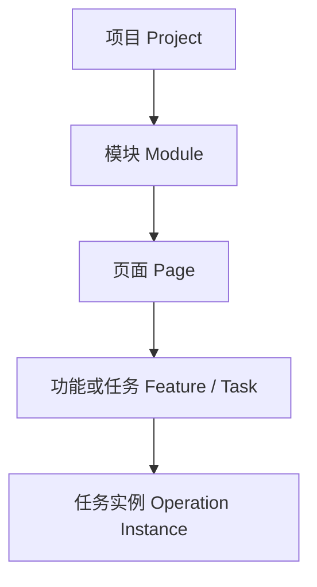
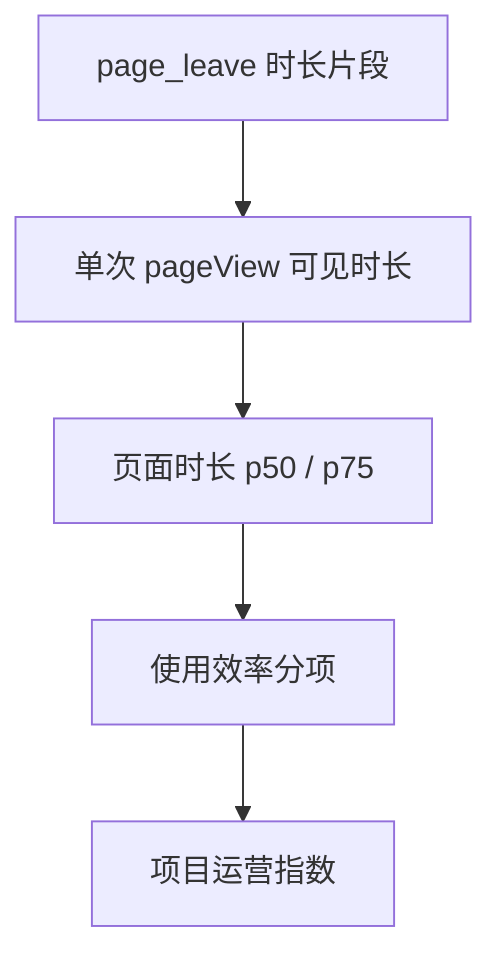
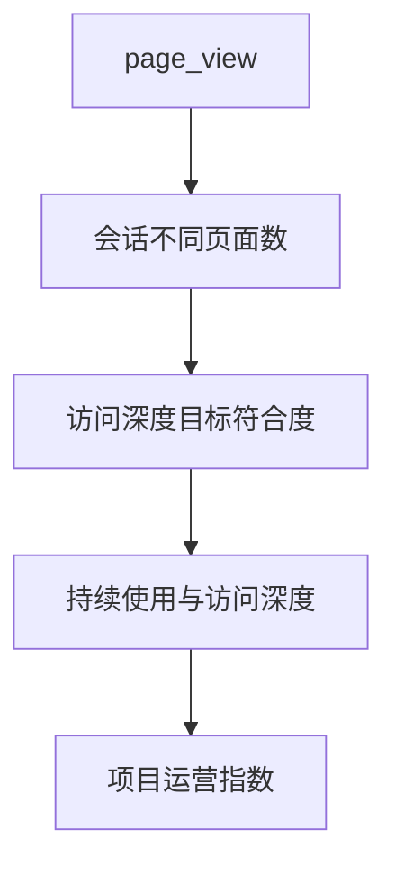

# Frontend Insight 智慧园区内部产品运营指标与项目运营指数方案 v0.2

> 状态：第二轮评审草案，不代表已修改当前产品基线  
> 更新日期：2026-07-29  
> 评估基线：`main`（M0–M5 已完成）  
> 当前产品基线：[需求文档 v1.5](../product/requirements-v1.5.md)  
> 当前开发基线：[MVP 开发计划 v1.2](mvp-plan-v1.2.md)  
> 前一版方案：[v0.1](operational-metrics-health-plan-v0.1.md)（保留用于查看评审演进）

## 0. 本轮调整摘要

本轮根据“弗物云”数字化工厂/智慧园区综合管理平台的业务背景，重新评估指标、项目总分、派生指标和指标血缘。

与 v0.1 相比，本版做出以下关键调整：

1. 产品定位从一般内部 Web 功能采用分析，进一步明确为：**面向复杂内部业务系统的私有化产品运营分析与前端可观测性平台**。
2. 正式接受**项目级总分**需求，总分命名为“项目运营指数”，并列出构成、公式、权重、样本门槛和下钻方式。
3. 将“转化”改成更符合内部系统语义的“曝光后使用率”“任务启动率”“任务达成率”“持续使用率”。
4. 新增页面、模块和关键任务的实体注册，否则无法正确计算页面类型、访问深度、关键页面覆盖和项目总分。
5. 新增可关联的任务实例生命周期。当前事件只能统计开始/成功次数，无法可靠计算一次具体操作耗时；需要兼容升级事件契约。
6. 将“大数据 DWS 思路”落成**指标语义与派生层**：统一原子指标、派生公式、版本、依赖和计算血缘，但不开放任意 SQL/任意公式。
7. 指标血缘被列为合理的 P1 能力；血缘用有向依赖图展示，时间变化仍使用折线图。
8. 根据新增范围将 M6 预计工期从 12–18 个开发日调整为 **26–37 个开发日**，原 M7 硬化与试点仍单独计算。

## 1. 产品背景与定位

### 1.1 代表性服务对象：弗物云

弗物云属于数字化工厂/智慧园区综合管理平台，典型模块包括：

- 驾驶舱：数字孪生、实时态势、报警监控；
- 能源管理：能耗、碳排、预算、空调和照明控制；
- 设备管理：设备生命周期、电子地图、IoT 设备；
- IoT 平台：产品、设备和数据记录；
- 报警管理：报警事件、异常事件和规则配置；
- 门禁系统：门禁和人员管理；
- 基础标准：报警级别、设备类型、字典和计费规则。

当前代表性项目使用 Vue 3、Element Plus、ECharts 和 Cesium，但 Frontend Insight 不能绑定 Vue。未来被监测系统可能使用 React、Angular、原生页面、不同路由方案或多页面架构。

核心 SDK 必须继续基于浏览器标准能力：

- History API、hash、页面加载和卸载；
- `visibilitychange`、`pagehide`；
- `sendBeacon` 和 keepalive fetch；
- 与框架无关的显式功能/任务 API。

框架适配器可以后续提供，但不能让 Vue 插件成为唯一接入方式。

### 1.2 与电商分析的区别

内部智慧园区产品通常没有“浏览商品—加购—下单”的统一商业漏斗。它更关心：

- 某项目、模块和页面是否持续有人使用；
- 关键驾驶舱是否按预期持续展示；
- 能源分析、设备管理等页面是否真正被访问和复用；
- 报警确认、设备控制、配置保存等任务能否完成；
- 用户完成任务是否明显耗时过长；
- 用户是否为了完成一个任务在过多页面间往返；
- 核心页面无人使用是正常低频，还是产品生命周期衰退信号；
- 页面无数据是业务无活动、埋点缺失还是采集链路故障；
- 生产错误和性能问题是否影响真实使用。

因此本产品不套用电商术语，也不把访问量简单等同于业务价值。

### 1.3 调整后的定位

> Frontend Insight 是一套私有化部署、面向复杂内部 Web 产品的运营分析与前端可观测性平台。它通过页面、模块、任务和后续错误/性能事实，帮助产品、运营、主管和开发判断产品是否被持续使用、关键任务是否顺利完成、使用效率是否偏离目标，以及哪些问题需要进一步调查。

产品分两条能力线：

1. **产品运营线**：项目、模块、页面、任务、访问深度、持续使用、任务达成、使用效率和项目运营指数；
2. **前端可观测性线**：JS/资源/API 错误、Web Vitals、版本、影响范围和告警。

两条线共享项目、账号/浏览器/会话、时间范围和数据状态，但使用不同事件族、隐私策略和保留策略。

### 1.4 能回答与不能回答的问题

本系统可以提供：

- 功能设计可能存在问题的量化信号；
- 操作耗时、失败、放弃、低触达或低持续使用的证据；
- 项目运营指数及其构成和变化；
- 需要访谈、可用性测试或开发排查的优先级。

本系统不能仅凭遥测证明：

- 某个页面设计一定合理或不合理；
- 停留越长一定越有价值；
- 访问越多一定越健康；
- 某个用户工作是否认真；
- 错误与使用下降之间存在因果关系。

产品结论仍需结合业务目标、发布计划、用户反馈和真实工作流程。

## 2. 分析实体与业务层级

现有系统主要有 project、route、feature。为支持模块、访问深度和项目总分，需要明确以下层级：



### 2.1 项目

一套被监测的内部 Web 产品，例如弗物云某个部署实例。

### 2.2 模块

稳定的业务域，例如驾驶舱、能源管理、设备管理、报警管理。模块不是从 URL 第一段自动推断，而是由管理员配置，避免路由结构改变后统计口径漂移。

### 2.3 页面

由归一化 route 标识，并配置：

- 页面名称；
- 所属模块；
- 页面类型模板；
- 是否核心页面；
- 关键度权重；
- 预期使用频率；
- 可选业务目标。

未注册 route 仍保留访问数据，但在完成归类前不进入关键页面覆盖率和项目评分。

### 2.4 功能或任务

功能用于判断页面内某项能力是否被使用；任务强调存在开始和终态，例如：

- 导出报表；
- 保存空调策略；
- 下发设备控制；
- 确认报警；
- 新建设备；
- 修改报警规则。

现有 `FeatureRecord` 可以扩展，而不需要另建完全独立的产品体系。

### 2.5 任务实例

一次具体操作的匿名关联实例。它只能使用 SDK 生成的随机 ID，不能使用设备 ID、报警编号、订单号、人员 ID 等业务标识。

任务实例用于关联：

```text
started → succeeded / failed / canceled
```

没有任务实例 ID 时，如果同一页面并发或连续发生多次同类操作，无法可靠计算单次任务耗时和放弃率。

## 3. 页面与任务类型模板

继续沿用三类核心语义，但用更贴近智慧园区的名称和解释。

### 3.1 持续监测型 `monitoring_dashboard`

典型页面：

- 驾驶舱；
- 数字孪生；
- 实时态势；
- 报警监控大屏；
- 能耗实时看板。

主要问题：

- 是否有人或有终端持续打开；
- 页面是否成功加载关键数据；
- 前台可见时间是否达到业务预期；
- 是否在预期工作日持续使用。

主要指标：

- 有效展示实例；
- 前台可见时长 p50/p75；
- 达到持续展示阈值的实例率；
- 活跃账号/浏览器；
- 活跃日覆盖；
- 数据就绪成功率。

时长方向通常是 `target_range` 或 `higher_better`，但必须设置合理上限，不能无限增加分数。

### 3.2 信息分析型 `analysis_view`

典型页面：

- 能耗分析；
- 碳排放分析；
- 预算分析；
- IoT 数据记录；
- 设备生命周期和电子地图。

主要问题：

- 页面和核心数据是否被查看；
- 用户是否在合理时间内完成阅读或分析；
- 是否跨会话/跨日再次使用；
- 是否使用了页面中的筛选、图表或导出功能。

主要指标：

- PV、活跃账号/浏览器、会话；
- 页面可见时长 p50/p75 和覆盖率；
- 数据就绪成功率；
- 曝光后使用率；
- 跨会话/跨日持续使用率；
- 会话访问深度和模块广度。

时长通常使用 `target_range`：过短可能未阅读，过长也可能代表理解或操作困难。

### 3.3 任务操作型 `task_operation`

典型页面：

- 空调/照明控制；
- 设备联动；
- 报警确认和规则配置；
- 门禁和人员管理；
- 产品、设备、字典和计费规则维护；
- 导入、导出和配置保存。

主要问题：

- 用户能否完成任务；
- 失败、取消或无终态的比例；
- 完成一次任务需要多久；
- 是否为了完成任务访问过多页面；
- 同类任务是否持续被使用。

主要指标：

- 任务启动实例；
- 任务达成率；
- 失败率、取消率、近似放弃率；
- 成功任务耗时 p50/p75；
- 跨会话/跨日持续使用率；
- 完成任务前的页面访问深度。

操作耗时通常是 `lower_better` 或 `target_range`，不能与大屏时长共用方向。

## 4. 指标语义与派生层：DWS 思路的合理落点

### 4.1 结论

借鉴大数据 DWS 层是合理的，因为项目运营指数和多个页面会复用相同的原子/派生指标，必须避免不同 API 各自实现一套公式。

但当前不需要建设可由用户自由组合字段、维度、窗口和公式的通用指标引擎。建议先实现：

> 代码注册、版本化、可测试、可追踪血缘的指标语义与派生层。

### 4.2 分层模型

| 层级        | 类比          | 内容                   | 示例                                  |
| ----------- | ------------- | ---------------------- | ------------------------------------- |
| L0 事实事件 | DWD           | 去重后的不可变事实     | page_view、page_leave、task lifecycle |
| L1 原子指标 | DWS atomic    | 单一事实直接聚合       | PV、账号数、任务成功实例数            |
| L2 派生指标 | DWS derived   | 多个原子指标组合       | 时长覆盖率、任务达成率、访问深度      |
| L3 复合指标 | DWS composite | 归一化和加权           | 页面分项、模块分项、项目运营指数      |
| L4 展示读模 | ADS           | 页面、表格、趋势和下钻 | 运营概览、项目运营指数                |

### 4.3 首期逻辑层，不急于物理建表

首期的“DWS”是逻辑语义层：

- 指标目录和公式在代码中注册；
- 原始值继续由 ClickHouse 固定查询计算；
- 元数据、目标、权重和版本保存在 MySQL；
- 指标依赖和血缘由目录元数据生成；
- 所有公式都有 golden fixture。

只有满足现有性能阶段门时，才增加小时/天级 `AggregatingMergeTree`：

- 默认 30 天查询 p95 连续超过 2 秒；
- 扫描量影响其他 ClickHouse 业务；
- 项目事件量持续超过既定阈值。

不为“架构看起来完整”提前加入 Redis、调度平台或离线重算集群。

### 4.4 指标定义元数据

每个指标至少声明：

- `metricKey`
- 中文名称和业务问题；
- entity type；
- 数据类型和单位；
- 时间窗口；
- 输入指标或事实；
- 公式/聚合器；
- 分母；
- 去重键；
- 缺失值语义；
- score direction；
- minimum sample；
- definition version；
- 数据 owner；
- 依赖指标列表。

这些信息同时服务计算、说明、测试和血缘，不在前后端复制多份文案。

### 4.5 真正通用指标引擎的存在价值与成本

当未来出现以下场景时，通用或受限 DSL 才有明显价值：

- 多个项目反复提出无法由内置模板满足的组合指标；
- 不同客户需要自己选择事件、过滤条件、维度和窗口；
- 指标数量大到代码发布成为主要瓶颈；
- 有专人负责指标治理、成本和历史回算。

当前若直接建设，需要额外解决：

- 事件/属性注册与类型；
- DSL AST、函数和依赖校验；
- 任意维度的高基数保护；
- 查询成本估算和异步执行；
- 公式版本、回溯和重算；
- 指标级权限；
- 循环依赖和影响分析；
- UI 编辑器与诊断。

预计在本方案之外额外增加 **25–40 个开发日**，且会形成持续维护成本。当前业务价值不足以支持这项投入，因此不进入 M6。

## 5. 核心指标公式与业务解释

### 5.1 统一前提

以下指标均满足：

- 按 `eventId` 去重；
- 使用项目时区；
- route 已归一化；
- 账号、浏览器、会话口径分开；
- 链路为 delayed/broken 时不把缺失数据当 0；
- 样本不足时返回 null/insufficient，不伪造稳定结论。

### 5.2 页面访问与时长

| 指标             | 计算公式                                                     | 业务解释                                 | 评分方向          |
| ---------------- | ------------------------------------------------------------ | ---------------------------------------- | ----------------- |
| PV               | `count(page_view)`                                           | 页面被打开的次数，刷新和重复访问均计数   | 通常不直接评分    |
| 活跃账号         | `uniq(account_id)`                                           | 已识别业务账号数；共享账号仍只算一个     | target based      |
| 活跃浏览器       | `uniq(visitor_id)`                                           | 浏览器存储实例，不是真实人数             | 辅助/target based |
| 会话             | `uniq(session_id)`                                           | 标签页内、30 分钟无活动切分的访问会话    | 辅助              |
| 单次页面可见时长 | 同一 `pageViewId` 的 `page_leave.visibleDurationMs` 片段求和 | 一次页面访问在前台实际可见的总时长       | 模板决定          |
| 平均可见时长     | `avg(有效 pageView 时长)`                                    | 便于总量比较，但容易受极端值影响         | 模板决定          |
| 可见时长 p50/p75 | `quantile(有效 pageView 时长)`                               | 更适合判断典型和偏慢/偏长体验            | 模板决定          |
| 时长覆盖率       | `有有效时长的 pageView / 全部 pageView`                      | 判断时长结果是否有代表性，不进入业务得分 | 可信度 gate       |

缺失 `page_leave` 的 page view 不以 0 参与时长平均。平均值和 p50 必须同时展示，p50 作为主要解释。

### 5.3 访问深度

“页面访问深度”不使用 URL path 段数，也不把 DOM 点击次数称为深度。

| 指标               | 计算公式                                               | 业务解释                     | 评分方向                  |
| ------------------ | ------------------------------------------------------ | ---------------------------- | ------------------------- |
| 会话页面数         | 每个 session 的 `count(page_view)`，展示 p50/p75       | 一次会话打开页面的次数       | 描述或 target_range       |
| 会话不同页面数     | 每个 session 的 `uniq(normalized route)`，展示 p50/p75 | 一次会话覆盖多少种页面       | 描述或 target_range       |
| 会话模块广度       | 每个 session 的 `uniq(moduleKey)`，展示 p50/p75        | 一次工作过程跨越多少业务模块 | 描述或 target_range       |
| 关键任务前页面深度 | task started 前同会话/任务窗口内的不同页面数           | 完成任务前是否需要过多跳转   | lower_better/target_range |

深度不是越高越好：

- 驾驶舱只访问一个页面可能完全符合预期；
- 完成配置任务需要跳转很多页面可能代表信息架构复杂；
- 分析工作跨多个模块可能是正常业务流程。

因此访问深度必须按模板和目标解释，不能作为全局正向指标。

### 5.4 功能使用与任务达成

本版不使用“转化率”作为默认产品术语。

| 指标                   | 计算公式                                                      | 业务解释                                       |
| ---------------------- | ------------------------------------------------------------- | ---------------------------------------------- |
| 曝光后使用率（账号）   | `成功使用去重账号 / 曝光去重账号`                             | 看到入口的账号中，有多少真正使用成功           |
| 曝光后使用率（浏览器） | `成功使用去重 visitor / 曝光去重 visitor`                     | 没有账号标识时的浏览器口径                     |
| 任务启动率             | `started instances / exposed opportunities`                   | 看到入口后是否开始任务；只在分母语义稳定时使用 |
| 任务达成率             | `succeeded operation instances / started operation instances` | 已开始任务中有多少成功完成                     |
| 任务失败率             | `failed operation instances / started operation instances`    | 明确失败的任务占比                             |
| 任务取消率             | `canceled operation instances / started operation instances`  | 用户明确取消，不与系统失败混合                 |
| 近似放弃率             | 超过观察窗口仍无终态的 started instances / started instances  | 可能是离开、断网或漏报，必须标注近似           |
| 成功任务耗时 p50/p75   | `terminalTime - startedTime`，仅成功实例                      | 判断典型操作时长和长尾                         |
| 跨会话持续使用率       | 至少 2 个 session 成功使用的账号 / 成功账号                   | 区分一次尝试与持续使用                         |
| 跨日持续使用率         | 至少 2 个本地日期成功使用的账号 / 成功账号                    | 更接近产品生命周期中的持续采用                 |

现有 `accountConversionRate`/`visitorConversionRate` API 字段暂不破坏性删除。M6 新响应使用 `postExposureUseRate` 等明确字段，旧字段进入弃用期；M5 UI 可先更换中文标签。

### 5.5 项目持续使用与核心覆盖

| 指标               | 计算公式                                       | 业务解释                     |
| ------------------ | ---------------------------------------------- | ---------------------------- |
| 活跃日覆盖率       | `有有效使用事件的日期 / 配置的预期活跃日`      | 是否在应使用的工作日持续使用 |
| 核心页面使用覆盖率 | `Σ已使用核心页面权重 / Σ已启用核心页面权重`    | 关键页面是否真正被触达       |
| 核心任务使用覆盖率 | `Σ有成功实例的关键任务权重 / Σ关键任务权重`    | 已交付关键任务是否有人完成   |
| 最近活动间隔       | `now - last valid activity`                    | 项目或模块多久没有真实使用   |
| 活跃账号目标达成   | `active accounts / configured target accounts` | 实际活跃账号是否达到业务预期 |

如果无法获得“应使用账号数”，活跃账号目标达成返回 unavailable，不使用浏览器数代替。管理员可以先配置目标值，后续再与 SSO/权限系统集成。

## 6. 事件契约与现有数据的能力边界

### 6.1 现有数据可以直接计算

- PV、账号、浏览器、会话；
- 页面可见时长及覆盖率；
- 会话页面数和不同页面数；
- 功能曝光、开始、成功、失败次数；
- 跨会话持续使用；
- long-view 前台可见时长。

### 6.2 现有数据不能可靠计算

- 一次具体操作从开始到成功的耗时；
- 同类操作并发时 started 与 succeeded 的配对；
- 明确取消率；
- 超时后近似放弃率；
- 任务完成前的精确导航窗口；
- 页面和模块的业务关键度。

无法满足的原因是缺少任务实例关联和页面/模块元数据，不是 ClickHouse 查询公式不足。

### 6.3 建议增加事件契约 v2

服务端在迁移期同时接受 v1/v2。v2 建议增加：

- `operationInstanceId`：SDK 随机生成的匿名任务实例 ID；
- `feature_canceled` 终态；
- data view 允许使用 started → succeeded/failed，计算数据就绪时长；
- 明确 terminal event 只能与同一 operation instance 配对；
- 可选 `interactionType` 使用固定枚举，不接受任意业务 ID。

ClickHouse 增加 nullable `operation_instance_id`，不回写历史事件。

历史影响：

- 现有历史数据仍可显示页面和采用指标；
- 任务耗时、取消和放弃指标只能从 v2 接入日开始；
- UI 必须显示“指标可用起始时间”，不能跨升级日前后直接比较。

## 7. 页面、模块与任务元数据

### 7.1 建议新增 MySQL 表

#### `project_modules`

- project、module key、名称；
- 状态、关键度权重；
- 展示顺序。

#### `page_definitions`

- project、module；
- 归一化 route；
- 页面名称；
- template key；
- 是否核心页面；
- 关键度权重；
- 预期活跃频率；
- 状态和生效时间。

#### 扩展 `features`

- 可空 `page_definition_id`；
- 是否关键任务；
- 任务权重；
- task timeout；
- 是否启用 operation lifecycle。

#### 指标配置

继续采用 v0.1 的：

- `metric_profiles`
- `metric_profile_items`
- `metric_profile_assignments`

所有新增配置修改均写审计。

### 7.2 未注册 route 的降级

- 继续出现在页面访问排行；
- 可查看 PV、访客、会话和时长；
- 标记“未归类”；
- 不进入核心页面覆盖和项目运营指数；
- 管理员可从观测到的 route 创建页面定义。

## 8. 项目运营指数

### 8.1 目标

项目运营指数用于给 Supervisor 提供一个可下钻的项目摘要，而不是替代原始指标。

页面必须同时展示：

- 总分；
- 四个一级构成；
- 每项原始指标、目标、分数和加权贡献；
- 数据可信度和权重覆盖；
- 指标/配置版本；
- 无法计算的原因；
- 模块、页面和任务下钻。

### 8.2 v1 构成与默认权重

| 一级维度           | 默认权重 | 业务问题                                          |
| ------------------ | -------: | ------------------------------------------------- |
| 使用覆盖           |      30% | 应被使用的账号、日期、核心页面是否真实被使用      |
| 持续使用与访问深度 |      25% | 是否跨会话/跨日持续使用，访问范围是否符合页面类型 |
| 任务达成           |      30% | 关键任务是否能启动、完成，失败/放弃是否可控       |
| 使用效率           |      15% | 页面停留和任务耗时是否处于业务目标范围            |

默认权重可由 admin 在模板允许范围内覆盖，并产生新的 profile version。

### 8.3 一级维度的建议组成

#### 使用覆盖 30%

- 活跃账号目标达成：40%；
- 核心页面使用覆盖率：35%；
- 活跃日覆盖率：25%。

账号目标缺失时该子项为 unavailable，不用浏览器数替代。

#### 持续使用与访问深度 25%

- 跨日持续使用率：40%；
- 会话不同页面数目标符合度：30%；
- 会话模块广度目标符合度：30%。

不同页面模板使用不同目标区间。大屏项目不会因为页面深度低而被扣分。

#### 任务达成 30%

- 关键任务加权达成率：70%；
- 失败、取消和近似放弃的反向分：30%。

页面/任务按关键度加权，不对所有 feature 做简单平均。

#### 使用效率 15%

- 关键任务耗时目标符合度：60%；
- 页面可见时长目标符合度：40%。

没有 v2 operation 数据时，任务耗时子项 unavailable，并参与权重覆盖 gate。

### 8.4 聚合原则

项目总分不等于所有页面分数的算术平均：

- 次要页面数量多，不能稀释关键页面问题；
- 模块和页面使用显式关键度权重；
- 同一事实不能在多个一级维度重复加分；
- 数据质量只决定是否可评分，不给业务健康加分；
- 未来错误/性能不能静默加入 v1。

### 8.5 归一化

每个可评分指标声明：

- `higher_better`
- `lower_better`
- `target_range`

示例：

```text
higher_better:
score = clamp(100 × (value - floor) / (target - floor), 0, 100)

lower_better:
score = clamp(100 × (ceiling - value) / (ceiling - target), 0, 100)
```

`target_range` 在目标区间内为满分，超出上下界后按配置的容忍区间递减。

### 8.6 总分和展示门槛

用户已确认采用：

- 至少 3 个 eligible 一级维度；
- eligible 权重覆盖率 ≥70%；
- 数据链路不能是 delayed、broken 或 no_data；
- 各指标满足 minimum sample。

计算：

```text
dimensionScore = Σ(metricWeight × metricScore) / Σ(eligible metricWeight)

projectOperationalIndex =
  Σ(dimensionWeight × dimensionScore) / Σ(eligible dimensionWeight)

weightCoverage =
  Σ(eligible configured weight) / Σ(all configured weight)
```

不满足门槛时：

- 总分返回 null；
- 显示当前可用分项；
- 列出 `insufficient_sample`、`missing_target`、`metric_not_available`、`data_delayed` 等原因；
- 不把缺失值当 0，也不对用户隐藏权重缺口。

### 8.7 产品生命周期信号

单次项目运营指数只能描述一个时间窗口，不能单独判断产品处于导入、成长、稳定或衰退阶段。

在同一 profile version 下积累至少 8 周稳定数据后，可以增加：

- 活跃账号、活跃日和核心页面覆盖的 4/8 周趋势；
- 跨日持续使用率趋势；
- 项目运营指数同版本趋势；
- 发布、节假日、业务淡旺季等人工注释；
- “使用上升”“相对稳定”“使用下降”“证据不足”等描述性状态。

首期不自动宣布“产品进入衰退期”。智慧园区功能可能只在月末、告警发生或特定季节使用，必须结合预期使用频率和业务日历解释。

### 8.8 未来加入错误与性能

M8 完成后，可以发布项目运营指数 v2，例如增加：

- 运行稳定性；
- 性能体验。

v2 必须使用新的 definition/profile version，不能改写 v1 历史分数。UI 应允许按同一版本查看趋势。

## 9. 指标血缘

### 9.1 合理性

指标血缘有实际价值：

- 产品/运营可以理解总分从哪些事实产生；
- 开发可以判断修改事件或公式会影响哪些页面；
- 数据异常时可以从总分下钻到派生指标和原始事件；
- 规则版本变化时可以解释历史不可比原因。

### 9.2 展示方式

普通折线图适合展示“某指标随时间变化”，不适合展示依赖关系。

血缘建议使用有向无环图或分层流程：



另一个例子：



UI 可以提供“指标定义/血缘抽屉”：

- 当前公式和版本；
- 输入指标；
- 数据源事件；
- 下游使用者；
- 生效日期；
- 样本和缺失规则。

趋势页继续使用折线图，并从血缘抽屉跳转，不把两种图混在一起。

### 9.3 分期和成本

- P0：目录元数据中保存依赖，API 可返回 lineage JSON；
- P1：实现只读 DAG 抽屉，预计 2–4 个开发日；
- 后续：动态影响分析、版本 diff、回算作业状态，额外 6–10 个开发日。

血缘不是 M6 核心闭环的阻断项，但底层依赖元数据应在 M6 建好，否则后补时需要重新整理所有公式。

## 10. API 与代码边界

### 10.1 服务端拆分

当前 `AnalyticsStore` 已较大。新增能力时建议拆为：

- `PageAnalyticsStore`
- `TaskAnalyticsStore`
- `ProjectOperationalStore`
- `MetricCatalog`
- `MetricEvaluationService`
- `OperationalIndexService`
- `MetricLineageService`

Controller 保持薄层，固定查询和值白名单继续保留。

### 10.2 只读 API 草案

- `GET /api/projects/:id/analytics/operational-overview`
- `GET /api/projects/:id/analytics/modules`
- `GET /api/projects/:id/analytics/page-detail?route=...`
- `GET /api/projects/:id/analytics/tasks/:featureId`
- `GET /api/projects/:id/operational-index`
- `GET /api/projects/:id/metrics/:metricKey/definition`
- `GET /api/projects/:id/metrics/:metricKey/lineage`

### 10.3 管理 API 草案

- module/page definition CRUD；
- feature/task metadata 扩展；
- metric profile CRUD；
- assignment 和目标配置；
- business calendar/expected active days；
- configured target accounts。

viewer 只读，admin 配置；继续执行项目级授权和审计。

### 10.4 明确禁止

- 任意 SQL；
- 任意 group by；
- 前端提交公式并直接执行；
- 指标依赖循环；
- 使用业务设备 ID/报警 ID 作为 operation instance；
- 个人级运营评分；
- 在浏览器端计算与服务端不同的项目指数。

## 11. 前端信息结构

用户已确认继续保持“功能采用”作为默认入口。新增能力不静默改变默认首页。

建议导航：

1. 功能采用；
2. 运营概览；
3. 页面访问；
4. 项目运营指数；
5. 项目与接入；
6. 后续错误与性能。

### 11.1 运营概览

- 项目访问和持续使用趋势；
- 模块使用覆盖；
- 核心页面/任务状态；
- 活跃日；
- 页面深度和任务达成摘要。

### 11.2 项目运营指数

- 总分与版本；
- 四维雷达图；
- 四维加权贡献；
- 原始指标/目标/样本表；
- 数据可信度和 weight coverage；
- 模块、页面和任务下钻；
- 指标定义和血缘入口。

雷达图只展示归一化后的 0–100 一级维度，并提供等价表格。不同单位的原始值不能直接放进雷达图。

### 11.3 页面详情

- 页面模板和所属模块；
- PV、账号、浏览器、会话；
- 平均、p50、p75 时长和 coverage；
- 访问深度；
- 页面内关键任务；
- 原始趋势；
- 页面分项解释。

### 11.4 术语调整

| 当前术语   | 建议 UI 术语                      |
| ---------- | --------------------------------- |
| 转化率     | 曝光后使用率                      |
| 功能转化   | 功能使用达成                      |
| 漏斗       | 使用阶段/任务阶段                 |
| 健康度总分 | 项目运营指数                      |
| 用户数     | 已识别账号/活跃浏览器，按实际口径 |

## 12. 对 M0–M5 的修订影响评估

| 里程碑        | 影响  | 修订内容                                                                            |
| ------------- | ----- | ----------------------------------------------------------------------------------- |
| M0 决策与基线 | 低–中 | 补产品类型、混合前端栈、模块/页面/任务、账号目标和业务日历 ADR                      |
| M1 契约与迁移 | 高    | event contract v2、module/page/profile migrations、operation fixtures、指标定义版本 |
| M2 Web SDK    | 中    | operation instance API、canceled 终态、data-view started、框架无关测试              |
| M3 接收/消费  | 中    | 同时接受 v1/v2、operation 字段、stage 校验、ClickHouse 向前 migration               |
| M4 管理与查询 | 高    | 页面/模块/任务查询、指标语义层、profile、指数服务、权限和审计                       |
| M5 产品闭环   | 高    | 运营概览、页面详情、项目指数、解释/血缘入口和完整状态                               |

不需要推倒：

- Kafka/ClickHouse/MySQL 基础架构；
- 现有 page/feature/long-view 事实；
- 账号 HMAC、Origin、限流和隐私边界；
- 认证、项目授权、数据状态和 URL 时间范围；
- 当前 M5 功能采用闭环。

## 13. 分阶段实施计划

### M6.0：产品、实体和评分 ADR（2–3 个开发日）

- 固化项目/模块/页面/任务层级；
- 固化三类页面模板；
- 固化项目运营指数 v1 和默认权重；
- 确认目标账号、业务日历和关键度配置；
- 固化 v1/v2 兼容和历史不可回填语义；
- 手算至少 3 个项目/页面场景。

阶段门：每个得分都能说明原始事实、公式、目标和行动含义。

### M6.1：模块/页面注册与页面指标（4–5 个开发日）

- MySQL migrations；
- 未归类 route 发现与注册；
- 页面可见时长、coverage、p50/p75；
- 会话页面深度、模块广度；
- 页面详情和模块分析 API；
- 正确性与查询性能测试。

### M6.2：任务实例与操作耗时（5–7 个开发日）

- event contract v2；
- SDK operation lifecycle；
- canceled/terminal 语义；
- ingestion/consumer 双版本兼容；
- ClickHouse operation 字段；
- 任务达成、失败、取消、放弃和耗时指标；
- Chromium/WebKit 及非 Vue 示例测试。

### M6.3：指标语义、派生和血缘元数据（4–5 个开发日）

- metric catalog；
- 原子/派生/复合指标；
- 依赖 DAG 校验；
- definition version；
- golden fixtures；
- definition/lineage API；
- 暂不要求血缘图 UI。

### M6.4：项目运营指数与配置（4–6 个开发日）

- profile 和 assignment；
- 目标、权重、minimum sample；
- 四个一级维度；
- eligible/coverage/data-state gate；
- 版本化响应；
- 管理权限和审计。

### M6.5：前端产品闭环（4–6 个开发日）

- 运营概览；
- 页面详情；
- 项目运营指数；
- 雷达图和等价明细表；
- 目标/权重配置；
- 指标解释和血缘入口；P1 图形化抽屉不阻断阶段门；
- 全部数据/请求状态。

### M6.6：回归与真实用户走查（3–5 个开发日 + 观察期）

- M0–M5 全回归；
- 固定数据手算；
- 运营、产品、Supervisor 和开发任务走查；
- 观察至少 2 个工作日；
- 判断总分是否能对应真实行动；
- 调整模板默认值，不改写既有版本。

M6 合计：**26–37 个开发日**，不含观察等待和完整动态血缘能力。

### M7：硬化、部署与试点（原 M6）

继续执行负载、故障、备份恢复、部署和真实项目试点，另计约 6–8 个开发日。

### M8：前端可观测性

- JS、资源和 API 错误；
- 错误分组和影响范围；
- Web Vitals；
- 版本关联和固定告警；
- SourceMap 由实际检索/定位需求触发。

M8 完成后另行发布项目运营指数 v2，不静默改写 v1。

## 14. 测试与验收补充

### 14.1 页面与深度

- 同一 page view 多次隐藏/恢复：片段求和；
- 缺失 leave：不参与时长，coverage 下降；
- route 未归类：可查但不评分；
- 大屏单页面会话：不会因低深度扣分；
- 操作任务跨多个页面：窗口与 operation instance 正确关联；
- 高基数动态 route：归一化后统计。

### 14.2 任务实例

- 同一 feature 并发两个 operation，不串联；
- succeeded/failed/canceled 只能结束一次；
- 无终态在观察窗口后才算近似放弃；
- operation ID 不含业务标识；
- v1 事件继续被接收；
- v2 指标只从可用起始时间展示。

### 14.3 项目运营指数

- 四维权重和子项贡献手算一致；
- 关键页面/任务权重生效；
- 账号目标缺失不使用浏览器替代；
- eligible 一级维度不足 3 个时总分 null；
- 权重覆盖低于 70% 时总分 null；
- delayed/broken/no_data 时总分 null；
- profile version 改变后历史结果不混算；
- viewer 不能修改配置。

### 14.4 UI

- 原始指标优先可见；
- 总分可下钻；
- 雷达图有等价表格；
- 指标公式和业务解释可查；
- 数据不足、目标缺失和版本起始时间清楚；
- 不用颜色作为唯一表达；
- 不显示“设计好/坏”的自动结论。

## 15. 迁移、降级与回滚

- 只增加向前 migration，不修改既有 `001–003`；
- ingestion/consumer 同时接受 v1/v2；
- 没有 module/page 定义的项目继续使用 M5；
- 没有 profile 时显示原始运营指标，不显示项目指数；
- 没有 operation v2 数据时隐藏任务耗时并说明原因；
- profile 按生效时间和版本保存；
- 回滚应用时保留新表，不执行破坏性 down migration；
- 查询性能不足时关闭项目指数，保留原始指标；
- 不使用缓存掩盖错误公式或高扫描查询。

## 16. 已确认 ADR 与新增决策

### 16.1 用户已确认

| 决策     | 结论                                       |
| -------- | ------------------------------------------ |
| 项目总分 | 需要                                       |
| 总分命名 | 项目运营指数，并列出构成                   |
| 目标来源 | 管理员模板/目标 + 历史基线                 |
| 时长语义 | 按持续监测、信息分析、任务操作分别配置     |
| 展示门槛 | 至少 3 个 eligible 一级维度且权重覆盖 ≥70% |
| 权限     | admin 配置、viewer 只读                    |
| 默认入口 | 暂时保留功能采用                           |

### 16.2 本版建议在代码前固化

1. 项目运营指数 v1 默认权重是否采用 30/25/30/15；
2. 目标账号由管理员配置，未来再接 SSO/权限系统；
3. 页面和任务关键度使用显式权重，不自动按流量推断；
4. operation 使用随机实例 ID，并采用事件契约 v2；
5. 指标血缘底层元数据进入 M6，图形化抽屉作为 P1；
6. 项目指数 v2 加入错误/性能时保留 v1 历史。

## 17. 文档升级顺序

本方案获批后再执行：

1. 新增实体、指标语义、事件 v2 和项目指数 ADR；
2. 需求文档升级为 v1.6；
3. 开发计划升级为 v1.3；
4. 更新事件契约、指标定义和 API 文档；
5. 编写 M6 golden fixtures 与验收清单；
6. 开始 migration 和代码实现。

在评审完成前，不直接修改 `requirements-v1.5.md` 和 `mvp-plan-v1.2.md`。
