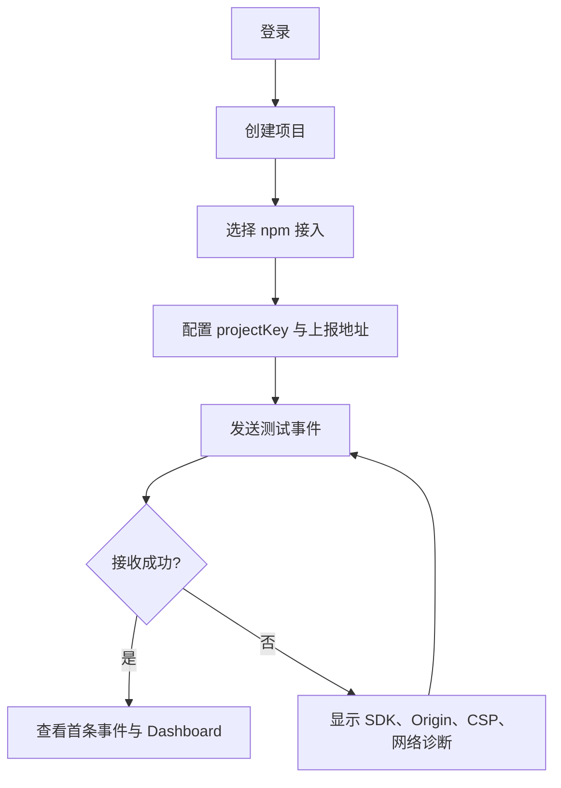

# Frontend Insight 内部 Web 功能采用分析系统——需求文档 v1.5

> 状态：待开发评审  
> 更新日期：2026-07-19  
> 基于版本：v1.4  
> 适用阶段：MVP / 内部试点  
> 关联文档：[MVP 开发计划 v1.2](../planning/mvp-plan-v1.2.md)、[Mac 本地全流程指南](../guides/local-full-flow-macos.md)、[v1.3 评审报告](../reviews/v1.3-review.md)

## 0. 版本决策摘要

v1.4 已将产品从“轻量 Sentry + 运营数据平台”收敛为“内部 Web 使用分析系统”。v1.5 进一步明确：产品的首要任务不是给页面计算抽象健康分，而是帮助产品和开发团队判断新功能是否真正被使用、多少账号或浏览器在使用、是否持续使用，并据此决定继续投入、优化入口或交互、还是下线功能。

MVP 只解决四件事：

1. 让内部 Web 项目能够低成本接入并确认数据链路正常；
2. 统一衡量数据查看型、操作完成型和持续展示型三类功能的使用情况；
3. 让产品、运营和开发查看功能曝光、成功使用、使用账号/浏览器、重复使用、趋势和最后使用时间；
4. 让系统维护者能够区分“功能无人使用”“用户没有看到功能”和“采集链路异常”。

错误监控、性能监控、告警、自定义指标引擎和健康度评分不再属于 MVP。它们只有在用户需求和容量数据满足阶段门槛后才进入开发。

## 1. 产品定义

### 1.1 背景

内部 Web 应用部署在隔离网络中，不能使用 Google Analytics、百度统计等公网服务，数据也不能离开内部环境。当前团队缺少统一、可信的使用数据，无法稳定回答：

- 哪些项目和页面仍在被使用；
- 新开发的页面、图表、导入、导出、配置和大屏功能是否真正被使用；
- 有多少账号、匿名浏览器和会话使用过某个功能；
- 用户看到功能后是否实际使用，是否只试用一次便不再使用；
- 使用量是增长、下降还是突然中断；
- 访问来自多少匿名浏览器、已识别账号或会话；
- 某页面在指定时间段内的使用趋势；
- 数据为空时，是业务无访问还是监控链路故障。

### 1.2 产品定位

Frontend Insight 是一套私有化部署的内部 Web 功能采用分析系统。它通过轻量 SDK 采集页面访问和标准化功能事件，经内部数据链路处理后，在统一 Dashboard 中展示可解释的功能使用数据。页面访问分析仍然保留，但它服务于功能采用判断，不再是产品的唯一中心。

它在 MVP 阶段不是：

- Sentry、Datadog 或完整 APM 的替代品；
- 通用 BI、自助 SQL 或任意指标计算平台；
- 用户行为录屏或员工监视工具；
- 需要秒级刷新的实时流式看板；
- 面向外部客户的多租户 SaaS。

### 1.3 产品原则

| 原则 | 具体要求 |
|---|---|
| 先回答决策问题 | 每个图表都必须对应一个明确问题，不以“可展示的数据”驱动功能 |
| 区分看到与使用 | 曝光、开始、成功和持续使用是不同事件，不能用按钮点击代替功能成功 |
| 不自动评判好坏 | 系统提供采用证据，不以单一分数宣布设计成功或失败 |
| 口径优先于图表 | 指标定义、时区、延迟和数据状态必须对用户可见 |
| 接入可验证 | 创建项目后，用户可以独立完成接入、测试和排障 |
| 对宿主影响可测 | 不使用“零影响”表述，以包体、耗时、队列和请求预算验收 |
| 默认保护数据 | 默认不采集 query、hash、表单、DOM 文本、cookie 和原始敏感标识 |
| 组件按证据增加 | Redis、ES、复杂规则引擎等均由性能或需求阈值触发 |
| 监控系统可被监控 | 必须展示链路状态、最后事件时间、拒绝数和消费延迟 |

## 2. 目标用户与核心任务

### 2.1 用户角色

| 角色 | 核心任务 | MVP 权限 |
|---|---|---|
| 产品/运营查看者 | 查看项目使用趋势、页面排行和时间对比 | 只读查看已授权项目 |
| 业务开发者 | 创建项目、接入 SDK、验证数据、定位采集问题 | 项目管理、接入配置、查看数据 |
| 平台管理员 | 管理项目访问、查看系统状态和数据质量 | 全部项目、基础账号/授权、系统状态 |
| 系统维护者 | 部署、升级、排查采集与存储链路 | 运维接口和日志，不通过产品 UI 修改底层数据 |

MVP 使用 `admin` 和 `viewer` 两种产品角色。被监控的业务系统已有用户名密码和 token 登录机制，但 Frontend Insight SDK 不读取业务系统的 Authorization header、cookie 或 Local Storage token。业务系统只能显式传入稳定的账号引用。Frontend Insight 自身若无现成 SSO，则使用独立本地账号作为试点期方案。完整用户生命周期管理不在 MVP 范围。

### 2.2 用户需要完成的任务

| 优先级 | 用户任务 | 成功表现 |
|---|---|---|
| P0 | 将一个 Web 项目接入系统 | 用户在 15 分钟内看到测试事件被接收 |
| P0 | 判断某个新功能是否有人使用 | 能查看成功使用账号/浏览器数、次数、趋势和最后使用时间 |
| P0 | 判断用户是没有看到还是看到后没有使用 | 能对比曝光与成功使用，并显示曝光到使用转化率 |
| P0 | 区分一次尝试和持续使用 | 能查看跨会话重复使用账号/浏览器数 |
| P0 | 验证三类真实场景 | 数据/图表成功渲染、操作成功完成、大屏持续可见均能形成正确事件 |
| P0 | 判断项目近期是否仍有人使用 | 能查看近 7/30 天访问与活跃访客趋势 |
| P0 | 找出高频或长期无访问页面 | 能排序、搜索并查看页面最后访问时间 |
| P0 | 判断数据是否可信和新鲜 | 页面显示数据更新时间与链路状态 |
| P0 | 对比今日与昨日同时段 | 指标卡使用统一口径，说明比较区间 |
| P1 | 识别慢页面或错误页面 | 错误/性能阶段上线后完成，不由 MVP 假装回答 |

## 3. 成功指标与约束

### 3.1 MVP 产品成功指标

试点上线后 30 天内：

| 指标 | 目标 |
|---|---:|
| 首次接入中位耗时 | ≤ 15 分钟（不含业务项目发布等待） |
| 创建项目后 24 小时内成功收到数据的比例 | ≥ 80% |
| 试点项目覆盖率 | 约定试点项目中 ≥ 80% 接入 |
| 周活跃项目比例 | 已接入项目中 ≥ 60% 每周有一次 Dashboard 查看 |
| 预定任务完成率 | 目标用户可独立完成第 2.2 节全部 P0 任务 |

产品使用指标用于判断是否继续投资，不用于替代技术 SLO。

### 3.2 技术 SLO 与性能预算

默认容量假设：不超过 20 个项目、日事件量不超过 100 万、平均不超过 20 events/s、峰值不超过 200 events/s。超出时必须重新做容量评审。

| 项目 | MVP 目标 |
|---|---:|
| 接收接口可用性 | 月度 ≥ 99.5% |
| 接收接口 p95 响应时间 | ≤ 100 ms（仅完成校验与入队） |
| 数据可见延迟 p95 | ≤ 5 分钟 |
| 服务端拒绝/丢弃率 | < 1%，且可按原因观测 |
| Dashboard 核心查询 p95 | ≤ 2 秒（默认 30 天范围） |
| SDK ESM gzip 包体 | ≤ 12 KB，不包含 Source Map |
| SDK 单次事件同步处理 p95 | ≤ 2 ms（基准测试环境内） |
| SDK 内存队列 | ≤ 100 条且 ≤ 64 KiB/批 |
| 宿主异常隔离 | SDK 异常不得向业务调用栈抛出 |

这些指标是试点目标，不是未经压测的承诺。测试环境、浏览器和数据规模必须随结果记录。

## 4. MVP 范围

### 4.1 P0 功能清单

#### 4.1.1 项目与接入

- 创建、编辑和停用项目；删除项目不在 MVP，避免误删历史数据；
- 在项目下创建、编辑和停用功能定义，字段包括 `featureKey`、名称、功能类型、说明和上线时间；
- MVP 功能类型固定为 `data_view`、`action`、`long_view`，不开放任意指标公式；
- 为每个项目生成公开的 `projectKey`；它用于标识项目，不是秘密凭证；
- 配置允许上报的 Origin 列表；
- 生成 npm 接入代码和 CSP/CORS 提示；
- 提供“发送测试事件”和接入状态页；
- 显示最后收到事件时间、最近错误原因和 SDK 版本。

#### 4.1.2 Web SDK

- 自动采集初始加载及 SPA 路由变化的 `page_view`；
- 页面隐藏/切换时采集 `page_leave`，用于计算可见停留时长；
- 生成匿名访客 ID、会话 ID 和页面访问 ID；
- 支持 `setAccount(pseudonymousAccountRef)`；业务侧只能显式传入不包含 token、姓名、邮箱、手机号等信息的稳定不透明账号标识，接收端再使用服务端密钥做项目级 HMAC 后落库；
- SDK 生成匿名 `visitorId` 和独立 `sessionId`。共享账号只能统计为一个账号，但可按不同浏览器标识和会话观察使用情况；系统不得将其解释为真实人数；
- 支持 `featureExposed(featureKey)`、`featureStarted(featureKey)`、`featureSucceeded(featureKey)` 和 `featureFailed(featureKey, reasonCode)` 标准事件；
- 支持 `startLongView(featureKey)`，在页面可见时按固定周期发送心跳，并在隐藏/离开时结算可见时长；
- 支持受限的 `track(eventName, properties)` 自定义事件；
- 批量、定时和页面离开时上报；
- 支持路由归一化函数，默认移除 query 与 hash；
- 对事件名称、属性数量、键名、值长度和请求体大小设置上限。

#### 4.1.3 数据接收与处理

- `POST /v1/events` 接收批量事件；
- 校验 `projectKey`、Origin、schema 版本、时间范围和请求体大小；
- 为请求添加 `receivedAt`、`requestId`，不信任客户端时间作为唯一时间来源；
- 使用已有 Kafka 进行缓冲，按批写入 ClickHouse；
- 消费失败按有限次数重试，超过阈值进入死信主题；
- 记录接收、拒绝、入队、消费、重试、死信与写入指标；
- 对 `eventId` 进行幂等容错，统计系统接受“近似准确”，不承诺财务级 exactly-once。

#### 4.1.4 Dashboard

- 项目切换；
- 今日、近 7 天、近 30 天和自定义时间范围；
- 核心指标：PV、活跃浏览器、已识别账号、会话数；
- 今日与昨日同时段比较；
- PV/活跃访客趋势图；
- 页面排行：路由、PV、活跃访客、会话数、最后访问时间；
- 页面搜索与分页；
- 数据更新时间、时区、指标说明与数据状态；
- URL 可分享筛选状态，但不得包含用户标识或敏感查询参数。

#### 4.1.5 功能采用分析

- 功能总览：功能名、类型、上线时间、曝光账号/浏览器数、成功使用账号/浏览器数、成功次数、最近使用时间；
- 曝光到成功转化率：成功使用去重账号数 ÷ 曝光去重账号数；没有账号标识时同时提供浏览器口径；
- 重复使用：在至少两个不同会话中成功使用过该功能的账号/浏览器数；
- 趋势：按小时/天展示曝光、成功次数和成功使用账号/浏览器数；
- 数据查看型：主要数据请求成功且图表/数据区完成渲染后才记为成功使用；
- 操作完成型：导出成功开始下载、导入完成、指令被服务端接受、配置保存成功后才记为成功；按钮点击只记 `started`；
- 持续展示型：大屏主要数据渲染成功后开始统计，默认连续可见 30 秒记为一次成功使用，之后每 60 秒发送心跳并累计可见时长；阈值作为项目配置保存；
- 不输出“好/坏”“健康/不健康”等自动结论，只展示数据和口径说明。

#### 4.1.6 认证与授权

- 优先复用现有 SSO 或反向代理身份；
- 本地认证作为兜底：管理员初始化、强密码哈希、短时访问令牌与安全 cookie/刷新机制；
- `admin` 可管理项目和授权，`viewer` 只读；
- 所有管理操作写审计日志；
- 数据接收端不使用用户 JWT，也不把 `projectKey` 当作密钥。

#### 4.1.7 系统状态

- `/health/live` 与 `/health/ready`；
- 管理页展示最近 15 分钟接收数、拒绝数、消费延迟、死信数、写入失败数；
- 每个项目显示最后接收时间与最后可查询时间；
- 数据链路异常时，Dashboard 显示“数据可能延迟”，不得显示成“0 访问”。

### 4.2 明确不在 MVP 的功能

- 跳出率、留存、漏斗、用户路径桑基图；
- 通用自定义指标/规则引擎和健康度总分；
- JS 错误、资源错误、API 错误与 SourceMap；
- FCP、LCP、TTFB、API 性能与慢请求；
- 邮件、企业微信等告警通知；
- Elasticsearch、Redis 实时计数和 Dashboard 缓存；
- 自定义拖拽 Dashboard、Excel 导出、行为回放；
- 小程序 SDK；
- 多租户计费、外部 SaaS 和开放平台。

## 5. 指标定义

所有 UI、API 和验收测试必须使用下列口径。修改口径需要版本记录和回溯影响说明。

| 指标 | 定义 | 注意事项 |
|---|---|---|
| PV | `page_view` 事件数 | 同一访客重复访问重复计数；刷新页面也计数 |
| 活跃访客 | 时间范围内去重的匿名 `visitorId` 数 | 表示浏览器存储实例，不等于真实人数；清理存储或更换浏览器会产生新访客 |
| 已识别账号 | 时间范围内去重的哈希 `accountId` 数 | 仅统计业务主动调用 `setAccount` 的事件；共享账号仍然只算一个账号 |
| 会话 | 同一访客在连续活动中的一组事件，30 分钟无活动后新建 | MVP 默认以标签页为边界；跨标签合并不承诺 |
| 可见停留时长 | 同一 `pageViewId` 的可见前台时间累计 | 由 `page_leave` 上报；缺失离开事件时不计入平均值 |
| 功能曝光账号/浏览器 | 收到 `feature_exposed` 的去重账号或浏览器数 | 只代表功能入口实际呈现，不代表所有有权限用户；本项目不采集角色/部门作为资格分母 |
| 成功使用账号/浏览器 | 收到 `feature_succeeded` 的去重账号或浏览器数 | 成功规则由功能类型定义，不能用普通点击代替 |
| 成功使用次数 | `feature_succeeded` 事件数 | 同一账号重复成功会重复计数 |
| 曝光到成功转化率 | 成功使用去重账号数 ÷ 曝光去重账号数 | 只解释“看见后是否使用”，不能代表全部有权限用户的渗透率 |
| 重复使用账号/浏览器 | 至少在两个不同会话中产生成功事件的去重数 | 用于区分一次尝试与持续采用 |
| 大屏可见时长 | 有效心跳覆盖的前台可见时间之和 | 浏览器崩溃或断网时最多损失一个心跳周期；后台标签页不累计 |
| 最后访问时间 | 路由最后一条有效 `page_view.eventTime` | 同时展示服务器最后接收时间用于判断时钟偏差 |
| 今日环比 | 今日 00:00 至当前时刻 vs 昨日相同长度时间段 | 使用项目时区，而非浏览器临时时区 |

MVP 不把访问量或功能使用量包装为“健康度”“存活率”或“设计得分”。系统只能提供决策证据：曝光高而成功低可能是价值或交互问题；曝光低则也可能是入口位置或业务访问量问题；成功高但失败率高可能是功能质量问题。最终是否继续投入、优化或下线由产品负责人结合预期与用户反馈判断。

## 6. 用户体验设计

### 6.1 首次接入流程



接入页必须同时展示：

- 可复制的最小代码；
- 当前项目的 `projectKey` 和上报地址；
- 允许 Origin 配置；
- CSP `connect-src` 提示；
- 最近一次测试的请求 ID、状态和时间；
- 常见问题：401/403、CORS、CSP、网络不可达、schema 不兼容；
- 不采集的字段和数据隐私提示。

### 6.2 Dashboard 信息结构

1. 顶部：项目、项目时区、时间范围、刷新按钮、数据状态；
2. “功能采用”作为默认首页：功能筛选、类型筛选、曝光、成功使用、转化、重复使用、趋势和最近使用；
3. “页面访问”作为辅助页：PV、活跃访客、已识别账号、会话数、趋势与页面排行；
4. 功能详情页展示标准事件漏斗和口径，不展示自动健康评分；
5. 页脚或说明抽屉：指标定义、数据更新时间、SDK 版本分布和账号/浏览器口径切换。

### 6.3 页面状态

| 状态 | 展示要求 |
|---|---|
| 首次无数据 | 接入步骤、发送测试事件按钮，不显示误导性的全零指标 |
| 正常但无访问 | 明确“所选时间范围内无有效访问”，同时显示链路正常与最后数据时间 |
| 有曝光但无成功使用 | 显示曝光数据和“尚无成功使用”，不得标记为故障或设计失败 |
| 功能从未曝光 | 显示“尚未收到曝光事件”，同时提供埋点检查入口 |
| 数据延迟 | 保留最近可用数据，显示延迟横幅和预计影响范围 |
| 请求失败 | 保留筛选条件，提供重试和请求 ID，不清空为 0 |
| 部分数据 | 标注缺失时间段，不用折线直接连接跨越缺口 |
| 无权限 | 说明缺少哪个项目权限和联系管理员方式 |
| 加载中 | 图表骨架与旧数据标记，避免页面跳动 |

### 6.4 降低学习成本

- 用户界面使用“项目、功能、曝光、成功使用、账号、浏览器、会话”等业务语言，不暴露 Kafka topic 或 ClickHouse 表名；
- 指标卡悬停/点击即可看到定义；
- 所有筛选影响同一页面的全部图表；
- 时间范围、项目与粒度编码到 URL，刷新后保持；
- 默认只提供一套稳定 Dashboard，不在 MVP 提供拖拽和任意配置。

## 7. 数据与隐私边界

### 7.1 默认采集

- 归一化路由；
- 页面标题（可配置关闭，长度受限）；
- 事件时间、时区偏移；
- SDK 版本、schema 版本；
- 浏览器大类、操作系统大类、视口尺寸档位；
- 匿名访客、会话和页面访问标识；
- 业务显式允许的自定义事件与属性。

### 7.2 默认禁止采集

- URL query、hash 和完整 referrer query；
- cookie、Authorization、Local Storage 内容；
- 表单输入、DOM 文本、剪贴板、键盘记录、截图；
- 原始姓名、手机号、邮箱、身份证号；
- 请求/响应正文；
- 未经白名单允许的任意对象序列化。

### 7.3 数据最小化与控制

- SDK 提供 `beforeSend`，但只能删除/归一化字段，不能绕过服务端 schema；
- 自定义属性最多 20 个键，键长 ≤ 64，字符串值长 ≤ 256，禁止嵌套对象进入 MVP；
- 单事件序列化后 ≤ 8 KiB，单批 ≤ 64 KiB；
- 路由默认去除 query/hash；动态参数通过项目配置或 SDK `normalizeRoute` 归一化；
- SDK 不使用公开 project key 做“伪加密”；`setAccount` 只接受业务已生成的不透明账号引用，接收端用服务端密钥做项目级 HMAC，并在写 Kafka 前丢弃传输值；
- SDK 永远不自动读取或上报 `Authorization`、Bearer token、cookie、Local Storage 和 Session Storage 中的登录凭证；即使不同登录产生不同 token，也不得把 token 解释为不同用户；
- 管理员可以停用项目采集并设置保留期；
- 所有访问和配置修改写审计日志。

### 7.4 保留策略

| 数据 | 默认保留 | 说明 |
|---|---:|---|
| 原始事件 | 90 天 | ClickHouse TTL；可按合规要求缩短 |
| 小时/天级聚合 | 13 个月 | 足够进行年度同比前的滚动分析；不默认永久保留 |
| 接收与消费运行日志 | 30 天 | 不记录事件 payload |
| 审计日志 | 180 天 | 仅记录管理面操作 |
| 死信事件 | 7 天 | 仅限管理员访问，到期自动删除 |

## 8. SDK 技术需求

### 8.1 接入方式

MVP 只保证 npm ESM 包，script/UMD 方式进入后续迭代，减少双构建与全局变量兼容成本。

```ts
import { createTracker } from '@fudi/web-tracker'

const tracker = createTracker({
  projectKey: 'fi_public_xxx',
  endpoint: 'https://tracker.fudi.internal/v1/events',
  projectTimezone: 'Asia/Shanghai',
  normalizeRoute: (url) => normalizeBusinessRoute(url.pathname),
})

tracker.setAccount(currentUser.analyticsRef) // 业务生成的不透明账号引用，不可传 token/姓名/邮箱/手机号

// 数据/图表：主要接口成功且数据区完成渲染
tracker.featureExposed('sales_dashboard')
tracker.featureSucceeded('sales_dashboard')

// 操作：点击只代表开始；收到成功响应后才代表成功
tracker.featureStarted('report_export')
tracker.featureSucceeded('report_export', { format: 'csv' })

// 大屏：SDK 负责可见性、30 秒成功阈值和 60 秒心跳
const stopLongView = tracker.startLongView('operations_wallboard')
```

初始化失败不得中断宿主应用。SDK 应返回可安全调用的 no-op 实例，并在开发模式输出单次诊断警告。

### 8.2 事件契约

```json
{
  "schemaVersion": 1,
  "projectKey": "fi_public_xxx",
  "sentAt": "2026-07-19T17:10:00.000Z",
  "sdk": { "name": "web-tracker", "version": "0.1.0" },
  "events": [
    {
      "eventId": "evt_01...",
      "eventName": "page_view",
      "eventTime": "2026-07-19T17:09:58.120Z",
      "visitorId": "anon_hash",
      "sessionId": "ses_01...",
      "pageViewId": "pv_01...",
      "accountRef": "opaque_business_ref_or_empty",
      "route": "/orders/:id",
      "title": "Order detail",
      "properties": {
        "viewport": "large",
        "browserFamily": "Chrome"
      }
    }
  ]
}
```

`accountRef` 仅存在于浏览器到 ingestion 的传输阶段；ingestion 将其转换成项目级 HMAC `accountId` 后才写 Kafka。`page_leave` 使用新的 `eventId`，沿用 `pageViewId`，并在 `properties.visibleDurationMs` 中上报可见时长。功能事件额外包含 `featureKey`；长时间展示使用 `feature_long_view_started`、`feature_long_view_heartbeat`、`feature_long_view_ended`。事件一旦接收不做原地更新。

### 8.3 生命周期与会话

- SDK 初始化时产生初始 `page_view`；
- 拦截 History API，并监听 `popstate`、`hashchange`；同一路由短时间重复触发需去重；
- 通过 `visibilitychange` 和 `pagehide` 结算当前可见时长；
- 页面恢复时继续累计当前页面，而不是重复创建 PV；
- 长时间展示仅在 `document.visibilityState === 'visible'` 时累计；切入后台立即暂停心跳累计，恢复后继续；
- 30 分钟无活动创建新会话；MVP 会话以当前标签页为边界；
- SDK 提供 `destroy()`，必须解除所有监听和定时器，支持微前端卸载；
- 禁用 `beforeunload` 作为唯一离开信号。

### 8.4 发送策略

1. 内存缓冲，满批或定时 flush；
2. 常规 flush 使用 `fetch` POST；
3. 页面隐藏/离开使用 `navigator.sendBeacon`；
4. `sendBeacon` 未成功入队时使用 `fetch` + `keepalive`；
5. 请求体达到 64 KiB 前拆批；
6. MVP 不将队列持久化到 Local Storage，发送失败允许少量丢失，不阻塞业务；
7. 不使用 Image Beacon，不把事件放入 URL；
8. 每批携带 schema/SDK 版本，服务端返回支持的版本范围。

### 8.5 路由与高基数控制

- 默认只使用 `location.pathname`；
- 支持项目提供 `normalizeRoute`，将 `/orders/123` 转为 `/orders/:id`；
- 路由长度 ≤ 512；超限拒绝或截断并计数；
- 自定义事件名称必须匹配 `[a-z][a-z0-9_]{0,63}`；
- SDK 不在浏览器端进行重量级完整 UA 解析；只采集可维护的粗粒度字段。

## 9. 服务端与 API

### 9.1 模块边界

MVP 采用模块化单体，不创建多仓库微服务：

| 模块 | 职责 | 禁止职责 |
|---|---|---|
| `ingestion` | HTTP 接收、校验、限流、写 Kafka | 聚合查询、用户认证业务 |
| `consumer` | 消费、规范化、批量写 ClickHouse、死信 | Dashboard 业务逻辑 |
| `analytics` | 固定分析查询、口径实现 | 任意 SQL 与动态规则 |
| `admin` | 认证、项目、Origin、授权、审计 | 直接修改原始事件 |
| `system` | 健康检查、数据新鲜度与运行指标 | 展示事件 payload |

模块可以在同一 NestJS 仓库中构建为不同进程入口；初期允许接收/API 同进程，consumer 独立进程，避免消费任务阻塞 HTTP。

### 9.2 MVP API

| 方法 | 路径 | 说明 |
|---|---|---|
| POST | `/v1/events` | SDK 批量上报；公开项目标识 + Origin/限流保护 |
| GET | `/api/projects` | 当前用户可见项目 |
| POST | `/api/projects` | 创建项目 |
| PATCH | `/api/projects/:id` | 编辑、停用、时区和 Origin 配置 |
| GET/POST | `/api/projects/:id/features` | 查询或创建功能定义 |
| PATCH | `/api/projects/:id/features/:featureId` | 编辑或停用功能定义 |
| GET | `/api/projects/:id/onboarding/status` | 接入状态、最后事件与诊断 |
| GET | `/api/projects/:id/analytics/overview` | 核心指标与比较值 |
| GET | `/api/projects/:id/analytics/trend` | 按统一粒度返回时间序列 |
| GET | `/api/projects/:id/analytics/pages` | 页面排行、搜索和分页 |
| GET | `/api/projects/:id/analytics/features` | 功能采用总览、筛选和分页 |
| GET | `/api/projects/:id/analytics/features/:featureId` | 功能曝光/开始/成功/失败、重复使用和趋势 |
| GET | `/api/projects/:id/data-status` | 数据新鲜度与链路状态 |
| GET | `/health/live` | 进程存活 |
| GET | `/health/ready` | Kafka、MySQL、ClickHouse 关键依赖就绪 |

分析接口统一参数：`from`、`to`、`timezone`、`granularity`。服务端限制最大范围为 13 个月，并根据范围校验粒度。错误响应统一返回 `code`、`message`、`requestId` 和可选 `details`。

### 9.3 接收保护

- 请求体最大 64 KiB，事件批量最多 50 条；
- `projectKey + Origin + IP` 多维限流；
- Origin 不匹配返回明确拒绝码；无 Origin 的可信内网场景需显式配置；
- 客户端事件时间超出服务器时间 ±24 小时进入异常计数并按策略拒绝/校正；
- 服务端生成 `receivedAt`，ClickHouse 分区和数据新鲜度以服务端时间为主要依据；
- appKey/projectKey 查询使用进程缓存并短 TTL 刷新，不在每事件同步查 MySQL；
- 日志只记录元数据与拒绝原因，不记录完整事件 body。

### 9.4 交付语义

这是分析系统，不是账务系统：

- 接收成功表示批次已通过校验并进入可持久化队列；
- SDK 不能确认 `sendBeacon` 的最终服务端响应；
- Kafka 消费采用 at-least-once，`eventId` 用于幂等容错；
- 允许极少量客户端离线/页面关闭丢失；
- UI 中使用“估算/近似去重”说明，不对 UV 宣称绝对精确。

## 10. 存储设计

### 10.1 存储职责

| 存储 | MVP 职责 | 是否新增依赖 |
|---|---|---|
| Kafka（已有） | 接收与消费解耦、有限重试、死信 | 复用；若需新建集群则重新评审 |
| ClickHouse（已有） | 原始事件和后续聚合状态 | 复用 |
| MySQL（已有） | 用户、项目、Origin、授权、审计元数据 | 复用 |
| Redis | 不进入 MVP | 达到缓存/实时性阈值后再引入 |
| Elasticsearch | 不进入 MVP | 错误全文检索阶段再评估 |

### 10.2 原始事件模型

核心字段至少包括：

- `event_id`、`schema_version`、`sdk_version`；
- `project_id`、`event_name`；
- `event_time`、`received_at`；
- `visitor_id`、`session_id`、`page_view_id`、可空 `account_id`；
- 可空 `feature_id`、`feature_key`、功能事件阶段和 `duration_ms`；
- `route`、可空 `title`；
- `visible_duration_ms`；
- 受限 `properties`；
- `request_id`、`origin`。

原始表使用 `MergeTree`，按 `received_at` 月分区，排序键优先包含 `project_id`、日期、`event_name`、`route` 和时间。具体 DDL 必须通过真实查询样本验证，不能仅凭文档一次定型。

### 10.3 聚合策略

MVP 先对原始表执行固定查询并记录 p95。满足任一条件时增加小时/天级聚合：

- 单项目日事件量连续 7 天超过 300 万；
- 默认 30 天 Dashboard 查询 p95 连续 3 天超过 2 秒；
- 查询负载影响 ClickHouse 其他业务。

聚合表涉及去重和平均值时必须使用 `AggregatingMergeTree` 与聚合状态，例如 `uniqCombined64State`/`uniqCombined64Merge`、`avgState`/`avgMerge`。不得使用 `SummingMergeTree` 直接相加 UV 或平均值结果。

### 10.4 MySQL 元数据

至少包含：

- `projects`：项目名、公开 project key、时区、状态、保留策略；
- `features`：项目、feature key、名称、类型、成功/长时阈值、上线时间和状态；
- `project_origins`：允许 Origin；
- `users`/`identities`：仅在本地认证时使用；
- `project_members`：用户与项目角色；
- `audit_logs`：管理操作；
- `schema_migrations`：数据库迁移版本。

删除项目采用 `disabled_at` 软停用；物理删除数据需要独立审批流程，不在产品 UI 中提供。

## 11. 安全要求

- 管理面全站 HTTPS，生产环境不允许默认密码；
- 密钥、数据库凭证和 JWT/会话密钥仅通过 Secret/环境注入；
- 业务系统的 Authorization header、Bearer token、cookie 和 Local Storage 登录 token 属于凭证，SDK 不得读取、哈希、缓存、记录或上报；
- 本地账号密码使用成熟密码哈希算法和登录限流；
- 管理 API 做服务端项目级授权，不能只依赖前端隐藏；
- 管理操作、项目停用和 Origin 修改必须审计；
- CORS 使用项目白名单，不允许生产环境 `*`；
- CSP 文档说明 `connect-src` 配置；
- 自定义属性做服务端敏感键和大小校验；
- 日志、死信和错误响应不得泄露原始用户标识或凭证；
- 上线前完成威胁建模，至少覆盖伪造上报、数据污染、越权查询和事件放大攻击。

## 12. 可观测性与运维

### 12.1 必须观测的指标

- 接收请求数、事件数、p95 延迟与状态码；
- 按项目和原因统计的拒绝事件；
- Kafka 生产失败、consumer lag、重试和死信；
- ClickHouse 批写大小、失败率和耗时；
- 分析 API 查询耗时、扫描行数和错误率；
- 每项目最后接收时间、最后入库时间、最后可查询时间；
- SDK 版本和 schema 版本分布。

### 12.2 运维要求

- Mac 本地开发必须由 Docker Compose 和统一脚本提供完整链路；使用者不需要分别安装 Kafka、ClickHouse 或 MySQL；
- 提供 `./scripts/dev doctor|bootstrap|up|seed|smoke|status|logs|down`，并在命令失败时输出下一步处理建议；
- 提供包含三类场景的 demo Web：图表渲染、导出/导入/配置成功、大屏持续展示；
- `reset` 必须要求显式 `--confirm`，且说明会删除哪些本地卷；普通 `down` 不删除数据；
- 提供独立 [Mac 本地全流程指南](../guides/local-full-flow-macos.md)，从环境检查写到页面验证和故障排查；
- Docker Compose 支持试点部署，但生产配置与开发配置分离；
- 数据库使用命名卷并记录备份/恢复演练步骤；
- 所有 schema 变更使用版本化 migration；
- 提供升级、回滚、备份、恢复和数据清理说明；
- 部署失败不得自动删除现有卷；
- 生产默认启用资源上限、日志轮转和健康检查；
- 至少进行一次从备份恢复到新实例的演练后再验收。

## 13. 验收标准

### 13.1 产品验收

- [ ] 管理员创建项目后能得到 npm 接入代码、project key、Origin 和 CSP 提示；
- [ ] 业务开发者能发送测试事件并在 5 分钟内看到“接入成功”；
- [ ] 新项目无数据时显示接入流程，而不是一组 0；
- [ ] 页面访问页显示 PV、活跃浏览器、已识别账号、会话数、趋势和页面排行；
- [ ] 功能采用首页展示曝光、成功账号/浏览器、成功次数、转化率、重复使用和最近使用；
- [ ] 数据/图表仅在主要数据请求成功且渲染完成后记成功；
- [ ] 导入、导出、下发指令和配置仅在业务操作成功后记成功，按钮点击只记开始；
- [ ] 大屏可见 30 秒后记成功，后台标签页不累计，心跳可恢复长时间统计；
- [ ] 共享账号明确显示为一个账号，界面不得将 token 数、浏览器数或会话数称为真实人数；
- [ ] 今日比较明确为昨日同时段，项目时区对所有图表一致生效；
- [ ] 指标定义和数据更新时间无需查文档即可看到；
- [ ] 数据链路异常与正常无访问使用不同 UI 状态；
- [ ] viewer 无法创建/修改项目或访问未授权项目。

### 13.2 数据正确性验收

- [ ] 给定固定事件集，PV、去重访客、会话和页面排行结果符合基准样例；
- [ ] 给定三类功能 fixture，曝光、开始、成功、失败、转化、重复使用和大屏时长符合手算结果；
- [ ] 初始加载、pushState、replaceState、返回、hash 路由不会重复或遗漏预期 PV；
- [ ] query/hash 被去除，动态路由按配置归一化；
- [ ] `page_leave` 缺失时不把停留时长记为 0 参与平均；
- [ ] 客户端时钟偏差、重复 eventId、非法 schema 和超大 payload 有明确处理；
- [ ] 事件从接收到可查询的 p95 延迟不超过 5 分钟；
- [ ] 故意暂停 consumer 后，UI 能显示数据延迟，恢复后可继续消费。

### 13.3 SDK 验收

- [ ] 支持目标浏览器矩阵中的 Vue history/hash 和原生 History API；
- [ ] `destroy()` 后无遗留监听器或计时器；
- [ ] `sendBeacon` 失败能回退 keepalive fetch，不使用 Image Beacon；
- [ ] 包体、同步耗时、批大小和内存队列满足性能预算；
- [ ] SDK 内部异常不会中断业务代码；
- [ ] 默认上报中不存在 query、cookie、表单值和原始用户 ID；
- [ ] 即使业务 token 位于 Authorization、cookie 或 Local Storage，SDK payload、日志和死信中也不存在 token；
- [ ] CSP、CORS、离线和服务端 4xx/5xx 场景有可执行测试。

### 13.4 工程与运维验收

- [ ] 单元、契约、集成、端到端和最小负载测试通过；
- [ ] OpenAPI、事件 JSON Schema、数据库 migration 与部署文档提交到仓库；
- [ ] Docker Compose 在全新环境可启动，在已有数据卷环境可安全升级；
- [ ] 在一台未参与开发的 Mac 上，仅按本地指南完成 doctor、启动、三类场景操作、Dashboard 验证和停止；
- [ ] `down` 后重新启动数据仍在；只有显式确认的 reset 会清除本地测试数据；
- [ ] 备份恢复演练成功；
- [ ] P0/P1 缺陷为 0，P2 缺陷有负责人和计划；
- [ ] 接收、消费、存储和查询关键指标可见；
- [ ] 不存在硬编码凭证、默认生产密码或宽泛 CORS。

## 14. 触发式路线图

后续功能不因“原计划存在”自动开发，必须满足进入条件。

| 阶段 | 候选能力 | 进入条件 |
|---|---|---|
| P0.5 数据质量 | 更细功能属性、页面详情、功能版本对比 | MVP 数据稳定 2 周，字段完整率与用户解释通过验收 |
| P1 前端可观测性 | JS/资源/API 错误、Web Vitals、固定告警 | ≥ 3 个项目确认错误定位为高频任务，并指定值班/处理人 |
| P1.5 查询性能 | 小时/天聚合、Redis 缓存 | 达到第 10.3 节性能阈值 |
| P2 受限规则 | 预定义指标组合、阈值状态 | 至少 3 个跨项目复用需求；规则 DSL、成本上限和回溯方案完成评审 |
| P2 错误检索 | Elasticsearch、SourceMap | ClickHouse 不满足已验证的搜索/保留需求，且构建发布流程可管理版本映射 |
| 单独立项 | 小程序、行为回放、自定义 BI | 完成独立价值、隐私和维护成本评审 |

## 15. 开发前决策项

进入实现前由负责人确认并记录 ADR：

| ADR | 默认假设 | 影响 |
|---|---|---|
| ADR-001 容量 | ≤ 20 项目、≤ 100 万事件/日、峰值 ≤ 200 events/s | 影响聚合、分区、压测和资源配置 |
| ADR-002 业务身份 | 业务显式传入稳定不透明账号引用；严禁 token | 影响账号、浏览器与会话三套口径 |
| ADR-003 共享账号 | 不能识别真实个人；一个账号 + 多浏览器/会话并列展示 | 防止把 token 或浏览器数误报为人数 |
| ADR-004 Kafka | 可稳定复用现有 Kafka | 若不可复用，应简化为异步批写而非新建 Kafka 集群 |
| ADR-005 浏览器 | 明确组织实际支持矩阵 | 影响 SDK API、polyfill 和测试成本 |
| ADR-006 本地 Mac | Docker Compose 一键运行完整链路 | 影响镜像架构、内存预算和操作指南 |

任何默认假设被推翻，都应先更新本文档与开发计划，再修改实现。
