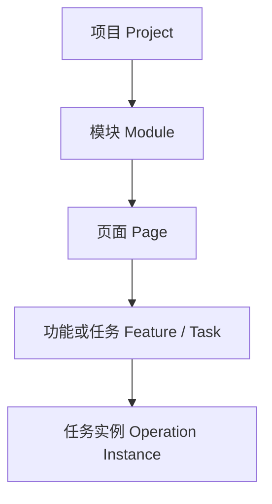
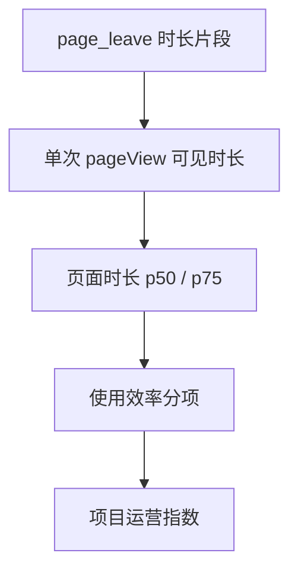

# Frontend Insight 内部 Web 产品运营分析与前端可观测性平台——需求文档 v1.6

> 状态：待产品评审  
> 更新日期：2026-07-29  
> 基于版本：[需求文档 v1.5](requirements-v1.5.md)  
> 决策来源：[智慧园区内部产品运营指标与项目运营指数方案 v0.2](../planning/operational-metrics-health-plan-v0.2.md)  
> 对应开发基线：[MVP 开发计划 v1.3](../planning/mvp-plan-v1.3.md)  
> 当前实现：M0–M5 已完成；本文定义 M6 目标产品基线及 M7–M9 后续边界

## 0. 版本决策摘要

v1.6 在保留 v1.5“功能采用”闭环的基础上，正式将产品定位扩展为：

> 面向复杂内部 Web 产品、支持私有化部署的产品运营分析与前端可观测性平台。

本版基线做出以下决策：

1. 保留“功能采用”作为默认入口，不推翻 M0–M5 已完成能力；
2. 增加项目、模块、页面、功能/任务、任务实例五级分析实体；
3. 按持续监测、信息分析、任务操作三类页面模板解释停留时长和访问深度；
4. 增加页面停留、访问深度、任务达成、操作耗时和持续使用指标；
5. 使用“曝光后使用率”“任务达成率”等内部产品术语，不再以“转化”作为默认表达；
6. 建设代码注册、版本化、可测试、可追踪血缘的指标语义与派生层，但不开放任意公式、任意维度或任意 SQL；
7. 增加必须可下钻的“项目运营指数”，并固定首版构成、默认权重和展示门槛；
8. 使用事件契约 v2 关联一次具体任务的开始和终态，同时继续接受 v1；
9. 将错误和性能监控保留到 M8；届时通过新的指数版本加入，不改写运营指数 v1 历史。
10. 将“AI 分析助手”作为 M9 编外能力：用户显式选择当前页面的结构化数据作为上下文，由私有化或获准的第三方模型解释运营/错误信息；对话、上下文快照和模型调用元数据需要可追溯留存。

v1.5 与开发计划 v1.2 继续保留，作为 M0–M5 的历史基线和范围演进记录。

## 1. 产品定义

### 1.1 业务背景

Frontend Insight 主要服务部署在隔离网络中的内部业务系统。代表性产品“弗物云”属于数字化工厂/智慧园区综合管理平台，典型模块包括：

- 驾驶舱：数字孪生、实时态势和报警监控；
- 能源管理：能耗、碳排、预算、空调和照明控制；
- 设备管理：设备生命周期、电子地图和 IoT 设备；
- IoT 平台：产品、设备和数据记录；
- 报警管理：报警事件、异常事件和规则配置；
- 门禁系统：门禁和人员管理；
- 基础标准：报警级别、设备类型、数据字典和计费规则。

这类产品没有传统电商统一的“浏览—加购—下单”漏斗。产品、运营、Supervisor 和开发更需要回答：

- 哪些项目、模块、页面和关键功能仍在持续使用；
- 新规划的功能是否被用户看到、使用并跨会话复用；
- 驾驶舱和实时监测页面是否按预期持续展示；
- 信息分析页面的停留时长是否符合阅读和分析任务预期；
- 报警确认、设备控制、配置保存等任务能否完成；
- 一次操作是否耗时过长，用户是否为完成任务在过多页面间往返；
- 使用下降是正常低频、业务季节性、入口问题、操作问题还是采集链路异常；
- 生产错误和性能问题是否影响真实使用。

### 1.2 产品定位

Frontend Insight 通过框架无关的 Web SDK 采集页面、功能和任务事实，经内部数据链路处理后，在统一管理端提供可解释的运营指标、项目运营指数及后续前端错误/性能信息。

产品分为两条能力线：

1. **产品运营线**：项目、模块、页面、任务、访问深度、持续使用、任务达成、使用效率和项目运营指数；
2. **前端可观测性线**：JS/资源/API 错误、Web Vitals、版本、影响范围和告警。

两条能力线共享项目、账号/浏览器/会话、时间范围、权限和数据状态，但使用不同事件族、保留策略和解释方式。

M9 增加横跨两条能力线的 **AI 分析助手**。它只消费已经过权限校验、脱敏和版本化的页面读模型，负责解释、归纳和提出调查建议；它不重新计算基础指标、不修改项目运营指数，也不直接执行配置或修复动作。

### 1.3 技术栈边界

当前代表性业务项目使用 Vue 3、Element Plus、ECharts 和 Cesium，但被监测项目不保证使用 Vue。

M6 核心 SDK 必须继续基于浏览器标准能力：

- History API、hash、初始加载和页面卸载；
- `visibilitychange`、`pagehide`；
- `sendBeacon` 和 keepalive fetch；
- 显式的页面、功能和任务 API。

React、Angular、Vue 或微前端适配器可以后续提供，但任何框架插件都不能成为唯一接入方式。

### 1.4 产品原则

| 原则             | 要求                                                   |
| ---------------- | ------------------------------------------------------ |
| 先回答业务问题   | 每个指标和图表必须对应明确的产品决策问题               |
| 事实与判断分离   | 展示使用证据和偏离信号，不自动宣布设计“好/坏”          |
| 指标可解释       | 原始事实、公式、目标、样本、版本和缺失原因均可查看     |
| 模板解释语义     | 停留时长和访问深度必须结合页面类型，不能统一按高低评分 |
| 原始指标优先     | 项目运营指数必须可下钻，不能遮蔽原始数据               |
| 数据状态优先     | 链路异常、样本不足和正常无访问必须使用不同状态         |
| 配置可追溯       | 目标、权重和公式变更产生新版本，不改写历史             |
| 框架无关         | 核心采集不绑定 Vue 或任一前端框架                      |
| 默认保护数据     | 不采集凭证、表单、DOM 文本和原始敏感标识               |
| 复杂度由证据触发 | 通用指标引擎、缓存和额外存储按复用和性能门槛进入       |

### 1.5 能回答与不能回答的问题

系统可以提供：

- 功能低触达、低持续使用、任务失败、放弃或耗时偏离的量化信号；
- 项目运营指数及其构成、目标、样本和时间变化；
- 需要进一步访谈、可用性测试或技术排查的优先级；
- M8 上线后错误、性能与受影响项目/页面/版本的证据。

系统不能仅凭遥测证明：

- 某个页面设计一定合理或不合理；
- 停留越长一定越有价值；
- 页面访问越深一定越健康；
- 访问越多一定代表业务价值越高；
- 某个用户工作是否认真；
- 错误与使用下降之间存在因果关系。

产品结论仍需结合业务目标、发布计划、用户反馈、业务日历和真实工作流程。

## 2. 目标用户、权限与核心任务

### 2.1 用户角色

| 角色            | 核心任务                                           | 产品权限                           |
| --------------- | -------------------------------------------------- | ---------------------------------- |
| 产品/运营查看者 | 判断功能是否被使用、持续使用及是否偏离目标         | `viewer`，只读已授权项目           |
| Supervisor      | 查看项目运营指数、构成、趋势和重点异常信号         | `viewer`，只读已授权项目           |
| 业务开发者      | 接入 SDK、定义任务成功语义、验证事件和排查采集问题 | 由组织授予 `admin` 或 `viewer`     |
| 项目管理员      | 配置模块、页面、任务、模板、目标、权重和业务日历   | `admin`，仅管理已授权项目          |
| 平台管理员      | 管理项目授权、数据质量和系统状态                   | `admin`                            |
| 系统维护者      | 部署、升级和排查采集/存储链路                      | 运维接口和日志，不经 UI 改原始事件 |

M6 继续只使用 `admin` 和 `viewer` 两种产品角色。viewer 不能修改任何影响指标结果的配置。所有配置变更必须写审计日志。

### 2.2 M6 核心用户任务

| 优先级 | 用户任务                       | 成功表现                                           |
| ------ | ------------------------------ | -------------------------------------------------- |
| P0     | 查看某项目近期是否持续使用     | 能查看账号、浏览器、会话、活跃日和趋势             |
| P0     | 判断某模块和核心页面是否被使用 | 能查看模块覆盖、核心页面覆盖和未归类路由           |
| P0     | 判断页面停留是否符合业务场景   | 能按页面模板查看平均、p50、p75 和时长覆盖率        |
| P0     | 判断访问深度是否异常           | 能查看会话页面数、不同页面数、模块广度及模板目标   |
| P0     | 判断用户看到功能后是否实际使用 | 能查看曝光后使用率，并区分账号和浏览器口径         |
| P0     | 判断任务是否完成及是否耗时过长 | 能查看达成、失败、取消、近似放弃和成功耗时         |
| P0     | 判断功能是否持续使用           | 能查看跨会话和跨日持续使用率                       |
| P0     | 配置项目目标                   | admin 可选择模板并配置目标，界面同时展示历史基线   |
| P0     | 查看项目运营指数               | 能看到总分、四维构成、贡献、样本、版本和缺失原因   |
| P0     | 判断总分是否可信               | 能看到数据状态、eligible 分项和权重覆盖率          |
| P0     | 从总分下钻                     | 能下钻到模块、页面、任务和原始指标                 |
| P1     | 查看指标血缘图                 | 能从指标查看依赖 DAG；没有图形时仍可查看依赖元数据 |
| 后续   | 定位生产前端错误和性能问题     | M8 上线后完成，不由 M6 假装回答                    |
| M9     | 选择当前页面数据并请求 AI 分析 | 能预览发送范围、选择模型/模板并获得可追溯回答      |
| M9     | 查看历史 AI 对话               | 能复核当时的数据快照、筛选、模型和模板版本         |

### 2.3 既有用户任务继续成立

v1.5 以下 P0 闭环必须保持：

- 15 分钟内完成项目接入和测试事件验证；
- 判断功能无人使用、未曝光、曝光后未使用或采集异常；
- 查看功能采用和页面访问的时间趋势；
- 区分账号、匿名浏览器和会话；
- 区分正常无访问、首次无数据、延迟、失败和部分数据；
- 在 Apple Silicon Mac 上运行完整 demo 和数据链路。

## 3. 产品成功指标与技术约束

### 3.1 M6 产品成功指标

试点观察期内：

| 指标             |                                                           目标 |
| ---------------- | -------------------------------------------------------------: |
| 页面定义覆盖     |                           约定核心页面 100% 完成注册与模板配置 |
| 关键任务定义覆盖 |                     约定关键任务 100% 明确开始、成功和终态语义 |
| 页面时长可用性   |                       已接入目标页面的时长覆盖率达到其验收门槛 |
| 指数可解释性     |     产品、运营和 Supervisor 均能独立说明总分构成及一个低分原因 |
| 指数可行动性     | 每个低分项能对应“继续观察、检查埋点、访谈、优化或技术排查”之一 |
| 配置可追溯性     |       目标或权重变化后产生新 profile version，历史结果不被改写 |
| 误导性评分       |                  数据门槛不满足时不显示伪造总分，验收中为 0 次 |
| M5 回归          |                                   原有全部 P0 用户任务继续通过 |

项目运营指数用于辅助判断投入和调查优先级，不替代技术 SLO，也不用于个人绩效考核。

### 3.2 延续的容量与性能预算

默认容量假设保持：

- 不超过 20 个项目；
- 日事件量不超过 100 万；
- 平均不超过 20 events/s；
- 峰值不超过 200 events/s。

| 项目                   |                                          目标 |
| ---------------------- | --------------------------------------------: |
| 接收接口可用性         |                                   月度 ≥99.5% |
| 接收接口 p95           |                     ≤100 ms，仅完成校验与入队 |
| 数据可见延迟 p95       |                                       ≤5 分钟 |
| 服务端拒绝/丢弃率      |                           <1%，且可按原因观测 |
| Dashboard 核心查询 p95 |                         ≤2 秒，默认 30 天范围 |
| SDK ESM gzip 包体      | v2 增量后仍以 ≤12 KB 为目标；超出必须单独评审 |
| SDK 单次同步处理 p95   |                                         ≤2 ms |
| SDK 队列/单批          |                         ≤100 条且单批 ≤64 KiB |
| 宿主异常隔离           |                  SDK 异常不得向业务调用栈抛出 |

若 v2 operation API 导致包体超过既有预算，必须先给出 bundle diff、使用收益和拆分方案，不能静默放宽。

## 4. 分析实体与业务层级



### 4.1 项目

一套被监测的内部 Web 产品或部署实例。项目保存时区、状态、数据保留、目标账号、业务日历和默认指标 profile。

### 4.2 模块

稳定的业务域，例如驾驶舱、能源管理、设备管理和报警管理。

- 模块由 admin 显式配置；
- 不从 URL 第一段自动推断；
- 可配置关键度权重和展示顺序；
- 路由变化不能静默改变模块归属。

### 4.3 页面

页面由归一化 route 标识，并配置：

- 页面名称和所属模块；
- 页面模板；
- 是否核心页面；
- 关键度权重；
- 预期使用频率；
- 可选业务目标；
- 生效时间和状态。

未注册 route 继续展示基础访问数据并标记“未归类”，但不进入核心页面覆盖率和项目运营指数。

### 4.4 功能或任务

功能用于判断页面内某项能力是否被使用；任务强调存在开始和终态，例如：

- 导出报表；
- 保存空调或照明策略；
- 下发设备控制；
- 确认报警；
- 新建设备；
- 修改报警规则。

现有 feature 定义继续使用，并增加页面归属、关键任务、任务权重、超时窗口和 operation lifecycle 配置。

### 4.5 任务实例

任务实例表示一次具体操作，只能使用 SDK 随机生成的不透明 ID。

```text
started → succeeded / failed / canceled
```

不得使用设备 ID、报警编号、订单号、人员 ID 或其他业务标识作为任务实例 ID。

## 5. M6 产品范围

### 5.1 保留的 M0–M5 能力

- 项目、Origin、成员和功能定义管理；
- 框架无关的页面/SPA 生命周期采集；
- 账号 HMAC、浏览器、会话和页面访问标识；
- 功能曝光、开始、成功、失败和 long-view 事件；
- Kafka、ClickHouse、MySQL 数据链路；
- 功能采用默认首页、功能详情和页面访问；
- 接入验证、数据状态、权限、审计和 Mac 全流程 demo。

### 5.2 M6 P0

#### 5.2.1 模块、页面和任务配置

- module/page definition CRUD；
- 从已观测的未归类 route 创建页面定义；
- 页面模板、核心页面和关键度配置；
- feature 的页面归属和关键任务配置；
- 目标账号、预期活跃日、业务日历和指标 profile；
- 所有修改按项目授权并写审计。

#### 5.2.2 页面运营分析

- 页面和模块访问量、账号、浏览器、会话；
- 页面平均、p50、p75 可见时长和时长覆盖率；
- 会话页面数、不同页面数和模块广度；
- 页面模板目标对比；
- 核心页面使用覆盖；
- 原始趋势和未归类 route 提示。

#### 5.2.3 任务实例与使用效率

- event contract v2；
- operation instance 开始、成功、失败和取消；
- 同一功能并发实例不串联；
- 任务达成率、失败率、取消率和近似放弃率；
- 成功任务耗时 p50/p75；
- 任务完成前页面深度；
- v2 指标可用起始时间。

#### 5.2.4 指标语义与派生层

- 代码注册的原子、派生和复合指标；
- 指标定义、单位、公式、分母、去重键和缺失语义；
- score direction、minimum sample 和 definition version；
- 依赖 DAG 校验和 lineage JSON；
- 固定查询和 golden fixtures。

#### 5.2.5 项目运营指数

- 四个一级维度和默认权重；
- admin 模板、目标和权重配置；
- 历史基线作为配置参考，不自动改写业务目标；
- eligible、minimum sample、数据状态和权重覆盖门槛；
- 总分、雷达图、加权贡献、等价明细表和下钻；
- profile/definition version 和缺失原因。

#### 5.2.6 前端产品闭环

- 保持“功能采用”为默认首页；
- 新增运营概览、页面详情和项目运营指数；
- 原始指标优先可见；
- 公式、目标、样本、数据状态和版本无需查外部文档即可理解；
- loading、empty、stale、error、forbidden、partial 和 unavailable 状态完整。

### 5.3 M6 P1

- 只读指标血缘 DAG 抽屉；
- 从指标趋势跳转到定义/血缘；
- 展示上游事实、输入指标和下游使用者。

P1 图形化血缘不阻断 M6；P0 必须保存正确依赖元数据并提供 lineage JSON。

### 5.4 明确不在 M6

- 用户任意选择事件、属性、维度、窗口和公式；
- 任意 SQL、任意 group by 和自助 BI；
- 动态回算调度平台；
- 指标级复杂权限；
- JS、资源和 API 错误；
- Web Vitals、SourceMap 和错误告警；
- 右侧 AI 分析助手、多模型接入和 AI 对话历史；
- 用户行为录屏、DOM 文本和行为回放；
- 个人级运营评分或员工监视；
- 小程序 SDK 和外部多租户 SaaS。

完整通用指标引擎需要事件/属性类型系统、DSL、基数保护、成本估算、异步执行、回算、版本治理、权限、循环依赖处理和编辑器。当前预计额外增加 25–40 个开发日，且缺少足够的跨项目复用需求，因此不进入 M6。

## 6. 页面与任务模板

### 6.1 持续监测型 `monitoring_dashboard`

典型场景：驾驶舱、数字孪生、实时态势、报警监控、能耗实时看板。

主要指标：

- 有效展示实例；
- 前台可见时长 p50/p75；
- 达到持续展示阈值的实例率；
- 活跃账号/浏览器；
- 活跃日覆盖；
- 数据就绪成功率。

时长方向使用 `target_range` 或有上限的 `higher_better`。单页面访问深度低不能因此扣分。

### 6.2 信息分析型 `analysis_view`

典型场景：能耗、碳排、预算、IoT 数据记录、设备生命周期和电子地图。

主要指标：

- PV、账号、浏览器和会话；
- 可见时长 p50/p75 和覆盖率；
- 数据就绪成功率；
- 曝光后使用率；
- 跨会话/跨日持续使用率；
- 会话页面深度和模块广度。

时长通常使用 `target_range`：过短可能没有完成阅读，过长可能代表理解或操作困难，但系统不得直接作因果结论。

### 6.3 任务操作型 `task_operation`

典型场景：空调/照明控制、设备联动、报警确认、规则配置、门禁管理、导入导出和配置保存。

主要指标：

- 任务启动实例；
- 任务达成率；
- 失败率、取消率和近似放弃率；
- 成功任务耗时 p50/p75；
- 跨会话/跨日持续使用率；
- 关键任务前页面深度。

操作耗时通常使用 `lower_better` 或 `target_range`，不能与大屏时长共用方向。

## 7. 指标定义与业务解释

### 7.1 统一计算前提

所有指标：

- 按 `eventId` 去重；
- 使用项目时区；
- 使用归一化 route；
- 分开账号、浏览器和会话口径；
- delayed/broken 时不把缺失数据当 0；
- 样本不足时返回 null 和具体原因；
- 定义变化产生新 definition version。

### 7.2 页面访问与停留

| 指标             | 计算公式                                                         | 业务解释                               | 评分方向       |
| ---------------- | ---------------------------------------------------------------- | -------------------------------------- | -------------- |
| PV               | `count(page_view)`                                               | 页面被打开的次数；刷新和重复访问均计数 | 通常不直接评分 |
| 活跃账号         | `uniq(account_id)`                                               | 已识别账号数；共享账号仍只算一个       | 目标驱动       |
| 活跃浏览器       | `uniq(visitor_id)`                                               | 浏览器存储实例数，不是真实人数         | 辅助/目标驱动  |
| 会话             | `uniq(session_id)`                                               | 标签页内、30 分钟无活动切分的会话      | 辅助           |
| 单次页面可见时长 | 同一 `pageViewId` 的有效 `page_leave.visibleDurationMs` 片段之和 | 一次访问在前台实际可见的总时长         | 模板决定       |
| 平均可见时长     | `avg(有效 pageView 时长)`                                        | 便于总体比较，但受极端值影响           | 模板决定       |
| 可见时长 p50/p75 | `quantile(有效 pageView 时长)`                                   | 典型体验与较长尾部体验                 | 模板决定       |
| 时长覆盖率       | `有有效时长的 pageView / 全部 pageView`                          | 判断时长样本是否有代表性               | 可信度 gate    |

缺失 `page_leave` 的 page view 不以 0 参与时长统计。页面必须同时展示 p50 和覆盖率，平均值只作为补充。

### 7.3 访问深度

访问深度不使用 URL 段数，也不把 DOM 点击数称为深度。

| 指标               | 计算公式                                               | 业务解释                   | 评分方向                      |
| ------------------ | ------------------------------------------------------ | -------------------------- | ----------------------------- |
| 会话页面数         | 每个 session 的 `count(page_view)`，展示 p50/p75       | 一次会话打开页面的次数     | 描述/`target_range`           |
| 会话不同页面数     | 每个 session 的 `uniq(normalized route)`，展示 p50/p75 | 一次会话覆盖的页面种类     | 描述/`target_range`           |
| 会话模块广度       | 每个 session 的 `uniq(moduleKey)`，展示 p50/p75        | 一次工作过程跨越的业务模块 | 描述/`target_range`           |
| 关键任务前页面深度 | started 前同一任务窗口内的不同页面数                   | 完成任务前是否需要过多跳转 | `lower_better`/`target_range` |

驾驶舱只访问一个页面可能完全符合预期；配置任务跨越很多页面可能代表信息架构复杂。深度不能作为全局正向指标。

### 7.4 功能使用和任务达成

| 指标                   | 计算公式                                                     | 业务解释                               |
| ---------------------- | ------------------------------------------------------------ | -------------------------------------- |
| 曝光后使用率（账号）   | 同一窗口内既曝光又成功使用的去重账号 ÷ 曝光去重账号          | 看到入口的账号中有多少实际使用成功     |
| 曝光后使用率（浏览器） | 同一窗口内既曝光又成功使用的去重 visitor ÷ 曝光去重 visitor  | 无账号标识时的浏览器口径               |
| 任务启动率             | started instances ÷ 可稳定配对的 exposed opportunities       | 看到入口后是否开始；分母不稳定时不展示 |
| 任务达成率             | succeeded operation instances ÷ started operation instances  | 已开始任务中有多少成功完成             |
| 任务失败率             | failed operation instances ÷ started operation instances     | 明确失败的任务占比                     |
| 任务取消率             | canceled operation instances ÷ started operation instances   | 用户明确取消，不与系统失败混合         |
| 近似放弃率             | 超过观察窗口仍无终态的 started instances ÷ started instances | 可能包含离开、断网或漏报，必须标注近似 |
| 成功任务耗时 p50/p75   | `terminalTime - startedTime`，仅成功实例                     | 典型完成时间和长尾                     |
| 跨会话持续使用率       | 至少两个 session 成功使用的账号 ÷ 成功账号                   | 区分一次尝试和持续使用                 |
| 跨日持续使用率         | 至少两个项目本地日期成功使用的账号 ÷ 成功账号                | 反映跨日持续采用                       |

既有 API 的 `accountConversionRate`/`visitorConversionRate` 在兼容期保留。新 API 使用 `postExposureUseRate` 等明确字段，旧字段标记弃用；UI 使用新的中文术语。

### 7.5 持续使用与核心覆盖

项目原始概览中的“活跃”可以包含所有通过校验的生产事件；进入项目运营指数的“有效使用”只包含已注册、已启用实体上的生产 `page_view`、功能成功、operation 成功或达到阈值的 long-view，不包含 onboarding 测试事件、demo 标记事件、被拒绝事件和未归类 route。界面必须并列提示未归类活动，避免把配置缺口误判为无人使用。

| 指标               | 计算公式                                          | 业务解释                     |
| ------------------ | ------------------------------------------------- | ---------------------------- |
| 活跃日覆盖率       | 预期活跃日中存在有效使用的日期 ÷ 配置的预期活跃日 | 是否在应使用日期持续使用     |
| 核心页面使用覆盖率 | `Σ已使用核心页面权重 / Σ已启用核心页面权重`       | 关键页面是否真实被触达       |
| 核心任务使用覆盖率 | `Σ有成功实例的关键任务权重 / Σ关键任务权重`       | 已交付关键任务是否有人完成   |
| 最近活动间隔       | `now - last valid activity`                       | 项目或模块多久没有真实使用   |
| 活跃账号目标达成   | `active accounts / configured target accounts`    | 实际活跃账号是否达到业务预期 |

目标账号缺失时返回 `unavailable`，不得使用浏览器数替代。历史基线只作为 admin 配置业务目标时的参考。

## 8. 指标语义、派生和血缘

### 8.1 分层模型

| 层级        | 内容                   | 示例                                       |
| ----------- | ---------------------- | ------------------------------------------ |
| L0 事实事件 | 去重后的不可变事实     | page_view、page_leave、operation lifecycle |
| L1 原子指标 | 单一事实直接聚合       | PV、账号数、成功实例数                     |
| L2 派生指标 | 多个原子指标组合       | 时长覆盖率、任务达成率、访问深度           |
| L3 复合指标 | 归一化和加权           | 页面分项、模块分项、项目运营指数           |
| L4 展示读模 | 页面、表格、趋势和下钻 | 运营概览、项目运营指数                     |

首期为逻辑语义层：公式在代码中注册，事实由 ClickHouse 固定查询计算，目标/权重/版本保存在 MySQL。只有达到查询性能门槛后才物化小时/天聚合。

### 8.2 指标目录元数据

每个指标至少声明：

- `metricKey`、中文名称和业务问题；
- entity type、数据类型、单位和时间窗口；
- 输入事实/指标、公式、分母和去重键；
- 缺失值语义；
- `higher_better`、`lower_better` 或 `target_range`；
- minimum sample；
- definition version、生效时间和 owner；
- 上游依赖列表。

这些元数据同时服务计算、说明、测试和血缘，前后端不得维护互相漂移的公式文案。

### 8.3 血缘展示

指标依赖使用有向无环图；时间变化使用折线图，两者不混用。



M6 P0 提供定义和 lineage JSON。P1 抽屉展示公式、版本、输入、数据源、下游使用者、生效日期、样本和缺失规则。

## 9. 项目运营指数 v1

### 9.1 产品要求

项目运营指数是给 Supervisor 和产品负责人使用的项目摘要，不替代原始指标。

页面必须同时展示：

- 总分和 profile/definition version；
- 四个一级维度；
- 每项原始值、目标、分数和加权贡献；
- eligible 状态、样本和权重覆盖率；
- 无法计算的原因；
- 模块、页面和任务下钻。

### 9.2 默认构成

| 一级维度           | 默认权重 | 业务问题                                   |
| ------------------ | -------: | ------------------------------------------ |
| 使用覆盖           |      30% | 应被使用的账号、日期和核心页面是否真实使用 |
| 持续使用与访问深度 |      25% | 是否持续使用，访问范围是否符合业务模板     |
| 任务达成           |      30% | 关键任务是否完成，失败/取消/放弃是否可控   |
| 使用效率           |      15% | 页面停留和任务耗时是否处于目标范围         |

admin 可以在模板允许范围内调整权重；任何调整产生新的 profile version。

### 9.3 一级维度子项

#### 使用覆盖

- 活跃账号目标达成：40%；
- 核心页面使用覆盖率：35%；
- 活跃日覆盖率：25%。

#### 持续使用与访问深度

- 跨日持续使用率：40%；
- 会话不同页面数目标符合度：30%；
- 会话模块广度目标符合度：30%。

#### 任务达成

- 关键任务加权达成率：70%；
- 失败、取消和近似放弃的反向分：30%。

#### 使用效率

- 关键任务耗时目标符合度：60%；
- 页面可见时长目标符合度：40%。

关键页面和任务按显式关键度加权，不按流量自动推断。大屏项目不会因为页面深度低而扣分。

### 9.4 归一化

每个可评分指标声明方向：

```text
higher_better:
score = clamp(100 × (value - floor) / (target - floor), 0, 100)

lower_better:
score = clamp(100 × (ceiling - value) / (ceiling - target), 0, 100)
```

`target_range` 在目标区间内为满分，超出上下界后按配置的容忍区间递减。目标、floor、ceiling 和容忍区间必须随 profile version 保存。

### 9.5 聚合和展示门槛

```text
dimensionScore =
  Σ(eligible metricWeight × metricScore)
  / Σ(eligible metricWeight)

projectOperationalIndex =
  Σ(eligible dimensionWeight × dimensionScore)
  / Σ(eligible dimensionWeight)

weightCoverage =
  Σ(eligible leaf configured weight)
  / Σ(all leaf configured weight)
```

其中叶子配置权重为“一级维度权重 × 维度内子项权重”，用于让缺失的子项真实反映在覆盖率中。

总分仅在以下条件同时成立时展示：

- 至少 3 个 eligible 一级维度；
- eligible 叶子分项权重覆盖率 ≥70%；
- 数据状态不是 `delayed`、`broken` 或 `no_data`；
- 每个参与指标满足 minimum sample。

不满足门槛时：

- 总分返回 null；
- 已有原始指标和分项继续展示；
- 明确列出 `insufficient_sample`、`missing_target`、`metric_not_available`、`data_delayed` 等原因；
- 缺失值不按 0 计分，也不隐藏权重缺口。

数据质量只决定是否可评分，不给业务表现加分。项目指数不是页面分数的算术平均，也不是把不同单位原始值直接放入 radar chart。

### 9.6 生命周期信号

单个时间窗口的分数不能判断产品处于导入、成长、稳定或衰退阶段。

在同一 profile version 下积累至少 8 周稳定数据后，可以展示：

- 活跃账号、活跃日和核心页面覆盖的 4/8 周趋势；
- 跨日持续使用率趋势；
- 同版本项目运营指数趋势；
- 发布、节假日、月末和业务淡旺季注释；
- “使用上升”“相对稳定”“使用下降”“证据不足”等描述性状态。

系统不得仅凭遥测自动宣布“进入衰退期”。

## 10. 事件契约与 SDK 产品要求

### 10.1 现有数据能力

v1 已能计算：

- PV、账号、浏览器和会话；
- 页面可见时长和覆盖率；
- 会话页面数和不同页面数；
- 功能曝光、开始、成功和失败次数；
- 跨会话持续使用；
- long-view 前台可见时长。

v1 不能可靠计算：

- 单次操作从开始到终态的耗时；
- 同类并发操作的 started/terminal 配对；
- 明确取消率和近似放弃率；
- 任务完成前的精确导航窗口。

原因是缺少任务实例关联，不是查询公式不足。

### 10.2 事件契约 v2

v2 增加：

- `operationInstanceId`：SDK 随机生成的匿名实例 ID；
- `feature_canceled` 终态；
- data view 的 started → succeeded/failed；
- terminal event 只能与同一 operation instance 配对；
- 可选固定枚举 `interactionType`，不接受业务 ID。

服务端迁移期同时接受 v1/v2。ClickHouse 只增加 nullable 字段，不回写历史事件。

历史数据仍可显示页面和功能采用指标；任务耗时、取消和放弃只能从 v2 接入日开始。UI 必须显示“指标可用起始时间”，不得跨升级日前后直接比较。

### 10.3 SDK API 语义

- `featureExposed`：入口真实呈现；
- `featureStarted`：任务开始，不代表成功；
- `featureSucceeded`：业务定义的成功终态；
- `featureFailed`：明确失败终态；
- `featureCanceled`：用户明确取消；
- operation handle 或显式 instance ID 必须防止同类并发任务串联；
- terminal 只能完成一次；重复终态进入诊断计数；
- SDK 初始化或 operation API 异常不得影响宿主业务。

## 11. 用户体验与信息结构

### 11.1 导航

1. 功能采用（默认入口）；
2. 运营概览；
3. 页面访问；
4. 项目运营指数；
5. 项目与接入；
6. 后续错误与性能。

### 11.2 运营概览

- 项目访问和持续使用趋势；
- 模块使用覆盖；
- 核心页面和关键任务状态；
- 活跃日；
- 页面深度和任务达成摘要；
- 未归类 route 和配置缺口。

### 11.3 页面详情

- 页面模板和所属模块；
- PV、账号、浏览器和会话；
- 平均、p50、p75 时长和覆盖率；
- 访问深度和模块广度；
- 页面内关键任务；
- 原始趋势；
- 目标、分项解释和可用起始时间。

### 11.4 项目运营指数

- 总分、版本和时间范围；
- 四维 radar chart；
- 四维加权贡献；
- 与 radar 等价的无障碍表格；
- 原始指标、目标、样本、得分和贡献；
- 数据状态和 weight coverage；
- 模块、页面、任务下钻；
- 指标定义和血缘入口。

radar chart 只展示归一化后的 0–100 一级维度。不同单位的原始值不能直接放入雷达图。

### 11.5 术语

| 旧术语     | v1.6 UI 术语                      |
| ---------- | --------------------------------- |
| 转化率     | 曝光后使用率                      |
| 功能转化   | 功能使用达成                      |
| 漏斗       | 使用阶段/任务阶段                 |
| 健康度总分 | 项目运营指数                      |
| 用户数     | 已识别账号/活跃浏览器，按实际口径 |

兼容 API 字段不等于继续在 UI 使用旧术语。

### 11.6 页面状态

| 状态         | 展示要求                                 |
| ------------ | ---------------------------------------- |
| 首次无数据   | 接入步骤和测试事件，不显示全零指标       |
| 正常但无访问 | 说明所选范围无有效访问，同时显示链路正常 |
| 未归类       | 展示基础指标和配置入口，不进入评分       |
| 指标不可用   | 显示缺少 v2、目标、样本或配置的具体原因  |
| 指数不可用   | 保留分项和原始数据，显示门槛与权重缺口   |
| 数据延迟     | 保留最近可用数据并显示影响范围           |
| 部分数据     | 标注缺失时间段，折线不跨缺口连接         |
| 请求失败     | 保留筛选和旧数据，提供重试及 request ID  |
| 无权限       | 说明缺少项目权限和联系管理员方式         |
| 加载中       | 使用骨架和旧数据标记，避免误显示为 0     |

## 12. 配置、权限与版本

### 12.1 admin 配置

- 模块和页面定义；
- 页面模板和关键度；
- 关键任务、任务权重和超时窗口；
- 目标账号和业务日历；
- 指标 profile、目标、容忍区间和权重；
- profile assignment 和生效时间。

### 12.2 viewer

- 查看原始指标、目标、指数、版本和血缘；
- 使用筛选和下钻；
- 不得修改任何配置。

### 12.3 版本规则

- 指标公式变化产生新的 definition version；
- 目标、权重或 assignment 变化产生新的 profile version；
- 版本包含生效时间；
- 趋势默认只比较同一版本；
- 历史基线仅供参考，不自动改变业务目标；
- M8 错误/性能加入时发布项目运营指数 v2，保留 v1。

## 13. 数据与隐私边界

### 13.1 默认采集

- 归一化 route 和可关闭的页面标题；
- 事件时间、项目时区偏移、SDK/schema 版本；
- 匿名 visitor、session、page view 和 operation instance ID；
- 业务显式提供的不透明账号引用，经服务端项目级 HMAC 后保存；
- 标准页面、功能、任务和 long-view 事件；
- 浏览器大类、操作系统大类和视口档位；
- 经 schema 允许的受限自定义属性。

### 13.2 禁止采集

- URL query、hash 和完整 referrer query；
- Authorization、Bearer token、cookie 和 Local/Session Storage 内容；
- 表单、DOM 文本、剪贴板、键盘记录和截图；
- 姓名、手机号、邮箱、身份证号；
- 设备 ID、报警编号、人员 ID 等业务标识作为 operation ID；
- 请求/响应正文；
- 未经白名单允许的任意对象。

### 13.3 约束

- 自定义属性最多 20 个键，键长 ≤64，字符串值长 ≤256；
- 禁止嵌套对象进入当前契约；
- 单事件 ≤8 KiB，单批 ≤64 KiB；
- `beforeSend` 只能删除或归一化，不能绕过服务端 schema；
- 日志、死信、错误响应和审计不得记录事件 payload 或原始账号引用。

### 13.4 保留策略

| 数据                                  |                 默认保留 |
| ------------------------------------- | -----------------------: |
| 原始事件                              |                    90 天 |
| 已物化小时/天聚合（若达到门槛后启用） |                  13 个月 |
| 接收与消费运行日志                    |                    30 天 |
| 审计日志                              |                   180 天 |
| 死信事件                              |                     7 天 |
| 指标定义和 profile 版本               | 项目存续期内保留，不改写 |

## 14. 产品 API 范围

### 14.1 既有接口继续兼容

- 项目、功能、Origin、成员和 onboarding；
- overview、trend、pages、features 和 feature detail；
- data status、live 和 ready。

### 14.2 M6 只读接口

- `GET /api/projects/:id/analytics/operational-overview`
- `GET /api/projects/:id/analytics/modules`
- `GET /api/projects/:id/analytics/page-detail?route=...`
- `GET /api/projects/:id/analytics/tasks/:featureId`
- `GET /api/projects/:id/operational-index`
- `GET /api/projects/:id/metrics/:metricKey/definition`
- `GET /api/projects/:id/metrics/:metricKey/lineage`

### 14.3 M6 管理接口

- module/page definition CRUD；
- feature/task metadata 扩展；
- metric profile CRUD；
- profile assignment、目标和权重；
- business calendar/expected active days；
- configured target accounts。

### 14.4 M9 AI 分析接口

- `GET /api/projects/:id/ai/page-context`
- `POST /api/projects/:id/ai/context-snapshots`
- `GET/POST /api/projects/:id/ai/conversations`
- `GET/POST /api/projects/:id/ai/conversations/:conversationId/messages`
- `GET /api/projects/:id/ai/runs/:runId`
- model profile、prompt template 和数据策略管理接口。

所有接口继续执行项目级授权、固定字段白名单、时间范围限制和审计。前端不得提交公式并让服务端直接执行。

## 15. 验收标准

### 15.1 产品闭环

- [ ] “功能采用”仍是默认首页，M5 用户任务全部回归通过；
- [ ] admin 可注册模块、页面和关键任务并选择三类模板；
- [ ] 未归类 route 仍可查看基础数据，但不进入项目指数；
- [ ] 运营概览能回答项目、模块、页面和关键任务是否持续使用；
- [ ] 页面详情显示 PV、账号、浏览器、会话、平均/p50/p75 时长和 coverage；
- [ ] 访问深度按模板解释，大屏单页面不会因深度低被扣分；
- [ ] 新术语在 UI 生效，兼容字段不泄漏为默认产品语言；
- [ ] admin 可配置目标和权重并查看历史基线；
- [ ] viewer 只读且无法绕过服务端权限。

### 15.2 任务实例

- [ ] 同一 feature 并发两个 operation 不串联；
- [ ] succeeded/failed/canceled 只能结束一次；
- [ ] 无终态只在观察窗口后计入近似放弃；
- [ ] operation ID 不含业务标识；
- [ ] v1 事件继续接收；
- [ ] v2 指标只从可用起始时间展示；
- [ ] 历史任务耗时不伪造回填。

### 15.3 指标正确性

- [ ] 每个指标可查看公式、业务解释、版本、样本和缺失语义；
- [ ] 同一 `pageViewId` 多个可见时长片段正确求和；
- [ ] 缺失 leave 不按 0 参与时长，coverage 相应下降；
- [ ] 账号、浏览器和会话口径不会互相替代；
- [ ] 目标账号缺失时不使用浏览器数代替；
- [ ] 指标依赖无循环；
- [ ] 固定 fixtures 的原子、派生和复合指标与手算一致。

### 15.4 项目运营指数

- [ ] 默认权重为 30/25/30/15，子项权重与本文一致；
- [ ] 关键页面和任务的显式权重生效；
- [ ] 至少 3 个 eligible 一级维度且叶子权重覆盖 ≥70% 才显示总分；
- [ ] delayed/broken/no_data 时总分为 null；
- [ ] minimum sample 不足、目标缺失和指标不可用均有具体原因；
- [ ] 缺失值不按 0 计分；
- [ ] profile/definition version 改变后历史结果不混算；
- [ ] radar chart 与等价表格、加权贡献和原始数据一致；
- [ ] 总分可以下钻到原始事实，不能只显示一个数字。

### 15.5 降级和状态

- [ ] 无 module/page 定义的项目仍可使用 M5 页面；
- [ ] 无 profile 时显示原始运营指标，不显示项目指数；
- [ ] 无 v2 数据时隐藏任务耗时并解释原因；
- [ ] 查询超时或指数服务关闭时保留原始指标；
- [ ] 正常无访问、链路延迟、首次无数据和指标不可用不会混淆；
- [ ] 部分数据的趋势线不跨越缺口。

### 15.6 安全、性能和无障碍

- [ ] operation instance、payload、日志和死信中无业务敏感标识或 token；
- [ ] SDK 包体和同步耗时满足预算，或完成单独评审；
- [ ] 默认 30 天核心查询 p95 ≤2 秒；
- [ ] 项目级授权和审计通过；
- [ ] 颜色不是唯一状态表达；
- [ ] radar chart 提供等价表格和键盘可访问下钻。

## 16. 迁移、降级与回滚原则

- 只增加向前 migration，不修改既有 `001–003`；
- ingestion 和 consumer 同时接受 v1/v2；
- 新 SDK 按项目逐步启用 operation lifecycle；
- 新表和 nullable 字段在应用回滚时保留，不执行破坏性 down migration；
- 没有配置或 v2 数据的项目继续使用 M5；
- profile 按版本和生效时间保存；
- 查询性能不足时可以关闭项目指数，不能隐藏原始指标；
- 不使用缓存掩盖错误公式或高扫描查询；
- 任何版本回滚均不得改写既有原始事件和历史分数。

## 17. M9 编外能力：AI 分析助手

### 17.1 定位与进入条件

AI 分析助手安排在 M8 之后，原因是：

- M6 先固定运营指标、目标、版本和项目运营指数；
- M7 先完成生产部署、安全和恢复能力；
- M8 先形成稳定的错误组、性能指标、版本和影响范围；
- AI 只能解释已经稳定、可追溯的数据，不能替代底层统计。

AI 分析助手是一个 **只读解释层**：

- 可以总结事实、比较变化、提出假设和调查建议；
- 不重新计算 PV、时长、任务达成或项目运营指数；
- 不直接查询任意数据库表；
- 不自动修改目标、权重、项目配置或业务代码；
- 不自动执行告警关闭、错误忽略或修复操作；
- 模型回答不是事实来源，必须能回到平台原始指标或错误组验证。

### 17.2 全局交互

管理端右侧提供全局 AI 图标。点击后打开抽屉：

1. 显示当前项目、页面、时间范围和筛选条件；
2. 列出当前页面已经注册的上下文块；
3. 用户显式勾选需要发送的部分；
4. 展示发送预览、敏感等级、预计 token 和目标模型的数据边界；
5. 用户选择内置模板或自由提问；
6. 用户从管理员允许的模型 profile 中选择模型；
7. 流式展示回答，并将结论关联回指标、图表或错误组；
8. 保存对话、上下文快照、模板版本和模型调用记录。

AI 图标可以在所有页面显示，但没有注册上下文的页面必须明确提示“当前页面无可附加数据”，不能静默抓取 DOM。用户仍可进行不带页面数据的普通对话，是否开放由管理员配置。

当前页面筛选发生变化时，既有会话继续绑定创建时快照，并显示“上下文已冻结”；用户可以主动创建新快照，不能静默替换历史上下文。

### 17.3 页面上下文块

页面不得把整个 DOM、前端 store 或任意 API 响应直接交给模型。每个业务页面只注册经过设计的 `AIContextBlock`，至少描述：

- `blockKey` 和标题；
- project/module/page/task/error 等 entity scope；
- 数据类型、单位和业务说明；
- 当前时间范围、筛选和时区；
- metric definition/profile version；
- data status、样本和 availableFrom；
- sensitivity class；
- 预计 token；
- 支持的序列化格式；
- 来源查询或 read-model 标识。

前端提交的是 block 选择和当前筛选，不是可信数据本身。服务端必须重新执行：

1. 当前用户和项目权限校验；
2. block 白名单及页面适用性校验；
3. 服务端读模型获取；
4. 敏感字段删除、截断和高基数限制；
5. token 预算；
6. 生成不可变、可复核的 context snapshot。

首版优先使用紧凑 JSON/Markdown。只有模型 profile 声明支持文件、数据策略允许且用户预览确认后，才可以把平台生成的 CSV/附件交给模型。首版不接收任意用户上传文件。

数据量超过预算时，由平台先确定性地计算趋势、Top N、最大变化、异常点和数据质量摘要；不能依赖模型从大量原始事件中重新算指标。

### 17.4 内置提示词模板

#### 运营数据

- 解释项目运营指数和加权贡献；
- 比较两个时间范围，列出显著变化；
- 分析低曝光、曝光后低使用、低任务达成和低持续使用；
- 分析页面停留、访问深度或任务耗时是否偏离模板目标；
- 列出数据限制、待验证假设和建议调查步骤；
- 形成适合产品、运营或 Supervisor 阅读的摘要。

#### 错误与性能

- 汇总错误组的页面、版本、浏览器和影响范围；
- 根据脱敏堆栈和发生时间提出根因候选；
- 生成复现与排查清单；
- 建议修复优先级和回归范围；
- 分析错误/性能变化与使用变化是否相关，同时明确“相关不代表因果”。

模板必须版本化，并要求回答区分：

1. 已知事实；
2. 数据限制；
3. 合理推测；
4. 建议验证；
5. 建议行动。

每次请求按固定顺序组成：

```text
平台安全与回答规则
+ 已选提示词模板及版本
+ 指标/错误定义、数据状态和时间范围
+ 用户确认的 context snapshot（内联或获准附件）
+ 当前用户问题
+ token 预算内允许回放的历史消息
```

context snapshot 和历史消息始终属于数据区，不能覆盖平台安全规则。

模型回答应引用 `contextBlockKey`、指标 key、错误组、时间范围或其他平台证据。没有证据时必须明确说明，不得编造指标。

### 17.5 多模型兼容与配置

产品采用：

> 统一内部请求/响应模型 + OpenAI-compatible 基础适配器 + provider capability matrix + 必要的专用适配器。

DeepSeek、GLM、私有化 vLLM 或其他服务可以复用共同协议，但不能假设所有模型支持完全相同的参数、reasoning、文件、结构化输出或多轮消息语义。

每个 model profile 至少配置：

| 类别 | 配置                                                                                                               |
| ---- | ------------------------------------------------------------------------------------------------------------------ |
| 连接 | protocol、base URL、API path、model ID、secret reference、认证方式、代理和 TLS/CA                                  |
| 生成 | temperature、top-p、max output tokens、thinking/reasoning、stop、timeout 和 retry                                  |
| 能力 | streaming、system message、JSON/schema、tool calling、文件、视觉、reasoning、reasoning replay、context/output 上限 |
| 治理 | internal/external、允许项目/数据类型、数据驻留、provider 留存/训练政策、并发和 token/请求配额                      |
| 降级 | 是否允许 fallback、备用 profile、失败提示和重试边界                                                                |

规则：

- model ID 和 vendor 参数只能配置，不能写死在业务代码；
- API key 只保存在 Secret/环境中，数据库保存 `secretRef`；
- 所有模型请求由服务端 AI Gateway 发出，浏览器不能获得密钥；
- external profile 必须记录并通过组织对 provider 数据留存、训练使用和删除能力的评审；
- 未通过 capability 检查的功能不显示或拒绝执行；
- 不在 internal/external 数据边界之间自动 fallback；
- fallback profile 必须具有相同或更严格的数据策略；
- 历史记录显示实际使用的 provider、model profile 和关键生成参数。
- 平台不保存或回放隐藏 reasoning；若某模型的持久多轮思考要求回传 reasoning content，该 profile 必须改用非思考模式、无状态调用或标记为不支持持久多轮。

首版即使记录 tool-calling capability，也不允许模型执行工具或平台写操作。

### 17.6 对话和上下文历史

历史记录至少包含：

- conversation：项目、创建者、标题、私有/共享状态和保留策略；
- message：用户消息和模型最终回答；
- context snapshot：实际发送的数据、筛选、版本、数据状态、hash 和生成时间；
- AI run：provider、model profile、模板版本、关键参数、耗时、token、状态和 request ID；
- audit：创建、查看、分享、删除和模型配置变更。

留存原则：

- 用户消息、最终回答和脱敏 context snapshot 默认保留 180 天，可由管理员缩短；
- 对话默认仅创建者可见，显式分享后才允许同项目成员查看；
- 每次读取历史都重新检查当前项目权限；
- 用户项目权限被撤销后，不能继续访问该项目历史对话；
- 删除内容后可以按审计策略保留最小元数据，但不保留明文 prompt、回答或上下文；
- 本地删除不能被描述为已经删除第三方 provider 副本；是否存在外部留存及删除能力必须按 profile 政策向用户说明；
- 不保存模型隐藏推理或 chain-of-thought；
- 不默认保存 provider 原始响应；
- 历史上下文是不可变快照，不能用当前数据覆盖。
- 留存 180 天不等于每轮都发送 180 天内容；每个 run 只回放 token 预算允许的当前会话消息，并记录实际发送的 message ID。

如果未来需要跨对话搜索，再单独评估全文检索或向量检索；首版不因历史留存引入向量数据库或 RAG。

### 17.7 数据安全与模型边界

- 聚合运营数据可以按管理员策略发送给内部模型；
- 第三方模型只能接收明确批准的数据等级和上下文块；
- 错误堆栈、URL、接口错误信息必须先清除 token、query、账号、设备、报警和人员标识；
- 原始事件、原始账号引用、请求/响应正文不能直接成为上下文；
- 页面数据和错误文本都按不可信内容处理，使用明确边界与系统提示，不能让其中的文字覆盖平台指令；
- 服务端在发送前再次执行项目授权，不能信任浏览器的选中结果；
- 用户发送前能看到具体数据范围和目标模型属于内部还是第三方；
- 所有模型调用都有审计、限流、超时、并发和 token 预算；
- 模型输出按不可信内容渲染，不能直接作为 HTML、SQL 或可执行代码运行；
- 首版不提供模型自动操作能力，避免 prompt injection 获得额外权限。

### 17.8 M9 范围

#### P0

- 全局 AI 入口和抽屉；
- 当前页面 context block 注册、选择和预览；
- 服务端权限、脱敏、token 预算和快照；
- 至少一种 OpenAI-compatible 私有模型接入；
- DeepSeek、GLM 或等价第三方 profile 配置能力；
- capability matrix 和 provider conformance test；
- 运营模板和错误/性能模板；
- 流式回答、证据引用和错误状态；
- 对话、消息、快照、run 和审计历史；
- admin 配置、viewer 使用；
- 模型不可用时不影响原 Dashboard。

#### P1

- 对话在项目内显式分享；
- 上下文刷新和两个快照对比；
- 导出回答和引用；
- 对已批准 provider 开放平台生成的 CSV 附件；
- 基于用户反馈优化模板和模型选择。

#### 不在首版

- 任意数据库自然语言查询；
- 自动生成并执行 SQL；
- 模型自动修改项目、目标、权重或代码；
- 自动关闭错误或发布修复；
- 任意用户文件上传；
- 跨项目自动拼接上下文；
- 对全部历史对话建立 RAG；
- 用模型输出替代正式运营指数或错误优先级规则。

### 17.9 M9 产品验收

- [ ] 所有业务页面均有 AI 入口；无上下文页面明确说明，不抓 DOM；
- [ ] 用户可以只选择当前数据的一部分；
- [ ] 发送前显示项目、筛选、字段、敏感等级、预计 token 和目标模型边界；
- [ ] 服务端重新校验权限并生成不可变快照；
- [ ] 第三方 profile 无权接收的 block 被服务端拒绝；
- [ ] 回答区分事实、限制、推测、验证和行动；
- [ ] 回答引用当前快照中的指标或错误证据；
- [ ] 模型不能重新定义项目运营指数或伪造底层指标；
- [ ] 历史对话能复核当时的筛选、版本、上下文和模型；
- [ ] 权限撤销后历史内容不可继续访问；
- [ ] 不保存 chain-of-thought、API key 或 provider 原始敏感响应；
- [ ] 模型超时、限流或不可用不影响 Dashboard；
- [ ] internal/external 不发生越界自动 fallback；
- [ ] prompt injection、敏感数据、越权和不安全输出测试通过；
- [ ] AI 回答不触发任何平台写操作。

## 18. 后续路线图

| 阶段     | 能力                                         | 进入条件                                       |
| -------- | -------------------------------------------- | ---------------------------------------------- |
| M6 P1    | 只读血缘 DAG 抽屉                            | P0 依赖元数据稳定，且用户确认解释价值          |
| M7       | 负载、故障、部署、备份恢复和真实项目试点     | M6 指标与指数正确性通过                        |
| M8       | JS/资源/API 错误、Web Vitals、版本和固定告警 | 至少 3 个项目确认错误定位为高频任务并有处理人  |
| M8 后    | 项目运营指数 v2                              | 错误/性能口径稳定，完成新版本评审              |
| M9       | AI 分析助手、多模型、上下文选择和对话历史    | M6–M8 数据模型稳定，完成 AI 安全与数据出境评审 |
| 条件触发 | 物理小时/天聚合                              | 30 天查询 p95 或事件量达到性能门槛             |
| 单独立项 | 通用指标 DSL/自助 BI                         | 多项目复用需求、治理 owner、成本和回算方案齐备 |

## 19. 已确认决策

| 决策            | v1.6 基线                                     |
| --------------- | --------------------------------------------- |
| 项目总分        | 必须提供                                      |
| 名称            | 项目运营指数，并展示完整构成                  |
| 默认权重        | 30/25/30/15                                   |
| 目标来源        | admin 配置模板/业务目标，历史基线只作参考     |
| 时长语义        | 持续监测、信息分析、任务操作三类模板          |
| 展示门槛        | 至少 3 个 eligible 一级维度且权重覆盖 ≥70%    |
| 权限            | admin 配置、viewer 只读                       |
| 默认入口        | 保持功能采用                                  |
| 页面/任务关键度 | 显式配置，不按流量自动推断                    |
| 任务关联        | 随机 operation instance + event contract v2   |
| 指标血缘        | M6 保存元数据，图形化抽屉为 P1                |
| 错误/性能       | M8 单独建设，并通过指数 v2 加入               |
| AI 分析助手     | M9 编外能力，读取已授权快照，不参与指标计算   |
| AI 历史         | 留存对话、脱敏上下文、模板/模型版本和调用记录 |
