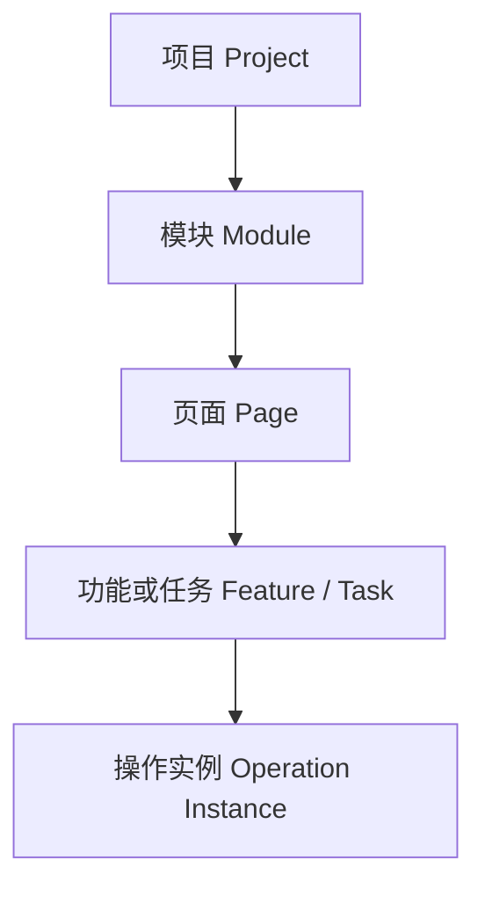
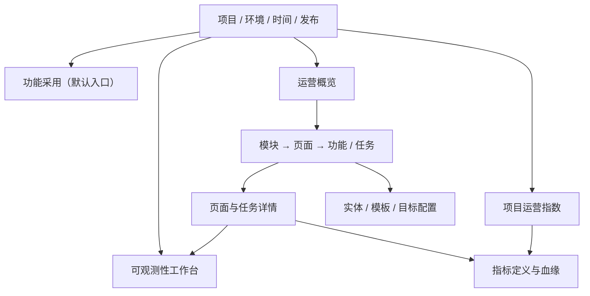
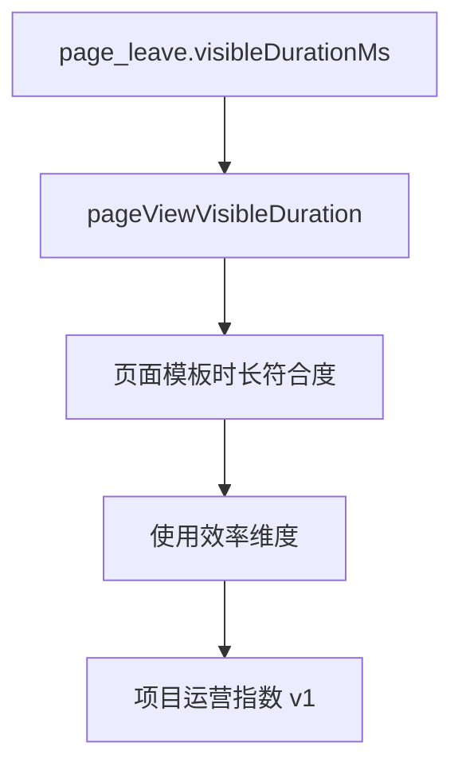

# Frontend Insight 产品需求文档 v1.7

- 状态：待产品评审
- 更新日期：2026-08-06
- 前序基线：`docs/product/requirements-v1.6.md`
- 对应开发计划：`docs/planning/mvp-plan-v1.4.md`
- 当前实现：M0–M8 已合并 `main`；尚未投产，遥测、项目配置、账号、Origin、profile 与 demo 数据均为可丢弃测试数据
- 输入依据：《内部业务操作系统 · 前端监测指标字典》v1.0、产品流程图、M0–M8 已验收实现与 ADR-008～ADR-013

## 0. 本次基线解决什么问题

v1.6 已建立“功能采用、产品运营、项目运营指数、前端可观测性”四类能力，但附件反馈暴露了三个跨阶段问题：

1. 同一概念在产品、SDK、事件、存储和 UI 中存在多组名称，例如 `appId/projectId`、`env/deploymentEnvironment`、`release/releaseVersion`、`userId/accountId`；
2. 部分指标只有名称，没有把分母、去重键、时间窗口、分位数、缺失值和业务解释固定为可执行契约；
3. 产品页面已经具备多个分析入口，但页面、指标、实体、配置和下钻关系缺少一张统一的信息架构。

本版本将上述反馈收敛为一套可直接重建、可验收的产品基线。核心原则是：

- 一个概念只有一个规范名；当前没有外部生产消费者，不保留旧名称和运行时兼容层；
- 指标定义同时驱动计算、接口说明、页面文案、血缘和测试，不能各写一份；
- 原始指标优先于评分，描述性信号不得被包装为因果结论；
- 不因统一字典而降低 v1.6/M8 已建立的隐私、契约和 SDK 异常隔离边界；
- 采用 Pre-1.0 破坏性重置：清空测试数据、重新建立 schema 和 seed，不开发旧数据迁移、双读、别名或回填；
- 事件、指标和配置仍然版本化，用于投产后的治理，而不是为了保留当前测试历史。

文档中的“必须”“不得”为验收条件；“建议”为默认方案，可由后续 ADR 调整。

## 1. 产品定位与范围

Frontend Insight（中文统一称“前端洞察平台”）服务于数字化工厂、智慧园区、IoT、能源、报警、门禁和内部管理系统。其目标不是用电商成交漏斗评价内部产品，而是回答四类业务问题：

| 产品域 | 核心问题 | 主要使用者 |
| --- | --- | --- |
| 功能采用 | 已规划的模块、页面和功能是否有人看到、开始并成功使用 | 产品经理、运营人员 |
| 产品运营 | 使用是否持续，任务是否顺畅，页面停留和路径是否符合页面类型 | 产品经理、Supervisor |
| 前端可观测性 | 哪个发布、页面、浏览器正在出现错误或性能退化，影响范围多大 | 前端开发、项目负责人 |
| 项目运营指数 | 在目标、样本和数据完整性满足时，项目整体运营表现如何 | Supervisor、产品负责人 |

平台不用于：员工个人绩效、行为监控、通用 BI、任意 SQL、录屏回放、自动判定产品生命周期，或在没有证据时把停留长、访问深、错误和使用下降解释为因果关系。

M9 的多模型 AI 分析助手仍为编外末期能力：只消费用户明确选择的现有只读数据快照，不改变本版本的采集范围、指标真相源和权限规则。

## 2. 统一领域模型

### 2.1 实体层级



| 实体 | 唯一标识 | 业务含义 | 主要挂载内容 |
| --- | --- | --- | --- |
| 项目 | `projectId` / `projectKey` | 一个被监测的前端产品 | 环境、发布、成员、全局目标、运营指数 |
| 模块 | `moduleKey` | 稳定业务域，如能源、设备、报警 | 页面集合、采用覆盖、组织画像 |
| 页面 | `pageDefinitionId` + `route` | 经配置的归一化 SPA 页面 | PV、时长、深度、性能、错误 |
| 功能 | `featureId` | 页面内可曝光、开始、成功/失败的能力 | 曝光后使用、持续使用 |
| 任务 | `featureId` + `taskEnabled` | 有明确开始和终态的业务动作 | 达成、取消、失败、耗时、路径 |
| 操作实例 | `operationInstanceId` | 一次并发安全的任务执行 | started 到唯一 terminal 的配对 |

页面继续使用三类模板：`monitoring_dashboard`（持续监测型）、`analysis_view`（信息分析型）、`task_operation`（任务操作型）。同一毫秒时长在三类页面上的业务方向不同，目标与评分方向必须由模板和项目 profile 决定。

### 2.2 分析上下文

所有页面和接口共享以下筛选上下文：项目、部署环境、时间范围、项目时区、发布版本；可选模块、页面、功能/任务及粗粒度浏览器/操作系统。页面下钻必须保留这些筛选条件，除非用户显式重置。

组织维度不由浏览器直接提交原始部门或角色。二期在授权后通过版本化目录快照，将项目级 HMAC 账号映射为受治理的 `departmentKey`、`roleKey` 和适用人数；目录版本必须随结果返回。

## 3. 命名规范

### 3.1 分层命名规则

| 层 | 规则 |
| --- | --- |
| 产品/UI | 使用明确中文业务名，避免只显示 UV、VV、“转化”“健康度”等歧义词 |
| TypeScript/JSON/API | `camelCase`；时间点以 `At` 结尾，时长以 `Ms` 结尾，数量以 `Count` 结尾，比例以 `Rate` 结尾 |
| 事件名 | `snake_case` 过去式或事实名，例如 `page_view`、`feature_succeeded`、`error_js` |
| 数据库物理列 | 可按存储约定使用 `snake_case`，但必须由 schema 生成映射，不能成为第二套产品词典 |
| 指标键 | 稳定 `camelCase`，一经发布不能原地改变公式；公式改变发布新的 `definitionVersion` |

缩写只保留业界稳定指标（PV、LCP、INP、CLS、FCP、TTFB）。首次出现必须同时展示中文解释。

### 3.2 输入名称与最终规范

| 附件/当前名 | v1.7 唯一规范名 | 最终规则与理由 |
| --- | --- | --- |
| `appId` | `projectId`（管理/读模型）、`projectKey`（SDK 传输） | 沿用现有项目隔离模型；删除 `appId`，不提供输入别名 |
| `env` | `deploymentEnvironment` | 枚举只接受 `production`、`staging`、`development`；删除 `prod/dev` 适配 |
| `release` | `releaseVersion` | 必须由构建/部署显式注入，不从资源名猜测 |
| `event` | `eventName` | 客户端发送具体事实事件；`eventFamily` 由服务端派生，不用宽泛 `custom/error/api` 替代事实名 |
| `timestamp` | `occurredAt` | 客户端发生时间；服务端另存 `receivedAt`，不覆盖原值 |
| `pageRoute` | `route` | SDK 发送无 query/hash 的路由；读模型返回 `normalizedRoute` |
| `pageUrl` | 不采集原始值 | 只保留归一化 route；完整 URL、query、hash 不进入事件 |
| `userId` | `accountRef`（瞬时传输）→ `accountId`（项目级 HMAC） | 不保存员工工号、姓名等直接标识；删除 `userId` 输入字段 |
| `deviceId` | `visitorId` | 浏览器一方随机实例，不做设备指纹，也不宣称等于设备或人员 |
| `ua/os/browser` | `browserFamily`、`osFamily`、`viewportBucket` | 客户端只发粗粒度结果，不发送原始 User-Agent |
| `deptId/roleId` | `departmentKey/roleKey` | 二期由受治理目录映射；禁止浏览器直传原始组织标识 |
| `vv` | `sessions` | UI 称“会话数”，不展示 VV |
| `uv` | `activeAccounts` 或 `activeVisitors` | 必须区分账号与浏览器，不使用一个 UV 混合两种口径 |
| `bounce_rate` | `singlePageSessionRate` | UI 称“单页会话率”；仅作诊断，不默认评分或告警 |
| conversion | `postExposureUseRate` / “曝光后使用率” | 内部产品不使用电商“转化”措辞；删除旧 API 字段 |
| health score | `projectOperationalIndex` / “项目运营指数” | 不是医学或系统综合健康度；错误/性能暂不进入 v1 指数 |

### 3.3 Pre-1.0 重置要求

1. `schemaVersion: 3` 是重置后的唯一事件契约；ingest、consumer、SDK、demo 和测试不再接受或产生 v1/v2。
2. Web SDK 发布新的 Pre-1.0 版本（计划为 `0.4.0`），只暴露规范配置和事件 API，不提供 deprecated wrapper。
3. 产品 API 和 read model 直接采用规范字段；删除旧字段，不返回 alias 或 `deprecatedSince`。
4. 本地与验收环境清空 MySQL、ClickHouse、Kafka、项目配置和 demo 数据，再从空环境执行 schema baseline 与 seed。
5. 不实现旧数据库升级、事件回填、指标历史衔接或旧/新结果对照；Git 历史与 v1/v2 文档仅作为设计演进记录。
6. 数据库 migration 工具仍必须存在，用于从空库确定性建立最新结构，并服务未来投产后的向前迁移。
7. `definitionVersion`、profile version 和目录版本仍从新基线开始保存；投产后不得再以“测试阶段”为由原地换义。

## 4. 统一指标契约

### 4.1 每个指标必须声明的元数据

`MetricCatalog` 是指标计算、接口、UI 文案、血缘与 golden fixture 的共同真相源。每个指标至少声明：

- `metricKey`、中文名称、业务问题、适用实体和页面模板；
- 输入事实或上游指标、公式、分子、分母、去重键和时间窗口；
- 单位、分位数、样本数、最小样本、覆盖率和可用起始时间；
- `higher_better`、`lower_better`、`target_range` 或 `none`；
- `definitionVersion`、owner、生效时间、上游依赖和下游使用者；
- `available`、`no_data`、`insufficient_sample`、`delayed`、`broken`、`not_collected`、`missing_target` 等缺失语义。

公式文案不得由前端手写。页面通过定义接口展示与计算完全一致的解释。

### 4.2 通用计算规则

- 所有事实按 `eventId` 去重；项目、环境、发布、时区和时间范围是计算的一部分。
- 实时窗口按 5 分钟桶；日/周/月使用项目时区的自然日、自然周和自然月。
- 比率必须返回 numerator、denominator、rate、sampleSize；分母为 0 时返回 `null`，不是 0%。
- 账号、浏览器、会话不可互相兜底。缺少账号时展示浏览器口径，不能把它命名为人数。
- 缺少 `page_leave` 的访问不以 0ms 进入时长；必须同时展示时长覆盖率。
- delayed/broken/partial 数据不补零，趋势线不跨缺口连接。
- 项目默认只看 `production`；非生产数据必须显式切换，永不进入运营指数。
- 任何阈值、目标、分母来源或公式变化均产生新 definition/profile version。

### 4.3 分位数规则

附件提出“所有时长默认 P90”，但不同指标已有公认口径，且现有运营指数使用模板化时长目标。v1.7 采用按指标族固定默认值：

| 指标族 | 列表主值 | 详情补充 | 理由 |
| --- | --- | --- | --- |
| Core Web Vitals | P75 | P50/P90、样本、good/needs improvement/poor | 与 Web Vitals 标准及 M8 阈值一致 |
| 任务/操作耗时 | P50 + P90 | P75/P99（样本足够时） | 同时看典型效率与长尾；P75 可作为详情补充，不承担兼容职责 |
| 页面可见时长 | P50 + P90 + 覆盖率 | 平均/P75/P99 | 时长不是越长越好，不能只显示均值 |
| API、首屏、列表渲染 | P90 | P50/P75/P99 | 优先暴露长尾等待 |
| 计数/比率 | 不适用 | 分子、分母、样本 | 不对比率计算时长分位数 |

建议门槛：P50 至少 5 个有效样本，P75/P90 至少 20 个，P99 至少 100 个；未达到时返回 null 与 `insufficient_sample`。最终门槛随指标定义版本固化。

## 5. 指标字典

### 5.1 使用情况

| 规范指标 | 公式与去重口径 | 业务解释 | 当前数据状态 |
| --- | --- | --- | --- |
| `pageViews` | `count(page_view)` | 页面完成初始化或 SPA 路由切换后的访问次数；刷新重复计数 | 已有，需统一命名 |
| `activeAccounts` | `uniq(accountId)` | 时间范围内有有效活动的已识别账号；共享账号仍只算一个 | 已有 |
| `activeVisitors` | `uniq(visitorId)` | 浏览器随机实例数，不代表真实人数 | 已有 |
| `sessions` | `uniq(sessionId)` | 30 分钟无活动切分的连续使用会话 | 已有 |
| `daily/weekly/monthlyActiveAccounts` | 对自然日/周/月 `uniq(accountId)` | DAU/WAU/MAU 的明确账号口径；内部产品默认突出周活跃账号 | 可由现有事实派生 |
| `weeklyMonthlyStickiness` | `weeklyActiveAccounts / monthlyActiveAccounts` | 月活账号中本周仍活跃的比例；必须显示对应周/月范围 | 可派生 |
| `moduleAdoptionRate` | `active module eligible accounts / eligibleAccountCount` | 有资格使用该模块的账号中实际使用的比例 | 需账号目录分母 |
| `moduleActiveShare90d` | `module active accounts / project active accounts in 90d` | 缺少账号目录时的描述性活跃份额，不等于模块渗透率 | 可派生，禁止冒充分母 |
| `avgVisibleDurationPerAccount` | `sum(valid visibleDurationMs) / activeAccounts` | 每个活跃账号在范围内的有效前台使用时长 | 可由现有事实派生 |
| `pageViewVisibleDuration` | 同一 `pageViewId` 有效时长片段之和，输出 P50/P90/coverage | 一次页面访问实际在前台可见多久 | 已有 P50/P75，需补 P90 |
| `hourlyActivity` | 按项目本地小时聚合 PV、账号、浏览器 | 识别使用时段、规划维护窗口 | 可派生 |
| `singlePageSessionRate` | `uniq(route)=1 的 session / all sessions` | 单页结束会话占比；看板查完即走可能正常 | 可派生，仅诊断 |

`moduleAdoptionRate` 的官方分母必须来自版本化账号/权限目录或管理员确认的 eligible account snapshot。近 90 日活跃账号只能产出另一个明确命名的指标，不能作为“系统总用户数”的静默近似。

### 5.2 功能采用、访问深度与持续使用

| 规范指标 | 公式 | 业务解释 |
| --- | --- | --- |
| `postExposureUseRateByAccount` | 同窗内既 `feature_exposed` 又 `feature_succeeded` 的账号 / 曝光账号 | 看到入口的账号中有多少成功使用 |
| `postExposureUseRateByVisitor` | 同上，按 visitor 去重 | 无账号时的浏览器口径 |
| `crossSessionReuseRate` | 至少两个 session 成功使用的账号 / 成功账号 | 区分一次尝试与持续使用 |
| `crossDayReuseRate` | 至少两个项目本地日期成功使用的账号 / 成功账号 | 反映跨日持续采用 |
| `sessionPageViewCount` | 每 session 的 `count(page_view)`，P50/P90 | 一次工作过程打开页面的总步数，含往返 |
| `sessionDistinctPageCount` | 每 session 的 `uniq(route)`，P50/P90 | 一次会话覆盖的不同页面数 |
| `sessionModuleBreadth` | 每 session 的 `uniq(moduleKey)`，P50/P90 | 一次会话跨越的业务模块数 |

访问深度不等于 URL 层级或 DOM 点击数。持续监测型大屏深度低可能完全符合预期，因此以上指标默认 `none` 或 `target_range`，不得全局设置为越高越好。

### 5.3 操作效率

| 规范指标 | 公式与边界 | 业务解释 | 当前数据状态 |
| --- | --- | --- | --- |
| `operationCompletionDuration` | 同一 operation 的 `succeededAt-startedAt`，P50/P90 | 用户明确开始操作到成功终态的耗时 | M6 已有 P50/P75，需补 P90 |
| `taskJourneyDuration` | 显式 `task_journey_started` 到成功终态，P50/P90 | 从进入业务流程到最终完成，允许跨页面；不复用 page_view 猜起点 | 需新事件/API |
| `taskSuccessRate` | succeeded operations / started operations | 已开始任务的成功达成比例 | 已有 |
| `taskFailureRate` | failed operations / started operations | 明确失败终态比例 | 已有 |
| `taskCancelRate` | canceled operations / started operations | 用户明确取消比例 | 已有 |
| `taskApproximateAbandonRate` | 观察窗后仍无终态 started / started | 可能是离开、断网或漏报，必须标“近似” | 已有模型 |
| `fieldRevisionPerSubmission` | 字段 change 次数 / 提交次数，仅字段键白名单 | 表单是否需要反复修正；不采集字段值 | 需汇总事件 |
| `formResetRate` | reset 次数 / 表单页有效 PV | 是否频繁清空重填 | 需汇总事件 |
| `formValidationFailureRate` | 前端校验失败提交 / 提交尝试 | 交互说明或默认值是否可能有问题 | 需汇总事件 |
| `operationBusinessRejectRate` | 后端业务码拒绝 operations / 已完成业务请求 | 业务规则拒绝，不等于 HTTP/API 异常 | 需显式业务适配器 |
| `repeatedOperationSessionRate` | 同一账号对同一不可逆 HMAC 业务对象 24h 操作 ≥阈值的 session / 相关 session | 反复编辑/撤销的诊断信号 | 二期；需单独隐私评审 |
| `taskPathSteps` | task journey 内 page_view 总数及 distinct route 数，P50/P90 | 完成任务前是否存在过多跳转和回退 | 二期；需 journey ID |

不得使用原始 `bizId`。若重复操作确有业务价值，业务方在发送前以项目密钥域生成不可逆、短期轮换的 `businessObjectRef`；默认不开放跨项目、跨长期追踪。

### 5.4 性能

| 规范指标 | 默认口径 | 业务解释 | 当前数据状态 |
| --- | --- | --- | --- |
| `lcp` | route P75，补 P90；good <2500ms | 最大内容完成绘制的体验 | M8 已有 |
| `inp` | route P75；good <200ms | 交互到下次绘制的延迟 | M8 已有 |
| `cls` | route P75；good <0.1 | 非预期布局偏移 | M8 已有 |
| `fcp` | route P90；good <1800ms | 首次内容绘制 | M8 已有样本，需新增 P90 读模 |
| `ttfb` | route P90；good <800ms | 首字节等待 | M8 已有样本，需新增 P90 读模 |
| `firstScreenDuration` | 业务显式“数据就绪并渲染”到达时长 P90 | SPA/大表格首屏，以业务 readiness 为准 | 需手动 API |
| `apiRequestDuration` | method + 归一化 path，P50/P90 | 接口长尾等待 | 需采集全部受控请求样本 |
| `apiSuccessRate` | 成功请求 / 受控请求总数 | 请求层稳定程度 | 需分母事件 |
| `apiSlowRequestRate` | 超项目阈值请求 / 受控请求总数 | 慢接口影响面，默认阈值可从 2s 起配 | 需分母事件 |
| `listRenderDuration` | page + rowCountBucket，P90 | 大列表数据就绪到渲染完成耗时 | 需组件适配器 |
| `longTaskCount/Duration` | 每 pageView 汇总 >50ms 长任务数量/总时长 | 主线程卡顿证据 | 需汇总事件 |
| `longTaskAffectedPageViewRate` | 含长任务 pageView / 有性能汇总 pageView | 卡顿影响访问占比 | 需分母事件 |

接口监测优先由业务请求层调用显式适配器。全局包装 `fetch`/XHR 默认关闭，避免破坏宿主行为；任何自动采集必须逐项目 opt-in。

### 5.5 稳定性

| 规范指标 | 默认口径 | 业务解释 | 当前数据状态 |
| --- | --- | --- | --- |
| `jsErrorOccurrencesPerPageView` | JS 错误次数 / PV，同时返回错误组、影响账号/浏览器 | 页面访问中的前端异常密度 | M8 可派生 |
| `jsErrorAffectedPageViewRate` | 含 JS 错误的 pageView / 有效 PV | 有多少访问受到 JS 错误影响 | 需稳定 pageView 关联 |
| `apiErrorRate` | HTTP 4xx/5xx、网络失败、超时 / 受控请求总数 | 传输/HTTP 异常，不等于业务拒绝 | M8 只有异常事件，需请求分母 |
| `resourceFailureOccurrences` | 资源失败次数、错误组和影响 PV | 当前可可靠提供的资源失败证据 | M8 已有 |
| `resourceFailureRate` | 资源失败请求 / 被观测资源请求总数 | 资源加载失败占比 | 需 `resource_summary` 分母后才可命名为率 |
| `blankScreenCandidateRate` | 候选白屏 pageView / 启用检测 pageView | 自动规则只能给候选证据，需结合错误/资源快照 | 需模板化 opt-in |
| `errorBreadcrumb` | 错误前最多 50 条允许列表语义动作，仅随错误发送 | 帮助复现错误，不独立作为运营指标 | 需隐私受控实现 |

白屏检测不能统一使用“3 秒 + 九宫格”作为最终事实。Cesium、Canvas、大屏骨架和异步首屏均可能误报；必须按页面模板配置 root/readiness 适配器，并在证据验证前称“白屏候选”。

breadcrumb 只允许 route change、语义化 action key、受控 API path/status 和错误组引用；默认禁止 DOM 文本、CSS 选择器、输入值、控制台输出、业务对象 ID、header/body。即使附件允许“目标”，也必须通过 allowlist 和大小裁剪。

SourceMap 不设为所有项目的强制采集。只有脱敏首帧无法支撑真实定位任务，且源码暴露、上传权限、版本匹配、保留期、私有化传输和容量均通过评审时，才按项目启用服务端受控 SourceMap；浏览器事件仍不得携带源码或 SourceMap。

### 5.6 组织与安全

| 指标/能力 | 口径 | 阶段与约束 |
| --- | --- | --- |
| `departmentUsageRate` | 部门活跃账号 / 目录适用账号 | 二期；返回目录版本和分母覆盖率 |
| `roleUsageRate` | 角色活跃账号 / 目录适用账号 | 二期；同一账号多角色需定义分摊规则 |
| `roleFeatureProfile` | role × module 的账号、PV、有效时长分布 | 二期；仅聚合展示，设最小群体门槛 |
| `abnormalAccessSignal` | 受治理规则产生的安全候选信号 | 三期独立安全产品线；不得用于个人绩效 |

非工作时间、高频访问、多 IP/多设备和无权限路由涉及员工行为与认证数据，不能仅靠前端监测事件实现。必须另立 ADR、权限、审计、告警处理人、最小群体门槛、误报复核和数据保留策略；在此之前不进入主导航和运营指数。

## 6. 项目运营指数 v1

项目运营指数继续采用 ADR-012 的产品构成，因为四个维度仍符合当前业务目标，而不是为了兼容测试历史。重置后所有分项、目标和总分只根据新口径与新 seed 数据重新计算：

| 一级维度 | 权重 | 子项构成 |
| --- | ---: | --- |
| 使用覆盖 | 30% | 活跃账号目标达成 40%；核心页面使用覆盖 35%；活跃日覆盖 25% |
| 持续使用与访问深度 | 25% | 跨日持续使用 40%；会话不同页面数符合度 30%；会话模块广度符合度 30% |
| 任务达成 | 30% | 关键任务加权达成 70%；失败/取消/近似放弃反向分 30% |
| 使用效率 | 15% | 关键任务耗时符合度 60%；页面可见时长符合度 40% |

总分仅在至少 3 个 eligible 一级维度、叶子权重覆盖 ≥70%、数据状态可用且各指标满足 minimum sample 时显示；缺失值不按 0。radar chart 只展示四个归一化 0–100 维度，并提供等价表格。

本版本新增的错误、性能、表单、组织或安全指标默认不进入指数 v1，这是产品边界而非历史兼容要求。若真实试点证明需要综合运营与体验，必须发布“项目运营指数 v2”，明确新构成、相关性风险和重新验收计划。

## 7. 事件与上报规范

### 7.1 规范事件外壳

重置后的唯一事件契约为 v3；服务端拒绝 v1/v2：

```json
{
  "schemaVersion": 3,
  "eventId": "evt_...",
  "eventName": "page_view",
  "projectKey": "ops-admin",
  "deploymentEnvironment": "production",
  "releaseVersion": "1.4.2",
  "sessionId": "s_...",
  "visitorId": "v_...",
  "accountRef": "opaque-login-reference",
  "pageViewId": "pv_...",
  "route": "/alarm/list",
  "occurredAt": 1786000000000,
  "properties": {}
}
```

`accountRef` 只在接收链路内用于计算项目级 HMAC `accountId`，不得进入 Kafka payload 日志、ClickHouse 原始列、死信或错误响应。`receivedAt` 由服务端产生。

### 7.2 事件目录

| 事实域 | 现有规范事件 | 拟新增受限事件 |
| --- | --- | --- |
| 页面 | `page_view`、`page_leave` | `page_readiness`（首屏/白屏适配器） |
| 功能/任务 | `feature_exposed/started/succeeded/failed/canceled` | `task_journey_started/ended`、`form_summary` |
| 错误 | `error_js`、`error_resource`、`error_api` | 带 allowlist breadcrumb 的受控扩展 |
| 性能 | `web_vital` | `api_request_summary`、`resource_summary`、`list_render`、`long_task_summary` |

不提供任意事件名、任意嵌套属性和任意公式的通用入口。自定义事件只有在 MetricCatalog 注册 schema、隐私规则、owner 和使用者后才能进入生产 allowlist。

### 7.3 页面与 SPA 生命周期

1. 首次页面完成初始化后发送 `page_view`。
2. SPA 路由完成切换时，先结算旧 `page_leave`，再创建新的 `pageViewId` 并发送 `page_view`。
3. 统一处理 `pushState`、`replaceState`、`popstate` 与 `hashchange`；仅 hash 改变默认不新建访问，可按项目配置。
4. 页面 hidden 时暂停可见时长；visible 时继续；route leave、hide/close 时尽力 flush。
5. 连续 30 分钟无允许列表交互后新建 session；后台标签页不立即结束 session，但不累计可见时长。
6. 单次无交互可见片段超过 30 分钟的超出部分不计；截断策略进入定义版本。

### 7.4 批量、大小、重试和采样

| 项 | v1.7 要求 |
| --- | --- |
| 攒批 | 最多 50 条；队列有事件时最长 10 秒发送；单批仍 ≤64 KiB |
| 单事件 | 沿用当前更严格边界 ≤8 KiB，不放宽到附件的 16 KiB |
| 离开兜底 | `visibilitychange/pagehide` 使用 `sendBeacon` 或 `fetch keepalive` 尽力发送 |
| 重试 | 有界指数退避；复用 `eventId`，由查询侧去重；队列必须有上限 |
| 错误采样 | 同一脱敏指纹每项目/发布/5 分钟最多 10 条原始样本，同时保留被抑制计数 |
| SDK 隔离 | 初始化、监听、序列化、发送和适配器异常不得向宿主调用栈抛出 |
| 诊断 | 只记录拒绝码、数量、大小和 SDK 版本，禁止记录 payload |

错误“实时上报”表示优先 flush，不表示绕过批大小、schema、限流和隐私裁剪。

## 8. 隐私、安全与数据治理

默认允许：归一化 route、事件时间、项目/环境/发布、随机 visitor/session/pageView/operation ID、服务端 HMAC 账号、标准事件、粗粒度浏览器/OS/视口、allowlist 属性。

默认禁止：原始 URL/query/hash/referrer query、原始工号/姓名/邮箱/手机号、设备指纹、原始 UA、IP 作为产品分析维度、DOM/输入/剪贴板/截图/录屏、请求/响应 header/body、token/cookie/storage、源码/SourceMap、任意业务主键和未注册嵌套对象。

现有边界继续有效：属性最多 20 个、键长 ≤64、字符串值 ≤256、原始事件默认保留 90 天；日志和死信不记录 payload。组织目录、breadcrumb、业务对象引用和安全信号各自需要额外数据保护评审。

## 9. 产品流程与页面关系

附件流程图表达了“全局上下文 → 分层概览 → 实体下钻 → 专项详情/配置”的主路径，并以虚线表示共享上下文或跳转关系。由于图片文字分辨率有限，本节只固化可辨认的结构关系，具体名称以本需求字典为准，不从模糊图中文字猜测新功能。



### 9.1 页面职责矩阵

| 页面 | 回答的问题 | 主指标/内容 | 主要下钻 |
| --- | --- | --- | --- |
| 功能采用（默认） | 功能是否被看到、开始并成功使用 | 曝光、开始、成功/失败、曝光后使用、持续使用 | 功能/任务详情 |
| 运营概览 | 项目、模块、页面整体是否持续使用 | 活跃账号/浏览器/会话、WAU、时长、覆盖、深度、关键任务、未归类 route | 模块 → 页面 → 任务 |
| 页面访问 | 某页面的使用模式是否符合模板 | PV、账号、浏览器、时长分布/覆盖、单页会话、小时分布 | 页面详情 |
| 页面/任务详情 | 具体体验卡点在哪里 | 页面模板、时长、路径、任务达成/耗时、相关性能和错误摘要 | 可观测性过滤结果、定义/血缘 |
| 项目运营指数 | 项目级目标达成如何、由什么构成 | 总分、四维 radar、等价表格、原始值、目标、贡献、样本、版本 | 维度 → 指标 → 实体 |
| 可观测性工作台 | 哪些发布和页面出现前端异常 | 错误组、影响范围、Web Vitals、API/资源/发布、固定告警 | 错误/性能详情、对应页面 |
| 指标定义/血缘 | 指标怎么算、来自哪里、被谁使用 | 公式、分子分母、去重、分位数、版本、DAG | 上游事实、下游页面/指数 |
| 项目与接入 | 如何接入和治理 | Origin、SDK/schema 分布、环境、发布、数据状态、采集开关 | 测试事件、诊断 |
| 运营配置（admin） | 页面/任务及目标如何配置 | 模块、页面模板、任务、业务日历、eligible 账号、profile/目标/权重 | 配置版本和审计 |

### 9.2 交互规则

- 全局筛选器在所有分析页面位置和语义一致，并同步到 URL，支持刷新和分享。
- 概览卡片是下钻入口，不复制另一套公式；目标页通过同一个 read model 或明确的子查询获取数据。
- 趋势图表达时间变化；指标血缘用 DAG 表达依赖。不得用折线图表示血缘，也不得把不同单位原始值直接放入 radar。
- 页面详情可以带当前 route/release/time 跳到可观测性工作台；反向可从错误组跳回页面，但不宣称错误导致使用变化。
- 未归类 route 仍显示基础访问与错误证据，但不进入模块覆盖或项目运营指数，并提供 admin 配置入口。
- AI 入口未来可在任意页面出现，但只读取用户勾选的卡片/趋势/错误组快照；页面上下文不是全库权限。

## 10. 页面模板与指标解释

| 模板 | 典型页面 | 时长/深度解释 | 重点指标 |
| --- | --- | --- | --- |
| 持续监测型 | 驾驶舱、数字孪生、实时态势、报警监控 | 较长可见时长可能符合预期；单页深度低不扣分；关注数据 readiness | 有效展示、可见时长目标区间、活跃日、Web Vitals、错误 |
| 信息分析型 | 能耗、碳排、预算、IoT 记录、设备地图 | 过短可能未读完，过长可能复杂或性能慢，只能作为调查线索 | PV/账号/会话、时长区间、模块广度、API/列表性能 |
| 任务操作型 | 联动控制、报警确认、规则配置、门禁、导入导出 | 任务成功前提下通常越短越好；需区分校验、业务拒绝和 API 错误 | 达成/失败/取消/放弃、操作与旅程耗时、路径、表单效率 |

任何时长或深度异常都只能生成“建议调查”的描述，不自动判定功能好坏。

## 11. 权限、配置与版本

- `admin`：配置模块、页面、模板、关键任务、目标账号、业务日历、采集开关、Metric profile、目标/区间/权重和生效时间；查看审计。
- `viewer`：只读查看指标、公式、样本、版本、趋势和下钻，不能修改接入或评分配置。
- 配置 clone-on-write；已激活版本不可原地修改。
- 趋势默认只连接同一 definition/profile/directory version；跨版本以断点和注释展示。
- 历史基线只作为管理员设定目标的参考，不自动覆盖业务目标。

## 12. 数据状态与可解释性

| 状态 | 页面行为 |
| --- | --- |
| `no_data` | 展示接入/范围说明，不显示全零图表 |
| `not_collected` | 明确所需 SDK 开关或事件尚未启用 |
| `insufficient_sample` | 保留样本数、门槛和已有原始值，不显示不稳定分位数/评分 |
| `partial` | 标出缺失时间段和覆盖率，趋势不跨缺口 |
| `delayed/broken` | 保留最近可用数据并显示影响范围，不能补零 |
| `missing_target` | 展示原始指标和配置入口，不进入评分 |
| `unclassified` | 展示基础事实但不进入模块/指数 |
| `forbidden` | 说明权限边界和联系管理员方式，不泄露项目存在性 |

每张指标卡至少可看到：业务解释、公式摘要、分母、样本、时间范围、环境、定义版本、可用起始时间和详情入口。

## 13. 指标血缘

血缘数据必须保存正确的 DAG，即使首期 UI 只提供抽屉：



血缘节点展示 metric/event key、中文名、definition version、数据源、公式、owner、可用起始时间和下游消费者；循环依赖在发布前拒绝。

## 14. API 与契约方向

管理 API 与 read model 在同一变更中直接切换到 v1.7 规范。重置后必须：

- 返回规范字段、metric definition 摘要、numerator/denominator/sample/coverage 和 data status；
- 接受统一 project/environment/release/time/entity 筛选；
- 使用 cursor 或固定 Top N 控制高基数错误、route、API path；
- 通过 metric key 查询 definition/lineage，不在每个页面硬编码公式；
- schema、SDK、ingest、consumer、API、Web 和 demo 在同一发布基线上只使用规范字段。

事件契约确定命名为 v3；具体 endpoint 与数据库列由实施 ADR 固化。产品验收只认本文件定义的规范语义，不验收 v1/v2 运行时兼容。

## 15. 分期优先级

| 优先级 | 内容 | 说明 |
| --- | --- | --- |
| P0 | Pre-1.0 数据重置、唯一命名、公式、页面关系、MetricCatalog、现有指标 P90/分母/状态统一 | 不新增敏感采集；优先消除同义词和错误解释 |
| P1 | API 请求分母与耗时、首屏、列表、长任务、资源分母、模板化白屏候选、受限 breadcrumb | 对齐附件一期中 M8 尚缺能力，全部 opt-in |
| P2 | task journey、表单汇总、业务拒绝、路径、目录化部门/角色指标 | 需要业务接入和外部目录 |
| P3 | 安全异常信号、指数 v2、受控 SourceMap、通用派生指标工作台 | 均需独立证据和 ADR，不与 P0 捆绑 |

“通用自定义指标引擎”仍不作为当前刚需。现有 L0–L4 指标语义层已经支持代码注册的原子、派生和复合指标。只有出现至少 3 个真实项目反复请求同一类自助组合、且固定模板无法满足时，才评估受限 DSL、成本估算、回算、版本、权限和基数治理；预计仍是 25–40 个开发日级别的独立项目。

## 16. 验收标准

### 16.1 文档与命名

- 产品、SDK、schema、API、MetricCatalog、数据库映射和 UI 术语有一张可机读规范清单。
- 新 UI 不再显示含混的 UV/VV/转化/健康度；账号、浏览器和会话口径清楚可见。
- schema v3、SDK `0.4.0`、服务端、demo 与 UI 只使用规范字段；v1/v2 事件得到明确拒绝。
- 执行带显式确认的测试环境 reset 后，可从空库完成 schema、seed、登录、接入和分析闭环。

### 16.2 指标正确性

- 每个 P0 指标有 golden fixture，覆盖重复事件、跨日/时区、缺失 leave、并发 operation、分母为 0、样本不足和 partial/delayed。
- API、UI、定义抽屉中的公式、分母、分位数和版本一致。
- Web Vitals 默认 P75；任务/页面/API 的 P90 按本文件展示，不用全局开关改变所有指标。
- 无资源/API 总请求分母时不展示失败率；无目录分母时不展示模块渗透率。

### 16.3 采集与隐私

- 生产事件拒绝 raw URL/query/hash、原始账号、设备指纹、UA、DOM/输入、header/body 和未注册业务 ID。
- 单事件 8 KiB、单批 50 条/64 KiB、最长 10 秒 flush、离开兜底、限流、重试和 SDK 异常隔离均有自动化测试。
- 路由切换先 leave 后 view，pageView/session/operation 并发与终态规则有浏览器测试。

### 16.4 产品流程

- 全局筛选在功能采用、运营概览、页面、指数和可观测性之间保持一致。
- 项目 → 模块 → 页面 → 功能/任务下钻可达，未归类实体有配置入口。
- 页面/任务详情可带筛选跳到相关错误/性能，且界面不作因果结论。
- 指标趋势、定义与血缘可相互到达；radar 有等价表格。

### 16.5 回归

- M0–M8 的业务能力在 v3 新基线上重新通过 contract、SDK、ingest、consumer、analytics、auth、RBAC、Compose、备份恢复和 M8 可观测性验收。
- 旧 v1/v2 兼容测试、旧数据升级测试和历史指数对照从验收范围删除；新指标与项目运营指数使用新 golden fixtures 手算一致。
- reset 必须使用精确确认参数，只能作用于明确命名的本地/验收资源，不能误删生产或其他项目数据。

## 17. 已确认前提与待固化 ADR

### 17.1 已确认

1. 项目未投产，当前 MySQL、ClickHouse、Kafka、用户、项目、Origin、实体配置、profile、目标和 demo 数据全部为可丢弃测试数据。
2. 本次实施直接重置所有明确命名的本地/验收数据，不提供历史迁移、双读、别名、旧 SDK 或 v1/v2 运行时兼容。
3. schema v3 与 SDK `0.4.0` 作为唯一新基线；M0–M8 业务能力在新基线上整体回归。
4. 项目运营指数仍采用 30/25/30/15，是现阶段产品决策；所有结果从新数据重新计算。
5. 旧代码、契约和 ADR 由 Git 保留用于追溯，不在运行时继续承担兼容成本。

### 17.2 仍需 ADR 固化

1. 事件契约 v3 的精确字段、SDK `0.4.0` API、干净 schema baseline 和安全 reset 命令；
2. 账号/权限目录接口、eligible 分母快照、角色多值及最小群体展示门槛；
3. task journey 跨页面/跨会话边界与短期业务对象引用的密钥轮换；
4. 白屏 readiness 适配器、API/资源分母的抽样率和代表性说明；
5. SourceMap、breadcrumb、安全信号分别通过真实项目证据后是否进入 P3；
6. 是否在 P1 完成后提出项目运营指数 v2，默认答案为“不自动加入”。

在 ADR-014 固化前，开发可以完成规范清单、公式、页面信息架构和新 golden fixtures 设计，但不得自行增加兼容层，或选择会改变隐私与分母的默认值。

## 18. M9 编外能力：AI 分析助手

M9 在本版本中继续保留，范围与 v1.6 已评审规划一致，但必须消费 v1.7 的唯一规范 read model，不能从页面 DOM 抓取数据。

### 18.1 定位与进入条件

- AI 是只读解释层，可以总结事实、比较变化、提出假设和调查建议；
- AI 不重新计算指标或指数，不直接查询任意数据库，不修改配置/代码，不关闭告警或执行修复；
- M8.1-A 的规范名、MetricCatalog、统一筛选和 context block 契约稳定后才能实施 M9 P0；
- M8.1-B 尚未启用的指标必须返回 `not_collected`，不得由模型推算或伪造。

### 18.2 交互与上下文

管理端右侧提供全局 AI 图标。用户打开抽屉后：

1. 查看当前项目、页面、环境、发布、时间范围和筛选；
2. 从页面注册的 `AIContextBlock` 中勾选要发送的卡片、趋势、任务、指标或错误组；
3. 预览字段、敏感等级、预计 token 和目标模型的 internal/external 边界；
4. 选择版本化运营模板或错误/性能模板，也可自由提问；
5. 从管理员允许的 model profile 中选择模型；
6. 查看带证据引用的流式回答；
7. 保存对话、不可变上下文快照、模板版本和 AI run。

无注册上下文的页面不得静默抓取 DOM、store 或任意 API 响应。前端只提交 block key 和筛选；服务端重新做项目权限、block allowlist、read-model 查询、脱敏、Top N/截断和 token 预算，再生成不可变 snapshot。筛选变化不覆盖历史快照。

每个 block 使用本版本规范名，并包含 entity scope、单位/业务说明、筛选/时区、definition/profile/directory version、data status、sample、coverage、availableFrom、sensitivity 和来源 read model。大量数据先由平台确定性计算趋势与 Top N，模型不从原始事件重新算指标。

### 18.3 多模型与配置

采用“统一内部请求/响应模型 + OpenAI-compatible 基础适配器 + provider capability matrix + 必要专用适配器”，兼容 DeepSeek、GLM、私有化 vLLM 等服务，但不假设能力完全相同。

model profile 至少配置连接（base URL、path、model ID、secretRef、认证、代理、TLS/CA）、生成（temperature、top-p、token、reasoning、timeout/retry）、能力（streaming、system、JSON/schema、file/vision/context 限制）和治理（internal/external、允许项目/数据等级、驻留/留存、配额、fallback）。浏览器永不获得 API key；internal/external 之间不得越界自动 fallback。

首版不允许 tool calling 执行平台写操作，不保存或回放隐藏 reasoning/chain-of-thought，不默认保存 provider 原始响应。

### 18.4 历史与数据安全

- 默认保存用户消息、最终回答、脱敏 snapshot、实际 model profile/参数/token/耗时/status 和审计，默认 180 天且管理员可缩短；
- 对话默认仅创建者可见，显式共享后同项目成员可见；每次读取重新校验项目权限；
- 权限撤销后不能读取历史；删除明文后只保留审计允许的最小元数据；
- 本地删除不能宣称删除了第三方副本，provider 留存/训练/删除政策必须在发送前可见；
- 原始事件、原始账号引用、请求/响应正文、未脱敏错误文本不能成为上下文；
- 模型输出按不可信内容渲染，不直接作为 HTML、SQL 或代码执行；
- 回答必须区分已知事实、数据限制、合理推测、建议验证和建议行动，并引用 context block、metric key、错误组和时间范围。

### 18.5 M9 P0 验收保留项

- 用户能只选择当页数据的一部分，发送前能看清范围、敏感等级和模型边界；
- 服务端重查权限并生成可复核快照，第三方 profile 无权接收的 block 被拒绝；
- 运营、错误/性能内置模板使用同一 MetricCatalog 解释，不重定义项目运营指数；
- 对话历史可复核当时的筛选、版本、数据状态、模型和实际发送消息；
- prompt injection、越权、敏感数据、fallback 和不安全输出测试通过；
- 模型超时、限流或不可用不影响原 Dashboard，且任何回答都不能触发平台写操作。
