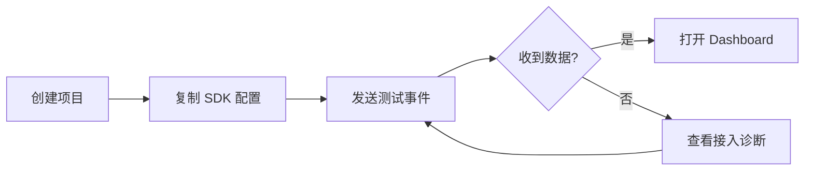

# 内部监控系统文档评审报告（基于 PRD v1.3）

> 评审日期：2026-07-19  
> 评审范围：《内部监控系统 - 需求文档 v1.3》《内部监控系统 - MVP 开发计划表》  
> 评审视角：产品经理、目标用户、开发与运维  
> 结论去向：已落实到《需求文档 v1.4》和《MVP 开发计划 v1.1》

## 1. 结论摘要

项目解决的问题真实且值得做：内网 Web 应用缺少统一、私有化的使用数据，产品、运营和开发无法回答“哪些项目和页面有人使用、使用趋势如何、数据是否仍然活跃”。

但 v1.3 的主要风险不是技术选型，而是产品边界。文档同时承诺了四类产品：

1. Web 产品分析；
2. 前端错误与性能监控；
3. 自定义指标和健康度规则平台；
4. 用户、项目和权限管理平台。

这些能力面向的任务、数据模型和成功标准不同。若全部按 P0 建设，8–13 个工作日只能完成“链路演示”，无法形成可稳定使用的产品。开发计划实际上也只覆盖了 PV、UV、趋势和页面排行，与 PRD 的 P0 范围不一致。

建议把首期产品明确为：

> 面向内部 Web 应用的轻量使用分析系统。先可靠回答访问量、活跃访客、页面使用趋势和数据新鲜度，再根据真实需求扩展错误、性能和告警能力。

### 1.1 三视角评分

| 视角 | v1.3 评分 | 主要判断 |
|---|---:|---|
| 产品必要性与范围 | 6/10 | 核心问题成立，但把“使用分析”和“可观测性平台”混为一个 MVP |
| 用户体验与学习成本 | 5/10 | Dashboard 有雏形，但缺少首次接入、数据验证、空状态、口径解释和故障反馈 |
| 工程可持续性 | 4/10 | 技术组件较多、事件模型未稳定、聚合 DDL 有正确性风险、PRD 与计划不一致 |

若按 v1.4 的范围收敛、数据契约和阶段门槛执行，项目具备持续迭代的基础。

## 2. 功能必要性评估

### 2.1 应保留在 MVP 的能力

| 功能 | 必要性 | 理由 |
|---|---|---|
| 项目创建与 SDK 接入指引 | 必须 | 没有可完成的接入流程，Dashboard 无法产生价值 |
| 接入验证与“最后收到数据时间” | 必须 | 用户最常见的问题不是图表怎么画，而是“不知道接入是否成功” |
| PV、活跃访客、会话、页面排行与趋势 | 必须 | 直接回答首期核心问题，且数据模型相对稳定 |
| 项目与统一时间范围切换 | 必须 | 多项目和跨时间对比是基础使用场景 |
| 指标口径、时区、数据延迟说明 | 必须 | 否则不同角色会对同一数字产生不同解释 |
| 数据接收、清洗、存储和查询链路 | 必须 | 产品能力的最小技术闭环 |
| 系统状态与数据新鲜度 | 必须 | 监控系统自身不可成为黑盒 |
| 基础认证与只读/管理员角色 | 必须但简化 | 内部数据仍需访问控制；首期不必建设完整 IAM |

### 2.2 应调整定义的能力

| v1.3 能力 | 问题 | 调整建议 |
|---|---|---|
| UV | `localStorage` UUID 只能代表浏览器实例，不等于真实用户 | 分成“活跃访客”和“已识别用户”；前者匿名标识，后者由业务端显式设置并进行哈希/伪匿名化 |
| 停留时长 | PV 产生时还不知道最终时长 | 使用 `page_view` 与 `page_leave` 两类不可变事件，通过 `pageViewId` 关联 |
| 跳出率 | SPA、内部工具和多标签页场景下含义模糊 | 移出 MVP；先展示单页会话数，并在验证业务解释后再命名为跳出率 |
| 页面健康度 | 仅根据访问量不能判断健康，易形成误导 | MVP 改为“页面活跃度”；健康度必须在错误率、性能和可用性数据齐备后再设计 |
| appKey 校验 | 浏览器中的 appKey 无法成为秘密 | 明确为公开项目标识，安全依赖来源白名单、限流、数据校验和管理面认证 |
| 采样率 | 随机采样会破坏 UV 和趋势口径 | MVP 全量采集；未来采用按访客稳定采样，并在查询结果中显示采样口径 |

### 2.3 应移出 MVP 的能力

| 功能 | 原因 | 重新进入计划的条件 |
|---|---|---|
| 通用自定义指标引擎 | 动态规则、动态查询、权限、回溯计算和口径管理会快速放大复杂度 | 至少出现 3 个无法由固定指标满足、且在两个以上项目复用的需求 |
| 健康度总分 | 权重和阈值缺少业务依据，单一分数会掩盖问题 | 错误、性能、可用性数据稳定，且用户能说明分数对应的决策 |
| 用户访问路径桑基图 | 容易成为低使用率的展示功能，高基数路径也会降低可读性 | 真实用户研究确认路径分析是高频任务；先用会话明细/转移表验证 |
| SourceMap 管理 | 涉及版本关联、上传安全、构建集成和存储生命周期 | 错误监控成为正式阶段目标后单独立项 |
| Elasticsearch | 首期没有全文错误检索需求 | ClickHouse 无法满足已验证的错误检索性能或功能时引入 |
| Redis 实时计数与 Dashboard 缓存 | 首期允许分钟级延迟，提前加入会增加口径和一致性问题 | 查询性能或并发压测达到明确阈值后引入 |
| 用户行为回放 | 隐私、存储和前端性能成本高，且与核心目标偏离 | 单独进行合规与价值评审，不作为默认路线图承诺 |

## 3. 产品经理视角

### 3.1 做对了什么

- 明确了内网、数据不外传这一硬约束；
- 已有技术基础设施被识别出来，具备复用条件；
- 选择从 Web SDK 到 Dashboard 打通闭环，而不是只建设后端数据管道；
- 有 P0/P1/P2 分期意识，并考虑宿主应用的性能影响。

### 3.2 需要修正的问题

#### 产品定位过宽

“轻量 Sentry + 运营数据平台”会让不同角色产生不同期待。开发者会期待错误归因、SourceMap、告警与性能瀑布；产品和运营会期待漏斗、留存、用户分群与路径分析。v1.3 既无法完整覆盖任一方向，也没有明确优先解决哪个决策问题。

#### 缺少可验证的成功指标

“Dashboard 能看到数据”只能证明链路可运行，不能证明产品有用。应增加：

- 首个项目从创建到看到首条数据的中位耗时；
- 接入成功率；
- 活跃项目覆盖率；
- 数据延迟与丢弃率；
- 目标角色每周是否用系统回答预定问题。

#### P0 与开发计划不一致

PRD 的 P0 包含停留时长、跳出率、路径、用户管理、自定义指标和健康度；计划与验收只覆盖 PV/UV、趋势、排行和基础项目管理。这会导致“开发认为完成、产品认为未完成”。新版文档统一以同一份 MVP 清单和验收门槛为准。

#### 缺少非目标

如果没有明确声明“不做什么”，后续每个合理建议都会进入范围。v1.4 明确不在 MVP 中建设 Sentry 替代品、通用 BI、自定义规则引擎、实时流式 Dashboard 和用户行为回放。

## 4. 目标用户视角

### 4.1 首次使用会困惑的地方

v1.3 从登录直接进入 Dashboard，但新项目没有数据。用户不知道下一步应该：

1. 在哪里创建项目；
2. 选择 npm 还是 script 接入；
3. CSP/CORS 是否需要配置；
4. SDK 是否加载成功；
5. 上报已被接收还是仍在 Kafka 中；
6. 为什么图表仍为空。

新版增加完整 onboarding：创建项目 → 复制接入代码 → 发送测试事件 → 显示链路状态 → 进入 Dashboard。空状态必须保留接入指引和排障入口。

### 4.2 日常使用会产生歧义的地方

- “今日”按浏览器时区、服务器时区还是业务时区？
- UV 是人、账号、浏览器还是设备？清理缓存后如何计算？
- 环比是与昨日完整全天比较，还是与昨日同一时间段比较？
- 页面 URL 是否包含 query/hash，`/orders/123` 是否会产生无限页面行？
- 数据更新是实时、分钟级还是小时级？
- 数据缺失时是“无人访问”，还是“采集链路异常”？

新版要求所有页面显示统一时区、数据更新时间与指标说明；今日环比默认与昨日同时段比较；路由必须去除 query/hash 并支持参数归一化；“无访问”和“数据链路异常”使用不同状态。

### 4.3 建议的主流程

日常用户进入系统后应在一个页面内完成项目选择、时间选择、核心趋势、页面排行和数据状态确认，不要求先理解 Kafka、ClickHouse 或事件表。

## 5. 开发者与运维视角

### 5.1 主要熵增来源

| 熵增来源 | 后果 | 控制方式 |
|---|---|---|
| 事件格式未版本化 | SDK 与消费者各自演进，旧事件无法兼容 | 建立 `schemaVersion`、兼容策略和契约测试 |
| 一个 NestJS 项目承担所有职责但边界不清 | 模块互相依赖，后期只能整体部署 | 保持模块化单体，明确 ingestion、consumer、query、admin 四个边界 |
| P0 同时依赖 MySQL、Redis、Kafka、ClickHouse、ES | 本地和生产故障面过大 | MVP 只保留已有 Kafka、ClickHouse、MySQL；Redis/ES 以阈值触发 |
| 动态指标直接生成查询 | 查询成本不可控，存在注入和高基数风险 | 首期固定查询；后续规则引擎使用受限 DSL、白名单和成本预算 |
| 客户端自由上报 payload | 高基数、敏感数据和存储膨胀 | 大小限制、字段白名单、敏感键拒绝、路由归一化 |
| 只观察业务数据，不观察监控链路 | 数据为空时无法定位 | 暴露接收数、拒绝数、消费延迟、写入失败和最后事件时间 |
| 没有迁移与保留策略 | 表结构和历史数据不可控 | SQL migration、TTL、回滚说明和按版本部署 |

### 5.2 技术正确性问题

#### ClickHouse 聚合

v1.3 使用 `SummingMergeTree` 同时保存 `avg(duration)` 与 `uniq(device_id)` 的结果，这会产生错误聚合语义。`SummingMergeTree` 会对同键数值列做求和，不能直接正确合并平均值与去重基数。需要使用 `AggregatingMergeTree` 保存 `avgState`/`uniqState` 并在查询时 `avgMerge`/`uniqMerge`，或在 MVP 数据量较小时先查询原始事件。参见 ClickHouse 官方的 [SummingMergeTree](https://clickhouse.com/docs/engines/table-engines/mergetree-family/summingmergetree) 与 [AggregatingMergeTree](https://clickhouse.com/docs/engines/table-engines/mergetree-family/aggregatingmergetree) 说明。

#### 上报降级

Image Beacon 会把事件数据放入 URL，受 URL 长度限制，也可能把敏感内容写入代理访问日志，并且与 `POST /api/report` 协议不一致。应使用 `sendBeacon`，失败时回退 `fetch(..., { keepalive: true })`；单批请求设置硬上限，仍失败时按“允许少量丢失”的分析系统语义记录 SDK 计数，不阻塞业务。MDN 将 `sendBeacon` 定义为异步发送少量分析数据的 POST，并指出需要自定义请求能力时可使用 [keepalive fetch](https://developer.mozilla.org/en-US/docs/Web/API/Request/keepalive)；其 [sendBeacon 文档](https://developer.mozilla.org/en-US/docs/Web/API/Navigator/sendBeacon) 也说明了队列大小边界。

#### “零干扰”不可验收

任何 SDK 都会消耗 CPU、内存与网络。“零侵入、零干扰、不占内存”应改成可测预算，例如包体、同步执行耗时、队列上限、请求体上限、宿主异常隔离和压测条件。

#### 事件生命周期

页面进入时无法知道停留时长。不可修改已经写入 ClickHouse 的 PV 事件来补时长。应发出新的 `page_leave` 事件，并通过 `pageViewId` 关联。跳出、会话和平均停留时长在服务端查询层派生，避免客户端各版本产生不同口径。

### 5.3 架构建议

- 采用模块化单体与独立 SDK 包，先不拆微服务；
- Kafka 仅因组织已有且可运维而保留；若需要为本项目单独部署 Kafka，应改为接收服务异步批量写 ClickHouse；
- Redis 与 Elasticsearch 不是架构默认项，达到量化阈值后再引入；
- 首期查询原始事件，性能不足时再增加正确的聚合状态表；
- 以事件契约、数据库迁移、API OpenAPI 规范和端到端测试作为模块边界；
- 每个后续阶段均设置价值门槛和容量门槛，避免按路线图惯性扩张。

## 6. 文档一致性问题清单

| 编号 | 问题 | v1.4 处理 |
|---|---|---|
| D-01 | PRD P0 远大于计划与验收范围 | 统一 MVP 清单，后续能力改为触发式路线图 |
| D-02 | Dashboard 文字称“4 个接口”，实际只列 3 个 | 改为项目域下 3 个分析接口 + 1 个数据状态接口 |
| D-03 | “SDK 一行接入”与实际配置、CSP/CORS、发布流程不符 | 改为“一次初始化 + 可视化验证”，不承诺一行代码 |
| D-04 | 会话 ID 与 30 分钟规则描述冲突 | 明确标签页内会话语义和超时逻辑 |
| D-05 | PRD 要求 appKey 校验，计划未安排 | 增加项目公钥缓存、来源控制与限流任务 |
| D-06 | PRD 要求自定义指标，计划只在 MVP 后实现 | 从 MVP 删除，并给出重新进入条件 |
| D-07 | 原始事件 3 个月、天级永久保留缺少隐私依据 | 改为默认 90 天/13 个月，可配置并定期复核 |
| D-08 | “Bug 清零”不可验收 | 改为 P0/P1 缺陷为零，P2 有负责人和计划 |
| D-09 | AI 友好被当作技术选型核心理由 | 改为团队熟悉度、维护性和现有基础设施优先；AI 仅是交付方式 |

## 7. 最终范围决策

| 决策 | 内容 |
|---|---|
| 现在做 | 项目与接入验证、PV/活跃访客/会话、趋势、页面排行、数据状态、基础权限、私有化部署 |
| 做完 MVP 后验证 | 停留时长质量、用户识别率、页面详情、固定业务事件 |
| 有证据后再做 | 错误与性能监控、告警、受限指标规则、ES、Redis、路径分析 |
| 当前不承诺 | 通用 BI、自定义 Dashboard、健康度总分、用户行为回放、小程序统一平台 |

## 8. 开工前必须确认的三项假设

以下问题不会阻止文档定稿，但进入开发前必须由项目负责人确认并记录为 ADR：

1. 预计项目数、日事件量和峰值事件速率；
2. 是否可接入现有 SSO；若不可，是否接受本地账号作为临时方案；
3. 是否允许采集稳定用户标识，以及需要哈希、脱敏或完全禁用的字段。

若三项假设与 v1.4 的默认值不同，应先调整容量、数据模型和工期，而不是在实现中临时兼容。
